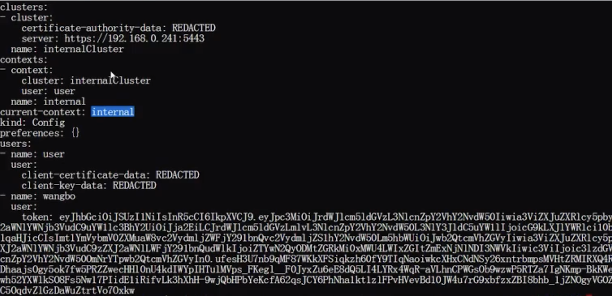
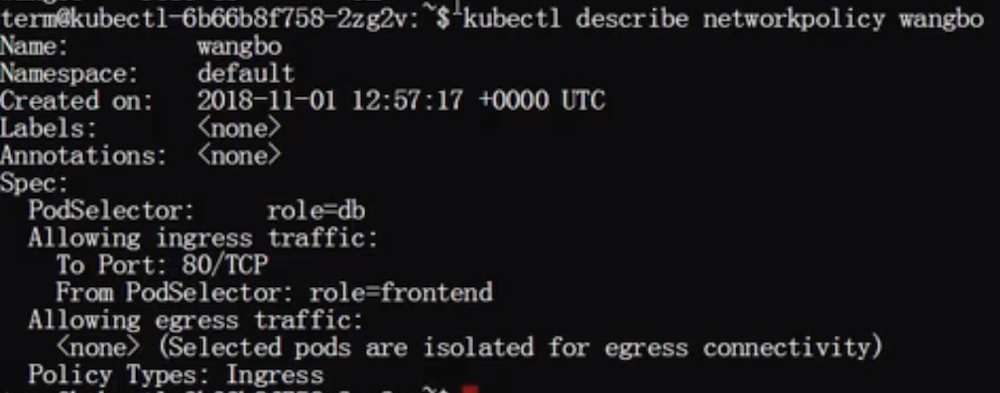

# K8S安全管理实训

## 大纲

* 安全全景图
* 认证和鉴权
* `Admissions`与安全的持久化保存键值(`etcd`)
* `Pod SecurityContext`(安全上下文)
* `Network Policy`

## 安全全景图


### 部署态的安全控制

* 认证
* 鉴权
* Admission(准入控制)
* Pod SecurityContext

### 运行态的安全控制

* Network policy

## 认证(Authentication)和鉴权(Authorization)


```
// Info describes a user that has been authenticated to the system.
type Info interface {
// GetName returns the name that uniquely identifies this user among
all
// other active users. GetName() string
// GetUID returns a unique value for a particular user that will cha
// if the user is removed from the system and another user is added
with
// the same name.
GetUID() string
// GetGroups returns the names of the groups the user is a member of GetGroups() []string
// GetExtra can contain any additional information that the
authenticator
// thought was interesting. One example would be scopes on a token.
// Keys in this map should be namespaced to the authenticator or
// authenticator/authorizer pair making use of them.
// For instance: "example.org/foo" instead of "foo"
// This is a map[string][]string because it needs to be serializeabl
into
// a SubjectAccessReviewSpec.authorization.k8s.io for proper
authorization
// delegation flows
// In order to faithfully round-trip through an impersonation flow,
these keys
// MUST be lowercase. GetExtra() map[string][]string
}
```

* 认证支持多种方式，**其中一种认证方式认证通过即通过，输出`userinfo`**
* **基于认证输出的`userinfo`进行鉴权，鉴权也支持多种方式，常用方式为`RBAC`**

### 认证(Authentication)

**认证方式有**:`X509`、`service account`、`Authenticating Proxy`、`WebHook`、`username/password`...
**常用认证方式介绍:**
**X509:**

* `Kube-apiserver`的启动参数`’—client-ca-file=ca.crt’`指定`X509`根证书❤️，**请求中需带有由该根证书签名的证书，才能认证通过**
* **客户端签署的证书里包含`user`、`group`信息**，具体为证书的`subject.CommonName(username)`以及`subject.Organization(group)`


### Service Account(为k8s必选认证方式):

* `Kube-apiserver`的启动参数`’—service-account-key-file=key.pem’`❤️指定`pem`文件，**用以生成`bearer token;’—service-account-lookup=true/false’`表示在删除`service account`后其`token`是否被吊销**
* `Serviceaccount Admission`默认给`Pod`打上`service account`，当然用户也可以自行指定所需要的`service account`


#### Default `serviceaccount` can generate default token❤️

```
spec:
  serviceAccountName: default 
  containers:
  - image: nginx:latest
    imagePullPolicy: IfNotPresent
    name: container-0
    volumeMounts:
    - mountPath: /var/run/secrets/kubernetes.io/serviceaccount 
      name: default-token-rm7xw
      readOnly: true
  volumes:
  - name: default-token-rm7xw
    secret:
      defaultMode: 420
      secretName: default-token-rm7xw  # check default token
```

### 鉴权(`Authorization`)

鉴权分为以下几种:`RBAC`、`ABAC`、`Node`以及`Webhook`常用`RBAC`介绍:


#### Create role and cluster role

```
kind: Role
apiVersion: rbac.authorization.k8s.io/v1 
metadata:
  namespace: default
  name: pod-reader 
rules:
- apiGroups: [""] # "" indicates the core API group 
  resources: ["pods"]
  verbs: ["get", "watch", "list"]
---
kind: ClusterRole
apiVersion: rbac.authorization.k8s.io/v1 
metadata:
name: secret-reader 
rules:
- apiGroups: [""] # "" indicates the core API group 
  resources: [“secrets"]
  verbs: ["get", "watch", "list"]
```

#### Create role binding and cluster role binding

```
kind: RoleBinding
apiVersion: rbac.authorization.k8s.io/v1 
metadata:
  namespace: default
  name: read-pods
subjects:
- kind: User
  name: wangbo
  apiGroup: rbac.authorization.k8s.io/v1 
roleRef:
  kind: Role #this can be Role or ClusterRole 
  name: pod-reader
  apiGroup: rbac.authorization.k8s.io/v1
---
kind: ClusterRoleBinding
apiVersion: rbac.authorization.k8s.io/v1 
metadata:
  name: read-secrets-global 
subjects:
- kind: Group
  name: manager
  apiGroup: rbac.authorization.k8s.io/v1
```

## Admission(PodSecurityPolicy)

* `Kube-apiserver`的启动参数`’—admission-control=PodSecurityPolicy’`新增`PodSecurityPolicyadmission`
* `Admin`用户创建`PodSecurityPolicy`策略，决定能创建什么样的`Pod`
* 创建`Pod`的用户也必须赋予它能使用 `PodSecurityPolicy`策略的权限


## 安全的持久化保存键值(`etcd`)

* **`etcd`支持备份恢复机制，防止数据被误删导致数据丢失**
* 用户的敏感信息建议存放在`secret`类型的资源中，**该类型资源是加密存储在`etcd`中**
* **`etcd`支持`https`，`kube-apiserver`访问`etcd`使用`https`协议**

具体配置方式:


### `Client->Server:`

```
--cert-file=<path> 
--key-file=<path> 
通道以tls协议加密 
-------------------- 
--client-cert-auth 
--trusted-ca-file=<path> 
服务端会认证客户端证书是否是受信任CA签发 
-------------------- 
--auto-tls 
是否系统自动生成证书
```

### `Server->Server:`

```
--peer-cert-file=<path> 
--peer-key-file=<path> 
通道以tls协议加密 
-------------------- 
--peer-client-cert-auth 
--peer-trusted-ca-file=<path> 
服务端会认证客户端证书是否是受信任CA签发 
-------------------- 
--peer-auto-tls 
是否系统自动生成证书
```

## 安全上下文(`Pod SecurityContext`)

* **分为`Pod`级别和容器级别，容器级别的会覆盖`Pod`级别的相同设置**❤️
* 在有`PodSecurityPolicy`策略的情况下，两者需要配合使用

```
apiVersion: v1 
kind: Pod 
metadata:
  name: test-pod
spec:
  securityContext: 
    privileged: false              是否使用特权容器      ❤️
    runAsUser: 1000                指定容器启动`UID`     ❤️           
    fsGroup: 2000                  指定`Pod`中容器文件所属组`GID`. ❤️
  volumes:
  - name: test
    emptyDir: {} 
  containers:
  - name: test
    image: gcr.io/google-samples/node-hello:1.0 
  volumeMounts:
  - name: test
    mountPath: /data/test 
  securityContext:
    readOnlyRootFilesystem: false            容器的文件系统是否是只读❤️
    runAsUser: 1001
    privileged: false  
    capabilities:                            容器系统调用能力配置❤️
      add: ["NET_ADMIN", "SYS_TIME"] 
      drop: ["SYS_BOOT"]
```

## Network Policy

**分为`Ingress`和`Egress`策略控制，都为白名单**

### `Ingress`为`入口`请求控制
### `Egress`为`出口`请求控制

```
apiVersion: networking.k8s.io/v1 
kind: NetworkPolicy
metadata:
  name: test-network-policy
  namespace: default 
spec:
  podSelector:              
    matchLabels:                规则匹配器，选择匹配的`Pod`❤️
      role: db 
  policyTypes:
  - Ingress 
  - Egress 
  ingress: 
  - from:
    - ipBlock:                  远端(访问端)`IP`白名单开放❤️
        cidr: 172.17.0.0/16 
        except:
        - 172.17.1.0/24
    - namespaceSelector:        远端(访问端)`namespace` 白名单开放❤️
        matchLabels:
          project: myproject 
    - podSelector:              远端(访问端)pod白名单开放❤️
        matchLabels: 
        role: frontend
    ports:                     本端(被访问端)允许被访问的端口和协议❤️
      - protocol: TCP
        port: 6379 
  egress:
  - to:
    - ipBlock:
        cidr: 10.0.0.0/24 
   ports:
   - protocol: TCP 
     port: 5978
```

### 禁止所有入口请求:

```
apiVersion: networking.k8s.io/v1 
kind: NetworkPolicy
metadata:
  name: default-deny 
spec:
  podSelector: {} 
  policyTypes:
  - Ingress
```

### 允许所有入口请求

```
apiVersion: networking.k8s.io/v1 
kind: NetworkPolicy
metadata:
  name: allow-all 
spec:
  podSelector: {} 
  policyTypes:
  - Ingress 
  ingress:
  - {}
```

### 禁止所有出口请求

```
apiVersion: networking.k8s.io/v1 
kind: NetworkPolicy
metadata:
  name: default-deny 
spec:
  podSelector: {} 
  policyTypes:
  - Egress
```

### 允许所有出口请求

```
apiVersion: networking.k8s.io/v1 
kind: NetworkPolicy
metadata:
  name: allow-all 
spec:
  podSelector: {} 
  policyTypes:
  - Egress 
  egress:
  - {}
```

## 实机操作

### 1.List Serviceaccount

```
$ kubectl get serviceaccount
```

### 2.Delete Serviceaccount

```
$ kubectl delete serviceaccount pod-operator
serviceaccount "pod-operator" deleted
```

### 3.Create Serviceaccount

```
$ kubectl create serviceaccount pod-reader -ncka
serviceaccount "pod-reader" created
```

### 4.The secret token will be created along with Serviceaccount automatically (pod-reader)

```
$ kubectl get secret 
```


### 5.describe the sa

```
$ kubectl describe sa pod-reader
```


### 6.create a clusterrole

```
$ kubectl get clusterrole view -oyaml > role.yaml
```


```
$ kubectl create namespacce cka
namespace "cka" crated
$ kubectl create -f role.yaml
role "pod-reader" created
```


### 7.create rolebinding

```
$ kubectl get clusterrolebing
```


## Test switch role from internalcluster admin to new created role

### 1.check current user

```
$ kubectl config view
```


### 2.get secret token 

```
$ kubectl get secret pod-reader-token -jhrbp -ncka -oyaml | grep token: | awk '{print $2}' | base64 -d
```

### 3.create new user with token

```
$ kubectl config set-credentials wangbo --token=$(kubectl get secret pod-reader-token-jhrbp -ncka -oyaml | grep token: | awk '{print $2}' | base64 -d)
User “wangbo" set
```


### 4.change current-context



### 5.switch to new context with new username

```
$ kubectl config set-context contextname --cluster=internalCluster --user=username
``` 


```
$ kubectl config user-context internal
Switched to context "internal”
```

### 6.check config view

```
$ kubectl config view
```


### 7.get default namespace pod, should be forbidden 

```
$ kubectl get pods
```


```
$ kubectl get pods -ncka
```

## privilege container or pod

### container => `privileged: true`


```
scurityContext:
  privileged: true
```

```
$ kubectl create -f secruity-pod.yaml
$ kubectl get pods
```


#### you have privilege to some system info


```
$ kubectl exec -it pod-name sh

# system -a | grep tcp
# syctl -a | grep recv
# syctl -a | grep recv | awk '{print $1}'
# syctl -w $(syctl -a | grep recv | awk '{print $1}')=70
```

### container => `privileged: false`

```
scurityContext:
  privileged: false
```


### 分为Pod级别和容器级别，容器级别的会覆盖`Pod`级别的相同设置


```
spec:
  scurityContext:
    runAsUser: 1001
...
scurityContext:
  privileged: false
  runAsUser: 1000
```

**1000 will overlap 1001**


**UID => pass**

```
$ cat /etc/passwd
...
paas:x:1000:1000::/home/paas:/bin/bash
```


### `fsGroup: 2000`  => file group owner


```
$ kubectl exec -it wangbo sh
$ cd /data/
$ ls -l
drwxrwxrwx 2 root 2000 4096 Nov 1 12:52 test
```

## NetworkPolicy

```
apiVersion: networking.k8s.io/v1 
kind: NetworkPolicy
metadata:
  name: test-network-policy
  namespace: default 
spec:
  podSelector:              
    matchLabels:                
      role: db 
  policyTypes:
  - Ingress  
  ingress: 
  - from:
    - podSelector:              
        matchLabels: 
        role: frontend
   ports:
   - protocol: TCP 
     port: 80
```

```
$ kubectl get networkpolicy
```


```
$ kubectl describe networkpolicy policyname
```



