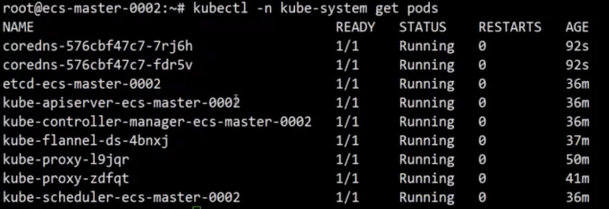

# K8S集训运维实训

* 集群部署及安全配置
* 节点证书签发
* 安装`network`插件插件
* 高可用集群
* 集群升级与备份恢复
* `E2E`测试及结果分析

## K8S集群工作原理

### Master节点:负责整个集群的管理和控制

* etcd
* kube-apiserver
* kube-controller-manager
* kube-scheduler

### Node节点:

* kubelet
* kube-proxy 
* docker
* cni插件


## 集群部署及安全配置

**`Kubelet manifest`部署控制节点组件**

* `manifest`方式拉起管理面组件
* `Liveness`、`readiness`配置组件健康检查


**`Systemd` 管理`docker`、`kubelet`进程 `Daemonset`方式部署插件**


### 安装CNI插件

* 为`pod`分配`IP`
* 节点间`podIP`互通

```
kubectl apply -f
https://raw.githubusercontent.com/coreos/flannel/v0.9.1/Documentation/kub
e-flannel.yml
```


```
$ kubectl config view
```


## 生成`kubecfg`文件

### 修改`cluster`

```
$ kubectl config set-cluster kubernetes
--certificate-authority=/path/to/ca --embed-certs=true --server=${KUBE_APISERVER} --kubeconfig=/kubeconfig/filename
```

### 修改user

```
kubectl config set-credentials testuser
--client-certificate=/path/to/cert --client-key=/path/to/private_key --embed-certs=true --kubeconfig=/kubeconfig/filename
```

Example: [Create new user with token](https://github.com/Chao-Xi/JacobTechBlog/blob/master/k8s_cka/6CKA_Security.md#3create-new-user-with-token)

### 修改context

```
kubectl config set-context default
--cluster=kubernetes --user=testuser --kubeconfig=test.kubeconfig
```

### 设置默认context

```
kubectl config use-context default --kubeconfig=/kubeconfig/filename
```

Example:[ Switch to new context with new username](https://github.com/Chao-Xi/JacobTechBlog/blob/master/k8s_cka/6CKA_Security.md#5switch-to-new-context-with-new-username)


## `tls bootstrap`与节点证书签发

### `kubelet`启动时使用低权限`token`像`kube-apiserver`发送`csr`请求

### RBAC允许的CRS请求类型:

* `nodeclient`:**签发证书**
* `selfnodeclient`:**更新证书** 
* `selfnodeserver`:**更新`kubelet server`证书**


### `kube-controller-manager`自动签发证书

### `kubelet`使用签发的证书、私钥访问`kube-apiserver`


## 高可用集群


### 控制节点滚动升级 

* 升级`kubelet`
* 通过更新`manifest`升级控制组件

### 计算节点升级

```
kubectl drain

kubectl uncordon
```

## 集群升级流程


## 备份恢复

### 周期性备份`ETCD`数据


### 生成`snapshot`

```
ETCDCTL_API=3 etcdctl --cacert /etc/kubernetes/pki/etcd/ca.crt --cert /etc/kubernetes/pki/etcd/server.crt --key /etc/kubernetes/pki/etcd/server.key -- endpoints https://127.0.0.1:2379 snapshot save snapshotdb
```

```
ETCDCTL_API=3 etcdctl --cacert /etc/kubernetes/pki/etcd/ca.crt --cert /etc/kubernetes/pki/etcd/server.crt --key /etc/kubernetes/pki/etcd/server.key -- endpoints https://127.0.0.1:2379 snapshot status snapshotdb -w table
```

## 实机操作


### 1.[用 kubeadm 搭建集群环境](https://github.com/Chao-Xi/JacobTechBlog/blob/master/k8s_dev/kubeadm12/1Kubeadm_Setup.md)

```
sudo kubeadm init --pod-network-cidr=10.244.0.0/16
```

### 2.check kubelet config on node

```
$ ps -elf | grep kubelet
```


### 3.check manifets files

```
$ cd /etc/kubernetes/manifests
$ ls
```


### 4.get nodeclient clusterrole

```
$ kubectl get clusterrole | grep nodeclient
```


### 4.get approved clusterrolebinding


### 5.get `kube-controller-manager` docker process


### 6. how to drain a node

```
$ kubectl drain node-name --ignore-dameonsets=true
```


### 7.revoke the drained node "uncordon"

```
$ kuectl uncordon node-name 
```


#### drained node's pod revive 




