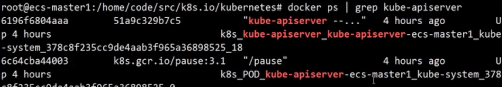

# K8S故障排查实训

## 大纲

* E2E测试及结果分析
* 管理面异常原因排查
* 节点异常原因排查
* 应用异常原因排查
* Service访问异常问题排查
* 常用kubectl命令

## E2E测试及结果分析

### 环境准备

* `local-up-cluster`、`kubeadm`等工具启动测试集群 
* `ginkgo`测试框架
* `go`语言编译环境

[End-to-End Testing in Kubernetes](https://github.com/kubernetes/community/blob/master/contributors/devel/e2e-tests.md)

### E2E配置及用例选择

* 集群地址 `--host`
* 筛选用例 `--ginkgo.ship` `--ginkgo.focus`


`--host="https://192.168.1.206:6443"`

### 问题定位

**关注框架清理环境前打印的定位信息**

* `Namespace Event`信息
* 节点状态及`Event`信息
* `POD`状态及`Event`信息

## 管理面异常排查


### `APIServer、ETCD`异常

* **无法创建、更新、删除资源对象**
* 节点正常工作
* 已有资源对象正常工作，不受影响

**1.Check kube-apiserver log**

```
$ ps -elf | grep kube-apiserver | grep log
```

**2.check kube-apiserver docker process**

```
$ docker ps | grep kube-apiserver
```



**3.Check clusterStatus**

```
$ kubectl get cs
```


**4.Check etcd status**

```
$ docker ps | grep etcd
```


### Controller异常

* **`deployment`、`rs`、`ds`等对象操作请求处理正常，但实际未生效**
* **`Service`关联的后端`pod`变化，但`endpoint`不更新** 
* ..

### Scheduler异常

**`Pod`长时间`Pending`，且无调度失败`event`信息**

### `Master`组件状态查询:`kubectl get cs`

### 进程不存在

* 明确组件生命周期管理方式
* 故障检测方式是否有效(`livenessProbe、restartPolicy`)
* 重新启动进程

### 进程crash

**分析日志**

### 组件功能异常

**分析日志、检查依赖组件是否正常**

## 节点异常原因排查

### 节点状态查询:`kubectl get nodes`


### 常见异常现象

* 节点状态为`NotReady`
* 调度到该节点上的`Pod`显示`NodeLost`、`Unkonwn`、`Pending`等状态

### 常见故障

* `kubelet`进程异常 
* 未安装`cni`插件
* `Docker`异常
* 磁盘空间不足
* 内存不足
* ...

### 定位方式

* `kubectl describe node`查看异常事件
* `service status`查看系统进程状态 
* `journalctl `查看系统组件日志
* `top`查看系统`cpu`、内存
* `du、df`查看磁盘使用情况

```
kubectl describe node ecs-node-001
```


#### Check kubelet problem

```
kubelet --help | grep root
```

**we can check the root path for kubelet files: `/var/lib/kubelet`**


```
$ ll /var/lib/kubelet
```


**we can check the root path for docker: `/var/lib/docker`**


#### Check disk problem

```
$ df -h
```

```
du -h /var/lib/docker
```

## 应用异常原因排查

### 应用异常原因排查

#### 1.已存在的POD数超过`resource-quota`限制

```
kubectl describe quota –n ${ns}
```

#### 2.待创建的`POD`不满足`admission controller`限制

查看`kube-apiserver enable-admission-plugins`参数启用了哪些`ac`

#### 3.`DaemonSet`找不到符合要求的节点

* `kubect describe ds –n ${ns}` 
* 查看`ds`的`nodeSelector`
* 查看节点`taints`

#### 4.StatefulSet

* podManagementPolicy 
* serviceName
* volumeClaimTemplates

#### 5.Example: fail to create a deployment, describe deploy is okay, then describe rs


```
$ kubectl edit nginx-deployment
```

**According to the warning message, add requests: cpu and memeory**


Now, the new rs created successfully


#### 6.node label problem

```
$ kubectl get nodes --selector=beta.kubernetes.io/arch=amd64
```


**Add label to the nodes**

```
$ kubectl label ecs-node-0001 beta.kubernetes.io/arch=amd64 --overwrite
```


```
$ kubectl label node --all beta.kubernetes.io/arch=amd64 --overwrite
```

### POD实例异常

#### 1.状态检查

```
kubectl get/describe pod
```

#### 2.Pending

* 可用资源不足:`describe pod`可看到调度失败`event`
* 不满足亲和性策略
* 节点有`taints`

#### 3.Waiting

* 镜像下载失败
* 配置的`imagePullSecret`无法通过认证，查看环境是否存在可用的`dockerconfigjson`类型的`secret` 
* `imagePullPolicy`配置是否正确

#### 4.CrashBackoff

* `kubectl logs` 查看容器日志
* `kubectl/docker exec`登录容器验证功能
* 检查`pod`配置是否正确:`command、liveness、readiness`


## Service访问异常原因排查

### 通过域名访问Service

`nslookup`判断域名解析是否正常

### 没有`Endpoint`

* `kubectl –n ${ns} get endpoints ${service-name}`
* `kubectl –n ${ns} get pods --selector=${service-selector}`
* 查看`pod status`是否为`ready`状态
* 查看`service port`定义与`pod`定义是否匹配


### Example: Service created, but no service offered

```
$ kubectl get svc -n test-service
```


**Connection refused by curl, while something goes wrong**

```
$ curl http://10.104.197.24:80
```


#### 1. Check endpints

```
$ kubectl get endpoints clusterip -n test-service
```


```
$ kubectl describe endpoints clusterip -n test-service
```


**There is no backend for this endpoint**

#### 2. Check svc

```
$ kubectl descibe svc clusterip -n test-service
```


```
Selector:   app=non-exist
```

#### 3. Selector not matched, no pod matched 

```
$ kubectl get pods --selector=app=non-exist -n test-service
No resources found
```

#### 4. Get pods and show labels

```
$ kubectl get pods --show-labels -n test-service
```


#### 5. Change service label

```
$ kubectl edit svc clusterip -n test-service
```


```
selector:
  app: nginx
```

#### 5.Now backend pod found


```
$ curl http://10.104.197.24:80
```


**Curl still failed**

#### 6.Service target port is 8080, while pod only open 80 port, not matched


#### 7.change service target port to 80

```
$ kubectl edit svc clusterip -n test-service
```


#### 8.curl successfully


## Service访问异常原因排查

### `Endpoint`访问不通

* `kube-proxy`是否运行正常，依赖的`conntrack`是否安装
* 查看`kube-prox`y配置参数，确认`mode`类型，查看转发规则是否正确
 
#### userspace

```
iptables-save | grep ${servicename}
KUBE-PORTALS-CONTAINER、KUBE-PORTALS-HOST
```

#### iptables:

```
iptables-save | grep ${servicename}
KUBE-SVC-XXX、KUBE-SEP-XXX
```

#### ipvs:

```
ipvsadm –ln
```


## 常用kubectl命令行

```
$ kubectl -h
```

```
$ kubectl explain
```