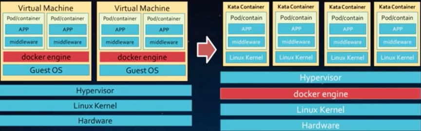
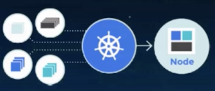

# 云原生的前世今生

* CNDF 云原介绍
* 容器技术发展与介绍
* Kubernetes技术架构

## CNCF Toc: CNCF Cloud Native Definition v1.0

云原生技术有利于各个组织在公有云， 私有云和混合云等新型动态环境中，构建和运行可弹性扩展的应用。云原生的代表技术包括 **容器， 服务网格， 微服务， 不可变基础设施，和 声明式API**

这些技术可以构建容错性好， 易于管理和便于观察的松耦合系统。 结合可靠的自动化手段， 云原生技术使工程师能够更好的对系统做出频繁和可预测的重大变更

云原生计算基金会（CNCF）致力于培育和维护一个厂商中立的开源生态系统，来推广云原生技术。我们通过将最前沿的模式普惠，让这些创新为大众所用。

### 云计算的发展历程

“云” 中的资源在使用者看来是可以无限扩展的， 并且可以 随时获取， 按需使用， 随时扩展， 按使用付费。 这种特性经常被称为像水电一样的使用IT基础设施

### 云计算伴随云原生进入新时代

### 容器是云原生发展的第一波热潮

### 容器服务的目标就是打造Cloud Native应用的运行环境

### CNCF当前环境

#### 容器编排

#### 容器引擎

#### 容器镜像创库

#### 容器网格

#### 服务网格和服务发现

#### 容器监控运维

#### 消息通信

#### 数据库

#### sandbox 项目

## 容器技术发展与介绍

### 容器技术发展历史

容器虚拟化(LXC): 提供应用隔离运行的能力

Docker: 基于容器提供的统一的应用分发平台

### 容器三大好处

### Docker build, ship, and Run Any App, Anywhere

#### 容器底层关键技术 - Linux Cgroup

**Docker 使用 `Linux Cgroup` 技术来实现容器实例的资源管理**

#### 容器底层关键技术 - Linux Namespace

**Docker 使用 `linux namespace` 技术来实现容器实例间的资源隔离**

#### 容器底层关键技术 - 联合文件系统

概念： **一个基于文件的接口， 通过把一组目录交错起来， 形成一个单一的视图**

优点： 

1. 多个容器可以共享image存储， 节省存储空间
2. 部署多个容器时， base image 可以避免多次拷贝， 实现快速的部署

**Docker目前支持的联合文件系统种类包括 `devicemapper`, `overlay2`, `aufs`， `btrfs`, `vfs`**

### 新一代Kata容器实现多租户容器的强制隔离

* 虚拟化层的实现， 保障了容器在多租户场景下的安全性
* 高度裁剪和优化过的`KVM`, `guestOS` 保证了VM 启动时间极短，性能损耗小
* 接口层支持对接docker引擎或 crio, 镜像完全兼容了docker镜像， 无需修改， 完美融入`K8S`容器生态

## Kubernetes技术架构

### 什么是Kubernetes

* Kubernetes是用于自动部署， 扩展和管理容器化应用程序的开源系统

* 生产级别的容器编排系统
 
* 数据中心OS
 
* 新生代的云平台

### Kubernetes系统组件

### Kubernetes架构

### Declarative (声明式API） VS Imperative (命令式API)

**从命令行角度来看：**

1. 命令式：`kubectl run nginx -image nginx`
2. 声明式: `kubectl create -f nginx.yaml`

**从Kubernetes API角度来看：**

绝大部分的Kubernetes采用**声明式API**进行设计，Kubernetes 当前也部分提供命令式API，如执行`Pod Exec`动作

### Kubernetes 基于`list-watch` 机制的控制器架构

### Kubernetes 分层架构

### Kubernetes 生态系统的范畴

#### 容器内多样化工作负载

### K8S 多样化的环境

* 容器，网络，存储插件
* 镜像仓库
* 多云插件
* 集群管理配置
* 认证系统

### K8S 多样化的服务和工具

* 日志和监控
* 配置语言
* 编排部署
* 持续集成
* Paas
* 工作流
* 函数服务
* 数据处理服务
* 对象事物服务（数据库和存储）
* 互联网应用

