# K8S初体验

## 大纲

* Kubernetes Pod 详解
* Kubernetes 工作负载与服务介绍
* 快速部署第一个容器应用

## Kubernetes概览

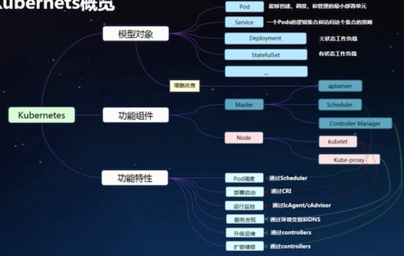

### Kubernetes 关键概念 - Pod

* 在`Kubernetes`中， `pods`是能够**创建**， **调度**， 和**管理**的最小单元，是一组容器的集合，而不是单独的应用容器
* 同一个pod里容器共享一个**网络命名空间，IP地址及端口空间**
* 从生命周期来看， Pod是短暂而不是长久的应用， pods被调度到节点上， 保持在这个节点上直到被销毁

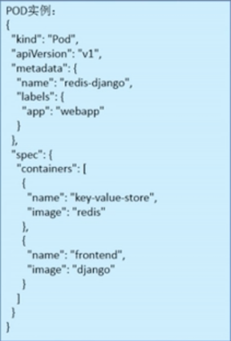

### pod详解 - 容器 （Containers）

#### 容器分类

* Infrastructure Container 基础容器
  * 用户不可见，无需感知
  * 维护整个pod网络空间

* InitContainer 初始化容器， 一般用于， 一般用于服务等待处理以及注册pod信息等
  * 先于业务容器开始执行
  * 顺序执行， 执行成功推出（exit 0), 全部执行成功后执行启动业务容器
* Containers业务容器
  * 开始启动， 启动成功后一直running

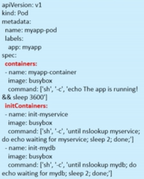

#### 容器基本组成

**镜像部分：**

* 镜像地址和拉取策略
* 拉取镜像的认证凭据

**启动命令:**

* **command**: 替换docker容器的entrypoint
* **args**: 作为容器的entrypoin的入参

**计算资源：**

* **请求值**：调度依据
* **限制值**：容器最大能使用的规格

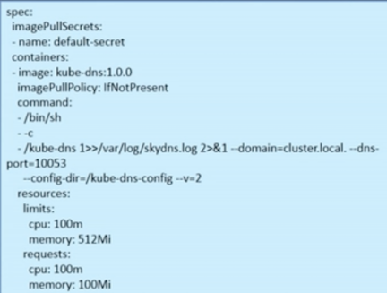

#### 健康检查

分**命令行方式**， **`httpGet`请求方式**， 以及**`TCPSocket`方式**

**业务探针（ReadinessProbe）:**

**探测不正常后， 不会重启容器， 只会拿掉服务后端的`endpoints`**

**存活探针（liveinessProbe）:**

**探测不正常后，会重启容器**

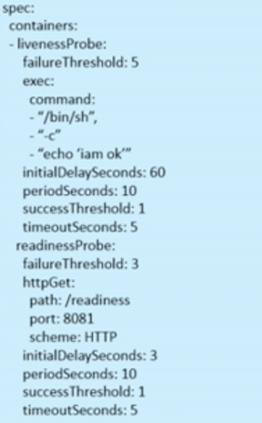

#### 外部输入

pod可以接入的外部输入方式： **环境变量， 配置文件以及秘钥**

环境变量: 使用简单，但是一旦变更后必须重启容器

* key-value自定义
* From配置文件（Configmap）
* From秘钥 （Secret）

以卷的形式挂在到容器内使用，权限可控

* 配置文件(configmap)
* 秘钥(secret)

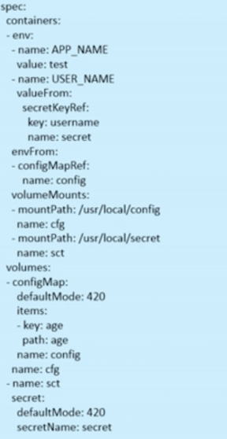

#### 配置文件（configmap）及秘钥（secret）介绍

* 大小不能超过1m
* Secret有类型区分， 不同的类型有不同的校验方式， 输入value需要base64加密

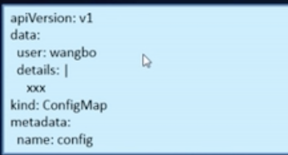

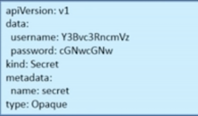

#### pod 持久化存储

**主机hostpath**

必须要求pod调到固定的节点上

**云存储**

* 多类型选择， 如云硬盘， 文件存储， 对象存储等
* 不用担心pod的迁移

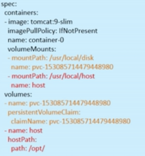

#### pv & pvc 介绍

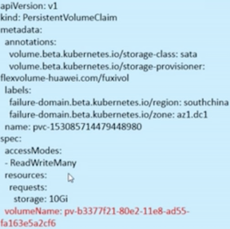

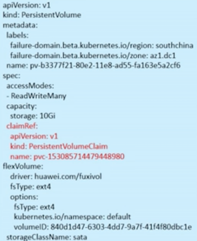

#### 服务域名发现

* pod 内域名解析的策略

* **ClusterFirst**: 使用`kube-dns`作为域名解析服务器

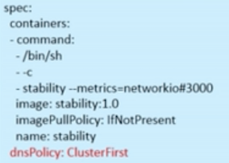

* **Default**: 使用节点（kubelet）指定的域名服务器解析域名

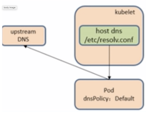

* **ClusterFirstWithHostNet**: 当pod使用主机网络部署时使用

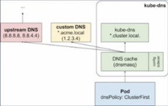

### pod与工作负载的关系

* 通过`label-selector`相关联
* pod通过工作负载实现的应用的运维， 如伸缩，和升级等。 

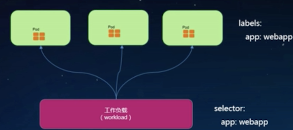

#### 关键工作负载 - ReplicaSet

* `ReplicaSet` 副本控制器
* 确保pod在一定数量的份数（`Replica`）在运行， 如果超过这个数量， 控制器会杀死一些， 如果少了， 控制器会启动一些
* `ReplicaSet` 用于解决 `pod` 的扩容和缩容的问题
* 通常是无状态应用

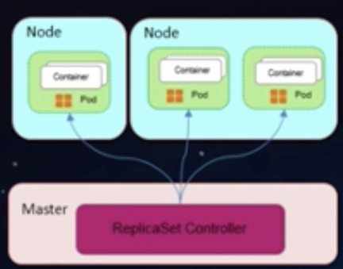

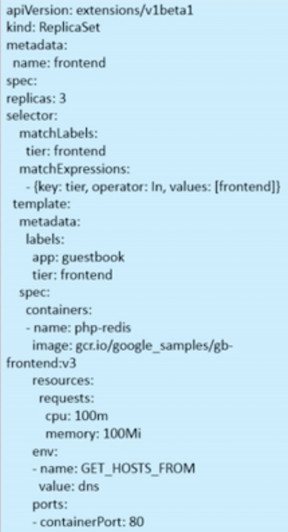

#### 关键工作负载 - Deployment

* Kubernetes Deployment 提供了官方用于更新pod和ReplicaSet (下一代ReplicaController) 的方法，您可以在Deployment对象中只描述您所期望的理想状态（预期的运行状态）， Deployment控制器为您将现在的实际状态转换成您所期望的状态
* Deployment继承了上线部署， 滚动升级， 创建副本， 暂停上线任务， 恢复上线任务， 回滚到以前的某一版本（成功/稳定）的Deployment 等功能， 在某程度上，Deployment 可以帮助我们实现无人值守的上线， 大大降低我们上线过程的复杂沟通， 操作风险
* Deployment的典型用例：
  * 使用`Deployment`来启动（上线/部署）一个`pod`或者`ReplicaSet`
  * 检查一个`Deployment`是否成功执行
  * 更新一个`Deployment`来重建相应的pods(例如，需要使用一个新的Image)
  * 如果现有的`Deployment`不稳定， 那么回滚到早期的稳定的`Deployment`版本

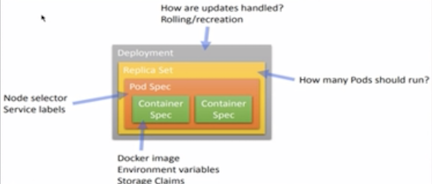

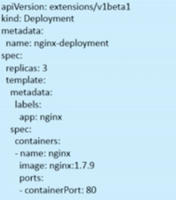

#### 关键工作负载 - StatefulSet

* StatefulSet - 有状态应用
* 用于解决各个 pod 实例独立生命周期的管理， 提供各个实例启动顺序和唯一性
 * 稳定和唯一的网络标识符
 * 稳定持久的存储
 * 有序的，优雅部署和扩展
 * 有序的，优雅的删除和终止
 * 有序的自动的滚动和更新

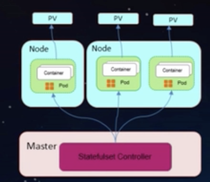

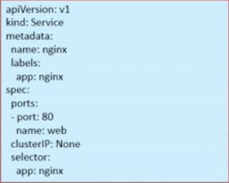 

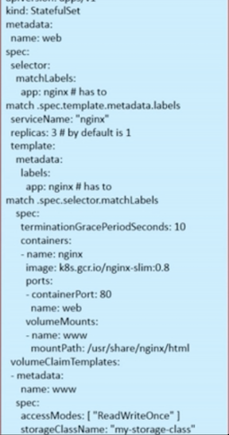

#### 关键工作负载 - DaemonSet

DaemonSet 能够让所有或者一些特定的Node节点上运行同一个pod, 当节点加入到Kubernetes集群中， pod会被（DaemonSet）调度到该节点上运行， 当节点从Kubernetes集群中被移除， 被（DaemonSet）调度的pod会被移除， 如果删除DaemonSet， 所有跟这个DaemonSet相关的pods都会被删除

在使用Kubernetes来运行应用时， 很多时候我们需要在一个区域（zone）， 或者所有`Node`运行同一个守护进程的（pod）, 例如如下场景

* 集群存储守护程序，如glusterd、ceph要部署在每个节点上以提供持久性存储；
* 节点监视守护进程，如Prometheus监控集群，可以在每个节点上运行一个node-exporter进程来收集监控节点的信息；
* 日志收集守护程序，如fluentd或logstash，在每个节点上运行以收集容器的日志

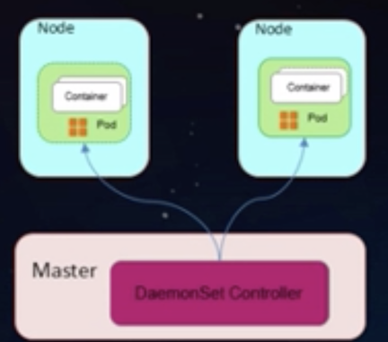

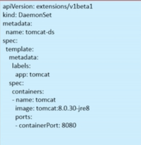

#### 关键工作负载 - Job

分为普通任务`job`和定时任务`Cronjob`

* 一次性执行，非堵塞
* 适合CI，视频解码，基因测序等业务

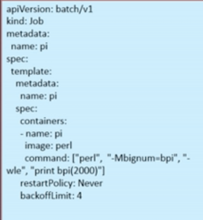

#### 关键工作负载 - CustomResourceDefinition

用户可自定义资源模型， 可扩展性强

需要实现自己的`controller`进行自定义资源的管理

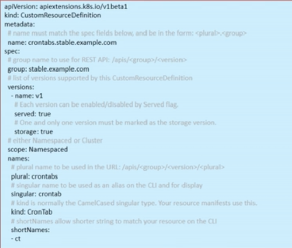

### pod与服务的关系

* 通过`label-selector`相关联
* 通过服务实现pod的负载均衡能力：
  * **Service**: 实现`TCP/UDP 4`层负载均衡能力
  * **Ingresss**: 实现`HTTP 7`层负载均衡能力

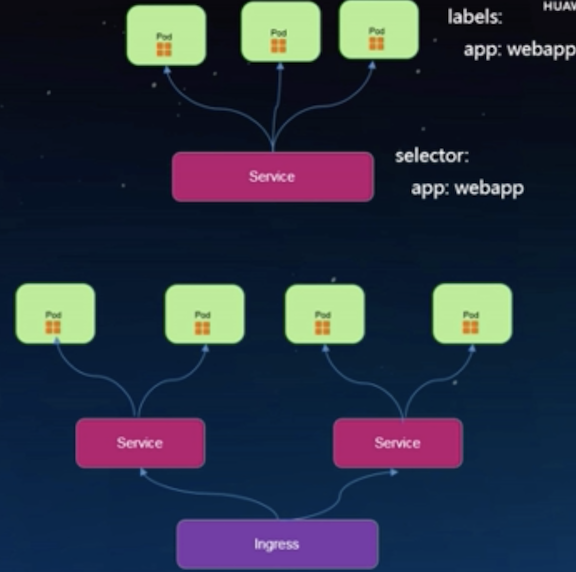

#### Service

* Service定义了pods的逻辑集合和访问这个集合的策略，Pods集合是通过定义service时提供的Label选择器完成的
* Service的引入旨在保证pod的动态变化对访问端透明， 访问端只需要知道service的地址， 由service来提供代理
* Service的抽象使得前端客户和后端pods进行解耦
* 支持`CluterIP`, `NodePort`以及`LoadBalancer`三种类型
* Service的底层实现有`userspace`，`iptbales` 和 `ipvs` 三种模式

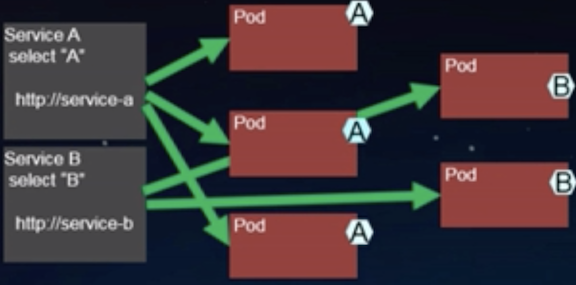

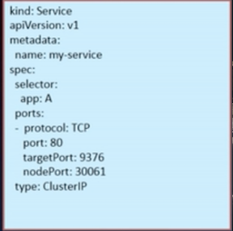

#### Service类型： `ClusterIP`, `NodePort`, `LoadBalancer`

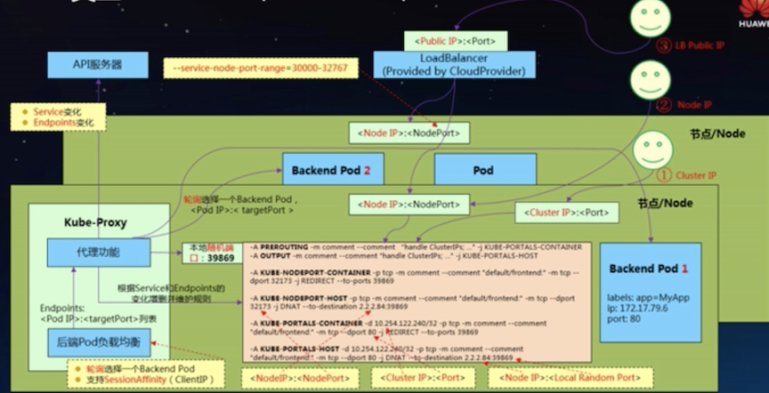

#### Ingress

**Ingress基于service实现7层路由转发的能力**

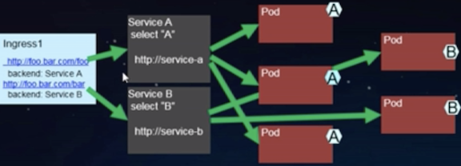

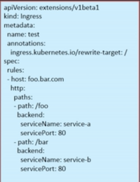
