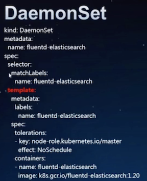

# Kubernetes 工作负载原理的剖析

### Kubernetes 的魔法


Kubernetes 是程序化应用程序模式的平台， 这些模式是应用更易于部署，管理，扩转， 从故障中恢复，这就是“魔法”

### 一个简化的k8s集群


## 无状态模式

* 不必为你的应用保持状态持久化数据
* 典型的应用代表： **Nginx**, **Tomcat**
* Replication Controller
* ReplicaSet
* Deployment


## Replication Controller


* 默认情况下，删除RC会删除pod, 只删除RC, 不影响pod

```
$ kubectl delete rc --cascade=false
```
* 滚动升级，需要两个RC,（不同的label selector）来配合实现， **旧的RC副本-1**， **新的RC副本数+1**，逐步完成。

## ReplicaSet

下一代的`Replication Controller`, 区别是支持“基于集合“ 的`label selector`


## 升级重器 `Deployment`

Deployment 提供了声明式， 自定义**策略**的pod**升级**支持


**Upgrade Deployment**

```
$ kubectl set image deployment/nginx-deployment nginx=nginx:1.9.1
```

**Check Upgrade status**

```
$ kubectl rollout status deployment/nginx-deployment
```

**Check Upgrade history**

```
$ kubectl rollout history deployment/nginx-deployment
```

**Scale up/down**

```
$ kubectl scale deployment nginx-deployment --replicas=10
```

**Upgrade / Roll back**

```
$ kubectl set resources deployment nginx-deployment -c=nginx --limits=cpu=200m,memory=512Mi
$ kubectl rollout history deployment/nginx-deployment --revision=2
$ kubectl rollout undo deployment/nginx-deployment --to-revision=2
```

**Pause / Resume**

```
$ kubectl rollout pause deployment/nginx-deployment
$ kubectl rollout resume deployment/nginx-deployment
```

**Scale up/down**

```
$ kubectl scale deployment nginx-deployment --replicas=10
$ kubectl autoscale deployment nginx-deployment --min=10 --max=15 --cpu-percent=80 #working with HPA
# maxSurge=3; 25%(default)
# maxUnavailable=2; 25%(default)
```

## 有状态模式

* 典型的应用：ZooKeeper, MongoDB, MySQL, etcd
* StatefulSet (曾用名： PetSet)
* **StatefulSet的pod和普通pod的区别： 有身份的**
* StatefulSet**身份**三要素：
  * 域名 （网络）<--- 容器IP易变
  * PVC
  * Pod Name
* 配合`headless service`, `PVC`一起使用
* 严格的启动、删除顺序：0，1，2 ...


## 守护进程模式

* 典型应用： **fluentd, linkderd, ceph, kube-proxy**
* Daemonset: 保证每个节点总是运行一个`pod`实例
  * NodeSelector或者NodeAffinity 指定Node
  * 经过（`1.11 Aplha`特性）/ 不经过调度器（不管Node状态）
  * 支持滚动升级
  * 支持级联/非级联删除
 



## 批处理模式

* **典型应用：并发执行的作业 - `batch job`**
 * 相关独立的工作项： 发邮件， 数据扫描， 文件转码
* **Job**
 * 保证指定数量的pod成功运行结束 -- **completions**
 * 支持并行 --  **parallelism** 
 * 支持错误自动重试 （10s, 20s, 30s, ... 60m）
 * 删除pod会触发对应pod删除
* **Cronjob** 
 * 基于时间调度的job(Cron格式）
 * 用户可以暂停/恢复Job的周期调度性， `.spec.suspend={true,false}`
 * 管理`job -> pod`


### Kubernetes Job常见使用方法

* **做不同的事情** 
  * 扩展Job Expansion, 传入参数， 环境变量
* **做同样的事情**
  * 工作队列形式， 与`Work Queue(RabbitMQ)` 集合


## Kubernetes工作负载总结

* **无状态模式**： 使用Deployment 提供高可用， 弹性扩/缩容， 升级/回滚
* **有状态模式**： 使用StatefulSet 提供一致性， Pod的唯一/粘性的身份标识， 存储， 按序部署，扩容缩
* **守护进程模式**： 一个节点部署一个 （可自定义节点范围）
* **批处理模式**： 并行跑多个`pod`, 并且保证都成功返回


```
$ kubectl get job
```


```
$ kubectl get cronjob
```


