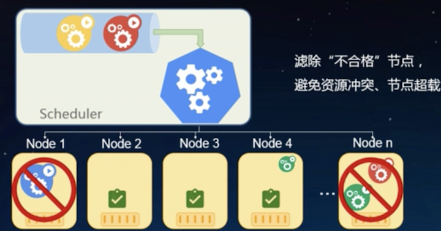
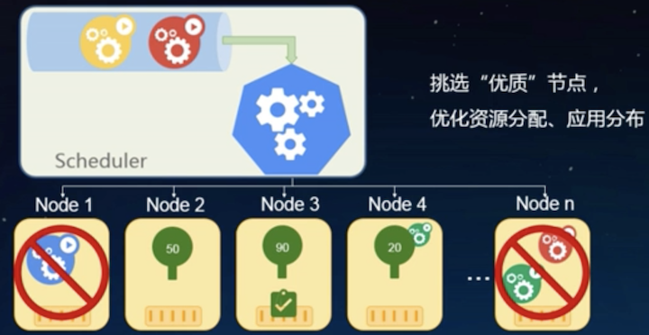
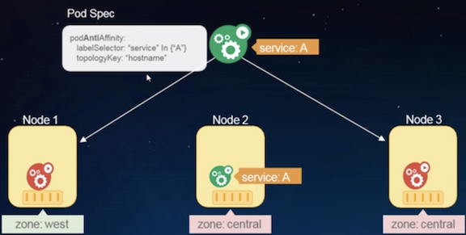
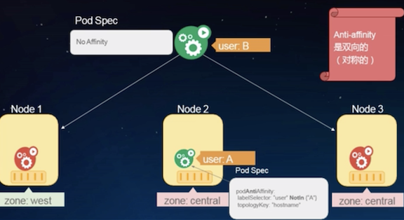

# Kubernetes 调度器原理剖析

## 大纲

* K8S 调度机制介绍
* K8S 中的调度策略和算法
* K8S 高级调度特性详解

## K8S 调度机制介绍

### Scheduler: 为Pod找到一个合适的Node


### Kubernetes 的 default scheduler

* 基于队列的调度器
* 一次调度一个pod
* 调度时刻全局最优


### 从外部流程看调度器

#### 从Pod创建开始， 到pod被bind结束


### 掉度器内部流程

* 通过NodeLister获取所有节点的信息
* 整合`scheduled pods`和`assume pods`， 合并到`pods`, 作为所有已调度`pod`信息
* 从pods中整理出`node-pods`的对应关系表`nodeNameToInfo`
* 过滤掉不合适的节点
* 给剩下的节点依次打分
* 在分数最高的节点中选择一个node用于绑定。这是为了避免分数最高的节点被几次调度撞车


## K8S 中的调度策略和算法


### 通过Predicate策略选择符合条件的Node



### 典型的Predicate 算法


### 通过Priority策略给剩余的Node评分， 挑选最优的节点



### 典型的priority 算法


## K8S 高级调度特性详解

### K8S中的label和selector

* 任意的metadata
* 所有的API对象都有Label
* 通常用来标记“身份”
* 可以查询时用selector过滤
  * 类似于 SQL `select ... where ...`


### Node Affinity 

#### 让pod在指定的node上运行


### Pod Affinity 

#### 让pod与指定的Service的一组Pod在相同的Node上运行

**`topologyKey: "zone"`**


**`topologyKey: "hostname"`**


### Pod Anti-Affinity 

#### 让同一个Service的pod分散到不同的Node上来运行



### Pod Anti-Affinity 具有对称性




### Taints-toleartions

#### 来自Node的反亲和配置


## Practical Example

```
$ kubectl get node -o yaml | grep -A 11 labels
```

### install zsh auto-complete

```
source <(kubectl completion zsh>
```


