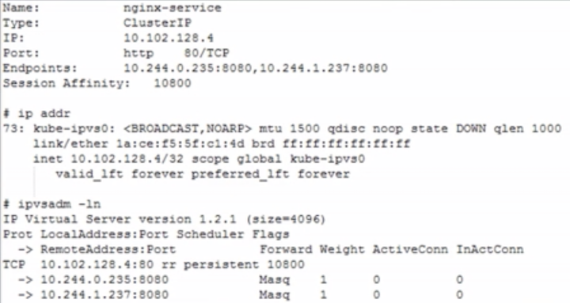
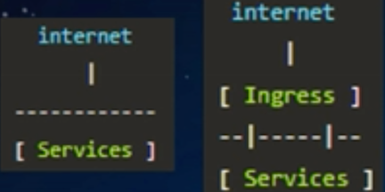
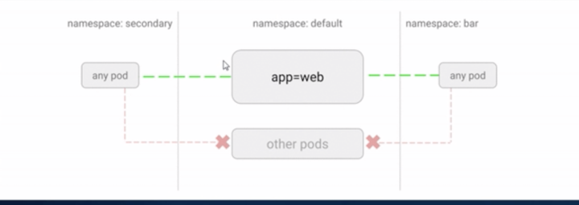

# Kubernetes 网络模型原理剖析

## 大纲

* 网络模型与CNI
* Service
* Ingress
* DNS
* Network Policy

## Kubernetes 网络模型与CNI 

### 1.一个Pod一个IP 

* 每个Pod独立IP, Pod内所有容器共享网络namespace (同一IP） 
* 容器之间直接通信，不需要NAT 
* Node和容器直接通信，不需要NAT 
* 其他容器和容器自身看到的IP是一样的 

### 2.集群内访问走Service，集群外访问走Ingress 

### 3.CNI(container network interface）用于配置Pod网络 
* 不支持docker网络 


### Bridge 网络


**注意， Bridge模式下， 多主机网络通信需要配置额外的主机路由， 或者使用overlay网络**

### overlay 网络

**`Overlay`是在物理网络只上的虚拟网络， `VXLAN`是当前最主流的`Overlay`标准**

- VXLAN 就是用 UDP 包头封装二层帧 （MAC in UDP）


## CNI Container Network Interface

* 容器网络的标准化
* 使用JSON来描述网络配置
* 两类接口：
 * **配置网络 -- 创建容器时调用**
 * `AddNetwork(net NetworkConfig, rt RuntimeConf)(types.Result, error)`
 * **清理网络 -- 删除容器时调用**
 * `DelNetwork(net NetworkConfig, rt RuntimeConf)`


### CNI 插件： host-local + bridge

```
cat /etc/cni/net.d/10-mynet.conf
{
	"name": "mynet",
	"type": "bridge",
	"ipam": {
		"type": "host-local",
		"subnet": "10.10.0.0/16"
	}
}
```

**`CNI plugin` 二进制文件:**

```
/opt/cni/bin/{host-local, bridge}
```

### CNI 插件：带宽控制

```
{
	"kind": "Pod, 
	"metadata": {
	"name": "iperf-slow", 
   "annotations": { 
       "kubernetes.io/ingress-bandwidth": "10M", 
       "kubernetes.io/egress-bandwidth": "10M"
		}
	}
}
```

```
{
"type": "bandwidth", 
"runtimeConfig": { 
  "trafficShaping": { 
  	"ingressRate": "10000" 
  	"egressRate": "10000" 
	}
  }
}
```


* 多个后端实例，如何做到负载均衡
* 如何保持会话亲和性
* 容器迁移， IP发生变化如何访问
* 健康检查怎么做
* 怎么通过域名访问


## Kubernetes Service


### Service 和 Endpoint 定义

```
apiVersion: vi 
kind: Service 
metadata: 
	name: nginx-service 
	namespace: default 
spec: 
	clusterIP: 10.101.28.148 
	ports: 
	- name: http 
	  port: 8O 
	  protocol: TCP 
	  targetPort: 8080 
	selector: 
	  app: nginx 
```
```
apiVersion: vi 
kind: Endpoints 
metadata: 
	name: nginx-service 
	namespace: default 
subsets: 
- addresses: 
  - ip: 172.17.0.2 
    nodeName: 100-106-179-237.node 
    targetRef: 
    	kind: Pod 
    	name: nginx-rc-c8tw2 
    	namespace: default 
  - ip: 172.17.0.3 
    nodeName: 100-106-179-238.node 
    targetRef: 
    	kind: Pod 
    	name: nginx-rc-xl4tv 
    	namespace: default 
  ports: 
  - name: http 
    port: 8080 
    protocol: TCP 
```

### Service 工作原理


### Kubernetes Service类型

**ClusterIP** 

* 默认类型，自动分配集群内部可以访问的虚IP ---- `ClusterlP`。 

**NodePort**

* 为Service 在 Kubernetes集群的每个Node上分配一个端口，即 `NodePort`, 集群内/外部可基于任何一个`NodeIP:NodePort`的形式来访问`Service`. 

**LoadBalancer**

* 需要跑在特定的`cloud provider`上 
* `Service Controller`自动创建一个外部`LB`并配置安全组 
* 对集群内访问，`kube-proxy`用`iptables`或 `ipvs` 实现了云服务提供商LB的部分功能：**L4转发，安全组规则等**。 


### Kubernetes 服务发现

#### 环境变量

Kubelet为每一个pod注入所有Service的环境变量信息，形如


**缺点： 环境变量洪泛， docker 启动参数通过长直接导致启动容器失败**


#### 域名

假如`Service (my-svc)`在 `namespace（my-ns）`中， 暴露名为`http`的`TCP`端口

* A记录：`my-svc.my-ns` -> **Cluster IP** 
* SRV记录： `_http._tcp.my-svc.my-ns`  -> **http端口号**

### Service 实现之 iptables

`Iptables`是用户控件应用程序， 通过配置`Netfilter`规则表（`Xtables`）来构建`linux`内核防火墙


```
Service IP:Port 一＞ PREROUTING(OUTPUT)一＞ KUBE-SERVICES一＞KUBE-SVC一xxx 一＞ KUBE-SEP-XXX 一＞ Pod IP:Port
```
### Service 实现之 IPVS

IPVS 是 LVS 的负载均衡模块， 亦基于`netfilter`,但比`iptables`性能更高



### iptables VS. IPVS


### 如何从集群外访问`Kubernetes Service`? 

* `NodePort`类型的`Service` 
  * 要求`Node`有对外可访问`IP` 
* 使用	`LoadBalancer`类型的`Service` 
  * 要求在特定的云服务上跑K8S 

**`Service`只提供`L4`负载均衡功能， 而没有`L7`功能**


## Ingress

### Ingress是授权入站连接到达集群服务的规则集合

* 支持通过`URL`方式将`Service`暴露到`K8S`集群外， `Service`之上的`L7`访问入口
* 支持自定义`Service`的访问策略
* 提供按域名访问的虚拟主机功能
* 支持TLS




```
apiVersion: extensions/v1beta1 
kind: Ingress 
metadata: 
	name: test-Ingress 
spec: 
 tls:
 - secretName: testsecret
 backend:
  serviceName: testsvc
  sevicePort:80
```


```
apiVersion: extensions/v1beta1 
kind: Ingress 
metadata: 
 name: test 
spec: 
 rules: 
 - host: foo.bar.com 
   http: 
    paths: 
    - path: /foo
      backend: 
       serviceName: s1 
       servicePort: 80 
    - path: /bar
      backend: 
       serviceName: s2 
       servicePort: 80 
```
**当LB准备就绪时，`Ingress Controller`把填充`ADDRESS`字段**


* ADDRESS: Ingress的访问入口地址， 由`Ingress Controller`分配
* BackEND: K8S Service + Port
* RULE: 自定义的访问策略
* 若规则为空， 则访问`ADDRESS`的所有流量都转发给`BACKEND`

## Ingress DIY

### 需要自己实现Ingress Controller

* List/watch K8S的Service, Endpoints, Ingress对象， 刷新外部的LB的规则和配置
* 官方提供的`Nginx`和`GCE`的`Ingress Controller`实例

### 想通过域名访问Ingress

需要自己配置域名和`Ingress IP`的映射： `host`文件， 自己的DNS


## Kubernetes DNS

* **解析`Pod`和`Service`的域名的，`K8S`集群内`Pod`使用**
  * **`kubelet`配置`--cluster-dns`把`DNS`的静态`IP`传递给每个容器**
* **`Kube-dns`和`CoreDNS`**
* 对`Service`:
  *  **A记录:**
  *  **普通Service:**`my-svc.my-namespace.svc.cluster.local` -> **`Cluster IP`**
  *  **headless Service:** `my-svc.my-namespace.svc.cluster.local` -> **`后端Pod IP列表`**
  * **SRV记录:**
  * `_my-port-name._my-port-protocol.my-svc.my-namespace.svc.cluster.local` -> `Service Port`
* 对`Pod`

**A记录:**

```
pod-ip(1,2,3,4).my-namespace.pod.cluster.local -> Pod IP
```

**在`Pod Spec`指定`hostname` 和 `subdomain`**

```
hostname.subdomain.my-namespace.pod.cluster.local -> Pod IP
```

* **Kubedns**: List/Watch K8S service 和 Endpoint的变化， 接入SkyDNS, 在内存中维护DNS记录，是dnsmasq的上游
* **dnsmasq**: DNS的配置工具， 监听53端口， 为集群提供DNS查询服务。 提供DNS缓存， 降低kubedns的压力
* **sidecar**: 健康检查，检查`kube-dns`和`dnsmasq`的健康


 
### Kube-dns级联查询

默认pod从node继承了DNS配置， 也可以通过`kubelet`的 `--resolve-conf`配置


## Kubernetes 的网络隔离




### Network Policy

#### 基于源IP的访问控制列表

* 限制Pod的进/出流量
* 白名单

#### pod 网络隔离的一层抽象

* label selector
* namespace selector
* port
* CIDR

#### 没有Network Policy: 全网通

#### 网络插件实现 Policy Controller

#### 网络插件要支持 `Network Policy`，如 `Calico`、`Romana`、`Weave Net`和`trireme`等


### Network policy


注释： 

* `{}`代表允许所有
* `[]`代表拒绝所有
* 标出，空值表示拒绝

### 拒绝所有流量进入

```
kind: NetworkPolicy 
apiVersion: networking.k8s.io/v1 
metadata: 
  name: web-deny-all 
spec: 
  podSelector: 
    matchLabels: 
      app: web 
  ingress: [] 
```


### 限制部分流量进入

```
kind: NetworkPolicy 
apiVersion: networking.k8s.io/v1 
metadata: 
  name: api-allow 
spec: 
  podSelector: 
    matchLabels: 
      app: bookstore 
      role: api 
  ingress: 
  - from: 
      - podSelector: 
          matchlabels: 
            app: bookstore 
```


### 允许所有流量进入

```
kind: NetworkPolicy 
apiVersion: networking.k8s.io/v1 
metadata: 
  name: web-allow-all
  namespace: default 
spec: 
  podSelector: 
    matchLabels: 
      app: web
  ingress:
  - {}
```

等价于：

```
ingress
- from
  podSelector: {}
  namespaceSelector: {}
```


 
### 允许特定的namespace的pod流量流入

```
kind: NetworkPolicy 
apiVersion: networking.k8s.io/v1 
metadata: 
  name: web-allow-prod
spec: 
  podSelector: 
    matchLabels: 
      app: web
  ingress:
  - from: 
      - namespaceSelector: 
          matchlabels: 
            purpose: production 
```


### 限制流量从指定端口进入

```
kind: NetworkPolicy 
apiVersion: networking.k8s.io/v1 
metadata: 
  name: web-allow-5000
spec: 
  podSelector: 
    matchLabels: 
      app: api
  ingress:
  - ports: 
    - ports: 5000
    from: 
    - podSelector: 
       matchLabels: 
        role: monitoring 
```


### 支持Network Policy的网络插件

* Calico
* Romana
* Cilium
* Weave Net
* Kube-router

**注意： flannel和Kubernetes 不支持`network policy`**❤️❤️