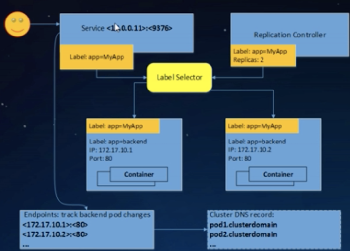

# Kubernetes 服务发现与负载均衡原理剖析

## 大纲 
- `Kubernetes`的`Service`机制 
- `Iptables`实现`Service`负载均衡 
- 当前`Iptables`实现存在的问题 
- `IPvs`实现`Service`负载均衡 
- `Iptables` VS.`IPVs`


## `Kubernetes`的`Service`


* 多个后端实例，如何做到负载均衡
* 如何保持会话亲和性
* 容器迁移， IP发生变化如何访问
* 健康检查怎么做
* 怎么通过域名访问

## `Kubernetes`的`Service`与`Endpoint`



## `Service`与`Endpoint` 的定义

```
apiVersion: vi 
kind: Service 
metadata: 
    name: nginx-service 
    namespace: default 
spec: 
    clusterIP: 10.101.28.148    ❤️
    ports: 
    - name: http 
      port: 8O                  ❤️
      protocol: TCP 
      targetPort: 8080          ❤️
    selector: 
      app: nginx 
```

```
apiVersion: vi 
kind: Endpoints 
metadata: 
    name: nginx-service 
    namespace: default 
subsets: 
- addresses: 
  - ip: 172.17.0.2                      ❤️
    nodeName: 100-106-179-237.node 
    targetRef: 
        kind: Pod 
        name: nginx-rc-c8tw2 
        namespace: default 
  - ip: 172.17.0.3                       ❤️
    nodeName: 100-106-179-238.node 
    targetRef: 
        kind: Pod 
        name: nginx-rc-xl4tv 
        namespace: default 
  ports: 
  - name: http   
    port: 8080                        ❤️
    protocol: TCP 
```

### Service 内部逻辑  

[内部服务发现 `kube-proxy` 实现原理](https://github.com/Chao-Xi/JacobTechBlog/blob/master/k8s_tutorial/k8s_adv36_kube_proxy.md)


### Iptables 实现 Service 负载均衡

用户空间的应用程序， 通过配置`Netfilter`规则表（`Xtables`）来构建linux内核防火墙


### 网络包通过Netfilter 全过程


## Iptables实现流量转发与负载均衡 

### `Iptabte`，如何做流览转发？

**DNAT实现IP地址和端口映射**

```
iptables -t nat -A PREROUTING -d 1.2.3.4 --dport 80 -j DNAT --to-destination 10.20.30.40:8080
```

### Iptables如何做负载均衡？

**`statistic`模块为每个后端设置权重**

```
Iptables -t nat -A PREROUTING -d 1.2.3.4 -d port 80 -m static --mode random --probability .25 -j DNAT --too-destination 10.20.30.40:8080 
```

### `Iptables`如何做会话保持？ 

**recent校块设置会话保持时间**

```
iptables -t nat -FOO -m recent -rcheck一seconds 3600 --reap --name BAR -j BAR 
```

###  `Iptables` 在 Kubernetes 的应用举例

```
Cluster Ip: Port -> PREROUTING(OutPut) -> Kube-Services -> Kube-SVC-XXX -> Kube->SEP->XXX -> Pod IP: Target Port
```


###  `Iptables` 做负载均衡的问题

#### 规则线性匹配时延

* `KUBE-SERVICES` 链挂了一长串`KUBE-SVC-*`链;访问诶个`service`, 要遍历每条链知道匹配， 时间复杂度 `O(N)`, 

#### 规则更新时延

* 非增量式

#### 可扩展性

* 当系统存在大量， `iptables` 规则链时，增加/删除规则会出现`kernel lock`

* `kernel lock: Another App is currently holding the xtables lock. Perhaps you want to use -w option`

#### 可用性

* 后端实例扩容， 服务会话保持时间更新等都会导致链接断开


### Iptables


### 更新`Iptables`规则的时延 

#### 时延出现在哪？ 

- 非增量式，即使加上 `--no-flush` (`iptables-restore`）选项 
- `Kube-proxy`定期同步`iptable`状态： 
   * 拷贝所有规则：`iptables一save` 
   * 在内存中更新规则 
   * 在内核中修改规则：`iptables-restore` 
   * 规则更新期间存在`kernel lock` 

* **5K service(40K规则)**,  增加一条`iptables`规则，耗时`11mm` 
* **20K service(60K规则）**, 增加一条`iptables`规则，耗时`5h `

### `Iptables`周期性刷新导致TPS抖动


### K8S Scability

* 5K Nodes, 100k Pod
* **1k** Services

### `Iptables` 优化， 树形结构


搜索时间复杂度取决于搜索树的高度（m）, 时间复杂度 O(m/N)

## 什么是IPVS (IP Virtual Server)

* Linux内核实现的L4 LB,LVS负载均衡的实现 
* **基于`netfilter`, `hash table` **
* 支持TCP, UDP, SCTP协议，IPV4, IPV6 
* 支持多种负载均衡策略 
  `-rr, wrr, lc, wlc, sh, dh, Ibic…`
* 支持会话保持 
  `-persistent connection`调度算法


### Ipvs三种转发模式 

* 支持三种LB模式 `Direct Routing(DR)`,`Tunneling`, `NAT` 
  * `DR`模式工作在`L2`，最快，但不支持端口映射 
  * Tunneling模式用IP包封IP包，也称`IPIP`模式，不支持端口映射 
  * `DR`和`Tunneling`模式，回程报文不会经过`IPVS Director`.
  * `NAT`模式支持端口映射，回程报文经过`IPVS Director` 
  * **内核原生版本只做DNAT，不做SNAT **

 
### IPVS工作流


### DR模式


### Tunneling模式


### NAT模式


### IPVS做L4转发

**1．绑定VIP** 

- dummy网卡 

```
#ip link add dev dummyO type dummy 
#ip addr add 192.168.2.2/32 dev dumrnyO
```

- 本地路由表 

```
# Ip route add to local 192.168.2.2/32 dev ethO proto kernel
``` 

- 网卡别名 

```
#ifconfig ethO:1 192,168.2.2 netmask 255.255.255.255 up
```

**2.创建IPVS Virtual Server**

```
#ipvsadm -A -t 192.168.60.200:80 -s -rr 一p 600 
```

**3．创建IPVS Real Server** 

```
# ipvsadm -a -t 192,168.60.200:80 -r 172.17.1.2:80 -m 
# ipvsadm -a -t 192.168.60.200:80 -r 172.17.2.3:80 -m
``` 

### Kubernetes支持 IPVS 模式 

* 社区1.8 Alpha特性，
* 社区1.9进bet
* 社区1.11进GA，广泛使用下一步成为默认模式
* 支持`ClusterIP`, `NodePort`, `External IP`, `Load Balancer` ...类型Service 

```
 - iptables模式的特性，IPVS模式都支持
```

* 兼容`Network Policy` 依赖`iptables`做`SNAT`和访问控制 


### Iptables VS. IPVS 规则刷新时延


观察结果：

- 增加一条 Iptables的时延，随养规则数的增加“指数”上升 
- 增加一条,Ipvs的时延，规则基数对其几乎没影响 

### Iptables VS. IPVS 资源消耗


### Iptables VS. IPVS TPS 与时延


## Iptables VS. IPVS

### Iptables

* 灵活，功能强大
* 在 prerouting, postrouting, forward, input, output 不同阶段都能对包进行操作

### IPVS

* 更好的性能（hash vs. chain）
* 更多的负载均衡算法

```
- rr, wrr, lc, wlc, ip, hash
```

* 连接保持

```
IPVS server 更新期间， 保持连接不断开
```

* 预先加载内核模

```
- nf_conntrack_ipv4, ip_vs, ip_vs_rr, ip_vs_wrr, ipvs_sh...
```

```
# echo 1 > /proc/sys/net/ipv4/vs/conntrack
```

## 为什么还需要Iptables 

因为我们访问了一层`Service IP！`

```
NodeIP一＞Service IP(Gateway）一＞C 
```

* 客户端: (NodeIP, ServiceIP) 期望：(Service IP, Node IP)
* 但实际: 经过`IPVS`一层转发，包地址变成了（NodeIP, C) 
* 服务端发出:(C, NodeIP) -这个包的源、目的地址与客户端期望的不一样！ 
**故将被丢弃, 因此，需要一次`SNAT(masquerade)`**
(Node IP, Service IP）一＞( IPVS director IP, C)

**这也是为什么`IPVS NAT` 模式要求回程报文必须进过`director`**

## IPSet 一 把`O(N）`的`iptables`规则降为`O(1)` 

但，不想要太多`iptables`

```
ipset create KUBE-LOOP-BACK hash:ip,port,ip 
ipset add KUBE-LOOP-BACK 192.168.1.1,udp:53,192.168.1.1 
ipset add KUBE-LOOP-BACK 192.168.1.2,tcp:80,192.168.1.2 
```

```
iptables -t nat -A POSTROTING -m set --match-set KUBE-LOOP-BACK dst,dst,src -j -MASQU ERADEOUTING O(1)
```


**`ipset`支持“增量”式增／删／改，而非`IptabIes`式全量更新**

## Practical Example

```
ipset list
```

```
kubectl get endpoints
```

```
ipvsadm -ln
```

```
ipset list
```

```
iptables -t nat -nL
```

