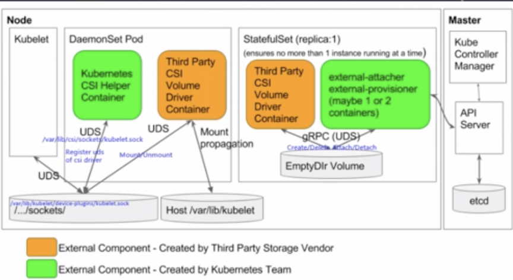

# K8S 存储原理剖析与实践

## 大纲

* K8S存储整体框架及与案例剖析
* K8S FlexVolume 存储扩展机制
* K8S CSI 存储扩展机制

## Docker 插件机制 - 机制 & 评价

### [评价]

1. 不重新编译docker的情况下提供针对权限， 网络， 卷等功能的扩展
2. 基于 HTTP JSON-PRC 格式的接口与插件进行交互
3. 支持容器化和非容器化的多种部署形式
4. 支持插件生命周期管理： 1.52+ docker plugin命令及其API; `<1.52 docker volume/network`
5. 支持基于TLS的安全加固

**约束**

某些插件（认证）的添加需要重启`docker daemon`

### Docker Volume Plugin 列表

### 支持Kubernetes 的平台和存储服务

## K8S 存储能力 - Volume 概念

* K8S中的普通Volume提供了在容器中挂圈的能力， 他不是独立的K8S资源对象， 不能通过K8S去管理（创建， 删除等），只能再创建Pod时区引用
* Pod 需要设置卷**来源** ( `spec. volume` ）, 和 **挂载点** ( `spec.container.volueMounts` ) 两个信息之后才可以使用相应的Volume

#### 使用AWS EBS的容器应用

#### 使用GCE	PD的容器应用

#### 使用HostPath的容器应用

#### 使用ConfigMap的容器应用

## K8S 存储能力：In-Tree Volume Plugins

K8S 的 VolumePlugin 提供了插件化扩展存储的机制， 分为内置插件（In-Tree）和 外置插件 （Out-of-Tree）两种

## K8S 存储能力：`Persistent-Volume`

**Kubernetes 通过 `Persistent Volume`子系统API对管理员和用户提供了存储资源创建和使用的抽象**

` POD  =>  PVC  =>  PV  => StorageClass  `

* `FlexVolume`: 此 `Volume Driver` 允许不同厂商去开发他们自己的驱动来挂载卷到计算节点
* `PersistentVolumeClaim`: K8提供的资源抽象的Volume Driver, 让用户不用关心具体的Volume的实现细节

## Flex Volume 框架

K8S 1.5引入1.8GA的 `Out-Of-Tree Volume Plugin`:

* driver以二进制命令行形式实现FlexVolume APT, 已提供`Controller-Manager`和 `Kubelet`调用， 对外接口实现容易
* Dameonset 方式部署确保master和node上都会讲driver安装到插件目录
* Docker 镜像+yaml配置的交付形式

## Flex Volume Driver部署脚本和配置

部署脚本所假设需要的驱动二进制文件， 且已经被至于部署镜像的`/DRIVER`目录下： 启动脚本将二进制driver重命名为 `.driver`,再拷贝到 `<plugindir>/<vendor~driver>/.driver`目录下，接着使用mv将其重命名为`drivr`,确保安装的原子性， 最后进入死循环确保容器活着

### Flex Volume CLI API

### CSI相关术语

## 业界容器编排系统的存储接口之痛

**DVDCLI: Docker Volume CLI**

**DVDI: Docker Volume Driver Interface**

## 业界存储界的福音： Container Storage Interface (CSI)

## CSI 通用框架

CO通过`gRPC` 与插件交互，每个SP必须实现以下两个plugin

* Node plugin: 需要运行在使用Volume的Node上， 主要负责`Volume Mount/Unmount`等操作
* Controller plugin: 可以运行在任何节点，主要负责`Volume Creation/Deletion, Attach/Detach`等操作

CSI有以下三种可以提供选择插件部署架构

### CO与Plugin的交互， 01.卷的创建和Attach

### CO与Plugin的交互， 02.将卷mount到全局路径、workload挂在路径

* 卷的mount系列操作是由 Workload的启动所触发的
* K8S的volume的**全局挂载路径** （存储挂载节点）格式样例

`/var/lib/kubelet/plugins/Kubernetes.io/$volume_plugin/mounts/$volume_name`

* K8S的volume的**workload挂载路径** （软连）格式样例

`/var/lib/kubelet/pods/$pod_id/volumes/$volume_plugin/$volume_name`

### CO与Plugin的交互， 03.将卷从全局路径、workload挂在路径unmount

**卷的`unmount`系列操作是由workload的重启，迁移，删除所触发的**

### CO与Plugin的交互， 03.卷的detach和删除

## 卷的生命周期

## RPC 接口集合 - Identity

CSI规范定义了**3类RPC集合**：

* Identity Service: `Node Plugin`和`Controller Plugin`都需要实现RPC集合
* Controller Service: `Controller Plugin`需要实现的RPC集合
* Node Service: Node plugin 需要实现的RPC集合

`Identity Service RPC`: 身份服务RPC允许CO查询插件的功能， 健康状态和其他源数据

## RPC 接口集合 - Controller

**`Controller Service RPC`: 控制服务RPC提供卷的创建， 删除， Attach, Detach, 查询等功能， 以及卷的快照的创建， 删除， 查询等功能**

## RPC 接口集合 - Node

##  K8S CSI框架

K8S 1.9 实现了CSI plugin alpha 版本， 1.11版本升级至Beta

为了部署一个容器化的第三方`CSI Volume driver`存储提供商需要提供如下操作：

1. 创建一个实现CSI规范描述的插件功能， 并通过Unix套接字来暴露gRPC访问接口的“ CSI Volume Driver”容器
2. 集合使用K8S团队提供的帮助容器服务来部署CSI Volume driver, 具体需要创建如下两类K8S对象
   1. StatefulSet: 用于与K8S 控制器进行交互，实例数1， 包含3个容器 （CSI volume driver, external-attacher, external-provisioner, ） 需要一个挂载点为`/var/lib/csi/sockets/pluginproxy`的empty volume
   2. Damemonset: 包含两个容器（CSI volume driver， K8S CSI Helper），挂载三个`hostpath`
3. 集群管理员为存储系统在K8S集群中部署上述的 StatefulSet和 Damemonset

