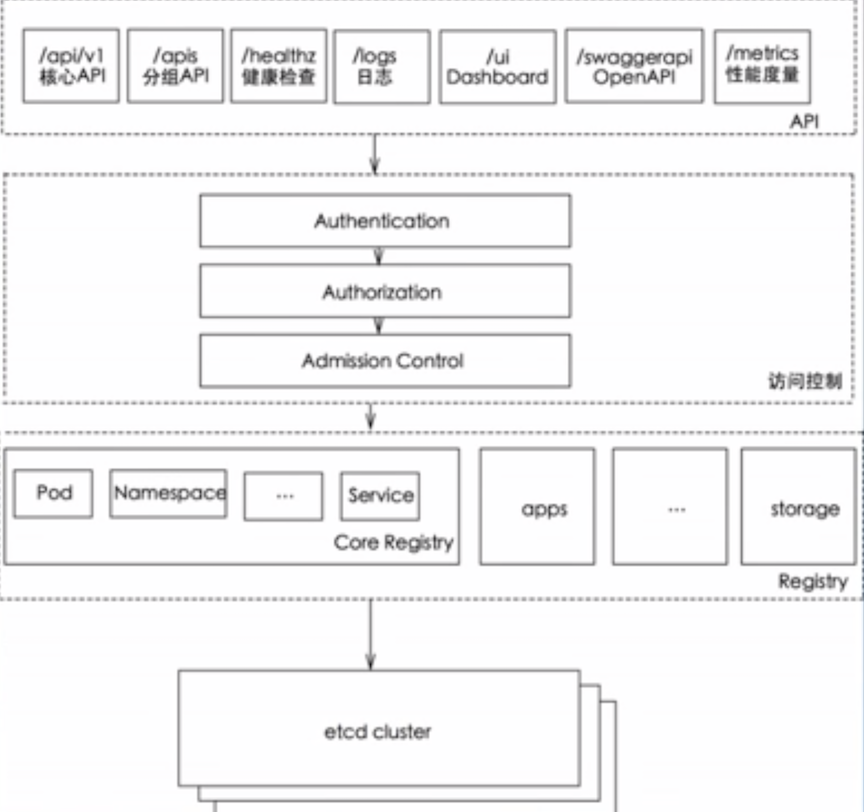
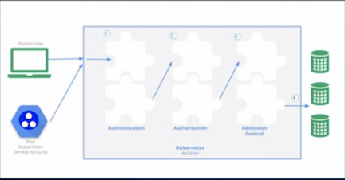
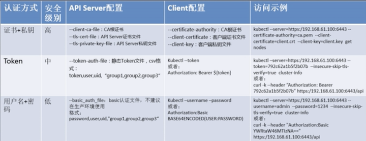
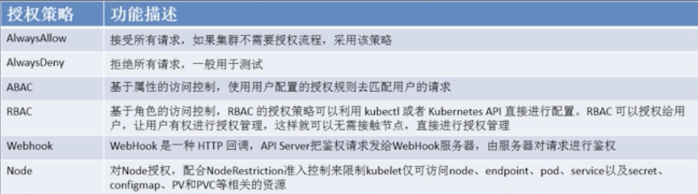
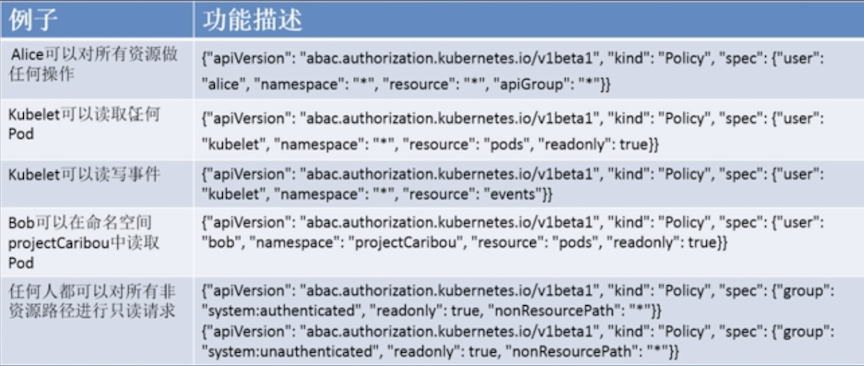
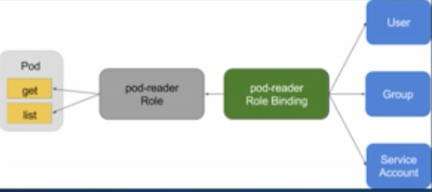
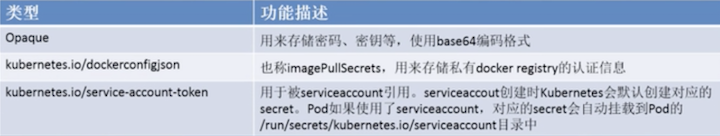
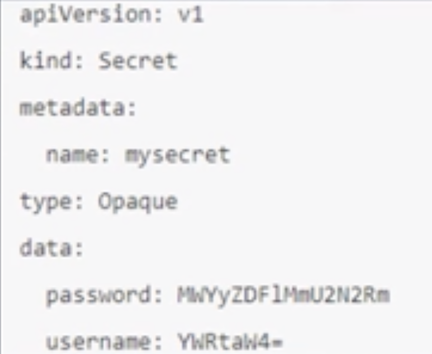
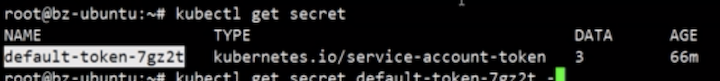
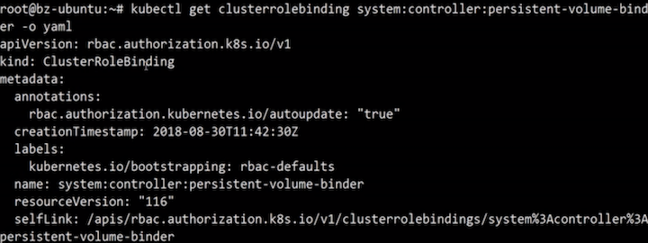

# Kubernetes 安全原理剖析

## 大纲

* 认证与权限
* 准入控制
* Service Account
* Sercret

## 再看API Server



## Kubernetes的安全框架



* 访问K8S集群的资源需要通过三关： 认证， 鉴权， 准入控制
* 普通用户若要访问集群API Server, **往往需要证书， token, 用户名-密码**；pod访问， 需要`ServiceAccount`
* K8S安全控制框架主要由下面3个阶段进行控制， 每个阶段都支持插件方式， 通过API Server配置来启用插件
  * Authentication 
  * Authorization 
  * Admission Control

### 认证： 告别8080，迎接6443

#### 三种客户端身份认证



* 用户通过认证后，对指定的资源是否有权限访问， 还需要经过**授权**环节。授权主要是用于对集群资源的访问控制，通过检查请求包含的**相关属性值**。 与相对应的访问策略相比较， API 请求必须满足某些策略才能被处理
* Kubernetes 授权仅处理的请求处理
  * user, group, extra
  * API, 请求方式（如 get, post, update, patch 和 delete）和 请求路径 （如/api）
  * 请求资源和子资源
  * Namespace
  * API group
* API Server支持多种授权策略， 通过启动参数 **“--authorization_mode”** 设置， 可以**同时**启用多种策略



### 授权策略 - ABAC

* **ABAC (Attribute-based access control**） **基于属性的访问控制**，通过使用将属性组合在一起的策略向用户访问授权
* 给 API server指定策略文件， `--authorization-policy-file=FILENAME`， 文件内容是一行一个`Policy`对象的`JSON`

```
{
 "apiVersion": "abac.authorization.kubernetes.io/v1beta1",
 "kind":"policy",
 "spec": {
    "user": "bob",
    "group": "musician",
    "namespace": "projectDJ",
    "resource": "*",
    "apiGroup": "*",
    "readonly": true
 }
} 
```

#### 修改策略文件将需要 `API Server`重启

#### ABAC - 实例




### 授权策略 - RBAC

* RBAC (Role-Based Access Control), 允许通过 `Kubernetes API`动态配置策略
* RBAC 被映入成四种K8S顶级资源对象
  * **角色（Role）: `Role`， `ClusterRole`**
  * 角色表示一组权限的规则， 累计规则
  * Role 适用带`namespace`的资源， `ClusterRole` 适用资源或非资源API
  * **建立用户与角色的映射/绑定关系： `Rolebinding`, `ClusterRoleBinding`**
  * `Rolebinding`和`ClusterRoleBinding` 的区别在于是否是namespace的资源
  * 角色绑定包含了一组相关主体（即subject, 包括用户， 或者`Service account`）以及对被授予的角色的应用




### 角色

```
Kind: Role
apiVersion: rbac.authorization.k8s.io/v1beta1 
metadata: 
	namespace: default 
	name: pod-reader 
rules: 
- apiGroups: [""]   # 空字符串表明使用 `core API group `
  resources: ["pods"] 
  verbs: ["get', "watch', "list"] 
```

```
Kind: ClusterRole
apiVersion: rbac.authorization.k8s.io/v1beta1 
metadata: 
# 无namespace 
  name: secret-reader 
rules: 
- apiGroups: [""] 
  resources: ["secrets"] 
  verbs: ['get", 'watch', "list"]
``` 

### 角色绑定

**允许用户“jane”从“default”命名空间读取Pod**

```
Kind: RoleBind       ❤️
apiVersion: rbac.authorization.k8s.io/v1beta1 
metadata: 
  name: read-pods 
  namespace: default 
subjects             ❤️
- kind: User      #Service Account也可以
  name: jane 
  apiGroup: rbac.authorization.k8s.io 
RoleRef             ❤️
  kind: Role 
  name: pod-reader 
  apiGroup: rbac.authorization.k8s.io 
```
  
**允许用户组“manger”中任何用户都可以读取集群中任何命名空间中的`secret`**
```
kind: ClusterRoleBding  ❤️
apiVersion: rbac.authorization.k8s.io/v1beta1
metadata: 
 name: read-pods 
 namespace: default 
subjects:               ❤️
- kind: Group
  name: manager
  apiGroup: rbac.authorization.k8s.io 
RoleRef:                ❤️
  kind: Role 
  name: pod-reader 
  apiGroup: rbac.authorization.k8s.io 
```

## Admin Control 准入控制

* **Admin Control实际上是一个准入控制器（Admin Control）插件链表**（又叫“准入控制链”）发送到 `API server`的请求都经过这个列表中的每个准入控制器插件的检查，检查不通过， 则`API Server`拒绝请求
* 会自动修改Pod的配置
* 官方支持20+个准入控制插件， 而且支持自定义扩展
* 1.4以后版本官方推荐使用插件
  
 ```
  --admission-control=NamespaceLifecycle,LimitRanger,ServiceAccount,DefaultStorageClass,ResourceQuota
 ```
 
## Secret
 
`Secret` 对象类型用来保存敏感信息， 例如密码， OAuth 令牌和 ssh key. 将这些信息放在secret中比放在Pod的定义或者docker镜像中可以更好地控制它的用途， 并降低意外暴露的风险

pod一般3种方式使用secret

* 最为 volume中的文件挂载到pod中一个或多个容器
* 环境变量
* 当`kubelet`为pod拉取镜像时使用



### Secret - Opaque类型定义

**Opaque类型数据是一个map类型， 要求value是base64编码格式**

**以数据库用户名（admin=> ）， 密码（）为例：**



```
# base64
$ echo "" | base64 --decode 
```

### Secret 挂载到 Volume

```
apiVersion: v1
kind: Pod 
metadata: 
  name: mypod 
spec: 
  containers: 
  - name: mypod 
    image: redis
    volumeMounts:
    - name: foo
      mountPath: "/etc/foo"
      readOnly: true
  volumes:
  - name: foo
    secret:
      secretName: mysecret
      defaultMode: 0400
```
 
#### 从volume消费secret

```
$ ls /etc/foo
username
password

$ cat /etc/foo/username
admin
$ cat /etc/foo/password
1f2d1e2e67df
```

* 挂载到Volume的secret被更新时， 被映射的key也将被更新
* Kubelet 在周期性同步时检查被挂载的secret是不是最新的

同步时延：

```
kubelet sync period + ttl
```

#### secret 做为环境变量

```
apiVersion: v1
kind: Pod
metadata:
  name: secret-env-pod
spec:
  containers:
  - name: mycontainer
    image: redis
    env: 
    - name: SECRET_USERNAME
      valueFrom: 
        secretKeyRef:
          name: mysecret
          key: username
    - name: SECRET_PASSWORD
      valueFrom:
        secretKeyRef:
          name: mysecret
          key: password
    restartPolicy: Never
```

**消费环境变量里的Secret值**

```
$ echo $SECRET_USERNAME
admin
$ echo $SECRET_PASSWORD
1f2d1e2e67df
```

### Secret - dockerconfigjson 类型

Kubernetes.io/dockerconfigjson 类型是secret是将包含`Docker Registry`凭证传递给Kubelet的一种方式， 可以为pod拉取私有镜像

```
$ kubectl create secret docker-registry myregistrykey --docker-server=DOCKER_REGISTRY_SERVER --docker-username=DOCKER_USER --docker-password=DOCKER_PASSWORD --docker-email= DOCKER_MAIL
```

OR: 从docker配置文件导入

```
$ kubectl get secret docker-reistry myregistryey --from-file="~/.dockercfg"
```

```
$ kubectl get secret myregistryey -o yaml
```

### dockerconfigjson类型使用Secret使用

```
apiVersion: v1 
kind: Pod 
metadata: 
  name: private-reg 
spec: 
  containers:  
  - name: private-reg-container 
    image: <your-private-image> 
  imagePullSecret:
  - name: regcred
```

## Service Account

* Service Account 用于Pod中的进程访问API Server
  * 相对于客户端使用的`user account`(全局权限）， 为pod内进程提供身份标识
* 为什么需要Service Account
  * 客户端的授权方式是'全授权‘，可以操作集群！需要更轻量和精准的方式
  * 当default的service Account创建时， 会自动在同namespace下创建一个`default-token-xxx`，并关联到default的`Service Account`上
  * 创建pod时，如果没有指定`Service Account`,K8S的`Service Account Admission Controller`为自动为该Pod指定`default Service Account`
* Pod关联Service Account
  * K8S会给Pod创建一个特殊的Volume, 该Volume中包含指定`Service Account Secret`的token, namespace, 证书文件，并将Volume挂载到Pod中所有的容器指定目录下（`/var/run/secrets/kubernetes.io/serviceaccount`）
* 认证环节
  * 用户名 `system:serviceaccount:(NAMESPACE):(SERVICEACCOUNT)`
  * 凭证 `service account token`

## ServiceAccount使用

* 让Pod访问 API Server
  * 容器应用读取 `/var/run/secrets/kubernetes.io/serviceaccount/token`, 使用token认证方式访问API server
  * client-go做了封装

* Kubectl使用`ServiceAccount token`访问API server
  * 查看指定namespace(如default)下的ServiceAccount, 获取Secret
  * 查看Secret,获取token
  * 设置kubeconfig中设置token
  * 使用kubectl访问

### 再看Service-account-token类型的secret

再看看`service-account-token`类型Secret

Service使用

kubernetes.io/service-account-token类型的Secret对应Pod中的`ca.crt(API Server的CA公钥正式）`， `namespace`, `token`(用API Server私钥签发的bearer token)三个文件

* `/run/secrets/kubernetes.io/serviceaccount/token`
* `/run/secrets/kubernetes.io/serviceaccount/ca.crt`
* `/run/secrets/kubernetes.io/serviceaccount/namespace`


## Pragmatic Example

```
$ kubectl get secret
```



```
$ kubectl get secret default-... -o yaml
```

```
$ kubectl get clusterrole
```
```
$ kubectl get clusterrolebinding
```




```
$ kubectl get sa --all-namepsace | grep persistent-vloume-binder
```

