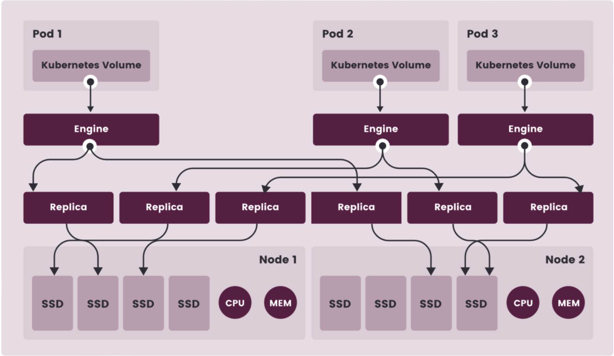
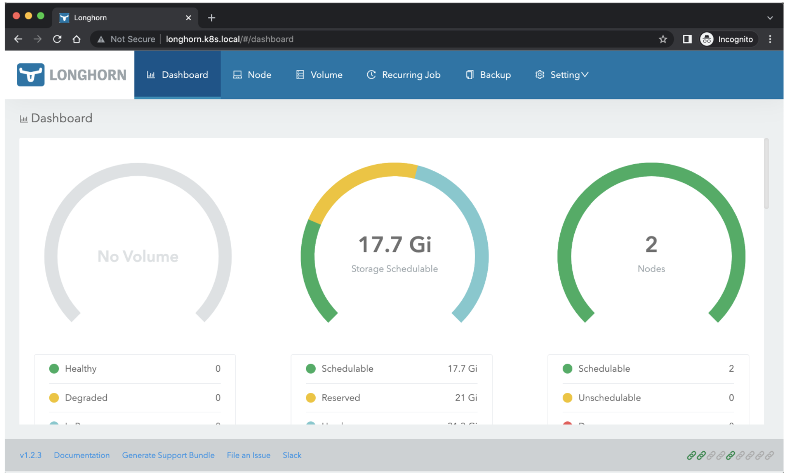
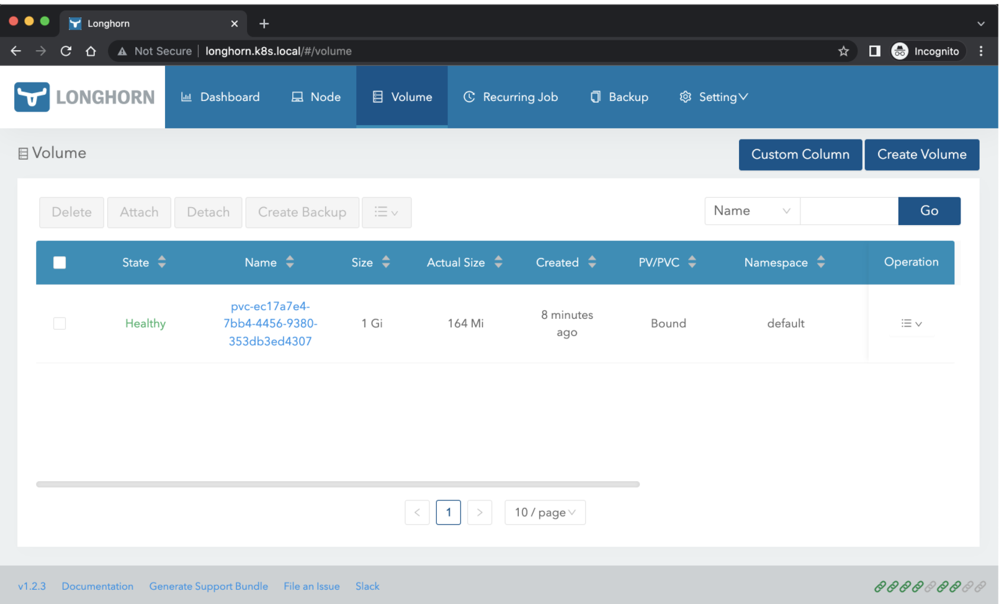

# **1 Kubernetes 分布式存储平台 Longhorn 初体验**

了本地存储、NFS共享存储，除了这些存储类型之外，还有一个块存储，同样为 Kubernetes 提供块存储的方案有很多，比如 Ceph RBD，

今天我们为大家介绍的是 Rancher 开源的一款 Kubernetes 的云原生分布式块存储方案 - Longhorn，Longhorn 是一个轻量级且功能强大的云原生 Kubernetes 分布式存储平台，可以在任意基础设施上运行，Longhorn 还可以与 Rancher 结合使用，将帮助你在 Kubernetes 环境中轻松、快速和可靠地部署高可用性持久化块存储。

使用 Longhorn，可以：

* **使用 Longhorn 卷作为 Kubernetes 集群中分布式有状态应用程序的持久存储**
* **将你的块存储分区为 Longhorn 卷**，以便你可以在有或没有云提供商的情况下使用 Kubernetes 卷
* **跨多个节点和数据中心复制块存储以提高可用性**
* 将备份数据存储在 NFS 或 AWS S3 等外部存储中
* 创建跨集群灾难恢复卷，以便可以从第二个 Kubernetes 集群中的备份中快速恢复主 Kubernetes 集群中的数据
* **调度一个卷的快照，并将备份调度到 NFS 或 S3 兼容的二级存储**
* **从备份还原卷**
* **不中断持久卷的情况下升级 Longhorn**

Longhorn 还带有独立的 UI，可以使用 Helm、kubectl 或 Rancher 应用程序目录进行安装。

## **1 架构**

Longhorn 为每个卷创建一个专用的存储控制器，并在多个节点上存储的多个副本之间同步复制该卷。Longhorn 在整体上分为两层：**数据平面和控制平面**，

* **Longhorn Engine 是存储控制器，对应数据平面**
* **Longhorn Manager 对应控制平面。**

**Longhorn Manager 会以 DaemonSet 的形式在 Longhorn 集群中的每个节点上运行**，它负责在 Kubernetes 集群中创建和管理卷，并处理来自 UI 或 Kubernetes 卷插件的 API 调用，它是遵循 Kubernetes 控制器模式。


Longhorn Manager 通过与 Kubernetes APIServer 通信来创建新的 Longhorn volume CRD，然后 Longhorn Manager 会一直 Watch APIServer 的响应，当它看到发现创建了一个新的 Longhorn volume CRD 时，Longhorn Manager 就会去创建一个新的对应卷。

**当 Longhorn Manager 被要求创建一个卷时，它会在卷所连接的节点上创建一个 Longhorn Engine 实例，并在每个将放置副本的节点上创建一个副本，副本应放置在不同的主机上以确保最大可用性。**

副本的多条数据路径确保了 Longhorn 卷的高可用性，即使某个副本或引擎出现问题，也不会影响所有副本或 Pod 对卷的访问。

**Longhorn Engine 始终与使用 Longhorn 卷的 Pod 在同一节点中运行，它在存储在多个节点上的多个副本之间同步复制卷。**



* 上图中有3个 Longhorn 卷实例
* 每个卷都有一个专用控制器，称为 Longhorn Engine，并作为 Linux 进程运行
* 每个 Longhorn 卷有两个副本，每个副本也是一个 Linux 进程
* 图中的箭头表示卷、控制器实例、副本实例和磁盘之间的读/写数据流
* 通过为每个卷创建单独的 Longhorn Engine，如果一个控制器发生故障，其他卷的功能不会受到影响

> 注意: 图中的 Engine 并非是单独的一个 Pod，而是每一个 Volume 会对应一个 golang exec 出来的 Linux 进程

在 Longhorn 中，每个 Engine 只需要服务一个卷，简化了存储控制器的设计，由于控制器软件的故障域与单个卷隔离，因此控制器崩溃只会影响一个卷。由于 Longhorn Engine 足够简单和轻便，因此我们可以创建多达 100000 个独立的 Engine，Kubernetes 去调度这些独立的 Engine，从一组共享的磁盘中提取资源，并与 Longhorn 合作形成一个弹性的分布式块存储系统。

> 注意: 图中的 Engine 并非是单独的一个 Pod，而是每一个 Volume 会对应一个 golang exec 出来的 Linux 进程


在 Longhorn 中，每个 Engine 只需要服务一个卷，简化了存储控制器的设计，由于控制器软件的故障域与单个卷隔离，因此控制器崩溃只会影响一个卷。由于 Longhorn Engine 足够简单和轻便，因此我们可以创建多达 100000 个独立的 Engine，Kubernetes 去调度这些独立的 Engine，从一组共享的磁盘中提取资源，并与 Longhorn 合作形成一个弹性的分布式块存储系统。

因为每个卷都有自己的控制器，所以每个卷的控制器和副本实例也可以升级，而不会导致 IO 操作明显中断。Longhorn 可以创建一个长时间运行的 job 任务来协调所有卷的升级，而不会中断系统的运行。

**Longhorn 是通过 CSI 驱动在 Kubernetes 中管理的，CSI 驱动通过调用 Longhorn 来创建卷，为 Kubernetes 工作负载创建持久性数据，CSI 插件可以让我们创建、删除、附加、分离、挂载卷，并对卷进行快照操作，Kubernetes 集群内部使用 CSI 接口与Longhorn CSI 驱动进行通信，而 Longhorn CSI 驱动是通过使用 Longhorn API 与 Longhorn Manager 进行通信。**

此外 Longhorn 还提供一个 UI 界面程序，通过 Longhorn API 与 Longhorn Manager 进行交互，通过 Longhorn UI 可以管理快照、备份、节点和磁盘等，此外，集群工作节点的空间使用情况还可以通过 Longhorn UI 查看。

## **2 安装**

要在 Kubernetes 集群上安装 Longhorn，需要集群的每个节点都必须满足以下要求：

* 与 Kubernetes 兼容的容器运行时（Docker v1.13+、containerd v1.3.7+ 等）
* Kubernetes v1.18+
* 安装 `open-iscsi`，并且 `iscsid` 守护程序在所有节点上运行，这是必要的，因为 Longhorn 依赖主机上的 `iscsiadm` 为 Kubernetes 提供持久卷
* `RWX` 支持需要每个节点上都安装 `NFSv4` 客户端
* 宿主机文件系统支持 file extents 功能来存储数据，目前我们支持：`ext4` 与 `XFS`
* bash、curl、findmnt、grep、awk、blkid、lsblk 等工具必须安装
* **`Mount propagation` 必须启用，它允许将一个容器挂载的卷与同一 pod 中的其他容器共享，甚至可以与同一节点上的其他 pod 共享**

Longhorn workloads 必须能够以 root 身份运行才能正确部署和操作 Longhorn。

## **依赖**

为了验证这些环境要求，Longhorn 官方提供了一个脚本来帮助我们进行检查，执行该脚本需要在本地安装 jq 工具，执行下面的命令即可运行脚本：

```
]$  curl -sSfL https://raw.githubusercontent.com/longhorn/longhorn/v1.2.3/scripts/environment_check.sh | bash
daemonset.apps/longhorn-environment-check created
waiting for pods to become ready (0/3)
waiting for pods to become ready (2/3)
all pods ready (3/3)

  MountPropagation is enabled!

cleaning up...
daemonset.apps "longhorn-environment-check" deleted
clean up complete
```

如果没有检查通过会给出相关的提示信息。

要安装 `open-iscsi`，可以直接使用下面的命令即可：

```
# apt-get install open-iscsi  # Debian 和 Ubuntu 系统命令
➜ yum install -y iscsi-initiator-utils
```
Longhorn 官方还为我们还提供了一个 iscsi 安装程序，可以更轻松地自动安装 `open-iscsi`：

```
➜ kubectl apply -f https://raw.githubusercontent.com/longhorn/longhorn/v1.2.3/deploy/prerequisite/longhorn-iscsi-installation.yaml
```

部署完成后，运行以下命令来检查安装程序的 pod 状态：

```
➜ kubectl get pod | grep longhorn-iscsi-installation
longhorn-iscsi-installation-49hd7   1/1     Running   0          21m
longhorn-iscsi-installation-pzb7r   1/1     Running   0          39m
```

也可以通过以下命令查看日志，查看安装结果：

```
➜ kubectl logs longhorn-iscsi-installation-pzb7r -c iscsi-installation
...
Installed:
  iscsi-initiator-utils.x86_64 0:6.2.0.874-7.amzn2

Dependency Installed:
  iscsi-initiator-utils-iscsiuio.x86_64 0:6.2.0.874-7.amzn2

Complete!
Created symlink from /etc/systemd/system/multi-user.target.wants/iscsid.service to /usr/lib/systemd/system/iscsid.service.
iscsi install successfully
```

也可以通过以下命令查看日志，查看安装结果：

```
➜ kubectl logs longhorn-nfs-installation-t2v9v -c nfs-installation
...
nfs install successfully
```

相关依赖环境准备好过后就可以开始安装 Longhorn 了。

## **3 部署**

官方支持使用 Rancher Catalog 应用、kubectl 与 helm 三种方式来进行安装，同样这里我们选择使用 helm 进行安装。

首先添加 longhorn 的 chart 仓库：

```
➜ helm repo add longhorn https://charts.longhorn.io
➜ helm repo update
```

然后可以根据自己的实际场景定制 values 文件，可以通过下面的命令获取默认的 values 文件：

然后可以根据自己的实际场景定制 values 文件，可以通过下面的命令获取默认的 values 文件：

```
➜ curl -Lo values.yaml https://raw.githubusercontent.com/longhorn/charts/master/charts/longhorn/values.yaml
```

然后可以修改 values 文件中的配置，longhorn 推荐单独挂盘作为存储使用，这里作为测试直接使用默认的 `/var/lib/longhorn` 目录。

如下所示默认配置的示例片段：

```
defaultSettings:
  backupTarget: s3://backupbucket@us-east-1/backupstore
  backupTargetCredentialSecret: minio-secret
  createDefaultDiskLabeledNodes: true
  defaultDataPath: /var/lib/longhorn-example/
  replicaSoftAntiAffinity: false
  storageOverProvisioningPercentage: 600
  storageMinimalAvailablePercentage: 15
  upgradeChecker: false
  defaultReplicaCount: 2
  defaultDataLocality: disabled
  guaranteedEngineCPU:
  defaultLonghornStaticStorageClass: longhorn-static-example
  backupstorePollInterval: 500
  taintToleration: key1=value1:NoSchedule; key2:NoExecute
  systemManagedComponentsNodeSelector: "label-key1:label-value1"
  priority-class: high-priority
  autoSalvage: false
  disableSchedulingOnCordonedNode: false
  replicaZoneSoftAntiAffinity: false
  volumeAttachmentRecoveryPolicy: never
  nodeDownPodDeletionPolicy: do-nothing
  mkfsExt4Parameters: -O ^64bit,^metadata_csum
  guaranteed-engine-manager-cpu: 15
  guaranteed-replica-manager-cpu: 15

ingress:  # 开启ingress
  enabled: true
  ingressClassName: nginx  # 配置 ingressclass
  host: longhorn.k8s.local
  annotations: # 添加annotations
    nginx.ingress.kubernetes.io/proxy-body-size: 10000m
enablePSP: false
```

同样要安装 NFSv4 客户端，可以直接使用下面的命令一键安装：

```
# apt-get install nfs-common  #  Debian 和 Ubuntu 系统命令
➜ yum install nfs-utils
```

同样 Longhorn 官方也提供了一个 nfs 客户端安装程序，可以更轻松地自动安装 nfs-client：

```
➜ kubectl apply -f https://raw.githubusercontent.com/longhorn/longhorn/v1.2.3/deploy/prerequisite/longhorn-nfs-installation.yaml
```

部署完成后，运行以下命令来检查安装程序的 pod 状态：

```
➜ kubectl get pod | grep longhorn-nfs-installation
NAME                                  READY   STATUS    RESTARTS   AGE
longhorn-nfs-installation-t2v9v   1/1     Running   0          143m
longhorn-nfs-installation-7nphm   1/1     Running   0          143m
```
也可以通过以下命令查看日志，查看安装结果：

```
➜ kubectl logs longhorn-nfs-installation-t2v9v -c nfs-installation
...
nfs install successfully
```

相关依赖环境准备好过后就可以开始安装 Longhorn 了。

## **4 部署**

官方支持使用 Rancher Catalog 应用、kubectl 与 helm 三种方式来进行安装，同样这里我们选择使用 helm 进行安装。

首先添加 longhorn 的 chart 仓库：

```
➜ helm repo add longhorn https://charts.longhorn.io
➜ helm repo update
```

然后可以根据自己的实际场景定制 values 文件，可以通过下面的命令获取默认的 values 文件：

```
➜ curl -Lo values.yaml https://raw.githubusercontent.com/longhorn/charts/master/charts/longhorn/values.yaml
```

然后可以修改 values 文件中的配置，`longhorn` 推荐单独挂盘作为存储使用，这里作为测试直接使用默认的 `/var/lib/longhorn` 目录。

如下所示默认配置的示例片段：

```
defaultSettings:
  backupTarget: s3://backupbucket@us-east-1/backupstore
  backupTargetCredentialSecret: minio-secret
  createDefaultDiskLabeledNodes: true
  defaultDataPath: /var/lib/longhorn-example/
  replicaSoftAntiAffinity: false
  storageOverProvisioningPercentage: 600
  storageMinimalAvailablePercentage: 15
  upgradeChecker: false
  defaultReplicaCount: 2
  defaultDataLocality: disabled
  guaranteedEngineCPU:
  defaultLonghornStaticStorageClass: longhorn-static-example
  backupstorePollInterval: 500
  taintToleration: key1=value1:NoSchedule; key2:NoExecute
  systemManagedComponentsNodeSelector: "label-key1:label-value1"
  priority-class: high-priority
  autoSalvage: false
  disableSchedulingOnCordonedNode: false
  replicaZoneSoftAntiAffinity: false
  volumeAttachmentRecoveryPolicy: never
  nodeDownPodDeletionPolicy: do-nothing
  mkfsExt4Parameters: -O ^64bit,^metadata_csum
  guaranteed-engine-manager-cpu: 15
  guaranteed-replica-manager-cpu: 15

ingress:  # 开启ingress
  enabled: true
  ingressClassName: nginx  # 配置 ingressclass
  host: longhorn.k8s.local
  annotations: # 添加annotations
    nginx.ingress.kubernetes.io/proxy-body-size: 10000m
enablePSP: false
```

然后执行下面的命令一键安装 Longhorn：

```
➜ helm upgrade --install longhorn longhorn/longhorn --namespace longhorn-system --create-namespace -f values.yaml
NAME: longhorn
LAST DEPLOYED: Sun Feb 20 16:14:05 2022
NAMESPACE: longhorn-system
STATUS: deployed
REVISION: 1
TEST SUITE: None
NOTES:
Longhorn is now installed on the cluster!

Please wait a few minutes for other Longhorn components such as CSI deployments, Engine Images, and Instance Managers to be initialized.

Visit our documentation at https://longhorn.io/docs/
```

部署后可以查看 Pod 的运行状态来确保安装正确：

```
➜ kubectl get pods -n longhorn-system
NAME                                        READY   STATUS    RESTARTS   AGE
csi-attacher-5f46994f7-fqntq                1/1     Running   0          33s
csi-attacher-5f46994f7-ltxg8                1/1     Running   0          36m
csi-attacher-5f46994f7-vw75d                1/1     Running   0          36m
csi-provisioner-6ccbfbf86f-bvc99            1/1     Running   0          33s
csi-provisioner-6ccbfbf86f-k46hn            1/1     Running   0          36m
csi-provisioner-6ccbfbf86f-lxm8h            1/1     Running   0          36m
csi-resizer-6dd8bd4c97-52gmm                1/1     Running   0          35m
csi-resizer-6dd8bd4c97-9btj6                1/1     Running   0          3s
csi-resizer-6dd8bd4c97-fdjmp                1/1     Running   0          35m
csi-snapshotter-86f65d8bc-5mjk2             1/1     Running   0          33s
csi-snapshotter-86f65d8bc-5rrfs             1/1     Running   0          35m
csi-snapshotter-86f65d8bc-bg6nv             1/1     Running   0          35m
engine-image-ei-fa2dfbf0-jrb2d              1/1     Running   0          36m
engine-image-ei-fa2dfbf0-m5799              1/1     Running   0          36m
instance-manager-e-051171e6                 1/1     Running   0          36m
instance-manager-e-db94b4b7                 1/1     Running   0          24m
instance-manager-r-dd84ad5c                 1/1     Running   0          36m
instance-manager-r-f5eefb8a                 1/1     Running   0          24m
longhorn-csi-plugin-mljt2                   2/2     Running   0          35m
longhorn-csi-plugin-rfzcj                   2/2     Running   0          24m
longhorn-driver-deployer-6db849975f-dh4p4   1/1     Running   0          58m
longhorn-manager-bxks6                      1/1     Running   0          24m
longhorn-manager-tj58k                      1/1     Running   0          2m50s
longhorn-ui-6f547c964-k56xr                 1/1     Running   0          58m
```

由于上面安装的时候我们添加了 Ingress 支持，所以可以通过配置的域名去访问 Longhorn UI：

```
➜ kubectl get ingress  -n longhorn-system
NAME               CLASS   HOSTS                ADDRESS         PORTS   AGE
longhorn-ingress   nginx   longhorn.k8s.local   192.168.31.31   80      4m11s
```

这里我们使用的 ingress-nginx 这个控制器，安装完成后在浏览器中直接访问 http://longhorn.k8s.local 即可：

Longhorn UI 界面中展示了当前存储系统的状态，也可以在页面中进行其他相关配置。

此外还会创建一个默认的 StorageClass 对象：

```
➜ kubectl get sc longhorn
NAME                 PROVISIONER          RECLAIMPOLICY   VOLUMEBINDINGMODE   ALLOWVOLUMEEXPANSION   AGE
longhorn (default)   driver.longhorn.io   Delete          Immediate           true                   91m
➜ kubectl get sc longhorn -o yaml
allowVolumeExpansion: true
apiVersion: storage.k8s.io/v1
kind: StorageClass
metadata:
  annotations:
    ......
    storageclass.kubernetes.io/is-default-class: "true"
  creationTimestamp: "2022-02-20T09:32:51Z"
  ......
  name: longhorn
  resourceVersion: "4524911"
  uid: 6066e858-e7ab-4dab-95db-7ff829e6e01b
parameters:
  fromBackup: ""
  fsType: ext4
  numberOfReplicas: "3"
  staleReplicaTimeout: "30"
provisioner: driver.longhorn.io
reclaimPolicy: Delete
volumeBindingMode: Immediate
```



### **测试**

下面我们来测试使用 longhorn 提供一个存储卷，由于提供了默认的 StorageClass，所以直接创建 PVC 即可，创建一个如下所示的 PVC：

```
apiVersion: v1
kind: PersistentVolumeClaim
metadata:
  name: mysql-pvc
spec:
  storageClassName: longhorn
  accessModes:
    - ReadWriteOnce
  resources:
    requests:
      storage: 1Gi
```

然后部署一个 mysql 应用来使用上面的 PVC 进行数据持久化：

```
apiVersion: apps/v1
kind: Deployment
metadata:
  name: mysql
spec:
  selector:
    matchLabels:
      app: mysql
  strategy:
    type: Recreate
  template:
    metadata:
      labels:
        app: mysql
    spec:
      containers:
      - image: mysql:5.6
        name: mysql
        env:
        - name: MYSQL_ROOT_PASSWORD
          value: password
        ports:
        - containerPort: 3306
          name: mysql
        volumeMounts:
        - name: data
          mountPath: /var/lib/mysql
      volumes:
      - name: data
        persistentVolumeClaim:
          claimName: mysql-pvc
``` 

直接创建上面的资源对象：

```
➜ kubectl get pvc mysql-pvc
NAME        STATUS   VOLUME                                     CAPACITY   ACCESS MODES   STORAGECLASS   AGE
mysql-pvc   Bound    pvc-ec17a7e4-7bb4-4456-9380-353db3ed4307   1Gi        RWO            longhorn       8s
➜ kubectl get pods
NAME                     READY   STATUS    RESTARTS      AGE
mysql-6879698bd4-r8cxz   1/1     Running   0             3m10s
➜ kubectl exec -it mysql-6879698bd4-r8cxz -- mysql -uroot -ppassword
Warning: Using a password on the command line interface can be insecure.
Welcome to the MySQL monitor.  Commands end with ; or \g.
Your MySQL connection id is 1
Server version: 5.6.51 MySQL Community Server (GPL)

Copyright (c) 2000, 2021, Oracle and/or its affiliates. All rights reserved.

Oracle is a registered trademark of Oracle Corporation and/or its
affiliates. Other names may be trademarks of their respective
owners.

Type 'help;' or '\h' for help. Type '\c' to clear the current input statement.

mysql> create database longhorn;
Query OK, 1 row affected (0.01 sec)

mysql>
```
 
 应用启动成功后我们可以去节点上查看数据来验证是否成功：

```
➜ ls /var/lib/longhorn/
engine-binaries  longhorn-disk.cfg  replicas
➜ ls /var/lib/longhorn/replicas/
pvc-ec17a7e4-7bb4-4456-9380-353db3ed4307-c40376c5
➜ ls /var/lib/longhorn/replicas/pvc-ec17a7e4-7bb4-4456-9380-353db3ed4307-c40376c5
revision.counter  volume-head-000.img  volume-head-000.img.meta  volume.meta
```

需要注意的是 longhorn 是分布式块存储，与分布式文件系统不同，不能超过 pv 设置的存储大小（上例中为1G）。我们在数据库中创建了一个名为 longhorn 的数据库，然后我们重建 Pod 再次查看数据是否依然存在：

```
➜ kubectl get pods
NAME                     READY   STATUS    RESTARTS      AGE
mysql-6879698bd4-s8tfv   1/1     Running   0             6s
➜  kubectl exec -it mysql-6879698bd4-s8tfv -- mysql -uroot -ppassword
Warning: Using a password on the command line interface can be insecure.
Welcome to the MySQL monitor.  Commands end with ; or \g.
Your MySQL connection id is 1
Server version: 5.6.51 MySQL Community Server (GPL)

Copyright (c) 2000, 2021, Oracle and/or its affiliates. All rights reserved.

Oracle is a registered trademark of Oracle Corporation and/or its
affiliates. Other names may be trademarks of their respective
owners.

Type 'help;' or '\h' for help. Type '\c' to clear the current input statement.

mysql> show databases;
+---------------------+
| Database            |
+---------------------+
| information_schema  |
| longhorn            |
| #mysql50#lost+found |
| mysql               |
| performance_schema  |
+---------------------+
5 rows in set (0.00 sec)

mysql>
```
可以看到前面创建的数据库依然存在，证明我们的数据持久化成功了。在 Longhorn UI 界面中也可以看到数据卷的信息：



