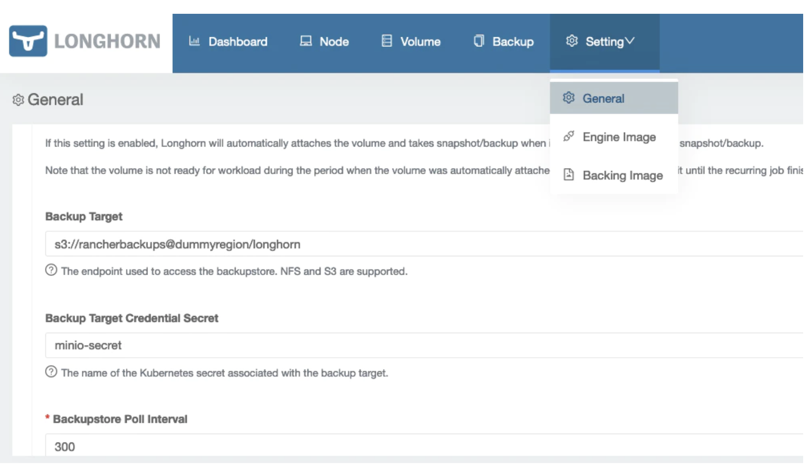
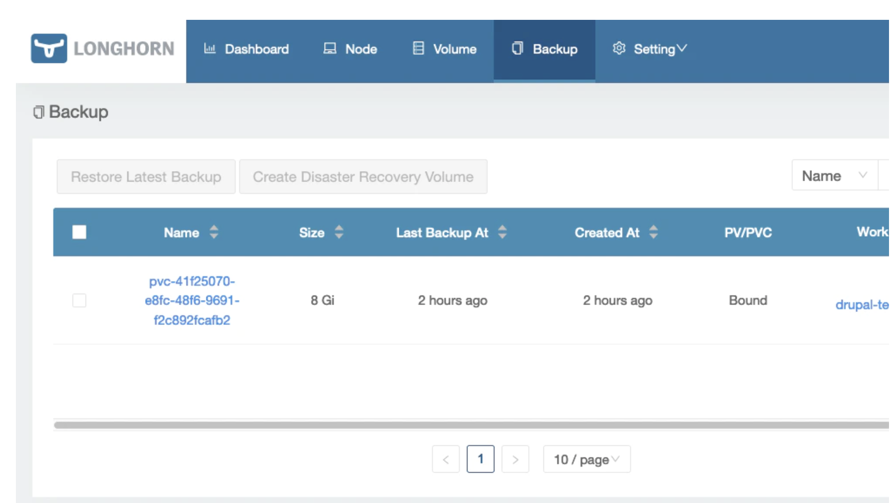
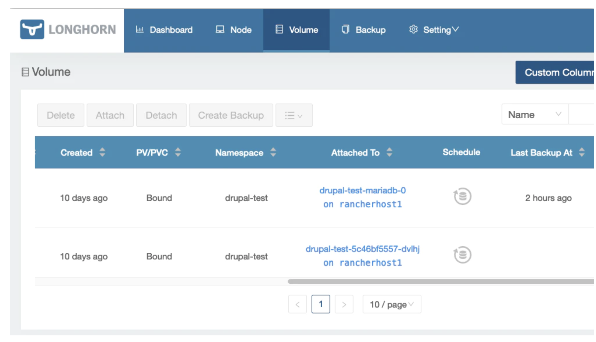

# **4 如何使用MinIO作为Longhorn的备份目标**

Longhorn是一款开源的云原生存储项目。2019年10月，Longhorn成为了云原生计算基金会（CNCF）的沙箱（Sandbox）项目。2020年6月，正式GA。其主要特点之一是完全支持volume备份，因为它实现了CSI volume快照API。Longhorn包括本地支持使用S3或NFS外部存储系统作为备份目标。

备份功能也并不局限于S3/NFS。可以访问Kubernetes API和管理卷快照的第三方备份工具也可以很容易地与Longhorn集成，以实现故障预防的存储架构，但在本文中我们只关注Longhorn中绑定的功能。

在本文中，我们将不介绍MinIO和Longhorn的安装步骤，而是集中介绍如何正确配置MinIO，使其使用S3协议作为备份目标。

部署所使用的环境：


* MinIO 版本 RELEASE.2021-08-17T20-53-08Z 部署为容器，在专门的SUSE SLES 15 SP2 虚拟机上使用 Podman 启动
* 在Kubernetes版本1.20.9-rancher1-1的RKE集群上使用Rancher的应用目录部署Longhorn 1.1.1

我们将使用MinIO的命令行工具“mc”（github.com/minio/mc）为这些备份创建一个专用用户和bucket。

首先开始配置mc别名，以访问位于 [https://miniolab.rancher.one](https://miniolab.rancher.one) 上的 Minio 安装程序，然后，我们将创建所有必需的对象：bucket、文件夹、用户和访问策略。

```
#mc alias for Minio Root user
mc alias set myminio https://miniolab.rancher.one miniorootuser miniorootuserpassword

#Bucket and folder
mc mb myminio/rancherbackups
mc mb myminio/rancherbackups/longhorn
```

MinIO中最后一步是创建我们要访问该bucket的用户，并定义适当的权限，这样访问就只限于该bucket中的对象容器。

```

mc admin user add myminio rancherbackupsuser mypassword

cat > /tmp/rancher-backups-policy.json <<EOF
{
  "Version": "2012-10-17",
      "Statement": [
    {
      "Action": [
        "s3:PutBucketPolicy",
        "s3:GetBucketPolicy",
        "s3:DeleteBucketPolicy",
        "s3:ListAllMyBuckets",
        "s3:ListBucket"
      ],
      "Effect": "Allow",
      "Resource": [
        "arn:aws:s3:::rancherbackups"
      ],
      "Sid": ""
    },
    {
      "Action": [
        "s3:AbortMultipartUpload",
        "s3:DeleteObject",
        "s3:GetObject",
        "s3:ListMultipartUploadParts",
        "s3:PutObject"
      ],
      "Effect": "Allow",
      "Resource": [
        "arn:aws:s3:::rancherbackups/*"
      ],
      "Sid": ""
    }
  ]
}
EOF

mc admin policy add myminio rancher-backups-policy /tmp/rancher-backups-policy.json

mc admin policy set myminio rancher-backups-policy user=rancherbackupsuser
```

现在我们已经准备好配置Longhorn的备份目标了。


首先，我们需要创建密钥来保存访问 MinIO 环境的凭据和端点。密钥将在 longhorn-system 命名空间中创建。


**我们将使用一个Opaque secret，所以我们需要首先将所有值转换为 base64**

```

echo -n https://miniolab.rancher.one:443 | base64
# aHR0cHM6Ly9taW5pb2xhYi5yYW5jaGVyLm9uZTo0NDM=
echo -n rancherbackupsuser | base64
# cmFuY2hlcmJhY2t1cHN1c2Vy
echo -n mypassword | base64
# bXlwYXNzd29yZA==
```


在本例中，MinIO 端点使用了由 Let's Encrypt 创建的 SSL 证书。如果您使用带有自定义 CA 的证书，您还应该对自定义 CA 证书进行编码并将其添加到 `AWS_CERT` 变量中。

```
apiVersion: v1
kind: Secret
metadata:
  name: minio-secret
  namespace: longhorn-system
type: Opaque
data:
  AWS_ACCESS_KEY_ID: cmFuY2hlcmJhY2t1cHN1c2Vy
  AWS_SECRET_ACCESS_KEY: bXlwYXNzd29yZA==
  AWS_ENDPOINTS: aHR0cHM6Ly9taW5pb2xhYi5yYW5jaGVyLm9uZTo0NDM=
  #AWS_CERT: your base64 encoded custom CA certificate goes here
```

现在我们需要构建遵循以下格式的备份目标端点 URL：“s3://bucket_name@region/folder”。在我们的 MinIO 测试环境中，我们不使用区域，但我们必须包含一些内容，否则 URL 解析器将失败，输入一个虚拟文本作为区域应该就足够了。根据该格式，备份目标 URL 将是：

> s3://rancherbackups@dummyregion/longhorn

一旦我们有了备份目标 URL 和备份目标secret，我们就可以进入 Longhorn 的 Web 界面并配置备份选项：



现在将为我们的卷启用备份选项。

我们将能够使用 UI 管理备份：



我们可以检查备份状态，并在卷菜单中为我们所有的卷定义调度。



如果配置中有任何错误，它将显示在 UI 中。我们最可能发生的常见错误如下：

* secret中的 base64 编码值不正确（请记住始终使用 echo -n 以避免向编码值添加回车符）
* 未正确构建Target URL
* mino MinIO 服务器的问题：不正确的bucket、策略中缺少权限等

可以尝试使用 MinIO 的 Web 控制台或 s3 兼容的命令行工具（如 mc）将文件上传到bucket/文件夹进行调试。在我的环境中，我使用 Nginx 作为 MinIO 前面的反向代理来处理 SSL 终止。这意味着您应该正确配置 `client_max_body_size directive` 指令，否则，您可能会在上传大文件时遇到问题，因为默认值非常小 (1 MiB)。