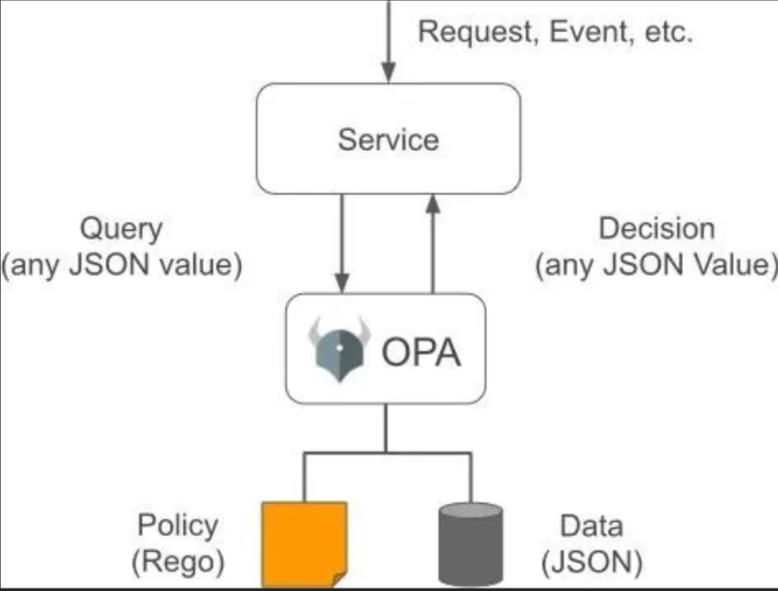
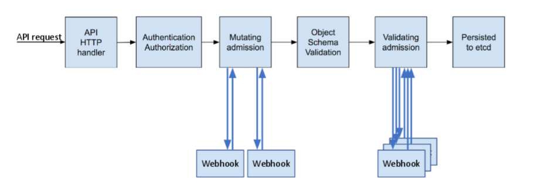
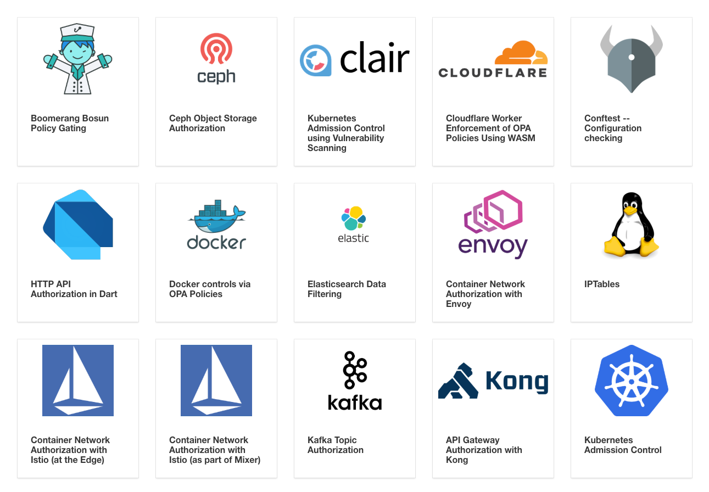

# `Open Policy Agent`（Gatekeeper） 在`Kubernetes`中的应用

`Open Policy Agent（OPA`）是`CNCF`（云原生计算基金会）下开源的通用策略引擎。

**`OPA`提供了一种高级声明式的语言（`Reg`o），简化了策略规则的定义，以此来减轻软件中决策的负担**。

`OPA`可以很方便的集成到微服务应用，`Kubernetes，CI / CD Pipelines`，`API`网关中进行策略校验。下面我将介绍`OPA`在`Kubernetes`中的一些应用场景。


## OPA概览

### OPA是什么

`OPA`是一个轻量的、功能齐全的策略引擎，将策略的定义、决策抽象为通用的模型, 把决策这一步骤从复杂的业务逻辑中解耦出来。


**`OPA`的理念是软件服务应该允许声明性地指定策略，无需重新编译或重新部署就可以随时对其进行更新，并自动执行**。

旨在帮助开发者大规模构建软件服务，使其适应不断变化的业务需求，提高策略合规的一致性，降低人为错误的风险。


`OPA`可以通过`sidecar`、外部服务或是依赖库的方式与已有的软件系统进行集成。开发者可以通过`OPA`提供的高级声明性语言（`Rego`）来编写策略，通过`API`或本地文件系统将策略加载到`OPA`中，再通过`OPA`提供的`API`进行决策。


OPA 可以接受任何类型的结构化数据，决策流程如下图所示：



* 一个策略是一组规则，规定一个软件服务的行为。
* 该策略可以描述速率限制，可信服务器的名称，应将应用程序部署到的群集，允许的网络路由或用户可以从中提取资金的帐户。
* 授权是一种特殊的策略，通常指示哪些人或机器可以对哪些资源执行哪些操作。

### OPA可以用来做什么

OPA通过数据输入和策略来进行决策，决策过程和数据无关。通过`Rego`可以描述出绝大多数的策略规则，例如：

1. 哪些用户可以访问哪些资源
2. 允许使用哪些仓库中的镜像
3. 允许在哪个时间段访问系统
4. 允许将`workload`部署到哪些集群中
5. 创建的资源对象必须包含哪些`label`

决策结果也不局限于简单的是或否，允许或拒绝。和查询数据一样，OPA在决策过程中可以生成任意结构化数据作为决策结果进行输出。

### OPA 不是什么

* OPA 不提供用户认证相关功能
* OPA 不直接提供权限管理功能


## Rego

**OPA的核心思想就是策略即代码。**

### 什么是Rego

`Rego`是一种高级声明式的语言，用于定义`OPA`中的策略，受到`Datalog`的启发，`Rego`扩展了`Datalog`以支持诸如`JSON`之类的结构化文档模型。

`Rego`查询是对存储在`OPA`中的数据的断言。

这些查询可用于定义策略，该策略枚举违反系统预期状态的数据实例。


### Rego的优点


1. 易于阅读和编写。
2. 支持嵌套的数据结构。
3. Rego是声明性的，因此策略的编写可以专注于应返回的查询，而不是应如何执行查询。这些查询比命令式语言中的查询更为简单和简洁。
4. 像其他支持声明性查询语言的应用程序一样，OPA能够优化查询以提高性能。


### 语法示例


下面我们通过一个简单的示例，简单了解一下Rego的语法

可以通过[https://play.openpolicyagent.org](https://play.openpolicyagent.org)快速预览。


在`Rego`中，策略定义在`module`中，`module`通常包括：

* 一个`package`声明
* 零或多个`import`语句
* 零或多个策略定义


定义如下规则`example.rego`：

```
# 注释以#字符开头，直到尾行
package authz #包含是唯一的，类似于命名空间， 通过packagae对module进行分组，可以通过名相互倒入

default allow = false

# 放行所有GET请求
allow {
	input.method = "GET"
}

# 允许admin用户做任何操作
allow {
	input.user = "admin"
}


# 允许admin用户组下做的任何操作
allow {
	input.group[_] = "admin"
}
```

输入数据进行决策`input.json`：

```
{
	"user": "user1",
    "group": ["dev", "admin"]
}
```

决策结果：

```
$ curl -L -o opa https://www.openpolicyagent.org/downloads/latest/opa_linux_amd64
$ chmod 755 ./opa

$  ./opa
An open source project to policy-enable your service.

Usage:
  opa [command]

Available Commands:
  build       Compile Rego policy queries
  check       Check Rego source files
  deps        Analyze Rego query dependencies
  eval        Evaluate a Rego query
  fmt         Format Rego source files
  help        Help about any command
  parse       Parse Rego source file
  run         Start OPA in interactive or server mode
  test        Execute Rego test cases
  version     Print the version of OPA

Flags:
  -h, --help   help for opa

Use "opa [command] --help" for more information about a command.
```


```
$ ./opa eval -i input.json -d example.rego -f pretty 'data.authz'
{
  "allow": true
}
```

上述例子充分的体现了rego语法简洁易读的特点。

在了解OPA是什么之后，我们再来看看OPA在Kubernetes中的应用场景。

## Admission controller

在`Kubernetes`中, 当资源创建、更新、删除的时候会通过准入控制器（`Admission Controllers`）进行决策，是Kubernetes中非常重要的一个环节。

**准入控制器是一段代码，用于在对象持久之前但在请求得到验证和授权之后，截取对`kube-apiserver`的请求进行验证或是修改**。

在一些列准入控制器中，有两个比较特殊，也是我们今天关注的重点。

* `MutatingAdmissionWebhook`：**主要用于修改请求对象**。
* `ValidatingAdmissionWebhook`：**主要用于数据格式校验**。



`OPA ` 和 `MutatingAdmissionWebhook` 、`ValidatingAdmissionWebhook` 可以很好的进行结合，完成数据的校验亦或是数据的加工处理。

可以通过`OPA`来做复杂的决策，以此来提高集群的安全性和易用性，有以下的使用场景。

### 安全策略

1. 它可用于禁止容器以`root`身份运行或确保容器的根文件系统始终以只读方式安装。
2. 仅允许从给定的仓库拉取镜像。
3. 拒绝不符合安全标准的部署。例如，使用`privileged`标志的容器可以避开很多安全检查。可以通过`OPA`策略来进行验证。

### 资源控制策略

1. 可以通过`OPA`定义策略，让集群使用者强制遵守某些惯例，例如拥有良好的标签，注释，资源限制或其他设置。
2. 要求所有`Pod`加上资源限制。
3. 防止创建冲突的`Ingress`对象。

### 访问控制策略

* 允许用户`A`访问`namespace1` 和 `namespace2` 下的所有资源

## `OPA`在`Kubernetes`中的应用

`OPA Gatekeeper`[https://github.com/open-policy-agent/gatekeepe](https://github.com/open-policy-agent/gatekeeper)非常好的将`OPA`和`Kubernetes`进行了集成。

`Gatekeeper`提供了:

1. 可扩展、参数化的策略定义方式.
2. 通过`CRD`定义了`constraints`(约束), 可以很方便的创建通用的策略。
3. 通过`CRD`定义了`constraints template`(约束模版), 增加了一些灵活性。
4. 提供了审计功能。


### Gatekeeper v3.0的特性

现在，让我们进一步了解Gatekeeper的当前状态，以及如何利用所有最新功能。考虑这样一个组织，它希望确保集群中的所有对象都具有作为对象标签的一部分提供的部门信息。你使用Gatekeeper可以怎样做？

### 验证准入控制

当集群中安装了所有`Gatekeeper`组件，无论何时创建、更新或删除集群中的资源，API服务器都会触发`Gatekeeper`准入`webhook`来处理准入请求。

在验证过程中，`Gatekeeper`充当`API`服务器和`OPA`的桥梁。`API`服务器将强制执行`OPA`执行的所有政策。


通过`Gatekeeper`将`OPA`应用于`Kubernetes`的`Admission Controller`。

`kube-apiserver`将`webhook`请求中的整个`Kubernetes`对象发送给`OPA`。`OPA`使用关联的策略进行决策后返回数据。


`Gatekeeper`的安装和部署：

```
$ kubectl apply -f https://raw.githubusercontent.com/open-policy-agent/gatekeeper/master/deploy/gatekeeper.yaml
namespace/gatekeeper-system created
customresourcedefinition.apiextensions.k8s.io/configs.config.gatekeeper.sh created
clusterrole.rbac.authorization.k8s.io/gatekeeper-manager-role created
clusterrolebinding.rbac.authorization.k8s.io/gatekeeper-manager-rolebinding created
secret/gatekeeper-webhook-server-cert created
service/gatekeeper-webhook-service created
deployment.apps/gatekeeper-controller-manager created
validatingwebhookconfiguration.admissionregistration.k8s.io/gatekeeper-validating-webhook-configuration created
customresourcedefinition.apiextensions.k8s.io/constrainttemplates.templates.gatekeeper.sh created
```


```
$ kubectl get all -n gatekeeper-system
NAME                                                 READY   STATUS    RESTARTS   AGE
pod/gatekeeper-controller-manager-5d75d65f4b-sbmb7   1/1     Running   1          3m36s


NAME                                 TYPE        CLUSTER-IP      EXTERNAL-IP   PORT(S)   AGE
service/gatekeeper-webhook-service   ClusterIP   10.96.217.101   <none>        443/TCP   3m37s


NAME                                            READY   UP-TO-DATE   AVAILABLE   AGE
deployment.apps/gatekeeper-controller-manager   1/1     1            1           3m37s

NAME                                                       DESIRED   CURRENT   READY   AGE
replicaset.apps/gatekeeper-controller-manager-5d75d65f4b   1         1         1       3m37s
```


### 政策和约束

通过集成`OPA`约束框架，一个约束（`Constraint`）是作者希望系统满足给定需求集的声明。每个约束都是用`Rego`编写的，`Rego`是`OPA`用来枚举违反系统预期状态的数据实例的声明式查询语言。

**所有约束都被评估为一个逻辑和（`logical AND`）。如果一个约束不满足，那么整个请求将被拒绝**。

在定义约束之前，你需要创建一个约束模板（`Constraint Template`），允许人们声明新的约束。每个模板都描述了强制约束的`Rego`逻辑和约束的模式，其中包括`CRD`的模式和可以传递到约束中的参数，就像函数的参数一样。


定义一个`ConstraintTemplate` （约束模板），该模板描述强制实施约束的`Rego`和约束的模式。

**约束的模式允许管理员微调约束的行为，就像函数的参数一样**。


### Constraint Templates

**`ConstraintTemplate.yaml`**

```
apiVersion: templates.gatekeeper.sh/v1beta1
kind: ConstraintTemplate
metadata:
  name: k8srequiredlabels
spec:
  crd:
    spec:
      names:
        kind: K8sRequiredLabels
        listKind: K8sRequiredLabelsList
        plural: k8srequiredlabels
        singular: k8srequiredlabels
      validation:
        # Schema for the `parameters` field
        openAPIV3Schema:
          properties:
            labels:
              type: array
              items: string
  targets:
    - target: admission.k8s.gatekeeper.sh
      rego: |
        package k8srequiredlabels

        violation[{"msg": msg, "details": {"missing_labels": missing}}] {
          provided := {label | input.review.object.metadata.labels[label]}
          required := {label | label := input.parameters.labels[_]}
          missing := required - provided
          count(missing) > 0
          msg := sprintf("you must provide labels: %v", [missing])
        }
```
 
```
 $ kubectl apply -f ConstraintTemplate.yaml 
constrainttemplate.templates.gatekeeper.sh/k8srequiredlabels created
```


创建 `ConstraintTemplate`（约束模版） 后，下一步是定义`Constraint`（约束）。

**`ns_constraint.yaml`**

```
apiVersion: constraints.gatekeeper.sh/v1beta1
kind: K8sRequiredLabels
metadata:
  name: ns-must-have-gk
spec:
  match:
    kinds:
      - apiGroups: [""]
        kinds: ["Namespace"]
  parameters:
    labels: ["gatekeeper"]
```


```
$ kubectl apply -f ns_constraint.yaml 
k8srequiredlabels.constraints.gatekeeper.sh/ns-must-have-gk created
```

**上述约束定义了创建 `namespace `的时候`label`中必须包含`gatekeeper`**

```
$ kubectl get K8sRequiredLabels
NAME              AGE
ns-must-have-gk   7m25s
```

```
$ kubectl create ns test
Error from server ([denied by ns-must-have-gk] you must provide labels: {"gatekeeper"}): admission webhook "validation.gatekeeper.sh" denied
 the request: [denied by ns-must-have-gk] you must provide labels: {"gatekeeper"}
```

```
$ kubectl delete K8sRequiredLabels ns-must-have-gk
k8srequiredlabels.constraints.gatekeeper.sh "ns-must-have-gk" deleted
```

类似地，可以从相同的约束模板轻松创建另一个约束`CRD`，它要求在所有名称空间上都提供标签`finance`。

```
apiVersion: constraints.gatekeeper.sh/v1beta1
kind: K8sRequiredLabels
metadata:
  name: ns-must-have-finance
spec:
  match:
    kinds:
      - apiGroups: [""]
        kinds: ["Namespace"]
  parameters:
    labels: ["finance"]
```

```
$ kubectl apply -f ns-must-have-finance.yaml 
k8srequiredlabels.constraints.gatekeeper.sh/ns-must-have-finance created
```

```
$ kubectl get K8sRequiredLabels
NAME                   AGE
ns-must-have-finance   2m15s
```

```
$ kubectl create ns test
Error from server ([denied by ns-must-have-finance] you must provide labels: {"finance"}): admission webhook "validation.gatekeeper.sh" denied the request: [denied by ns-must-have-finance] you must provide labels: {"finance"}
```

如你所见，使用约束框架，我们可以通过约束模板可靠地共享`Rego`，使用`match`字段定义实施范围，并为约束提供用户定义的参数，以便为每个约束创建定制的行为。


### 审计

审计功能支持根据集群中强制的约束对复制资源进行定期评估，以检测预先存在的错误配置。`Gatekeeper`将审计结果存储为相关约束的status字段中列出的违规行为（`violations`）。

```
apiVersion: constraints.gatekeeper.sh/v1beta1
kind: K8sRequiredLabels
metadata:
  name: ns-must-have-hr
spec:
  match:
    kinds:
      - apiGroups: [""]
        kinds: ["Namespace"]
  parameters:
    labels: ["hr"]
status:
  auditTimestamp: "2019-08-06T01:46:13Z"
  byPod:
  - enforced: true
    id: gatekeeper-controller-manager-0
  violations:
  - enforcementAction: deny
    kind: Namespace
    message: 'you must provide labels: {"hr"}'
    name: default
  - enforcementAction: deny
    kind: Namespace
    message: 'you must provide labels: {"hr"}'
    name: gatekeeper-system
  - enforcementAction: deny
    kind: Namespace
    message: 'you must provide labels: {"hr"}'
    name: kube-public
  - enforcementAction: deny
    kind: Namespace
    message: 'you must provide labels: {"hr"}'
    name: kube-system
```

### 数据复制

**审计需要将`Kubernetes`资源复制到`OPA`中，然后才能根据被执行的约束对其进行评估**。

需要访问集群中对象而不是评估对象的约束也需要数据复制。

例如，强制`ingress`主机名唯一性的约束必须能够访问集群中的所有其他`ingress`。

配置要复制的`Kubernetes`数据，请创建一个同步配置资源，其中包含要复制到`OPA`中的资源。例如，下面的配置将所有名称空间和`pod`资源复制到`OPA`。

```
apiVersion: config.gatekeeper.sh/v1alpha1
kind: Config
metadata:
  name: config
  namespace: "gatekeeper-system"
spec:
  sync:
    syncOnly:
      - group: ""
        version: "v1"
        kind: "Namespace"
      - group: ""
        version: "v1"
        kind: "Pod"
```


## OPA更多的使用场景




除了上述生态，在软件系统中，很多地方都可以用到OPA 提供的能力。

## 总结

通过OPA可以做到真正的策略即代码，灵活的配置策略，解决了系统中复杂决策的耦合问题，OPA对于开发者来说无疑是个很好的轮子！

## Q&A

* Q：规则是否会对性能有影响，是否有压测的数据？
	* A：决策过程就是一次RPC调用，因为策略的定义是声明式的数据都是静态存储，决策耗时可以忽略不计（在整个请求阶段中），即使是内部代理也会带来网络上的损耗。

* Q：规则是否可以动态修改，即使生效，不需要重启服务？
	* **A：不需要重启服务，实时生效，这也是OPA的目的，不会因为策略的变动而改动代码或是重启服务**。


* Q：是否可以与Istio结合，实现微服务权限管理下沉到网格？
	* A：当然可以，社区有相关的实现，这个得去关注具体的项目，我还没有深入了解。

* Q：是否可以与Spring Cloud结合使用，或是与Docker配合使用，因为没有用到Kubernetes。
	*  A：当然可以，OPA可以用做第三方库集成到你的代码中，通过API进行调用，一次决策就是一次RPC调用，OPA的核心理念在于把决策这个步骤给解耦出来，而不是和上下文逻辑混在一起。

* Q：OPA可以调用数据库吗？它能实现鉴权吗？
	* A：可以，可以自己实现外部调用的模块，但通用的做法是事先把需要决策的数据查询组装好发送给OPA进行决策。鉴权就是一种特殊的策略，策略需要关联到用户、用户组。可以把OPA和网关进行整合，每次用户请求都进行鉴权（通过OPA进行决策，该次请求是否放行）。

* Q：微服务和OPA是不是结合的更紧密？可以把决策提出来？
	* A：和微服务概念本身关系不大，即使是单体应用，只要你可以把决策过程剥离出来就可以用到OPA，这个很符合微服务的理念，OPA就是一个集中的决策服务。
 


