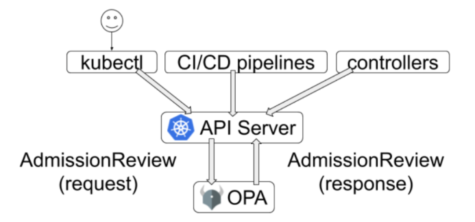
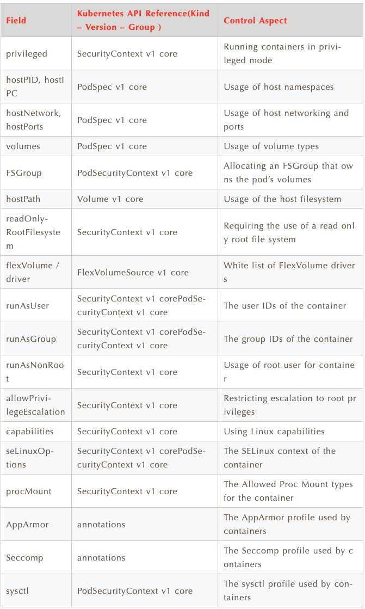

# **2、使用 OPA 实现 Kubernetes Pod 安全策略**

在此博客文章中，首先我将讨论Pod安全策略准入控制器。然后，我们将看到Open Policy Agent如何实现Pod安全策略。

**实际上，Open Policy Agent被视为Pod安全策略的潜在替代方案（后续版本会替换掉）。**

首先，简要介绍一下容器，安全性和准入控制器。

## **容器和安全简介**

容器轻巧，轻便且易于管理。在同一主机上运行的容器没有单独的物理/虚拟机。换句话说，容器共享运行它们的主机的资源，硬件和OS内核。因此，具有适当的安全性变得非常重要，这些安全性涉及容器中可以运行哪些进程，这些进程具有哪些特权，容器是否将允许特权升级，使用了什么镜像等等。

Pod是Kubernetes应用程序的基本执行单元，是您创建或部署的Kubernetes对象模型中最小和最简单的单元。它是一个或多个具有共享存储/网络的容器的组，以及有关如何运行容器的规范。因此，在容器上实施安全策略时，我们将检查安全策略并将其应用于Pod规范。那么，这些策略如何执行？使用准入控制器。


## **什么是Admission Controllers?**

准入控制器是kube-apiserver的一部分。在配置存储在集群设置（etcd）中之前，它们拦截对Kubernetes API服务器的请求。


准入控制器可以是正在验证（用于验证传入请求的一个）或正在变异（用于修改传入请求的一个）或两者都在进行。请参阅Kubernetes文档以快速浏览各种准入控制器。

## **Open Policy Agent 作为 admission controller**

Open Policy Agent（OPA）是一种开放源代码的通用策略引擎，可以将策略编写为代码。OPA提供了一种高级声明性语言-Rego-以策略作为代码。使用OPA，我们可以跨微服务，CI / CD管道，API网关等执行策略。OPA最重要的用例之一是Kubernetes作为准入控制者的策略实施。

**OPA作为准入控制器，您可以强制执行非root用户之类的策略，要求使用特定的资源标签，确保所有pod都指定了资源请求和限制等。基**本上，OPA允许您使用Rego语言将任何自定义策略编写为代码。

这些策略以Rego编写并加载到OPA中，作为Kubernetes集群上的准入控制器运行。

**OPA将根据Rego策略评估**对Kubernetes API服务器的任何资源创建/更新/删除请求。如果请求满足所有策略，则允许该请求。但是，即使单个策略失败，请求也会被拒绝。



> Adminssion Control Flow

在此处阅读有关OPA，Rego的更多信息，并用作OPA文档中的准入控制器。


## Pod Security Policy

Pod安全策略（PSP）是实现为准入控制器的集群级别资源。

PSP允许用户将安全要求转换为管理Pod规范的特定策略。

**首先，创建PodSecurityPolicy资源时，它什么也不做。为了使用它，必须通过允许“使用”动词来授权请求用户或目标pod的服务帐户使用该策略。您可以参考Kubernetes文档上的启用Pod安全策略**。

注意，PSP准入控制器既充当验证角色，又充当变异准入控制器。对于某些参数，PSP准入控制器使用默认值来更改传入的请求。此外，顺序始终是先突变然后验证。

**使用PSP我们可以控制哪些所有参数？**

下表简要概述了PSP中使用的各种参数和字段。在此处的Kubernetes文档中提供了详细说明。



## 那么，我们可以在OPA中实现PSP吗？

前面提到，Rego语言允许我们将任何自定义策略编写为代码。这意味着，我们可以使用Rego编写上述的Pod安全策略，并以OPA作为准入控制器来执行。

让我们快速了解一下实施“特权”Pod安全策略的Rego策略。可以在Rego playground试用此策略。


`privileged.rego`

```
package kubernetes.admission

deny[message] {
    #applies for Pod resources
    input.request.kind.kind == "Pod" 
    #loops through all containers in the request
    container := input.request.object.spec.containers[_]
    #for each container, check privileged field
    container.securityContext.privileged
    #if all above statements are true, return message
    message := sprintf("Container %v runs in privileged mode.", [container.name])
}
```

那么，该策略有何作用？如果输入请求中的任何容器正在作为特权容器运行，它将返回一条消息。

### PSP 实战

让我们通过基于minikube的教程来了解这项策略的实际效果。首先，按照此处OPA文档中的教程，将OPA设置为准入控制器。本教程将加载入口验证策略。取而代之的是，我们将加载上面显示的特权策略。

将OPA设置为minikube上的准入控制器后，请使用上述策略创建文件`privileged.rego`。然后，在`“ opa”`名称空间中将策略创建为`configmap`。


https://www.openpolicyagent.org/docs/v0.12.2/kubernetes-admission-control/

```
kubectl create configmap privileged-policy --from-file=privileged.rego -n opa
```

等待策略加载到OPA。当`configmap`的注释增加了`openpolicyagent.org/policy-status:'{"status":"ok"}'`项时表明已经加载了该策略。

现在，让我们使用以下清单创建具有特权容器的部署：

```
apiVersion: v1
kind: Pod
metadata:
  name: nginx
  namespace: default
  labels:
    app: nginx
spec:
  containers:
  - name: nginx
    image: nginx:latest
    securityContext:
      privileged: true
```

当您尝试创建此Pod时，您会注意到Open Policy Agent拒绝了Pod。

```
Error from server (Container nginx runs in privileged mode.): error when creating "privileged-deploy.yaml": admission webhook "validating-webhook.openpolicyagent.org" denied the request: Container nginx runs in privileged mode.
```

同样，我们可以为其他Pod安全策略参数编写策略，并使用OPA实施。

在本教程中，为简单起见，我们使用configmap加载了策略，但这并不是生产部署的最佳策略。对于生产部署，可以将OPA配置为定期从外部捆绑服务器中下载策略捆绑。您的所有策略都可以在此捆绑服务器中维护。OPA将通过定期下载策略来保持最新状态。

简而言之，使用OPA，我们可以实施Pod安全策略。不仅如此，我们还可以使用相同的设置来实施任何其他基于自定义。

## 将OPA用于PSP的主要好处是什么？

我们从这种方法中获得的一些主要好处是：

* 在一个准入控制器中集中管理所有策略（PSP和其他自定义策略），而不必分别进行管理
* **在CI / CD管道中也执行相同的策略，从而在整个堆栈中实施“按代码编码”。**
* 能够在源控制存储库（如Git）中维护OPA策略。OPA提供了HTTP API以动态管理加载的策略。
* 将策略决策流式传输到您选择的外部日志记录/监视工具。
* **根据您的设置/实现自定义拒绝消息**。


另外，我们可以将OPA部署为变异许可控制器。这样，您还可以实现PSP Admission Controller的变异行为。