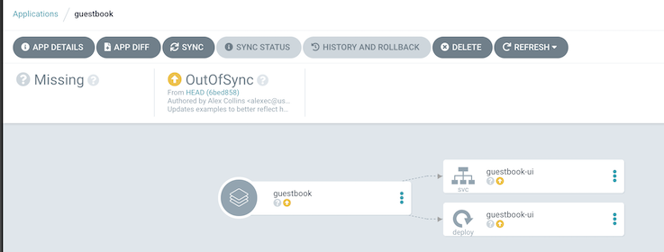
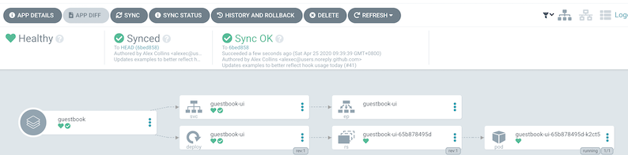

# `argo rollout` 自动化金丝雀canary部署

## Argocd 

###  Argocd-install

https://argoproj.github.io/argo-cd/getting_started/

```
$ kubectl create namespace argocd
$ kubectl apply -n argocd -f https://raw.githubusercontent.com/argoproj/argo-cd/stable/manifests/install.yam

kubectl port-forward svc/argocd-server -n argocd 8080:443

# 获取登录token
$ kubectl get pods -n argocd -l app.kubernetes.io/name=argocd-server -o name | cut -d'/' -f 2
argocd-server-764bb4b-5s4t7

# Bash one
$ kubectl port-forward svc/argocd-server -n argocd 8080:443

# Bash two
$ argocd login localhost:8080 
WARNING: server certificate had error: x509: certificate signed by unknown authority. Proceed insecurely (y/n)? y
Username: admin
Password: 
'admin' logged in successfully
Context 'localhost:8080' updated

 argocd account update-password
*** Enter current password: 
*** Enter new password: admin
*** Confirm new password: admin
Password updated
Context 'localhost:8080' updated
```

### Argocd使用

```
$ argocd cluster list
SERVER                          NAME  VERSION  STATUS      MESSAGE
https://kubernetes.default.svc                 Successful

# 增加集群
$ argocd cluster add $CONTEXTNAME

$ kubectl create ns argotest
namespace/argotest created

# 增加官方示例
$ argocd app create guestbook \
  --repo https://github.com/argoproj/argocd-example-apps.git \
  --path guestbook \
  --dest-server https://kubernetes.default.svc \
  --dest-namespace argotest

$ argocd app list
NAME       CLUSTER                         NAMESPACE  PROJECT  STATUS     HEALTH   SYNCPOLICY  CONDITIONS  REPO                              
                   PATH       TARGET
guestbook  https://kubernetes.default.svc  argotest   default  OutOfSync  Missing  <none>      <none>      https://github.com/argoproj/argocd
-example-apps.git  guestbook
```



```
$ argocd app sync guestbook
TIMESTAMP                  GROUP        KIND   NAMESPACE                  NAME    STATUS   HEALTH        HOOK  MESSAGE
2020-04-25T09:39:39+08:00            Service    argotest          guestbook-ui    Synced  Healthy              
2020-04-25T09:39:39+08:00   apps  Deployment    argotest          guestbook-ui    Synced  Healthy              

Name:               guestbook
Project:            default
Server:             https://kubernetes.default.svc
Namespace:          argotest
URL:                https://localhost:8080/applications/guestbook
Repo:               https://github.com/argoproj/argocd-example-apps.git
Target:             
Path:               guestbook
SyncWindow:         Sync Allowed
Sync Policy:        <none>
Sync Status:        Synced to  (6bed858)
Health Status:      Healthy

Operation:          Sync
Sync Revision:      6bed858de32a0e876ec49dad1a2e3c5840d3fb07
Phase:              Succeeded
Start:              2020-04-25 09:39:39 +0800 CST
Finished:           2020-04-25 09:39:39 +0800 CST
Duration:           0s
Message:            successfully synced (all tasks run)

GROUP  KIND        NAMESPACE  NAME          STATUS  HEALTH   HOOK  MESSAGE
       Service     argotest   guestbook-ui  Synced  Healthy        service/guestbook-ui unchanged
apps   Deployment  argotest   guestbook-ui  Synced  Healthy        deployment.apps/guestbook-ui unchanged


### 说明：应用在没有执行sync之前，应用显示的状态是OutOfSync，执行sync之后，状态会变更为Synced，表明应用已部署至指定的k8s集群上。

### 若git仓库里部署文件有变化，状态会自动变回OutOfSync，就需要重新执行Synced，才会自动部署。（注：Synced可以设置成自动）
```


## Argorollouts 

官网地址:  https://argoproj.github.io/argo-rollouts/getting-started/

```
$ kubectl create namespace argo-rollouts
namespace/argo-rollouts created

$ kubectl apply -n argo-rollouts -f https://raw.githubusercontent.com/argoproj/argo-rollouts/stable/manifests/install.yaml
customresourcedefinition.apiextensions.k8s.io/analysisruns.argoproj.io created
customresourcedefinition.apiextensions.k8s.io/analysistemplates.argoproj.io created
customresourcedefinition.apiextensions.k8s.io/experiments.argoproj.io created
customresourcedefinition.apiextensions.k8s.io/rollouts.argoproj.io created
serviceaccount/argo-rollouts created
role.rbac.authorization.k8s.io/argo-rollouts-role created
clusterrole.rbac.authorization.k8s.io/argo-rollouts-aggregate-to-admin created
clusterrole.rbac.authorization.k8s.io/argo-rollouts-aggregate-to-edit created
clusterrole.rbac.authorization.k8s.io/argo-rollouts-aggregate-to-view created
clusterrole.rbac.authorization.k8s.io/argo-rollouts-clusterrole created
rolebinding.rbac.authorization.k8s.io/argo-rollouts-role-binding created
clusterrolebinding.rbac.authorization.k8s.io/argo-rollouts-clusterrolebinding created
service/argo-rollouts-metrics created
deployment.apps/argo-rollouts created

# 安装成功
 kubectl get po  -n argo-rollouts
NAME                            READY   STATUS    RESTARTS   AGE
argo-rollouts-5b989d7f6-njf5m   1/1     Running   0          15m

# 查看相关CRD资源
$ kubectl get crd
NAME                            CREATED AT
analysisruns.argoproj.io        2020-04-22T05:34:43Z
analysistemplates.argoproj.io   2020-04-22T05:34:45Z
experiments.argoproj.io         2020-04-22T05:34:48Z
rollouts.argoproj.io            2020-04-22T05:37:22Z

# 下载命令行插件
# https://argoproj.github.io/argo-rollouts/features/kubectl-plugin/

$ curl -LO https://github.com/argoproj/argo-rollouts/releases/latest/download/kubectl-argo-rollouts-darwin-amd64
$ chmod +x ./kubectl-argo-rollouts-darwin-amd64
$ sudo mv ./kubectl-argo-rollouts-darwin-amd64 /usr/local/bin/kubectl-argo-rollouts
$ kubectl argo rollouts version
kubectl-argo-rollouts: v0.8.1+23fbc99
  BuildDate: 2020-04-20T23:58:37Z
  GitCommit: 23fbc99a91c6e3cf8aac90fdbc04ee608693ddfd
  GitTreeState: clean
  GoVersion: go1.13.1
  Compiler: gc
  Platform: darwin/amd64
```

### 使用

```
apiVersion: argoproj.io/v1alpha1 # Changed from apps/v1
kind: Rollout # Changed from Deployment
# ----- Everything below this comment is the same as a deployment -----
metadata:
  name: example-rollout
spec:
  replicas: 5
  selector:
    matchLabels:
      app: nginx
  template:
    metadata:
      labels:
        app: nginx
    spec:
      containers:
      - name: nginx
        image: nginx:1.15.4
        ports:
        - containerPort: 80
  minReadySeconds: 30
  revisionHistoryLimit: 3
  strategy:
  # ----- Everything above this comment are the same as a deployment -----
    canary: # A new field that used to provide configurable options for a Canary strategy
      steps:
      - setWeight: 20
      - pause: {}
```

```
$ kubectl apply -f rollout-demo.yaml 
rollout.argoproj.io/example-rollout created

$ kubectl get pods -l app=nginx
NAME                               READY   STATUS    RESTARTS   AGE
example-rollout-76f5bddc69-8mf2c   1/1     Running   0          42s
example-rollout-76f5bddc69-8tncf   1/1     Running   0          42s
example-rollout-76f5bddc69-ln9sl   1/1     Running   0          42s
example-rollout-76f5bddc69-v2w7k   1/1     Running   0          42s
example-rollout-76f5bddc69-zrdtw   1/1     Running   0          42s
```

```
$ kubectl patch rollout example-rollout --type merge -p '{"spec": {"template": { "spec"
: { "containers": [{"name": "nginx","image": "nginx:1.15.5"}]}}}}'
rollout.argoproj.io/example-rollout patched


# 使用插件进行canary发布
$ kubectl argo rollouts list rollouts
NAME             STRATEGY   STATUS        STEP  SET-WEIGHT  READY  DESIRED  UP-TO-DATE  AVAILABLE
example-rollout  Canary     Paused        1/2   20          5/5    5        1           5

$ kubectl get replicaset -w -o wide -l app=nginx
NAME                         DESIRED   CURRENT   READY   AGE    CONTAINERS   IMAGES         SELECTOR
example-rollout-66767759b    1         1         1       6m2s   nginx        nginx:1.15.5   app=nginx,rollouts-pod-template-hash=66767759b
example-rollout-76f5bddc69   4         4         4       10m    nginx        nginx:1.15.4   app=nginx,rollouts-pod-template-hash=76f5bddc69

# 使用插件进行canary发布
$ kubectl argo rollouts promote example-rollout
rollout 'example-rollout' promoted

$ kubectl get replicaset -w -o wide -l app=nginx
NAME                         DESIRED   CURRENT   READY   AGE     CONTAINERS   IMAGES         SELECTOR
example-rollout-66767759b    5         5         5       7m48s   nginx        nginx:1.15.5   app=nginx,rollouts-pod-template-hash=66767759b
example-rollout-76f5bddc69   2         2         2       12m     nginx        nginx:1.15.4   app=nginx,rollouts-pod-template-hash=76f5bddc69

$ kubectl get pods -l app=nginx
NAME                               READY   STATUS        RESTARTS   AGE
example-rollout-66767759b-khhn2    1/1     Running       0          8m22s
example-rollout-66767759b-psghp    1/1     Running       0          68s
example-rollout-66767759b-vnlbt    1/1     Running       0          37s
example-rollout-66767759b-wscs2    1/1     Running       0          68s
example-rollout-66767759b-zkqvs    1/1     Running       0          37s
example-rollout-76f5bddc69-8tncf   0/1     Terminating   0          12m
example-rollout-76f5bddc69-v2w7k   0/1     Terminating   0          12m
```
```
$ kubectl argo rollouts get rollout example-rollout
Name:            example-rollout
Namespace:       default
Status:          ✔ Healthy
Strategy:        Canary
  Step:          2/2
  SetWeight:     100
  ActualWeight:  100
Images:          nginx:1.15.5 (stable)
Replicas:
  Desired:       5
  Current:       5
  Updated:       5
  Ready:         5
  Available:     5

NAME                                        KIND        STATUS        AGE    INFO
⟳ example-rollout                           Rollout     ✔ Healthy     14m    
├──# revision:2                                                              
│  └──⧉ example-rollout-66767759b           ReplicaSet  ✔ Healthy     9m57s  stable
│     ├──□ example-rollout-66767759b-khhn2  Pod         ✔ Running     9m57s  ready:1/1
│     ├──□ example-rollout-66767759b-psghp  Pod         ✔ Running     2m43s  ready:1/1
│     ├──□ example-rollout-66767759b-wscs2  Pod         ✔ Running     2m43s  ready:1/1
│     ├──□ example-rollout-66767759b-vnlbt  Pod         ✔ Running     2m12s  ready:1/1
│     └──□ example-rollout-66767759b-zkqvs  Pod         ✔ Running     2m12s  ready:1/1
└──# revision:1                                                              
   └──⧉ example-rollout-76f5bddc69          ReplicaSet  • ScaledDown  14m 
```
 
### 总结

```
# 重点在于以下字段
strategy:
    canary: 
      steps:
      - setWeight: 20
      - pause: {}
```

###  各个字段详细说明：https://argoproj.github.io/argo-rollouts/features/canary/


