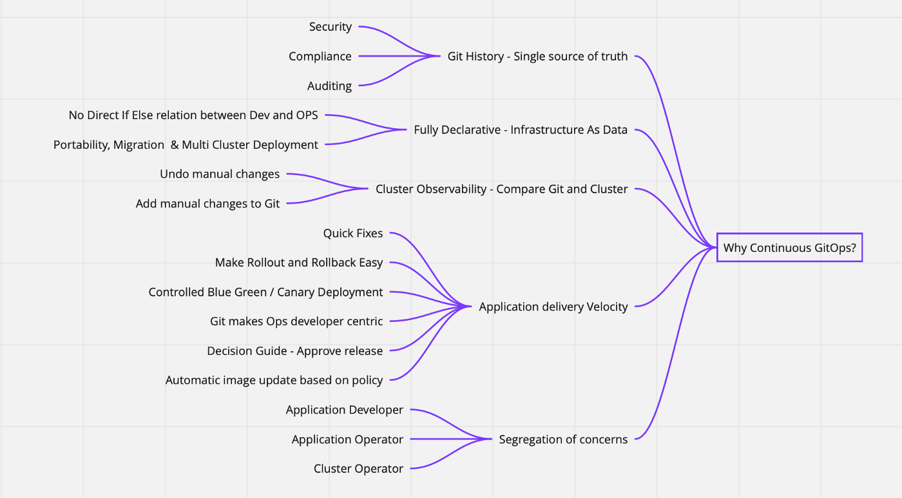
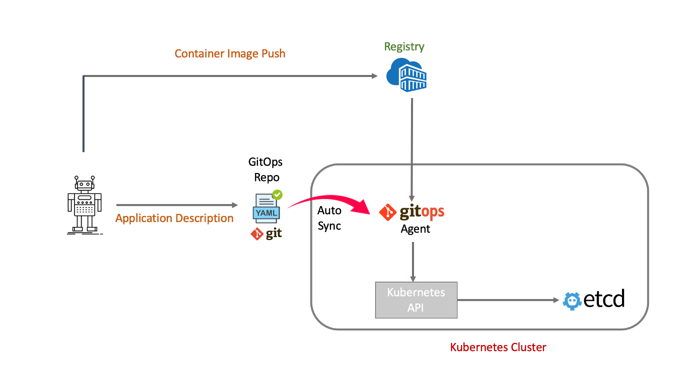
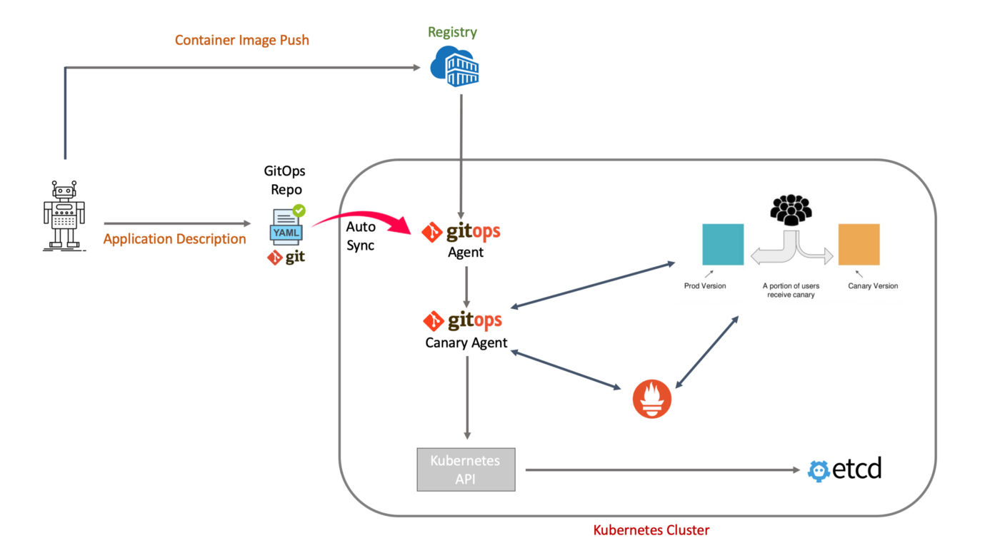
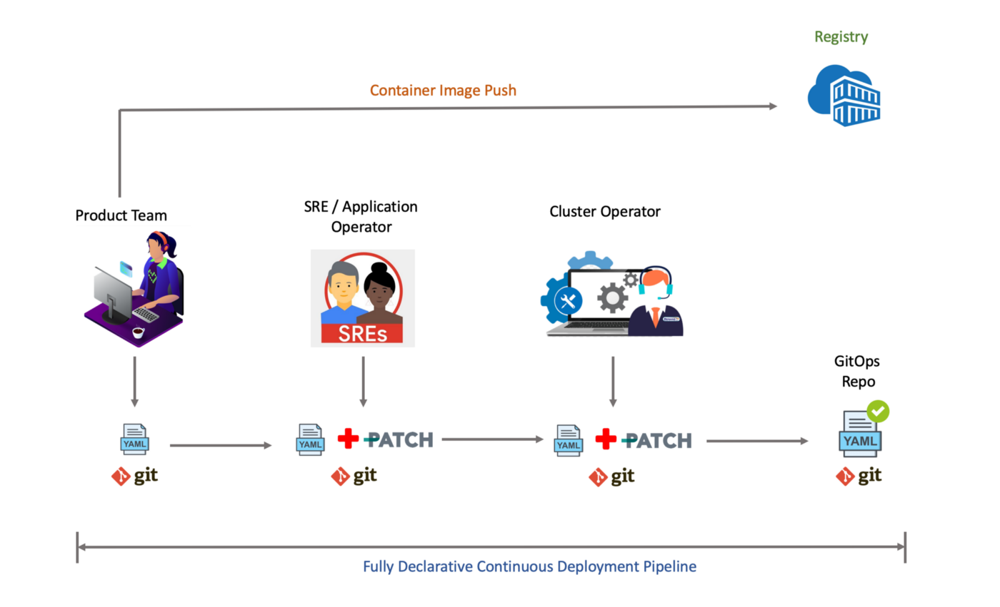
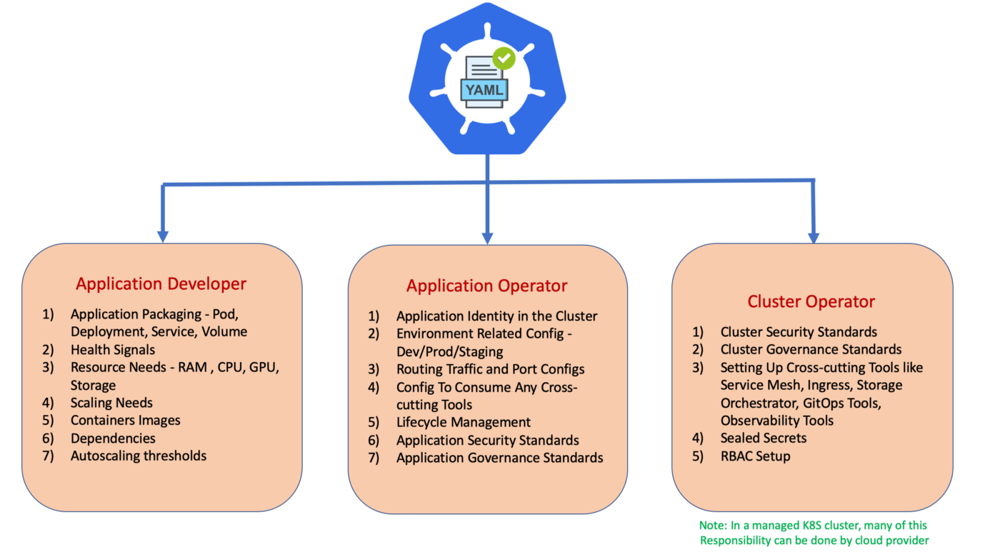
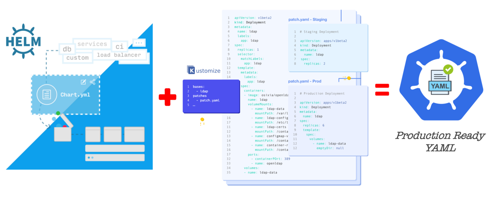
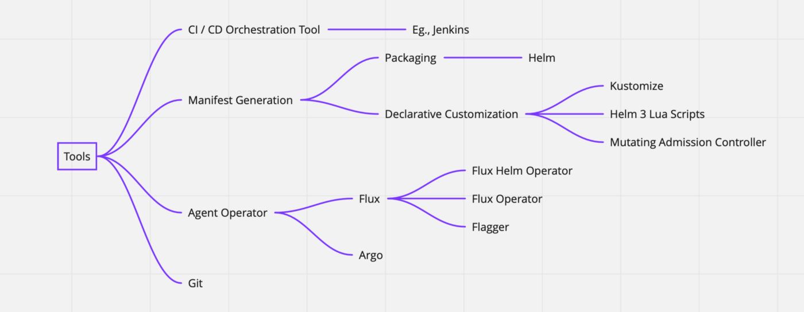

# GitOps - 在 Kubernetes 中进行 DevOps 的方式

从我们第一次听到持续交付这个词，到现在估计差不多有10年时间了吧。Humble Jez 和 Farley David 在2010年的时候，通过他们的新书《Continuous Delivery: Reliable Software Releases Through Build, Test and Deployment Automation》提出的。在过去10年中，持续交付改变了我们软件发布的方式。现在随着围绕 Kubernetes 生态系统不断演变出的一套新的工具，让我们在持续交付的旅程中实现了又一次飞跃。这些工具基本上都是围绕着 GitOps 这个概念展开的，本文将尝试来解释下 “GitOps” 的 Why? What? 以及 How?

## 什么是 GitOps？

GitOps 是一个概念，将软件的端到端描述放置到 Git 中，然后尝试着让集群状态和 Git 仓库持续同步，其中有两个概念需要说明下。

1. **软件的描述表示**：**Kubernetes、应用和底层基础架构之间的关系是一种声明式的，我们用声明式方式（`YAML`）来描述我们需要的基础架构**。这些 `YAML` 的实现细节被底层的 `Kubernetes` 集群的 `Controller`、`Schedulers`、`CoreDNS`、`Operator` 等等抽象出来，这使得我们可以从传统的基础架构即代码转向基础架构即数据，我们也可以从 `GitHub` 上了解到更多相关的信息。这里的关键是，你需要的每一个应用声明的角色（应用开发者/应用运维/集群运维）都会被用到持续交互流水线的 YAML 中，最后被推送到 GitOps 仓库中去。
2. **持续同步**：持续同步的意思是不断地检查 `Git `仓库，将任何状态变化都反映到 Kubernetes 集群中。这种思路来自于 `Flux` 工具，`Flux` 使用 `Kubernetes Operator` 将自动化部署方式从 Kubernetes 集群外转移到集群内部来。

GitOps 由以下4个主要的组件组成：

* **Git 仓库**：用来存储我们的应用程序的声明式定义的 YAML 文件的源代码仓库。
* **Kubernetes 集群**：用于部署我们应用程序的底层集群。
* **同步代理**：Kubernetes Operator 扩展，它的工作是将 Git 仓库和应用状态持续同步到集群中。
* **CD Pipeline**：持续部署流水线，用来编排整个流程的持续部署流水线。

关于这些组件如何协工作来创建 GitOps 流程的架构图如下所示。

 

在上面的架构图中，YAML 文件的创建和修改分为应用开发、应用运维和集群运维三部分。根据我们的组织团队架构、集群多租户等需求，可以选择分一到两步进行。接下来我们来看看为什么需要使用 GitOps？

## 为什么需要 GitOps？

GitOps 可以在很多方面都产生价值，下面我们来看看其中的一些关键的价值。

应用交付速度

持续的 GitOps 可以通过以下几个方面来提高产品交付速度。

* 可以比较最终的 `YAML` 和集群状态的能力，这也可以作为批准发布的决策指南。
* 借助 `Prometheus` 的应用程序指标，通过自动化的蓝绿部署，非常容易进行部署。
* 根据策略自动更新容器镜像，例如，`Istio sidecar` 次要版本的发布是向后兼容的，可以自动更新。
* `GitOps` 将以运维和开发为中心，提高效率。
* 应用团队可以接管一些运维工作，而运维团队则可以更加专注于平台建设。
* `GitOps` 仓库可以绕过完整的持续部署流程进行紧急发布。

### 端到端的自动化

在 GitOps 中，所有和应用开发、应用运维和集群运维相关的声明都通过 git 嵌入到 YAML 文件中，实现了端到端的自动化。

### 安全、审计和合规性

零手动更改到集群中应用的策略将大大增加集群的安全性，由于集群中的所有配置都在 git 中，我们将拥有一个完整的审计日志，记录集群中发生的事情。

### 集群可观测性

有了完整的审计日志，我们就可以很容易获得集群中发生的变化，来帮助调试一些问题。

### 关注点分离和迁移

GitOps 将应用开发者、应用运维和集群运维之间的关注点进行分离，这些团队中的依赖关系以声明式的方式注入到 git 中，这将大大缓解我们对底层 K8S 集群、治理策略等工具的迁移。

 

## 如何采用 GitOps？

我们将通过以下四个不同的方面进行阐述来帮助我们实现 GitOps 这一目标。

* GitOps 工作流的实现
* 管理声明式的 YAML
* 工具
* 从什么地方开始？

### GitOps 工作流的实现

以下三个工作流程是我们在开始使用 GitOps 时要采用的比较流行的工作流程。

***工作流1：标准的 GitOps 流程***

这是标准的 GitOps 工作流，我们将应用程序的 YAML 描述推送到 GitOps 仓库中，GitOps Agent 就会自动同步状态变化。

 

**工作流2：镜像自动更新**

在这个工作流中，`GitOps Agent` 会根据指定的策略从容器镜像仓库中自动更新新版本的容器镜像，例如，我们可以设置这样的策略，如果镜像有一个小版本变化，我们就可以自动更新，因为它们是向后兼容的。

 

**工作流3：自动化金丝雀部署**

该工作流非常强大，我们可以在这里实现金丝雀自动化部署。有了这个，我们在用 `Prometheus` 测量 `HTTP` 请求成功率、请求平均持续时间和 `Pods` 健康状态等关键性能指标的同时，可以逐步将流量迁移到金丝雀实例上。

 

### 管理声明式的 YAML

假设我们有一个电子商务购物车应用，完整的应用程序定义如下所示。

* 应用程序镜像。
* `Pod`、`Deployment`、`Service`、`Volume` 和 `ConfigMap` 的 `YAML` 文件。
* 连接数据的一些 `sealed secrets` 对象。
* 标记将 `Istio` 作为默认的集群服务治理策略网格。
* 环境治理策略，比如 `staging` 环境`1`个副本，生产环境`3`个副本。
* 标记添加节点亲和性和容忍用于高可用的节点调度。
* 基于 `Pod `标签的网络安全策略 `YAML` 声明。

要构建一个最终的应用 YAML 描述文件，我们需要应用开发者、应用运维和集群运维人员的一些输入。

假设我们是一个比较小的团队并且管理了很多的 Pod，下面的流程就可以来表示如何构建一个持续部署的自动化流水线。

 

这种关注点分离的方式深受 OAM（开放应用模型）的影响，该模型试图为云原生应用开发提供一个完善的框架。

OAM(https://oam.dev/) 描述了一种模式：

* 开发人员负责定义应用组件。
* 应用运维人员负责创建这些组件的实例，并为其分配应用配置。
* 基础设施运维人员负责声明、安装和维护平台上的可用的底层服务。

通过使用 OAM 框架，会将 YAML 的贡献者责任进行分离，当然这可能会根据你的团队组织结构和使用的 Kubernetes 集群类型有所变化。

 

## 工具

如果你比较赞同 GitOps 的理念，那么下面就可以来选择一些需要用到的工具了。有很多工具可以支持我们去实现 GitOps 的不同功能。接下来我们简单介绍一些工具及其使用方法。

**Git：这是我们使用 GitOps 来存储 YAML 清单的基础。**

**Helm & Kustomize：** 这是一个强大的组合，可以帮助我们生成声明式的 `YAML` 资源清单文件，我们可以使用 `Helm` 打包应用程序和它的依赖关系。然后 `Kustomize` 会帮助我们自定义和修补 `YAML` 文件，而不需要去改变原来的 `YAML` 文件。单独使用 `Helm` 是不够的，特别是用于区分不同环境的资源清单的时候，我们还需要结合 `Kustomize`。

* Argo CD：这是一个 GitOps 持续交付工具，它可以作为一个 Agent，将 GitOps 仓库中的改动同步到 Kubernetes 集群中。

* Flux：这是另外一个 GitOps 持续交付的工具，功能和 Argo CD 类似。

* Flagger：这个工具和 Flux 配合使用，可以很好地实现金丝雀部署。

