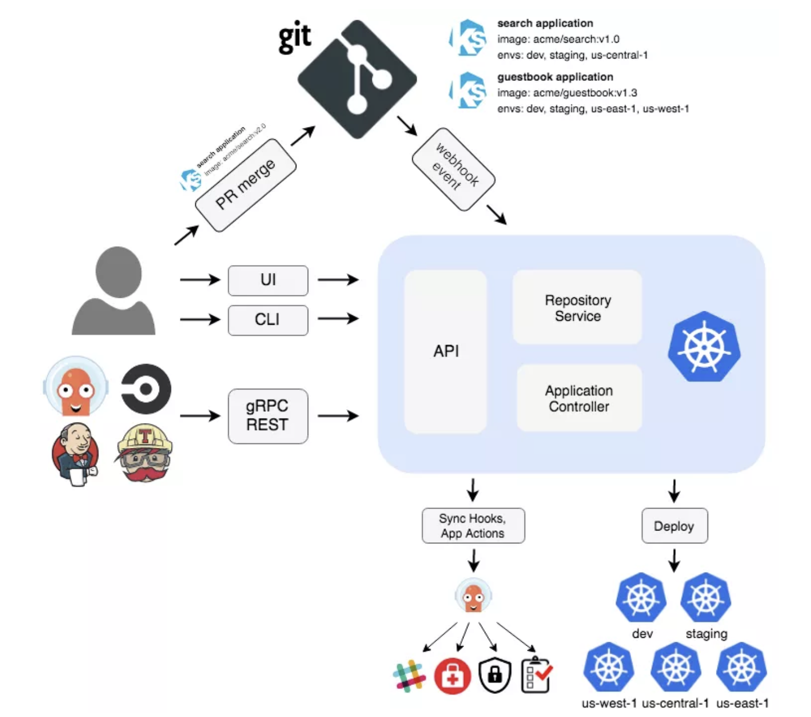
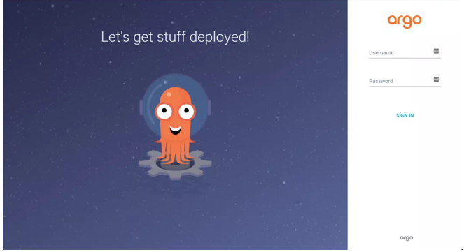
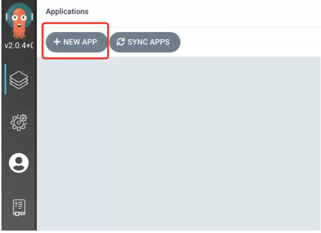
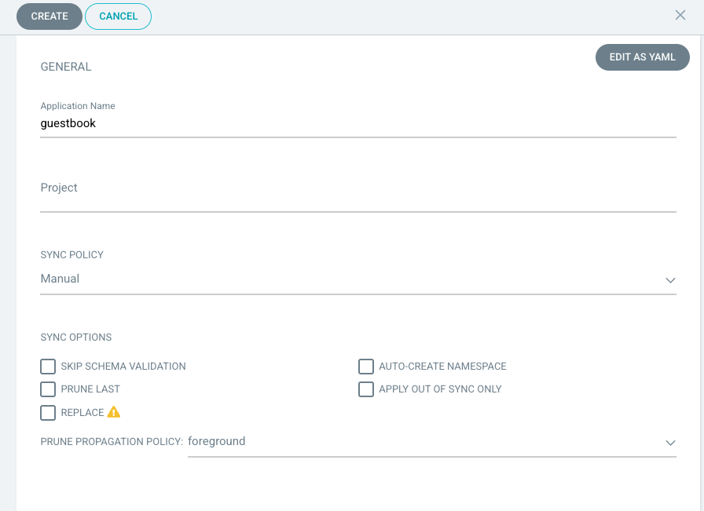
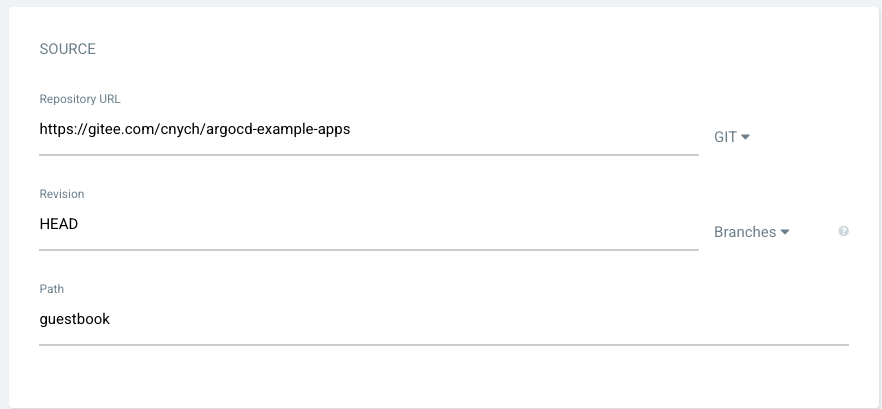
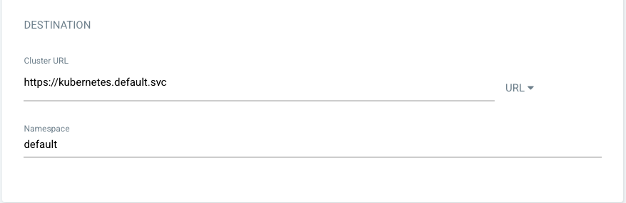
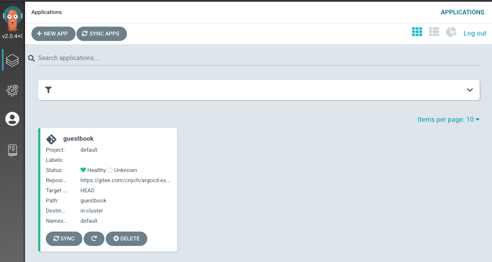
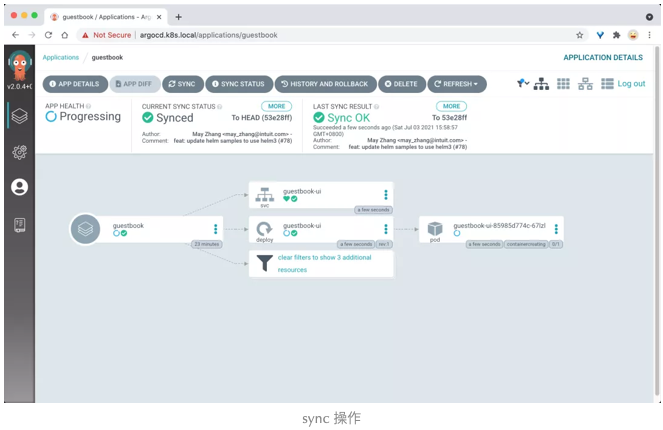
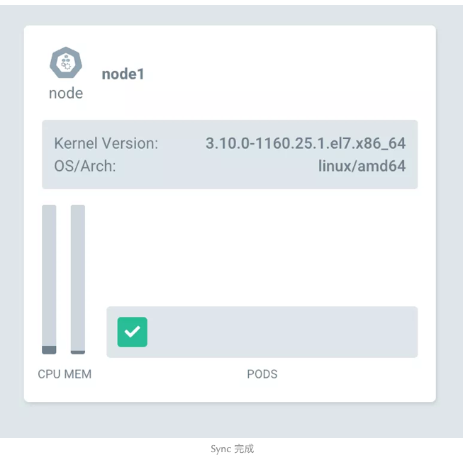
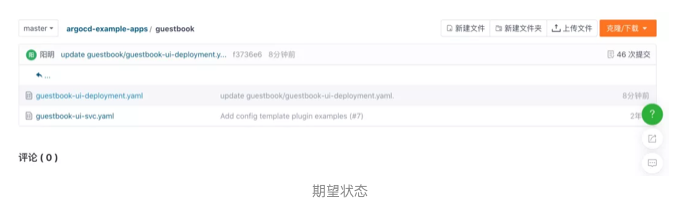

# **GitOps 持续部署工具 Argo CD 初体验**

Argo CD 是一个为 Kubernetes 而生的，遵循声明式 GitOps 理念的持续部署工具。Argo CD 可在 Git 存储库更改时自动同步和部署应用程序。


Argo CD 遵循 GitOps 模式，使用 Git 仓库作为定义所需应用程序状态的真实来源，Argo CD 支持多种 Kubernetes 清单：


* kustomize
* helm charts
* ksonnet applications
* jsonnet files
* Plain directory of YAML/json manifests
* Any custom config management tool configured as a config management plugin


## **架构**



Argo CD 是通过一个 Kubernetes 控制器来实现的，它持续 watch 正在运行的应用程序并将当前的实时状态与所需的目标状态（ Git 存储库中指定的）进行比较。已经部署的应用程序的实际状态与目标状态有差异，则被认为是 OutOfSync 状态，Argo CD 会报告显示这些差异，同时提供工具来自动或手动将状态同步到期望的目标状态。在 Git 仓库中对期望目标状态所做的任何修改都可以自动应用反馈到指定的目标环境中去。

下面简单介绍下 Argo CD 中的几个主要组件：


**API 服务**：API 服务是一个 `gRPC/REST` 服务，它暴露了 Web UI、CLI 和 CI/CD 系统使用的接口，主要有以下几个功能：

* 应用程序管理和状态报告
* 执行应用程序操作（例如同步、回滚、用户定义的操作）
* 存储仓库和集群凭据管理（存储为 K8S Secrets 对象）
* 认证和授权给外部身份提供者
* RBAC
* Git webhook 事件的侦听器/转发器

**仓库服务**：存储仓库服务是一个内部服务，负责维护保存应用程序清单 Git 仓库的本地缓存。当提供以下输入时，它负责生成并返回 Kubernetes 清单：


* 存储 URL
* revision 版本（commit、tag、branch）
* 应用路径
* 模板配置：参数、ksonnet 环境、helm values.yaml 等


应用**控制器**：应用控制器是一个 Kubernetes 控制器，它持续 watch 正在运行的应用程序并将当前的实时状态与所期望的目标状态（ repo 中指定的）进行比较。

**它检测应用程序的 `OutOfSync` 状态，并采取一些措施来同步状态，它负责调用任何用户定义的生命周期事件的钩子（PreSync、Sync、PostSync）**。


## **功能**


* 自动部署应用程序到指定的目标环境
* 支持多种配置管理/模板工具（Kustomize、Helm、Ksonnet、Jsonnet、plain-YAML）
* 能够管理和部署到多个集群
* SSO 集成（OIDC、OAuth2、LDAP、SAML 2.0、GitHub、GitLab、Microsoft、LinkedIn）
* 用于授权的多租户和 RBAC 策略
* 回滚/随时回滚到 Git 存储库中提交的任何应用配置
* 应用资源的健康状况分析
* 自动配置检测和可视化
* 自动或手动将应用程序同步到所需状态
* 提供应用程序活动实时视图的 Web UI
* 用于自动化和 CI 集成的 CLI
* Webhook 集成（GitHub、BitBucket、GitLab）
* 用于自动化的 AccessTokens
* **PreSync、Sync、PostSync Hooks，以支持复杂的应用程序部署（例如蓝/绿和金丝雀发布）**
* 应用程序事件和 API 调用的审计
* Prometheus 监控指标
* 用于覆盖 Git 中的 ksonnet/helm 参数
* 核心概念
* **Application：应用，一组由资源清单定义的 Kubernetes 资源，这是一个 CRD 资源对象**
* Application source type：用来构建应用的工具
* **Target state：目标状态，指应用程序所需的期望状态，由 Git 存储库中的文件表示**
* Live state：实时状态，指应用程序实时的状态，比如部署了哪些 Pods 等真实状态
* Sync status：同步状态表示实时状态是否与目标状态一致，部署的应用是否与 Git 所描述的一样？
* Sync：同步指将应用程序迁移到其目标状态的过程，比如通过对 Kubernetes 集群应用变更
*** Sync operation status：同步操作状态指的是同步是否成功**
* Refresh：刷新是指将 Git 中的最新代码与实时状态进行比较，弄清楚有什么不同
* Health：应用程序的健康状况，它是否正常运行？能否为请求提供服务？
* Tool：工具指从文件目录创建清单的工具，例如 Kustomize 或 Ksonnet 等
* **Configuration management tool：配置管理工具**
* **Configuration management plugin：配置管理插件**

## **安装**

当然前提是需要有一个 kubectl 可访问的 Kubernetes 的集群，直接使用下面的命令即可，这里我们安装最新的稳定版 v2.0.4：

```
kubectl create namespace argocd
kubectl apply -n argocd -f https://raw.githubusercontent.com/argoproj/argo-cd/v2.0.4/manifests/install.yaml
```		

如果你要用在生产环境，则可以使用下面的命令部署一个 HA 高可用的版本：

```
kubectl create namespace argocd
kubectl apply -n argocd -f https://raw.githubusercontent.com/argoproj/argo-cd/v2.0.4/manifests/ha/install.yaml
```	

这将创建一个新的命名空间 argocd，Argo CD 的服务和应用资源都将部署到该命名空间。

```
$ kubectl get svc -n argocd
NAME                    TYPE        CLUSTER-IP       EXTERNAL-IP   PORT(S)                      AGE
argocd-dex-server       ClusterIP   100.68.88.40     <none>        5556/TCP,5557/TCP,5558/TCP   14m
argocd-metrics          ClusterIP   100.71.188.229   <none>        8082/TCP                     14m
argocd-redis            ClusterIP   100.70.152.158   <none>        6379/TCP                     14m
argocd-repo-server      ClusterIP   100.68.105.0     <none>        8081/TCP,8084/TCP            14m
argocd-server           ClusterIP   100.66.54.188    <none>        80/TCP,443/TCP               14m
argocd-server-metrics   ClusterIP   100.71.135.179   <none>        8083/TCP                     14m
```

> 如果你对 UI、SSO、多集群管理这些特性不感兴趣，只想把应用变更同步到集群中，那么你可以使用 `--disable-auth` 标志来禁用认证，
> 
> 可以通过命令 `kubectl patch deploy argocd-server -n argocd -p '[{"op": "add", "path": "/spec/template/spec/containers/0/command/-", "value": "--disable-auth"}]' --type json` 来实现。


然后我们可以在本地安装 CLI 工具方便操作 Argo CD，我们可以在 Argo CD Git 仓库发布页面([https://github.com/argoproj/argo-cd/releases/latest](https://github.com/argoproj/argo-cd/releases/latest))查看最新版本的 Argo CD 或运行以下命令来获取版本：

```
VERSION=$(curl --silent "https://api.github.com/repos/argoproj/argo-cd/releases/latest" | grep '"tag_name"' | sed -E 's/.*"([^"]+)".*/\1/')
```

`VERSION` 在下面的命令中替换为你要下载的 Argo CD 版本：

```
curl -sSL -o /usr/local/bin/argocd https://github.com/argoproj/argo-cd/releases/download/$VERSION/argocd-linux-amd64
```

为 argocd CLI 赋予可执行权限：

```
$ chmod +x /usr/local/bin/argocd


$ kubectl port-forward service/argocd-repo-server -n argocd-test 8081:8081

$ argocd version
argocd: v1.4.2+48cced9
  BuildDate: 2020-01-24T01:07:43Z
  GitCommit: 48cced9d925b5bc94f6aa9fa4a8a19b2a59e128a
  GitTreeState: clean
  GoVersion: go1.12.6
  Compiler: gc
  Platform: darwin/amd64
argocd-server: v2.0.4+0842d44
  BuildDate: 2021-06-23T01:27:53Z
  GitCommit: 0842d448107eb1397b251e63ec4d4bc1b4efdd6e
  GitTreeState: clean
  GoVersion: go1.16
  Compiler: gc
  Platform: linux/amd64
  Ksonnet Version: v0.13.1
  Kustomize Version: v3.9.4 2021-02-09T19:22:10Z
  Helm Version: v3.5.1+g32c2223
  Kubectl Version: v0.20.4
```

```
kubectl port-forward service/argocd-server -n argocd-test 8080:443
```

现在我们就可以使用 argocd 命令了。

如果你是 Mac，则可以直接使用 `brew install argocd` 进行安装。

Argo CD 会运行一个 gRPC 服务（由 CLI 使用）和 HTTP/HTTPS 服务（由 UI 使用），这两种协议都由 `argocd-server` 服务在以下端口进行暴露：

* 443 - gRPC/HTTPS
* 80 - HTTP（重定向到 HTTPS）

我们可以通过配置 Ingress 的方式来对外暴露服务，这里我们仍然使用 Traefik 的 IngressRoute 进行配置，其他 Ingress 控制器的配置可以参考官方文档 [https://argo-cd.readthedocs.io/en/stable/operator-manual/ingress/](https://argo-cd.readthedocs.io/en/stable/operator-manual/ingress/) 进行配置。


由于 Traefik 它可以在同一端口处理 TCP 和 HTTP 连接，所以我们不需要定义多个 `IngressRoute` 来暴露 HTTP 和 gRPC 服务，然后应在禁用 TLS 的情况下运行 API 服务，编辑 `argocd-server Deployment` 以将 `--insecure` 标志添加到 `argocd-server` 命令中：

```
spec:
  template:
    spec:
      containers:
      - name: argocd-server
        command:
        - argocd-server
        - --staticassets
        - /shared/app
        - --repo-server
        - argocd-repo-server:8081
        - --insecure  # 需要禁用 tls，否则会 `redirected you too many times`
```

然后创建如下所的 `IngressRoute` 资源对象即可，我们创建了一个 `redirect-https `的中间件，可以让 `http` 服务强制跳转到 `https` 服务去：

```
apiVersion: traefik.containo.us/v1alpha1
kind: Middleware
metadata:
  name: redirect-https
  namespace: argocd
spec:
  redirectScheme:
    scheme: https
---
apiVersion: traefik.containo.us/v1alpha1
kind: IngressRoute
metadata:
  name: argocd-server-http
  namespace: argocd
spec:
  entryPoints:
    - web
  routes:
    - kind: Rule
      match: Host(`argocd.k8s.local`)
      priority: 10
      middlewares:
        - name: redirect-https
      services:
        - name: argocd-server
          port: 80
    - kind: Rule
      match: Host(`argocd.k8s.local`) && Headers(`Content-Type`, `application/grpc`)
      priority: 11
      middlewares:
        - name: redirect-https
      services:
        - name: argocd-server
          port: 80
          scheme: h2c
---
apiVersion: traefik.containo.us/v1alpha1
kind: IngressRoute
metadata:
  name: argocd-server
  namespace: argocd
spec:
  entryPoints:
    - websecure
  routes:
    - kind: Rule
      match: Host(`argocd.k8s.local`)
      priority: 10
      services:
        - name: argocd-server
          port: 80
    - kind: Rule
      match: Host(`argocd.k8s.local`) && Headers(`Content-Type`, `application/grpc`)
      priority: 11
      services:
        - name: argocd-server
          port: 80
          scheme: h2c
  tls:
    certResolver: default
    options: {}
```

创建完成后，我们就可以通过 `argocd.k8s.local `来访问 `Argo CD`服务了，不过需要注意我们这里配置的证书是自签名的，所以在第一次访问的时候会提示不安全，强制跳转即可：

```
kubectl port-forward service/argocd-server -n argocd-test 8080:443


https://localhost:8080/
```
 
 
 
 
默认情况下 admin 帐号的初始密码是自动生成的，会以明文的形式存储在 Argo CD 安装的命名空间中名为 password 的 Secret 对象下的 `argocd-initial-admin-secret` 字段下，我们可以用下面的命令来获取：

```
$ kubectl -n argocd-test get secret argocd-initial-admin-secret -o jsonpath="{.data.password}" | base64 -d && echo
hdhdLBYsqKzIRjHu
```

使用用户名 admin 和上面输出的密码即可登录 Dashboard，同样我们也可以通过 ArgoCD CLI 命令行工具进行登录：

```
$ argocd login localhost:8080
WARNING: server certificate had error: x509: certificate signed by unknown authority. Proceed insecurely (y/n)? y
Username: admin
Password: 
'admin:login' logged in successfully
Context 'localhost:8080' updated
```

CLI 登录成功后，可以使用如下所示命令更改密码：

```
 argocd account update-password
*** Enter current password: 
*** Enter new password: 
*** Confirm new password: 
```

## 配置集群


由于 Argo CD 支持部署应用到多集群，所以如果你要将应用部署到外部集群的时候，需要先将外部集群的认证信息注册到 Argo CD 中，如果是在内部部署（运行 Argo CD 的同一个集群，默认不需要配置），应该使用 `https://kubernetes.default.svc` 作为应用的 K8S APIServer 地址。

首先列出当前 kubeconfig 中的所有集群上下文：

```
kubectl config get-contexts -o name

shoot--sap-jam--integration701
```


从列表中选择一个上下文名称并将其提供给 argocd cluster add CONTEXTNAME，比如对于 `shoot--sap-jam--integration701`上下文，运行：

```
argocd cluster add shoot--sap-jam--integration701
```

上述命令会将 `ServiceAccount (argocd-manager) `安装到该 kubectl 上下文的 kube-system 命名空间中，并将 `ServiceAccount` 绑定到管理员级别的 ClusterRole，Argo CD 使用此 ServiceAccount 令牌来执行任务管理（部署/监控）。


> `argocd-manager-role` 可以修改 Role 的规则，使其仅对有限的一组命名空间、组、种类具有 create、update、patch、delete 等权限，但是对于 Argo CD 需要 get，list，watch 的权限在 ClusterRole 范围内。

## 创建应用

Git 仓库 `https://github.com/argoproj/argocd-example-apps.git` 是一个包含留言簿应用程序的示例库，我们可以用该应用来演示 Argo CD 的工作原理。


### 通过 CLI 创建应用


我们可以通过 `argocd app create xxx` 命令来创建一个应用：

```
$ argocd app create --help
Create an application

Usage:
  argocd app create APPNAME [flags]

Examples:

        # Create a directory app
        argocd app create guestbook --repo https://github.com/argoproj/argocd-example-apps.git --path guestbook --dest-namespace default --dest-server https://kubernetes.default.svc --directory-recurse

        # Create a Jsonnet app
        argocd app create jsonnet-guestbook --repo https://github.com/argoproj/argocd-example-apps.git --path jsonnet-guestbook --dest-namespace default --dest-server https://kubernetes.default.svc --jsonnet-ext-str replicas=2

        # Create a Helm app
        argocd app create helm-guestbook --repo https://github.com/argoproj/argocd-example-apps.git --path helm-guestbook --dest-namespace default --dest-server https://kubernetes.default.svc --helm-set replicaCount=2

        # Create a Helm app from a Helm repo
        argocd app create nginx-ingress --repo https://kubernetes-charts.storage.googleapis.com --helm-chart nginx-ingress --revision 1.24.3 --dest-namespace default --dest-server https://kubernetes.default.svc

        # Create a Kustomize app
        argocd app create kustomize-guestbook --repo https://github.com/argoproj/argocd-example-apps.git --path kustomize-guestbook --dest-namespace default --dest-server https://kubernetes.default.svc --kustomize-image gcr.io/heptio-images/ks-guestbook-demo:0.1

        # Create a app using a custom tool:
        argocd app create ksane --repo https://github.com/argoproj/argocd-example-apps.git --path plugins/kasane --dest-namespace default --dest-server https://kubernetes.default.svc --config-management-plugin kasane


Flags:
......
```

直接执行如下所示命令即可：

```
$ argocd app create guestbook --repo https://github.com/argoproj/argocd-example-apps.git --path guestbook --dest-server https://kubernetes.default.svc --dest-namespace default
application 'guestbook' created
```

### 通过 UI 创建应用

除了可以通过 CLI 工具来创建应用，我们也可以通过 UI 界面来创建，定位到 `argocd.k8s.local` 页面，登录后，点击 +New App 新建应用按钮，如下图：

 
 
 
 将应用命名为 `guestbook`，使用 `default project`，并将同步策略设置为 `Manual`：
 
 


然后在下面配置 Repository URL 为 `https://github.com/argoproj/argocd-example-apps.git`，由于某些原因我们这里使用迁移到 Gitee 上面的仓库地址 `https://gitee.com/cnych/argocd-example-apps`，将 `Revision` 设置为 `HEAD`，并将路径设置为 `guestbook`：

 
 
 然后下面的 `Destination` 部分，将 `cluster` 设置为 `in-cluster` 和 `namespace` 为 default：

 
 
 
 填写完以上信息后，点击页面上方的 Create 安装，即可创建` guestbook` 应用，创建完成后可以看到当前应用的处于 `OutOfSync` 状态：
 
  


## 部署应用

由于上面我们在创建应用的时候使用的同步策略为 `Manual`，所以应用创建完成后没有自动部署，需要我们手动去部署应用。同样可以通过 CLI 和 UI 界面两种同步方式。

### 使用 CLI 同步

应用创建完成后，我们可以通过如下所示命令查看其状态：

```
$ argocd app get guestbook
Name:               guestbook
Project:            default
Server:             https://kubernetes.default.svc
Namespace:          default
URL:                https://argocd.k8s.local/applications/guestbook
Repo:               https://gitee.com/cnych/argocd-example-apps
Target:             HEAD
Path:               guestbook
SyncWindow:         Sync Allowed
Sync Policy:        <none>
Sync Status:        OutOfSync from HEAD (53e28ff)
Health Status:      Missing

GROUP  KIND        NAMESPACE  NAME          STATUS     HEALTH   HOOK  MESSAGE
       Service     default    guestbook-ui  OutOfSync  Missing
apps   Deployment  default    guestbook-ui  OutOfSync  Missing
```

应用程序状态为初始 OutOfSync 状态，因为应用程序尚未部署，并且尚未创建任何 Kubernetes 资源。要同步（部署）应用程序，可以执行如下所示命令：

```
argocd app sync guestbook
```

此命令从 Git 仓库中检索资源清单并执行 kubectl apply 部署应用，执行上面命令后 guestbook 应用便会运行在集群中了，现在我们就可以查看其资源组件、日志、事件和评估其健康状态了。


## 通过 UI 同步

直接添加 UI 界面上应用的 Sync 按钮即可开始同步：

 

同步完成后可以看到我们的资源状态：

 


还可以有不同的视角进行查看：


 

也可以通过 kubectl 查看到我们部署的资源：


```
~ kubectl get pods
NAME                                      READY   STATUS      RESTARTS   AGE
guestbook-ui-6c96fb4bdc-nmk9b             1/1     Running     0          2m22s


 ~ kubectl get svc
NAME                 TYPE        CLUSTER-IP      EXTERNAL-IP   PORT(S)    AGE
guestbook-ui         ClusterIP   10.96.32.11     <none>        80/TCP     11m
kubernetes           ClusterIP   10.96.0.1       <none>        443/TCP    41d
```

和我们从 Git 仓库中同步 guestbook 目录下面的资源状态也是同步的，证明同步成功了。


 
