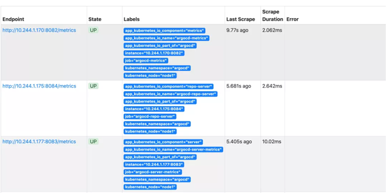

# **Argo CD 优化以及使用钉钉接收状态消息**

本文我们将介绍 Argo CD 通过 webhook 来优化应用检测、使用 Prometheus 监控 Argo CD，已经使用钉钉来接收 Argo CD 应用状态变化的消息通知。

## **webhook 配置**

Argo CD 会自动检查到配置的应用变化，**这是因为 Argo CD 会每隔三分钟去轮询一次 Git 存储库来检测清单的变化**，为了消除这种轮询延迟，**我们也可以将 API 服务端配置为接收 webhook 事件的方式，这样就能实时获取到 Git 存储库中的变化了**。


Argo CD 支持来着 GitHub、GitLab、Bitbucket、Bitbucket Server 和 Gogs 的 Git webhook 事件，这里我们仍然以上面的 GitLab 为例来说明如果配置 Webhook。

进入到 GitLab 项目仓库 [http://git.k8s.local/course/devops-demo-deploy](http://git.k8s.local/course/devops-demo-deploy) 中配置 Webhooks：


Webhook 的地址填写 Argo CD 的 API 接口地址 [http://argocd.k8s.local/api/webhook](http://argocd.k8s.local/api/webhook)，下面的 Secret token 是可选的，建议添加上，任意定义即可。**另外需要注意这里我们使用的是自签名的 https 证书，所以需要在下方去掉 启用SSL验证。**

然后需要将上面配置的 Secret token 添加到 Argo CD 的 Secret 配置中：

```
➜  ~ kubectl edit secret argocd-secret -n argocd
apiVersion: v1
kind: Secret
metadata:
  name: argocd-secret
  namespace: argocd
type: Opaque
data:
...
stringData:
  # gitlab webhook secret
  webhook.gitlab.secret: youdianzhishi
```

保存后，更改会自动生效，我们可以在 GitLab 这边测试配置的 Webhook，查看 Argo CD 的 API 服务 Pod 日志，正常就可以收到 Push 事件了：

```
➜  ~ kubectl logs -f argocd-server-5cc96b75b4-zws2c -n argocd
time="2021-07-08T07:15:32Z" level=info msg="finished streaming call with code OK" grpc.code=OK grpc.method=Watch grpc.service=application.ApplicationService grpc.start_time="2021-07-08T07:15:01Z" grpc.time_ms=31314.16 span.kind=server system=grpc
time="2021-07-08T07:15:37Z" level=info msg="Received push event repo: http://git.k8s.local/course/devops-demo-deploy, revision: master, touchedHead: true"
time="2021-07-08T07:15:37Z" level=info msg="Requested app 'devops-demo' refresh"
```

## Metrics 指标

Argo CD 作为我们持续部署的关键组件，对于本身的监控也是非常有必要的，Argo CD 本身暴露了两组 Prometheus 指标，所以我们可以很方便对接监控报警。

默认情况下 Metrics 指标通过端点 `argocd-metrics:8082/metrics` 获取指标，包括：

* 应用健康状态指标
* 应用同步状态指标
* 应用同步历史记录

关于 Argo CD 的 API 服务的 API 请求和响应相关的指标（请求数、响应码值等等...）通过端点 argocd-server-metrics:8083/metrics 获取。


然后可以根据我们自己的需求来配置指标抓取任务，比如我们是手动维护 Prometheus 的方式，并且开启了 endpoints 这种类型的服务自动发现，

那么我们可以在几个指标的 Service 上添加 `prometheus.io/scrape: "true"` 这样的 `annotation`：

```
➜  ~ kubectl edit svc argocd-metrics -n argocd
apiVersion: v1
kind: Service
metadata:
  annotations:
    kubectl.kubernetes.io/last-applied-configuration: |
      {"apiVersion":"v1","kind":"Service","metadata":{"annotations":{},"labels":{"app.kubernetes.io/component":"metrics","app.kubernetes.io/name":"argocd-metrics","app.kubernetes.io/part-of":"argocd"},"name":"argocd-metrics","namespace":"argocd"},"spec":{"ports":[{"name":"metrics","port":8082,"protocol":"TCP","targetPort":8082}],"selector":{"app.kubernetes.io/name":"argocd-application-controller"}}}
    prometheus.io/scrape: "true"
  creationTimestamp: "2021-07-03T06:16:47Z"
  labels:
    app.kubernetes.io/component: metrics
    app.kubernetes.io/name: argocd-metrics
    app.kubernetes.io/part-of: argocd
......


➜  ~ kubectl edit svc argocd-server-metrics -n argocd
apiVersion: v1
kind: Service
metadata:
  annotations:
    kubectl.kubernetes.io/last-applied-configuration: |
      {"apiVersion":"v1","kind":"Service","metadata":{"annotations":{},"labels":{"app.kubernetes.io/component":"server","app.kubernetes.io/name":"argocd-server-metrics","app.kubernetes.io/part-of":"argocd"},"name":"argocd-server-metrics","namespace":"argocd"},"spec":{"ports":[{"name":"metrics","port":8083,"protocol":"TCP","targetPort":8083}],"selector":{"app.kubernetes.io/name":"argocd-server"}}}
    prometheus.io/scrape: "true"
    prometheus.io/port: "8083"  # 指定8084端口为指标端口
  creationTimestamp: "2021-07-03T06:16:47Z"
  labels:
    app.kubernetes.io/component: server
    app.kubernetes.io/name: argocd-server-metrics
    app.kubernetes.io/part-of: argocd
......


➜  ~ kubectl edit svc argocd-repo-server -n argocd
apiVersion: v1
kind: Service
metadata:
  annotations:
    kubectl.kubernetes.io/last-applied-configuration: |
      {"apiVersion":"v1","kind":"Service","metadata":{"annotations":{},"labels":{"app.kubernetes.io/component":"repo-server","app.kubernetes.io/name":"argocd-repo-server","app.kubernetes.io/part-of":"argocd"},"name":"argocd-repo-server","namespace":"argocd"},"spec":{"ports":[{"name":"server","port":8081,"protocol":"TCP","targetPort":8081},{"name":"metrics","port":8084,"protocol":"TCP","targetPort":8084}],"selector":{"app.kubernetes.io/name":"argocd-repo-server"}}}
    prometheus.io/scrape: "true"
    prometheus.io/port: "8084"  # 指定8084端口为指标端口
  creationTimestamp: "2021-07-03T06:16:47Z"
  labels:
    app.kubernetes.io/component: repo-server
    app.kubernetes.io/name: argocd-repo-server
    app.kubernetes.io/part-of: argocd
......
```

配置完成后正常就可以自动发现上面的几个指标任务了：



如果你使用的是 Prometheus Operator 方式，则可以手动创建 ServiceMonitor 对象来创建指标对象。

然后我们可以在 Grafana 中导入 Argo CD 的 Dashboard，地址：https://github.com/argoproj/argo-cd/blob/master/examples/dashboard.json


## 消息通知

上面我们配置了 Argo CD 的监控指标，我们可以通过 AlertManager 来进行报警，但是有的时候我们可能希望将应用同步的状态发送到指定的渠道，这样方便我们了解部署流水线的结果，

Argo CD 本身并没有提供内置的同步状态通知功能，但是我们可以与第三方的系统进行集成。


* **ArgoCD Notifications - Argo CD 通知系统，持续监控 Argo CD 应用程序，旨在与各种通知服务集成，例如 Slack、SMTP、Telegram、Discord 等**。
* **Argo Kube Notifier - 通用 Kubernetes 资源控制器，允许监控任何 Kubernetes 资源并在满足配置的规则时发送通知**。
* Kube Watch - 可以向 Slack/hipchat/mattermost/flock 频道发布通知，它监视集群中的资源变更并通过 webhook 通知它们。

我们知道 Argo CD 本身是提供 resource hook 功能的，在资源同步前、中、后提供脚本来执行相应的动作, 那么想在资源同步后获取应用的状态，然后根据状态进行通知就非常简单了，通知可以是很简单的 curl 命令：


* PreSync: 在同步之前执行相关操作，**这个一般用于比如数据库操作等**
* Sync: 同步时执行相关操作，主要用于复杂应用的编排
* PostSync: **同步之后且app状态为health执行相关操作**
* **SyncFail: 同步失败后执行相关操作，同步失败一般不常见**


**但是对于 PostSync 可以发送成功的通知，但对于状态为 Processing 的无法判断，而且通知还是没有办法做到谁执行的 pipeline 谁接收通知的原则，没有办法很好地进行更细粒度的配置**。

ArgoCD Notifications 就可以来解决我们的问题，这里我们就以 ArgoCD Notifications 为例来说明如何使用钉钉来通知 Argo CD 的同步状态通知。

首先下载 ArgoCD Notifications 官方安装资源清单：

```
wget https://raw.githubusercontent.com/argoproj-labs/argocd-notifications/stable/manifests/install.yaml
```

然后我们需要在钉钉群中创建一个机器人，现在的机器人安全认证有几种方式，这里我们就选择关键字的方式，配置包含 ArgoCD 关键字的机器人：


然后我们需要修改 `install.yaml` 文件中的 `argocd-notifications-cm` 添加相关配置才能支持钉钉。

```
apiVersion: v1
kind: ConfigMap
metadata:
  name: argocd-notifications-cm
data:
  service.webhook.dingtalk: |
    url: https://oapi.dingtalk.com/robot/send?access_token=31429a8a66c8cd5beb7c4295ce592ac3221c47152085da006dd4556390d4d7e0
    headers:
      - name: Content-Type
        value: application/json
  context: |
    argocdUrl: http://argocd.k8s.local
  template.app-sync-change: |
    webhook:
      dingtalk:
        method: POST
        body: |
          {
                "msgtype": "markdown",
                "markdown": {
                    "title":"ArgoCD同步状态",
                    "text": "### ArgoCD同步状态\n> - app名称: {{.app.metadata.name}}\n> - app同步状态: {{ .app.status.operationState.phase}}\n> - 时间:{{.app.status.operationState.startedAt}}\n> - URL: [点击跳转ArgoCD]({{.context.argocdUrl}}/applications/{{.app.metadata.name}}?operation=true) \n"
                }
            }
  trigger.on-deployed: |
    - description: Application is synced and healthy. Triggered once per commit.
      oncePer: app.status.sync.revision
      send: [app-sync-change]  # template names
      # trigger condition
      when: app.status.operationState.phase in ['Succeeded'] and app.status.health.status == 'Healthy'
  trigger.on-health-degraded: |
    - description: Application has degraded
      send: [app-sync-change]
      when: app.status.health.status == 'Degraded'
  trigger.on-sync-failed: |
    - description: Application syncing has failed
      send: [app-sync-change]  # template names
      when: app.status.operationState.phase in ['Error', 'Failed']
  trigger.on-sync-running: |
    - description: Application is being synced
      send: [app-sync-change]  # template names
      when: app.status.operationState.phase in ['Running']
  trigger.on-sync-status-unknown: |
    - description: Application status is 'Unknown'
      send: [app-sync-change]  # template names
      when: app.status.sync.status == 'Unknown'
  trigger.on-sync-succeeded: |
    - description: Application syncing has succeeded
      send: [app-sync-change]  # template names
      when: app.status.operationState.phase in ['Succeeded']
  subscriptions: |
    - recipients: [dingtalk]  # 可能有bug，正常应该是webhook:dingtalk
      triggers: [on-sync-running, on-deployed, on-sync-failed, on-sync-succeeded]
```

其中 `argocd-notifications-cm` 中添加了一段如下所示的配置：

```
subscriptions: |
  - recipients: [dingtalk]
    triggers: [on-sync-running, on-deployed, on-sync-failed, on-sync-succeeded]
```

这个是为定义的触发器添加通知订阅，正常这里的 `recipients` 是 `webhook:dingtalk`，不知道是否是因为该版本有 bug，需要去掉前缀才能正常使用。

此外还可以添加一些条件判断，如下所示：

```

subscriptions:
# global subscription for all type of notifications
- recipients:
  - slack:test1
  - webhook:github
# subscription for on-sync-status-unknown trigger notifications
- recipients:
  - slack:test2
  - email:test@gmail.com
  trigger: on-sync-status-unknown
# global subscription restricted to applications with matching labels only
- recipients:
  - slack:test3
  selector: test=true
```

然后可以根据不同的状态来配置不同的触发器，如下所示：

```
trigger.on-sync-status-unknown: |
  - description: Application status is 'Unknown'
    send: [app-sync-change]  # template names
    when: app.status.sync.status == 'Unknown'
```

该触发器定义包括名称、条件和通知模板引用:

* **send**：表示通知内容使用的模板名称
* **description**：当前触发器的描述信息
* **when**：条件表达式，如果应发送通知，则返回 true

然后下面就是配置发送的消息通知模板：

```
template.app-sync-change: |
  webhook:
    dingtalk:
      method: POST
      body: |
        {
              "msgtype": "markdown",
              "markdown": {
                  "title":"ArgoCD同步状态",
                  "text": "### ArgoCD同步状态\n> - app名称: {{.app.metadata.name}}\n> - app同步状态: {{ .app.status.operationState.phase}}\n> - 时间:{{.app.status.operationState.startedAt}}\n> - URL: [点击跳转ArgoCD]({{.context.argocdUrl}}/applications/{{.app.metadata.name}}?operation=true) \n"
              }
          }
```


该模板用于生成通知内容，该模板利用 Golang 中的 html/template 包定义，允许定义通知标题和正文，可以重用，并且可以由多个触发器引用。每个模板默认都可以访问以下字段：

 
* app：保存应用程序对象
* context：是用户定义的字符串映射，可能包含任何字符串键和值
* notificationType 保留通知服务类型名称，该字段可用于有条件地呈现服务特定字段

然后记得使用钉钉机器人的 webhook 地址替换掉上面的  `argocd-notifications-secret `中的 url 地址。


配置完成后直接创建整个资源清单文件：

```
➜  ~ kubectl apply -f install.yaml
➜  ~ kubectl get pods -n argocd
NAME                                               READY   STATUS    RESTARTS   AGE
argocd-application-controller-0                    1/1     Running   0          5d4h
argocd-dex-server-76ff776f97-ds7mm                 1/1     Running   0          5d4h
argocd-notifications-controller-5c548f8dc9-dx824   1/1     Running   0          9m22s
argocd-redis-747b678f89-w99wf                      1/1     Running   0          5d4h
argocd-repo-server-6fc4456c89-586zl                1/1     Running   0          5d4h
argocd-server-5cc96b75b4-zws2c                     1/1     Running   0          4d22h
```

安装完成后重新去修改下应用代码触发整个 GitOps 流水线，正常就可以在钉钉中收到如下所示的消息通知了，如果没有正常收到消息，可以通过 argocd-notifications 的 CLI 命令进行调试：


```
➜  ~ kubectl exec -it argocd-notifications-controller-5c548f8dc9-dtq7h -n argocd -- /app/argocd-notifications template notify app-sync-change guestbook --recipient dingtalk
DEBU[0000] Sending request: POST /robot/send?access_token=31429a8a66c8cd5beb7c4295ce592ac3221c47152085da006dd4556390d4d7e0 HTTP/1.1
Host: oapi.dingtalk.com
Content-Type: application/json

{
      "msgtype": "markdown",
      "markdown": {
          "title":"ArgoCD同步状态",
          "text": "### ArgoCD同步状态\n> - app名称: guestbook\n> - app同步状态: Succeeded\n> - 时间:2021-07-03T12:53:44Z\n> - URL: [点击跳转ArgoCD](http://argocd.k8s.local/applications/guestbook?operation=true) \n"
      }
  }  service=dingtalk
DEBU[0000] Received response: HTTP/2.0 200 OK
Cache-Control: no-cache
Content-Type: application/json
Date: Thu, 08 Jul 2021 11:45:12 GMT
Server: Tengine

{"errcode":0,"errmsg":"ok"}  service=dingtalk
```


