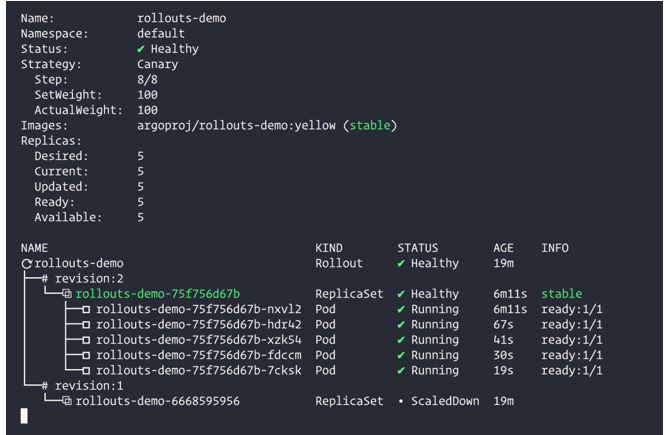

# **Argo Rollouts 实现蓝绿/金丝雀发布**

Argo Rollouts 是一个 Kubernetes Operator 实现，它为 Kubernetes 提供更加高级的部署能力，如蓝绿、金丝雀、金丝雀分析、实验和渐进式交付功能，为云原生应用和服务实现自动化、基于 GitOps 的逐步交付。

支持如下特性：

* 蓝绿更新策略
* 金丝雀更新策略
* 更加细粒度、加权流量拆分
* 自动回滚
* 手动判断
* 可定制的指标查询和业务 KPI 分析
* Ingress 控制器集成：NGINX，ALB
* 服务网格集成：Istio，Linkerd，SMI
* Metrics 指标集成：Prometheus、Wavefront、Kayenta、Web、Kubernetes Jobs、Datadog、New Relic

## 实现原理


与 Deployment 对象类似，Argo Rollouts 控制器将管理 ReplicaSets 的创建、缩放和删除，这些 `ReplicaSet` 由 `Rollout` 资源中的 `spec.template` 定义，使用与 `Deployment` 对象相同的` pod` 模板。

当 `spec.template` 变更时，这会向 `Argo Rollouts` 控制器发出信号，表示将引入新的 `ReplicaSet`，控制器将使用 `spec.strategy` 字段内的策略来确定从旧 `ReplicaSet` 到新 `ReplicaSet` 的 `rollout` 将如何进行，一旦这个新的 `ReplicaSet `被放大（可以选择通过一个 Analysis），控制器会将其标记为稳定。

如果在 `spec.template` 从稳定的 `ReplicaSet` 过渡到新的  `ReplicaSet` 的过程中发生了另一次变更（即在发布过程中更改了应用程序版本），那么之前的新 `ReplicaSet` 将缩小，并且控制器将尝试发布反映更新 `spec.template` 字段的 `ReplicasSet`。

## 相关概念

在继续之前我们先来了解一些基本的概念。

## Rollout(滚动)

Rollout 是一个 Kubernetes 的 CRD 资源，相当于 Kubernetes Deployment 对象，在需要更高级的部署或渐进式交付功能的情况下，**它旨在取代 Deployment 对象，Rollout 提供了 Kubernetes Deployment 所不能提供的功能**。

* 蓝绿部署
* 金丝雀部署
* 与 Ingress 控制器和服务网格整合，实现高级流量路由
* 与用于蓝绿和金丝雀分析的指标提供者集成
* 根据成功或失败的指标，自动发布或回滚

## 渐进式交付

渐进式交付是以受控和渐进的方式发布产品更新的过程，从而降低发布的风险，通常将自动化和指标分析结合起来以驱动更新的自动升级或回滚。

渐进式交付通常被描述为持续交付的演变，将 CI/CD 中的速度优势扩展到部署过程。通过将新版本限制在一部分用户，观察和分析正确的行为，然后逐渐增加更多的流量，同时不断验证其正确性。

## 部署策略

虽然业界使用了一致的术语来描述各种部署策略，但这些策略的实现往往因工具而异，为了明确 Argo Rollouts 的行为方式，以下是 Argo Rollouts 提供的各种部署策略实施的描述。

* **RollingUpdate(滚动更新)**：慢慢地用新版本替换旧版本，随着新版本的出现，旧版本会慢慢缩减，以保持应用程序的总数量。这是 Deployment 对象的默认策略。
* **Recreate(重新创建)：****Recreate 会在启动新版本之前删除旧版本的应用程序，这可确保应用程序的两个版本永远不会同时运行，但在部署期间会出现停机时间**。
* **Blue-Green(蓝绿)：蓝绿发布（有时称为红黑**）指同时部署了新旧两个版本的应用程序，在此期间，只有旧版本的应用程序会收到生产流量，这允许开发人员在将实时流量切换到新版本之前针对新版本进行测试。


上面显示了一个有两个阶段的金丝雀（10%和33%的流量进入新版本），**通过使用 Argo Rollouts，我们可以根据实际的使用情况定义确切的阶段数和流量百分比。**

## 场景

* 用户希望在新版本开始为生产环境提供服务之前对其进行最后一分钟的功能测试，通过 BlueGreen 策略，Argo Rollouts 允许用户指定预览服务和活动服务，Rollout 将配置预览服务以将流量发送到新版本，同时活动服务继续接收生产流量。一旦达到要求，则可以将预览服务提升为新的活动服务。
* 在新版本开始接收实时流量之前，需要预先执行一套通用步骤，通过使用 BlueGreen 策略，用户可以在不接收来自活动服务的流量的情况下启动新版本，一旦这些步骤执行完毕，就可以将流量切换到新版本了。
* 用户希望在几个小时内将一小部分生产流量提供给他们应用程序的新版本。之后，他们希望缩小新版本规模，并查看一些指标以确定新版本与旧版本相比是否具有性能问题，然后他们将决定是否为切换到新版本。使用金丝雀策略，rollout 可以用新版本扩大 ReplicaSet 的规模，以接收指定百分比的流量，**等待指定的时间，然后将百分比设置回 0，然后等待用户满意后再发布，为所有的流量提供服务。**
* 一个用户想慢慢给新版增加生产流量，先给它一小部分的实时流量，然后等待一段时间再给新版本更多的流量，最终，新版本将接收所有生产流量。使用金丝雀策略，用户指定他们希望新版本接收的百分比以及在百分比之间等待的时间。
* 用户想要使用 Deployment 中的正常滚动更新策略，如果用户使用没有步骤的金丝雀策略，rollout 将使用 maxSurge 和最大不可用值来滚动到新版本。

## 架构

下面展示了由 Argo Rollouts 管理的 Deployment 的所有组件。


## Rollout Controller

这是主控制器，用于监视集群的事件并在 Rollout 类型的资源发生更改时做出反应。控制器将读取 rollout 的所有详细信息，并使集群处于 rollout 定义中描述的相同状态。


**请注意，Argo Rollouts 不会篡改或响应正常 Deployment 资源上发生的任何变更，这意味着你可以在一个使用其他方法部署应用的集群中安装 Argo Rollouts**。


## Rollout 资源

Rollout 资源是 Argo Rollouts 引入和管理的一种自定义 Kubernetes 资源，它与原生的 Kubernetes Deployment 资源基本兼容，但有额外的字段来控制更加高级的部署方法，如金丝雀和蓝/绿部署。

Argo Rollouts 控制器将只对 Rollout 资源中的变化做出反应，不会对正常的 Deployment 资源做任何事情，所以如果你想用 Argo Rollouts 管理你的 Deployment，你需要将你的 Deployment 迁移到Rollouts。


## 旧版和新版的 ReplicaSets


这些是标准的 Kubernetes ReplicaSet 资源的实例，Argo Rollouts 给它们添加了一些额外的元数据，以便跟踪属于应用程序的不同版本。

还要注意的是，参加 Rollout 的 ReplicaSet 完全由控制器自动管理，你不应该用外部工具来篡改它们。

## Ingress/Service

用户的流量进入集群后，被重定向到合适的版本，Argo Rollouts 使用标准的 Kubernetes Service 资源，但有一些额外的元数据。


Argo Rollouts 在网络配置上非常灵活，

首先，可以在 Rollout 期间使用不同的服务，这些服务仅适用于新版本、仅适用于旧版本或两者都适用。

**特别是对于 Canary 部署，Argo Rollouts 支持多种服务网格和 Ingress 解决方案，用于按特定百分比拆分流量，而不是基于 Pod 数量进行简单的配置。**

## Analysis 与 AnalysisRun

Analysis 是一种自定义 Kubernetes 资源，它将 Rollout 连接到指标提供程序，并为某些指标定义特定阈值，这些阈值将决定 Rollout 是否成功。

对于每个 Analysis，你可以定义一个或多个指标查询及其预期结果，如果指标查询正常，则 Rollout 将继续操作；

如果指标显示失败，则自动回滚；如果指标无法提供成功/失败的答案，则暂停发布。


**Analysis 只是关于要查询哪些指标的模板。附加到 Rollout 的实际结果是 AnalysisRun 自定义资源，你可以在特定 Rollout 上或在集群上全局定义 Analysis 以供多个 rollout 共享。**

请注意，在 Rollout 中使用 Analysis 和指标是完全可选的，你可以通过 API 或 CLI 手动暂停和促进发布或使用其他外部方法（例如冒烟测试）。

你不需要仅使用 Argo Rollouts 的 Metrics 解决方案，你还可以在 Rollout 中混合自动（即基于 Analysis）和手动步骤。

除了指标之外，你还可以通过运行 Kubernetes Job 或运行 webhook 来决定发布的成功与否。

## Metric Providers

Argo Rollouts 包括几个流行的指标提供者的原生集成，你可以在 Analysis 资源中使用，来自动提升或回滚发布。

## CLI 和 UI（图中未显示）

还可以使用 Argo Rollouts CLI 或集成 UI 查看和管理 Rollout，两者都是可选的。

## 安装

直接使用下面的命令安装 Argo Rollouts：

```
~ kubectl create namespace argo-rollouts

~ kubectl apply -n argo-rollouts -f https://github.com/argoproj/argo-rollouts/releases/download/v1.0.2/install.yaml
```

这里会创建一个名为 `argo-rollouts` 的命名空间，Argo Rollouts 控制器运行在下面。

```
➜  ~ kubectl get pods -n argo-rollouts
NAME                             READY   STATUS    RESTARTS   AGE
argo-rollouts-6fdcf89f7c-7z2mh   1/1     Running   0          58s
```

此外，我们还可以安装一个 kubectl 插件，对于命令行管理和可视化发布非常方便。

我们这里是 Mac 系统，可以直接使用下面的命令进行安装：

```
➜  ~ brew install argoproj/tap/kubectl-argo-rollouts
```

当然也可以手动进行安装，使用 curl 安装 Argo Rollouts kubectl 插件：

```
➜  ~ curl -LO https://github.com/argoproj/argo-rollouts/releases/download/v1.0.2/kubectl-argo-rollouts-darwin-amd64
```

然后赋予 `kubectl-argo-rollouts` 二进制文件可执行权限：

```
➜  ~ chmod +x ./kubectl-argo-rollouts-darwin-amd64
```

将该二进制文件移动到你的 PATH 路径下面去：

```
➜  ~ sudo mv ./kubectl-argo-rollouts-darwin-amd64 /usr/local/bin/kubectl-argo-rollouts
```
执行下面的命令来验证插件是否安装成功：

```
➜  ~ kubectl argo rollouts version
kubectl-argo-rollouts: v1.0.2+7a23fe5
  BuildDate: 2021-06-15T19:36:10Z
  GitCommit: 7a23fe5dbf78181248c48af8e5224246434e7f99
  GitTreeState: clean
  GoVersion: go1.16.3
  Compiler: gc
  Platform: darwin/amd64
```

## 使用

接下来我们通过几个简单的示例来说明 Rollout 的部署、升级、发布和中断等操作，以此来展示 Rollouts 的各种功能。

### 1、部署 Rollout

首先我们部署一个 Rollout 资源和一个针对该资源的 Kubernetes Service 对象，这里我们示例中的 Rollout 采用了金丝雀的更新策略，将 20% 的流量发送到金丝雀上，然后手动发布，最后在升级的剩余时间内逐渐自动增大流量，可以通过如下所示的 Rollout 来描述这个策略：

```
# basic-rollout.yaml
apiVersion: argoproj.io/v1alpha1
kind: Rollout
metadata:
  name: rollouts-demo
spec:
  replicas: 5  # 定义5个副本
  strategy:  # 定义升级策略
    canary:   # 金丝雀发布
      steps:  # 发布的节奏
      - setWeight: 20
      - pause: {}  # 会一直暂停
      - setWeight: 40
      - pause: {duration: 10}
      - setWeight: 60
      - pause: {duration: 10}
      - setWeight: 80
      - pause: {duration: 10}
  revisionHistoryLimit: 2  # 下面部分其实是和 Deployment 兼容的
  selector:
    matchLabels:
      app: rollouts-demo
  template:
    metadata:
      labels:
        app: rollouts-demo
    spec:
      containers:
      - name: rollouts-demo
        image: argoproj/rollouts-demo:blue
        ports:
        - name: http
          containerPort: 8080
          protocol: TCP
        resources:
          requests:
            memory: 32Mi
            cpu: 5m
```

还包括一个如下所示的 Service 资源对象：

```
# basic-service.yaml
apiVersion: v1
kind: Service
metadata:
  name: rollouts-demo
spec:
  ports:
  - port: 80
    targetPort: http
    protocol: TCP
    name: http
  selector:
    app: rollouts-demo
```

直接创建上面的两个资源对象：

```
➜  ~ kubectl apply -f basic-rollout.yaml
➜  ~ kubectl apply -f basic-service.yaml
```

任何 Rollout 的初始创建都会立即将副本扩展到100%（跳过任何金丝雀升级步骤、分析等...），因为还没有发生升级。


Argo Rollouts 的 kubectl 插件允许我们可视化 Rollout 以及相关资源对象，并展示实时状态变化，要在部署过程中观察 Rollout，可以通过运行插件的 `get rollout --watch` 命令，比如：

```
➜  ~ kubectl argo rollouts get rollout rollouts-demo --watch
```


### 2. 更新 Rollout

上面已经部署完成，接下来就需要执行更新了，和 Deployment 类似，对 Pod 模板字段的任何变更都会导致新的版本（即 ReplicaSet）被部署，更新 Rollout 通常是修改容器镜像的版本，然后执行 kubectl apply ，为了方便，rollouts 插件还单独提供了一个 `set image` 的命令，比如这里我们运行以下所示命令，用 yellow 版本的容器更新上面的 `Rollout`：

```
➜  ~ kubectl argo rollouts set image rollouts-demo \
  rollouts-demo=argoproj/rollouts-demo:yellow
```


在 rollout 更新期间，控制器将通过 Rollout 更新策略中定义的步骤进行。

这个示例的 rollout 为金丝雀设置了20%的流量权重，并一直暂停 rollout，直到用户取消或促进发布。在更新镜像后，再次观察rollout，直到它达到暂停状态。

```
➜  ~ kubectl argo rollouts get rollout rollouts-demo --watch
```


当 demo rollout 到达第二步时，我们可以从插件中看到，Rollout 处于暂停状态，现在有5个副本中的1个运行新版本的 pod，其余4个仍然运行旧版本，这相当于 `setWeight: 20` 步骤所定义的20%的金丝雀权重。


### 3. Promote Rollout

经过上面的更新后，Rollout 现在处于暂停状态，当一个 Rollout 到达一个没有持续时间的暂停步骤时，它将一直保持在暂停状态，直到它被恢复/提升。

要手动将 Rollout 切换到下一个步骤，请运行插件的 promotion 命令。

```
➜  ~ kubectl argo rollouts promote rollouts-demo
```

切换后 Rollout 将继续执行剩余的步骤。在我们的例子中，剩余的步骤是完全自动化的，所以 Rollout 最终会完成步骤，直到它已经完全过渡到新版本。再次观察 Rollout，直到它完成所有步骤。

```
➜  ~ kubectl argo rollouts get rollout rollouts-demo --watch
```



> promote 命令还支持用 `--full` 标志跳过所有剩余步骤和分析。

可以看到 stable 版本已经切换到 `revision:2` 这个 `ReplicaSet` 了。

在更新过程中，无论何时，无论是通过失败的金丝雀分析自动中止，还是由用户手动中止，Rollout 都会退回到 stable 版本。

### 4. 中断 Rollout

接下来我们来了解如何在更新过程中手动中止 Rollout，首先，使用 set image 命令部署一个新的 red 版本的容器，并等待 rollout 再次达到暂停的步骤。

```
➜  ~ kubectl argo rollouts set image rollouts-demo \
  rollouts-demo=argoproj/rollouts-demo:red
```


这一次我们将中止更新，而不是将滚动切换到下一步，这样它就回到了 stable 版本，该插件同样提供了一个 abort 命令，可以在更新过程中的任何时候手动中止 Rollout。

```
➜  ~ kubectl argo rollouts abort rollouts-demo
```

当中止滚动时，它将扩大 ReplicaSet 的 stable 版本（在本例中是 yellow 版本），并缩小任何其他版本。尽管 ReplicaSet 的稳定版本可能正在运行，并且是健康的，但整个 Rollout 仍然被认为是退化的，因为期望的版本（red 版本）不是实际运行的版本。


```
➜  ~ kubectl argo rollouts set image rollouts-demo \
  rollouts-demo=argoproj/rollouts-demo:yellow
```

运行这个命令后，可以看到 Rollout 立即变成了 health 状态，而且没有任何关于创建新 ReplicaSets 的动态。


当 Rollout 还没有达到预期状态（例如，它被中止了，或者正在更新中），而稳定版本的资源清单被重新应用，Rollout 检测到这是一个回滚，而不是一个更新，并将通过跳过分析和步骤快速部署稳定的 ReplicaSet。


上面例子中的 Rollout 没有使用 Ingress 控制器或服务网格来控制流量。

相反，它使用正常的 Kubernetes Service 来实现近似的金丝雀权重，基于新旧副本数量的比例来实现。

所以，这个 Rollout 有一个限制，即它只能实现 20% 的最小加权，通过扩展5个pod中的一个来运行新版本。为了实现更细粒度的金丝雀，这就需要一个 Ingress 控制器或服务网格了，这部分我们可以在后续服务网格的学习中来介绍。

## Dashboard

Argo Rollouts Kubectl 插件可以提供一个本地 Dashboard，来可视化你的 Rollouts。


要启动这个 Dashboard，需要在包含 Rollouts 资源对象的命名空间中运行  `kubectl argo rollouts dashboard` 命令，然后访问localhost:3100 即可。


点击 Rollout 可以进行详细页面，在详细页面可以看到 Rollout 的配置信息，还可以直接在 UI 界面上执行一些常用的操作，比如重启、重启、中断等。


