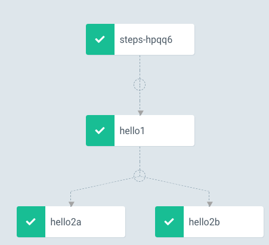

# Kubernetes 工作流引擎：Argo Workflow

[Argo](https://applatix.com/open-source/argo/) 是 [Applatix](https://applatix.com/) 推出的一个开源项目，为 `Kubernetes` 提供 `container-native`（工作流中的每个步骤是通过容器实现）工作流程。

**`Argo` 可以让用户用一个类似于传统的 `YAML` 文件定义的 `DSL` 来运行多个步骤的 `Pipeline`。**

该框架提供了复杂的循环、条件判断、依赖管理等功能，这有助于提高部署应用程序的灵活性以及配置和依赖的灵活性。

使用 Argo，用户可以定义复杂的依赖关系，以编程方式构建复杂的工作流、制品管理，可以将任何步骤的输出结果作为输入链接到后续的步骤中去，并且可以在可视化 UI 界面中监控调度的作业任务


 

## Argo 简介

`Argo V2` 版本通过 `Kubernetes CRD（Custom Resource Definition`）来进行实现的，所以我们可以通过 `kubectl` 工具来管理 `Argo` 工作流，当然就可以和其他 `Kubernetes` 资源对象直接集成了，比如 `Volumes`、`Secrets`、`RBAC` 等等。新版本的 `Argo` 更加轻量级，安装也十分简单，但是依然提供了完整的工作流功能，包括参数替换、制品、Fixture、循环和递归工作流等功能。

`Argo` 中的工作流自动化是通过使用 `ADSL`（Argo 领域特定语言）设计的 `YAML` 模板（因为 `Kubernetes` 主要也使用相同的 `DSL` 方式，所以非常容易使用）进行驱动的。

`ADSL` 中提供的每条指令都被看作一段代码，并与代码仓库中的源码一起托管。`Argo` 支持`6` 中不同的 `YAML` 结构：

* 容器模板：根据需要创建单个容器和参数
* 工作流模板：定义一个作业任务（工作流中的一个步骤可以是一个容器）
* 策略模板：触发或者调用作业/通知的规则
* 部署模板：创建一个长期运行的应用程序模板
* `Fixture` 模板：整合 Argo 外部的第三方资源
* 项目模板：可以在 Argo 目录中访问的工作流定义

`Argo` 支持几种不同的方式来定义 Kubernetes 资源清单：[Ksonnect](https://ksonnet.io/)、[Helm Chart](https://github.com/argoproj/argo-helm) 以及简单的 `YAML/JSON` 资源清单目录。

## 安装
安装 Argo 非常简单，首先当然需要一个 `Kubernetes` 集群（1.9+版本），`kubectl` 工具以及访问集群的 kubeconfig 文件（默认位于`~/.kube/config`）。


### Mac 系统：

```
$ brew install argoproj/tap/argo
```

### Linux 系统：

```
$ curl -sSL -o /usr/local/bin/argo https://github.com/argoproj/argo/releases/download/v2.2.1/argo-linux-amd64
chmod +x /usr/local/bin/argo
```

安装完成后，可以使用下面命令校验是否安装成功：

```
$ argo version
argo: v2.4.2
  BuildDate: 2019-10-21T18:39:52Z
  GitCommit: 675c66267f0c916de0f233d8101aa0646acb46d4
  GitTreeState: clean
  GitTag: v2.4.2
  GoVersion: go1.11.5
  Compiler: gc
  Platform: darwin/amd64
```

然后安装控制器和 UI 界面：

```
$ kubectl create ns argo
$ kubectl apply -n argo -f https://raw.githubusercontent.com/argoproj/argo/v2.4.2/manifests/install.yaml
customresourcedefinition.apiextensions.k8s.io/workflows.argoproj.io created
customresourcedefinition.apiextensions.k8s.io/workflowtemplates.argoproj.io created
serviceaccount/argo created
serviceaccount/argo-ui created
role.rbac.authorization.k8s.io/argo-role created
clusterrole.rbac.authorization.k8s.io/argo-aggregate-to-admin created
clusterrole.rbac.authorization.k8s.io/argo-aggregate-to-edit created
clusterrole.rbac.authorization.k8s.io/argo-aggregate-to-view created
clusterrole.rbac.authorization.k8s.io/argo-cluster-role created
clusterrole.rbac.authorization.k8s.io/argo-ui-cluster-role created
rolebinding.rbac.authorization.k8s.io/argo-binding created
clusterrolebinding.rbac.authorization.k8s.io/argo-binding created
clusterrolebinding.rbac.authorization.k8s.io/argo-ui-binding created
configmap/workflow-controller-configmap created
service/argo-ui created
deployment.apps/argo-ui created
deployment.apps/workflow-controller created
```
安装完成后，为了访问方便，我们将 `argo-ui` 改成 `NodePort` 类型的 `Service`（当然也可以创建 `Ingress` 对象通过域名进行访问):

```
$ kubectl get pods -n argo
NAME                                   READY   STATUS    RESTARTS   AGE
argo-ui-55c9c845f5-x2sz9               1/1     Running   0          119s
workflow-controller-7759d656c5-mwcn2   1/1     Running   0          119s

$ kubectl get svc -n argo
NAME      TYPE        CLUSTER-IP     EXTERNAL-IP   PORT(S)   AGE
argo-ui   ClusterIP   10.100.242.2   <none>        80/TCP    2m17s

$  kubectl edit svc argo-ui -n argo
service/argo-ui edited

$ kubectl get svc -n argo
NAME      TYPE       CLUSTER-IP     EXTERNAL-IP   PORT(S)        AGE
argo-ui   NodePort   10.100.242.2   <none>        80:32072/TCP   3m22s

$ kubectl get crd |grep argo
workflows.argoproj.io                    2019-12-06T09:00:00Z
workflowtemplates.argoproj.io            2019-12-06T09:00:00Z

$ kubectl api-versions |grep argo
argoproj.io/v1alpha1
```

 

到这里就证明 `Argo` 的基础环境就已经安装完成了。


## 基本的 Argo 工作流模板

**本篇文章中所有的`work-flow`模板都来自[`argo-example`](https://github.com/argoproj/argo/tree/master/examples)**

下面是一个非常简单的模板，

* 首先定义了一个工作流，创建一个带有两个容器的 `Pod`，其中一个容器带有 `curl` 命令，而另外一个容器是一个 `nginx sidecar` 容器，这里 `curl` 这个容器是“主”容器，用于轮询 `nginx sidecar` 容器，直到它准备好为请求提供服务为止。

 

将上面模板保存为名为 `argo-base-template.yaml` 的文件，然后可以使用 `argo` 命令来提交这个工作流：

```
apiVersion: argoproj.io/v1alpha1
kind: Workflow
metadata:
  generateName: sidecar-nginx-
spec:
  entrypoint: sidecar-nginx-example
  templates:
  - name: sidecar-nginx-example
    container:
      image: appropriate/curl
      command: [sh, -c]
      # Try to read from nginx web server until it comes up
      args: ["until `curl -G 'http://127.0.0.1/' >& /tmp/out`; do echo sleep && sleep 1; done && cat /tmp/out"]
    # Create a simple nginx web server
    sidecars:
    - name: nginx
      image: nginx:1.13
```

将上面模板保存为名为 `argo-base-template.yaml` 的文件，然后可以使用 `argo` 命令来提交这个工作流：

```
$ argo submit argo-base-template.yaml
Name:                sidecar-nginx-nd2fs
Namespace:           default
ServiceAccount:      default
Status:              Pending
Created:             Fri Dec 06 17:11:51 +0800 (now)

$ argo list
NAME                  STATUS    AGE   DURATION   PRIORITY
sidecar-nginx-nd2fs   Running   14s   14s        0
```

当然同样的我们可以直接使用 `kubectl` 来进行安装，但是 `Argo CLI` 提供了更强大的功能，比如 `YAML` 校验、参数传递、重试等等功能。


```
main:
    Container ID:  docker://a6e2c6e6085c8ae1983ab17d04945615a5c18a1c1d0709d35af57288d1a6a11c
    Image:         appropriate/curl
    Image ID:      docker-pullable://appropriate/curl@sha256:c8bf5bbec6397465a247c2bb3e589bb77e4f62ff88a027175ecb2d9e4f12c9d7
    Port:          <none>
    Host Port:     <none>
    Command:
      sh
      -c
    Args:
      until `curl -G 'http://127.0.0.1/' >& /tmp/out`; do echo sleep && sleep 1; done && cat /tmp/out
``` 

```
nginx:
    Container ID:   docker://6a15828baf37fcb24b3596323721f597efb42a24e12b524d8338a13549edc151
    Image:          nginx:1.13
    Image ID:       docker-pullable://nginx@sha256:b1d09e9718890e6ebbbd2bc319ef1611559e30ce1b6f56b2e3b479d9da51dc35
    Port:           <none>
    Host Port:      <none>
```

```
Container ID:  docker://b1fa7edf0b16f4b7c8147a45a2b4319f53e7b9c271526b41af9b2043dbdfb0c3
    Image:         argoproj/argoexec:v2.4.2
    Image ID:      docker-pullable://argoproj/argoexec@sha256:4e393daa6ed985cf680bcf0ecf04f7b0758940f0789505428331fcfe99cce06b
    Port:          <none>
    Host Port:     <none>
    Command:
      argoexec
```

```
Events:
  Type    Reason     Age    From                     Message
  ----    ------     ----   ----                     -------
  Normal  Scheduled  6m52s  default-scheduler        Successfully assigned default/sidecar-nginx-nd2fs to docker-desktop
  Normal  Pulling    6m51s  kubelet, docker-desktop  Pulling image "argoproj/argoexec:v2.4.2"
  Normal  Pulled     5m33s  kubelet, docker-desktop  Successfully pulled image "argoproj/argoexec:v2.4.2"
  Normal  Created    5m32s  kubelet, docker-desktop  Created container wait
  Normal  Started    5m32s  kubelet, docker-desktop  Started container wait
  Normal  Pulling    5m32s  kubelet, docker-desktop  Pulling image "appropriate/curl"
  Normal  Pulled     5m18s  kubelet, docker-desktop  Successfully pulled image "appropriate/curl"
  Normal  Created    5m18s  kubelet, docker-desktop  Created container main
  Normal  Started    5m18s  kubelet, docker-desktop  Started container main
  Normal  Pulling    5m18s  kubelet, docker-desktop  Pulling image "nginx:1.13"
  Normal  Pulled     4m32s  kubelet, docker-desktop  Successfully pulled image "nginx:1.13"
  Normal  Created    4m32s  kubelet, docker-desktop  Created container nginx
  Normal  Started    4m31s  kubelet, docker-desktop  Started container nginx
```

上面就是我们定义的一个工作流，创建一个 `Pod` 并执行 `Workflow` 中定义的配置：

### `Argo`通过`CRD`对象部署所以`Workflow`也可以通过`kubectl`工具来进行管理 

```
$ kubectl get workflows | grep sidecar-nginx
sidecar-nginx-nd2fs   15m
```
```
$ kubectl get pods | grep sidecar-nginx
sidecar-nginx-nd2fs                    0/3     Completed   0          15m
```

### `Argo Cli`可以用来获职`workflow`的相关信息有些特性是`kubectl`工具不具备的 

```
$ argo get sidecar-nginx-nd2fs
Name:                sidecar-nginx-nd2fs
Namespace:           default
ServiceAccount:      default
Status:              Succeeded
Created:             Fri Dec 06 17:11:51 +0800 (20 minutes ago)
Started:             Fri Dec 06 17:11:51 +0800 (20 minutes ago)
Finished:            Fri Dec 06 17:14:13 +0800 (18 minutes ago)
Duration:            2 minutes 22 seconds

STEP                                            PODNAME              DURATION  MESSAGE
 ✔ sidecar-nginx-nd2fs (sidecar-nginx-example)  sidecar-nginx-nd2fs  2m 
```

```
$ argo logs sidecar-nginx-nd2fs
sleep
sleep

  % Total    % Received % Xferd  Average Speed   Time    Time     Time  Current
                                 Dload  Upload   Total   Spent    Left  Speed
  0     0    0     0    0     0      0      0 --:--:-- --:--:-- --:--:--     0<!DOCTYPE html>
<html>
<head>
<title>Welcome to nginx!</title>
<style>
    body {
        width: 35em;
        margin: 0 auto;
        font-family: Tahoma, Verdana, Arial, sans-serif;
    }
</style>
</head>
<body>
<h1>Welcome to nginx!</h1>
<p>If you see this page, the nginx web server is successfully installed and
working. Further configuration is required.</p>
<p>For online documentation and support please refer to
<a href="http://nginx.org/">nginx.org</a>.<br/>
Commercial support is available at
<a href="http://nginx.com/">nginx.com</a>.</p>
<p><em>Thank you for using nginx.</em></p>
</body>
</html>
100   612  100   612    0     0   597k      0 --:--:-- --:--:-- --:--:--  597k
```

同样可以通过`argo logs`查看容器日志，也可以通过 `argo-ui` 在页面上查看相关信息：


## 带条件的工作流模板


前面我们提到过 `Argo` 支持工作流执行过程中的条件语句。`Argo` 提供的 [`Coinflip`](https://raw.githubusercontent.com/argoproj/argo/master/examples/coinflip.yaml) 示例就描述了如何在模板中使用`“when”`，其执行依赖于从父级接收的输出。


将 Coinflip 保存到本地：


```
$ wget https://raw.githubusercontent.com/argoproj/argo/master/examples/coinflip.yaml
```


上面的 `Worflow` 运行一个随机的整数脚本，常量为 `0=heads`、`1=tails`，调用特定模板（`heads` 或者 `tails`）取决于`“flip-coin”`任务的输出，如上面 `Workflow` 图中所示，`flip-coin` 任务执行 `heads` 任务只有当 `heads` 模板被执行的时候。

同样，使用`argo submit`来提交 `Coinflip` 这个 `Workflow`：

```
# The coinflip example combines the use of a script result,
# along with conditionals, to take a dynamic path in the
# workflow. In this example, depending on the result of the
# first step, 'flip-coin', the template will either run the
# 'heads' step or the 'tails' step.
apiVersion: argoproj.io/v1alpha1
kind: Workflow
metadata:
  generateName: coinflip-
spec:
  entrypoint: coinflip
  templates:
  - name: coinflip
    steps:
    - - name: flip-coin
        template: flip-coin
    - - name: heads
        template: heads
        when: "{{steps.flip-coin.outputs.result}} == heads"
      - name: tails
        template: tails
        when: "{{steps.flip-coin.outputs.result}} == tails"

  - name: flip-coin
    script:
      image: python:alpine3.6
      command: [python]
      source: |
        import random
        result = "heads" if random.randint(0,1) == 0 else "tails"
        print(result)

  - name: heads
    container:
      image: alpine:3.6
      command: [sh, -c]
      args: ["echo \"it was heads\""]

  - name: tails
    container:
      image: alpine:3.6
      command: [sh, -c]
      args: ["echo \"it was tails\""]
```

```
$ argo submit coinflip.yaml
Name:                coinflip-9rqsz
Namespace:           default
ServiceAccount:      default
Status:              Pending
Created:             Fri Dec 06 17:48:18 +0800 (now)
```

```
$  argo get coinflip-9rqsz
Name:                coinflip-9rqsz
Namespace:           default
ServiceAccount:      default
Status:              Succeeded
Created:             Fri Dec 06 17:48:18 +0800 (1 minute ago)
Started:             Fri Dec 06 17:48:18 +0800 (1 minute ago)
Finished:            Fri Dec 06 17:49:33 +0800 (3 seconds ago)
Duration:            1 minute 15 seconds

STEP                          PODNAME                    DURATION  MESSAGE
 ✔ coinflip-9rqsz (coinflip)                                       
 ├---✔ flip-coin (flip-coin)  coinflip-9rqsz-1325807784  53s       
 └-·-○ heads (heads)                                               when 'tails == heads' evaluated false
   └-✔ tails (tails)          coinflip-9rqsz-1049702265  18s
```

**可能看到这里出现了一个权限错误，`Argo` 官网上给出的解决方案是给 `default:default` 绑定上 `admin` 的 `clusterrole` 权限**：

```
$ kubectl create rolebinding default-admin --clusterrole=admin --serviceaccount=default:default
```

上面的 `Workflow` 将会创建两个容器，一个是用于执行 `randomint python` 脚本，另外一个是用于根据脚本的执行结果执行的 `tails` 模板，如下所示，`tails` 模板根据 `randomint` 脚本的结果（`result==tails`）被调用执行了：


类似地，递归（递归调用模板）也可以添加到条件规范中，例如，下面的模板输出显示 `flip-coin` 模板执行 `n` 次，直到结果为 `heads` 为止，下载 `flip-coin` 递归模板示例：

```
$ wget https://raw.githubusercontent.com/argoproj/argo/master/examples/coinflip-recursive.yaml
```

我们可以简单对比下前面的 `coinflip`，基本上是一致的，唯一的区别就是 `tails` 模板重新指向了 `coinflip`，这样就形成了递归：

```
spec:
  entrypoint: coinflip
  templates:
  - name: coinflip
    steps:
    - - name: flip-coin
        template: flip-coin
    - - name: heads
        template: heads
        when: "{{steps.flip-coin.outputs.result}} == heads"
      - name: tails
        template: coinflip  # 递归重新调用`coin-flip`
        when: "{{steps.flip-coin.outputs.result}} == tails"
```


然后用同样的方法来提交这个 `Workflow`，可以通过`argo get`命令来查看具体的执行步骤：

```
$ argo submit coinflip-recursive.yaml 
Name:                coinflip-recursive-c75sz
Namespace:           default
ServiceAccount:      default
Status:              Pending
Created:             Sat Dec 07 16:41:30 +0800 (now)
```

```
$ argo list
NAME                       STATUS      AGE   DURATION   PRIORITY
coinflip-recursive-wgzbv   Succeeded   1m    8s         0
coinflip-recursive-k9ggd   Succeeded   2m    8s         0
coinflip-recursive-c75sz   Succeeded   4m    8s         0
coinflip-wqbrx             Succeeded   22h   9s         0
sidecar-nginx-nd2fs        Succeeded   23h   2m         0
```

```
$ $ argo get coinflip-recursive-wgzbv
Name:                coinflip-recursive-wgzbv
Namespace:           default
ServiceAccount:      default
Status:              Succeeded
Created:             Sat Dec 07 16:45:23 +0800 (1 minute ago)
Started:             Sat Dec 07 16:45:23 +0800 (1 minute ago)
Finished:            Sat Dec 07 16:45:31 +0800 (1 minute ago)
Duration:            8 seconds

STEP                                    PODNAME                              DURATION  MESSAGE
 ✔ coinflip-recursive-wgzbv (coinflip)                                                 
 ├---✔ flip-coin (flip-coin)            coinflip-recursive-wgzbv-3900331486  3s        
 └-·-✔ heads (heads)                    coinflip-recursive-wgzbv-2459748331  1s        
   └-○ tails (coinflip)                                                                when 'heads == tails' evaluated false
```

```
$ argo get coinflip-recursive-mtmf4
Name:                coinflip-recursive-mtmf4
Namespace:           default
ServiceAccount:      default
Status:              Succeeded
Created:             Sat Dec 07 16:47:46 +0800 (15 seconds ago)
Started:             Sat Dec 07 16:47:46 +0800 (15 seconds ago)
Finished:            Sat Dec 07 16:47:59 +0800 (2 seconds ago)
Duration:            13 seconds

STEP                                    PODNAME                              DURATION  MESSAGE
 ✔ coinflip-recursive-mtmf4 (coinflip)                                                 
 ├---✔ flip-coin (flip-coin)            coinflip-recursive-mtmf4-4173752028  3s        
 └-·-○ heads (heads)                                                                   when 'tails == heads' evaluated false
   └-✔ tails (coinflip)                                                                
     ├---✔ flip-coin (flip-coin)        coinflip-recursive-mtmf4-3226824600  3s        
     └-·-✔ heads (heads)                coinflip-recursive-mtmf4-1895599153  2s        
       └-○ tails (coinflip)                                                            when 'heads == tails' evaluated false
```


```
$ kubectl get pods
NAME                                   READY   STATUS      RESTARTS   AGE
coinflip-recursive-9dpxn-1771762865    0/2     Completed   0          8m33s
coinflip-recursive-9dpxn-177901715     0/2     Completed   0          8m26s
coinflip-recursive-9dpxn-3162439927    0/2     Completed   0          8m41s
coinflip-recursive-9dpxn-3886219258    0/2     Completed   0          8m19s
coinflip-recursive-9dpxn-545668525     0/2     Completed   0          8m49s
```

同样可以在 `argo-ui` 中查看这个 `Workflow` 的调用示意图：


## 带循环和参数的 Workflow 模板


`Argo` 可以很方便的迭代 `Workflow` 中的一组输入，也可以处理用户提供参数（比如：输入参数）。

在下面的 `Workflow` 中，使用两个输入参数`“hello kubernetes”`和`“hello argo”`来执行 `Whalesay` 模板。


下载这里我们需要使用的 Workflow 示例：


```
$ wget https://raw.githubusercontent.com/argoproj/argo/master/examples/loops.yaml
```

不过需要注意，我们需要把 `loops.yaml` 文件里面的 `withItems` 修改成下面的参数值：

```
...
withItems:
- hello kubernetes
- hello argo
...
```

完整的 YAML 文件内容如下所示：


上面的模板包含一个单独的模板，通过使用一个 `items` 列表并根据提供的参数值数量来运行任务，所以，会创建两个 `Pod`，

* 一个使用“hello kubernetes”参数，
* 另外一个使用“hello argo”参数，

同样使用`argo submit`命令来创建这个 Workflow：

```
$ argo submit loops.yaml
Name:                loops-sq4th
Namespace:           default
ServiceAccount:      default
Status:              Pending
Created:             Sat Dec 07 16:56:19 +0800 (now)
```

使用`argo get`命令来查看这个` Workflow` 的详细信息，可以看到迭代了两个步骤出来，当然就会产生两个 `Pod`：

```
$ argo get loops-sq4th
Name:                loops-sq4th
Namespace:           default
ServiceAccount:      default
Status:              Succeeded
Created:             Sat Dec 07 16:56:19 +0800 (1 minute ago)
Started:             Sat Dec 07 16:56:19 +0800 (1 minute ago)
Finished:            Sat Dec 07 16:57:54 +0800 (1 second ago)
Duration:            1 minute 35 seconds

STEP                                                 PODNAME                 DURATION  MESSAGE
 ✔ loops-sq4th (loop-example)                                                          
 └-·-✔ print-message(0:hello kubernetes) (whalesay)  loops-sq4th-1668910395  1m        
   └-✔ print-message(1:hello argo) (whalesay)        loops-sq4th-4209019955  1m 
```


我们去查看生成的两个 Pod 的日志信息，里面就包含上面的传入的两个参数`“hello kubernetes”`和`“hello argo”`的信息：

 


类似的我们还可以完成更加复杂的循环：循环迭代一组 items，动态生成 items 列表等，具体的实现我们直接查看 Argo GitHub 仓库上面提供的 example 样例：[https://github.com/argoproj/argo/blob/master/examples/](https://github.com/argoproj/argo/blob/master/examples/)。


## 由 DAG（有向无环图）和步骤的依赖定义的多步骤工作流模板

Argo 允许用户使用简单的 `Python `对象 `DAG` 启动多步骤的 `Pipeline`，还可以在工作流规范中定义多个模板（嵌套工作流）。

下载使用的示例文件：

```
$ wget https://raw.githubusercontent.com/argoproj/argo/master/examples/dag-diamond.yaml
```

`Workflow` 更详细的内容如下所示：


接下来我们来提交这个 `Workflow`：

```
$ argo submit dag-diamond.yaml
Name:                dag-diamond-pqdq6
Namespace:           default
ServiceAccount:      default
Status:              Pending
Created:             Sat Dec 07 17:05:01 +0800 (now)
```

```
$ argo get dag-diamond-pqdq6
Name:                dag-diamond-pqdq6
Namespace:           default
ServiceAccount:      default
Status:              Succeeded
Created:             Sat Dec 07 17:05:01 +0800 (2 minutes ago)
Started:             Sat Dec 07 17:05:01 +0800 (2 minutes ago)
Finished:            Sat Dec 07 17:05:28 +0800 (1 minute ago)
Duration:            27 seconds

STEP                            PODNAME                       DURATION  MESSAGE
 ✔ dag-diamond-pqdq6 (diamond)                                          
 ├-✔ A (echo)                   dag-diamond-pqdq6-2014305344  18s       
 ├-✔ B (echo)                   dag-diamond-pqdq6-2064638201  2s        
 ├-✔ C (echo)                   dag-diamond-pqdq6-2047860582  3s        
 └-✔ D (echo)                   dag-diamond-pqdq6-2098193439  1s
 
```
 


### Multi-Step Workflow using Steps

Similarly Steps can be used to define a multi-step workflow, the example below comprise two templates hello-hello-hello and whalesay (nested workflow).


下载使用的示例文件：

```
wget https://raw.githubusercontent.com/argoproj/argo/master/examples/steps.yaml
```


```
$ argo submit steps.yaml 
Name:                steps-hpqq6
Namespace:           default
ServiceAccount:      default
Status:              Pending
Created:             Sat Dec 07 17:14:43 +0800 (now)
```

```
 argo get steps-hpqq6
Name:                steps-hpqq6
Namespace:           default
ServiceAccount:      default
Status:              Succeeded
Created:             Sat Dec 07 17:14:43 +0800 (38 seconds ago)
Started:             Sat Dec 07 17:14:43 +0800 (38 seconds ago)
Finished:            Sat Dec 07 17:15:12 +0800 (9 seconds ago)
Duration:            29 seconds

STEP                                PODNAME                 DURATION  MESSAGE
 ✔ steps-hpqq6 (hello-hello-hello)                                    
 ├---✔ hello1 (whalesay)            steps-hpqq6-3320933754  9s        
 └-·-✔ hello2a (whalesay)           steps-hpqq6-3049184131  9s        
   └-✔ hello2b (whalesay)           steps-hpqq6-3065961750  17s
```



