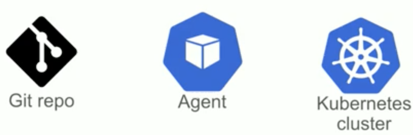

# What is GitOps 

* Your desired software system is **described by files in Git** 
* An agent ensures the live system is in the same state as Git 

### GitOps Components



### Useful 

* Manifest generation tool 
* CI system 
* A way to group Kubernetes resources 

### Why GitOps? 

* Single source of truth 
* Security, compliance, and auditing 
* Developer centric 
* Trivialises rollback 
* Declarative 
* Observable - detect configuration drift 
* Velocity 


## Poor Man's GitOps

[https://github.com/gitops-workshop/poor-mans-gitops](https://github.com/gitops-workshop/poor-mans-gitops)

### 1. Build The Agent

```
$ cd gitops
$ docker build -t my-agent:v1 agent
```
```
$ docker build -t my-agent:v1 agent
Sending build context to Docker daemon  4.096kB
Step 1/4 : FROM alpine:latest
 ---> e7d92cdc71fe
Step 2/4 : RUN apk update && apk add --no-cache git gettext
 ---> Using cache
 ---> 2d630b17a43d
Step 3/4 : ADD https://storage.googleapis.com/kubernetes-release/release/v1.6.4/bin/linux/amd64/kubectl /usr/local/bin/kubectl
Downloading [==================================================>]   70.7MB/70.7MB

 ---> 6084ec6bb7a4
Step 4/4 : RUN chmod +x /usr/local/bin/kubectl
 ---> Running in e2c393198530
Removing intermediate container e2c393198530
 ---> 0da45cfd66a2
Successfully built 0da45cfd66a2
Successfully tagged my-agent:v1
```

### 2. Install The Agent

```
kubectl -n default apply -f agent/install.yaml
```

Wait for the agent to apply your manifests:

```
$ kuebctl get cj 
$ kubectl get pods | grep git
```

### Clean-Up

```
kubectl -n default delete -f agent/install.yaml
kubectl -n default delete pod my-app
```


### Poor Man's GitOps: Problems 

* Security
* Observability 
* Impact 
* Latency 
* Single tenancy 