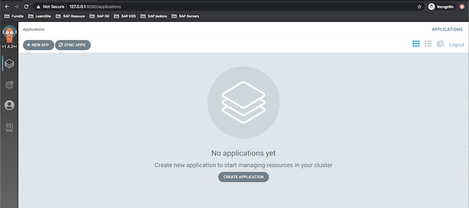

# 5.Install Argocd 

[Install Argocd](https://argoproj.github.io/argo-cd/getting_started/)

```
kubectl port-forward svc/argocd-server -n argocd 8080:443
```

The initial password is autogenerated to be the **pod name of the Argo CD** API server. This can be retrieved with the command:

```
$ kubectl get pods -n argocd -l app.kubernetes.io/name=argocd-server -o name | cut -d'/' -f 2
argocd-server-84b4bb5dd5-9vnf6
```

### Update argocd password with command line

```
argocd login <ARGOCD_SERVER>
argocd login argocd-server-84b4bb5dd5-9vnf6
FATA[0000] dial tcp: lookup argocd-server-84b4bb5dd5-9vnf6 on 10.33.139.58:53: no such host 


# Bash one
$ kubectl port-forward svc/argocd-server -n argocd 8080:443

# Bash two
$ argocd login localhost:8080 
WARNING: server certificate had error: x509: certificate signed by unknown authority. Proceed insecurely (y/n)? y
Username: admin
Password: 
'admin' logged in successfully
Context 'localhost:8080' updated

$ argocd account update-password
*** Enter current password: 
*** Enter new password: admin
*** Confirm new password: admin
Password updated
Context 'localhost:8080' updated

$ argocd logout localhost:8080
Logged out from 'localhost:8080'
```

* New username: **admin**
* New password: **admin**

```
https://127.0.0.1:8080/
```

