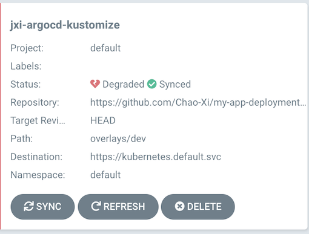

# ArgoCD with Kustomize


## Reference: 

* [Hands-On: GitOps with Kustomize and Argo CD](https://github.com/Chao-Xi/my-app-deployment)
* [使用 Kustomize 配置 Kubernetes 应用](https://github.com/Chao-Xi/JacobTechBlog/blob/master/k8s_tutorial/k8s_adv72_Kustomize.md)

## Hands-On

### 1. Install Kustomize

```
$ brew install kustomize

$ kustomize version
{Version:3.5.4 GitCommit:3af514fa9f85430f0c1557c4a0291e62112ab026 BuildDate:2020-01-17T14:23:25+00:00 GoOs:darwin GoArch:amd64}
```

### 2. Fork The Example Repo

* Open [https://github.com/gitops-workshop/my-app-deployment](https://github.com/gitops-workshop/my-app-deployment)
* Click “Fork”.

### 3. Clone the Fork

```
git clone https://github.com/Chao-Xi/my-app-deployment.git
cd my-app-deployment
```

### 4. Build The Base

```
$ kustomize build base
apiVersion: v1
kind: Pod
metadata:
  name: my-app
spec:
  containers:
  - image: gitopsworkshop/my-app:v1
    imagePullPolicy: IfNotPresent
    name: main
```

### 5. Create An Overlay

```
$ mkdir -p overlays/dev
$ touch overlays/dev/kustomization.yaml

apiVersion: kustomize.config.k8s.io/v1beta1
kind: Kustomization
resources:
  - ../../base
```

```
$ tree .
.
├── README.md
├── base
│   ├── kustomization.yaml
│   └── my-app.yaml
└── overlays
    └── dev
        └── kustomization.yaml

3 directories, 4 files
```

```
$ kustomize build overlays/dev
apiVersion: v1
kind: Pod
metadata:
  name: my-app
spec:
  containers:
  - image: gitopsworkshop/my-app:v1
    imagePullPolicy: IfNotPresent
    name: main
```

### 6. Change The Name Prefix

```
$ cd overlays/dev

# Sets the nameprefix field
# kustomize edit set nameprefix <prefix-value>

$ kustomize edit set nameprefix jxi-test-

apiVersion: kustomize.config.k8s.io/v1beta1
kind: Kustomization
resources:
- ../../base
namePrefix: jxi-test-
```

```
$ git diff
diff --git a/overlays/dev/kustomization.yaml b/overlays/dev/kustomization.yaml
index a227ac4..dc20023 100644
--- a/overlays/dev/kustomization.yaml
+++ b/overlays/dev/kustomization.yaml
@@ -1,4 +1,5 @@
 apiVersion: kustomize.config.k8s.io/v1beta1
 kind: Kustomization
 resources:
-  - ../../base
\ No newline at end of file
+- ../../base
+namePrefix: jxi-test-
```

```
$ kustomize build
apiVersion: v1
kind: Pod
metadata:
  name: jxi-test-my-app
spec:
  containers:
  - image: gitopsworkshop/my-app:v1
    imagePullPolicy: IfNotPresent
    name: main
```
```
$ git commit -am "set name prefix"
[master 583feb8] set name prefix
 1 file changed, 2 insertions(+), 1 deletion(-)

$ git push
```

### 7. Open Argo CD And Create Your App

```
$ kubectl port-forward svc/argocd-server -n argocd 8080:443
Forwarding from 127.0.0.1:8080 -> 8080
Forwarding from [::1]:8080 -> 8080
```

* Click "New application"


| Field | Value |
|-------|-------|
| Application name: | `${username}`(`jxi-argocd-kustomize`) |
| Project: | `default` |
| Sync policy: | `Manual` |
| Repository: | `https://github.com/${username}/my-app-deployment` |
| Revision: | `HEAD` |
| Path: | `overlays/dev` |
| Cluster: | `https://kubernetes.default.svc` |
| Namespace: | `default` |

* **MANIFEST**

```
apiVersion: argoproj.io/v1alpha1
kind: Application
metadata:
  name: jxi-argocd-kustomize
spec:
  destination:
    namespace: default
    server: 'https://kubernetes.default.svc'
  source:
    path: overlays/dev
    repoURL: 'https://github.com/Chao-Xi/my-app-deployment.git'
    targetRevision: HEAD
  project: default
  syncPolicy: null
```

```
$ argocd login localhost:8080
WARNING: server certificate had error: x509: certificate signed by unknown authority. Proceed insecurely (y/n)? y
Username: admin
Password: 
'admin' logged in successfully
Context 'localhost:8080' updated


$ argocd app get  jxi-argocd-kustomize
Name:               jxi-argocd-kustomize
Project:            default
Server:             https://kubernetes.default.svc
Namespace:          default
URL:                https://localhost:8080/applications/jxi-argocd-kustomize
Repo:               https://github.com/Chao-Xi/my-app-deployment.git
Target:             HEAD
Path:               overlays/dev
SyncWindow:         Sync Allowed
Sync Policy:        <none>
Sync Status:        OutOfSync from HEAD (31d4714)
Health Status:      Missing

GROUP  KIND  NAMESPACE  NAME             STATUS     HEALTH   HOOK  MESSAGE
       Pod   default    jxi-test-my-app  OutOfSync  Missing        pod/jxi-test-my-app unchanged
```

### 8. Sync Your App

* Click "Sync".


```
argocd app sync jxi-argocd-kustomize
```

* Click "Synchronize" in the Sliding panel.


**Check Cluster**

```
$ kubectl get pod | grep jxi-test
jxi-test-my-app     1/1     Running     0          2m51s
```


### 9. Upgrade Your App


```
$ kustomize edit set image gitopsworkshop/my-app:v2

$ git diff
diff --git a/overlays/dev/kustomization.yaml b/overlays/dev/kustomization.yaml
index dc20023..8b062e5 100644
--- a/overlays/dev/kustomization.yaml
+++ b/overlays/dev/kustomization.yaml
@@ -3,3 +3,6 @@ kind: Kustomization
 resources:
 - ../../base
 namePrefix: jxi-test-
+images:
+- name: gitopsworkshop/my-app
+  newTag: v2

$ kustomize build
apiVersion: v1
kind: Pod
metadata:
  name: jxi-test-my-app
spec:
  containers:
  - image: gitopsworkshop/my-app:v2  # Not exist 
    imagePullPolicy: IfNotPresent
    name: main
```

```
$ git commit -am "upgrade to version 2"
$ git push
```

* Detect git changes: "Refresh"
* Preview Differences: **"App Diff"**


* Deploy New Version: **"Sync"**



### 10. Troubleshoot Degraded App

1. Open app
2. Find the red heart
3. Check the event why the error


4. Clik on the resource and check each tab


### 11. Emergency Rollback

* Click "History And Rollback"
* Click "..." button in the last row
* Click "Rollback"
* Click "Ok" in the modal panel


### 12. GitOps Rollback

```
git revert $(git rev-parse HEAD)
git push
```


```
$ kubectl get pod | grep jxi-test
jxi-test-my-app                             1/1     Running     6          143m
```

### Clean up

```
$ kubectl delete pod jxi-test-my-app
pod "jxi-test-my-app" deleted
```
