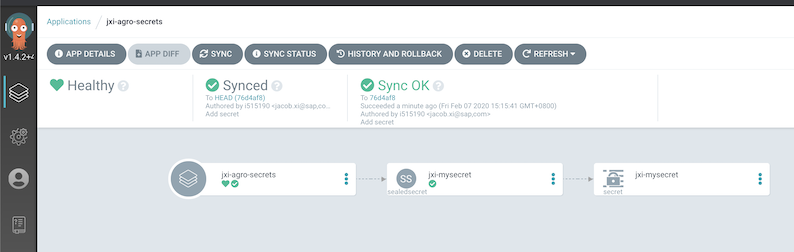
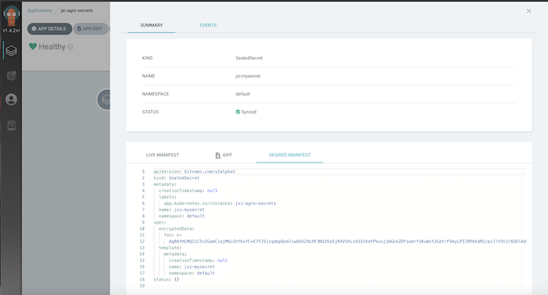
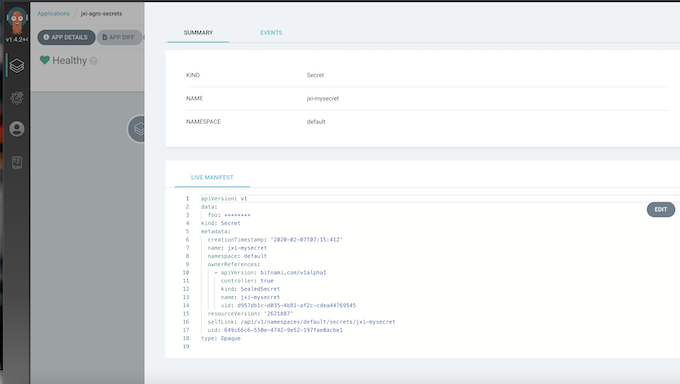

# ArgoCD with Sealed Secrets

## Reference

* [sealed-secrets, 一种Kubernetes控制器和一种加密密钥](https://github.com/Chao-Xi/JacobTechBlog/blob/master/k8s_dev/sealed-secrets/sealed-secrets.md)
* [Hand-On: Sealed Secrets](https://github.com/gitops-workshop/secrets)

### (Optional) Install Sealed Secrets with ArgoCD


```
argocd app create sealed-secrets --repo https://kubernetes-charts.storage.googleapis.com --helm-chart sealed-secrets --revision '1.5.0' --dest-server https://kubernetes.default.svc --dest-namespace kube-system 
argocd app sync sealed-secrets
```


```
brew install kubeseal
```

## Seal The Secret with ArgoCD

### Create Secret


```
$ cd argo-secrets/
echo -n bar | kubectl create secret generic jxi-mysecret --dry-run --from-file=foo=/dev/stdin -o json > mysecret.json
```

**mysecret.json**

```
{
    "kind": "Secret",
    "apiVersion": "v1",
    "metadata": {
        "name": "jxi-mysecret",
        "creationTimestamp": null
    },
    "data": {
        "foo": "YmFy"
    }
}
```

### Seal The Secret

```
$ cat mysecret.json | kubeseal > mysealedsecret.json
```

**mysealedsecret.json**

```
{
  "kind": "SealedSecret",
  "apiVersion": "bitnami.com/v1alpha1",
  "metadata": {
    "name": "jxi-mysecret",
    "namespace": "default",
    "creationTimestamp": null
  },
  "spec": {
    "template": {
      "metadata": {
        "name": "jxi-mysecret",
        "namespace": "default",
        "creationTimestamp": null
      }
    },
    "encryptedData": {
      "foo": "AgBAYHLMQZiC5nZGamCiqjMbLGhfbvYC+E7fJ5isqdepQomlcwQVk29LHF3N1U5aSjR4VShLim3ZnXeFPVusj1mGLkZDFswdrfsKuWztJGetrF9eyLPIJRPbkdRS/pillt5hJ/6UOlAdpd/IbRJ6oIQ3CuB4iIrIuP9/T1vmbkwTjZD1iypwvS4ZML8iHr3KlGPRY+4Dfo4uFalQMKy69vvzyuF5pffgFkTt0831f28j5cXLThvC7x2skKGd/KCBrrSsPAlbuYcZWLE6k7zBqWLZr6WAOYlCdbNaOPBMBnhqtPMeTA68smkPfnZCPgqNnXNKkVVVneg5mqdYjrVIwpRxtYVBMpvuNl7VXjVwFAT+g34OySVOw94JFTNywoea8viX8QK1wjV7eDa230dwn6h8K9zFaAUCu4VqRtqrbrGRk3RHytRE7jLrNyDRHJ0CqVKopMfSXx86GHfSE45BRQpTOeyPRQmlMUDGX+djiNy6JQEjD93usGTYnvmLdTCLW168QBkzxGO2hfaq10mkHp5mcw6Z8cIEuGF7rb6rF90KiY4V+Bo81HyOwePsFdcT3/XNM5BtHXxVzjskWEIfPd1fbpiMmFZoNL1mj2f7zg3JULQFb5Ut7WlupE6NlPncDCOtGGhLx2dp4qtMQOqVdFB7BL7OvL4W68vcoL46Y4xHzUm70JZHipqH3mM6Oho+5GOIzD0="
    }
  },
  "status": {
    
  }
}
```

### Delete The Un-Sealed Secret

```
rm mysecret.json
```

### Commit The Change

```
$ git add mysealedsecret.json
$ git commit -am 'Add secret'
```

### Create An App

```
argocd app create jxi-agro-secrets --repo https://github.com/chao-xi/arog-secrets.git --path . --revision HEAD --dest-server https://kubernetes.default.svc --dest-namespace default
```

* `argocd app create -h`: Create an application
* `Create a directory app`
  *  `--repo`: Repository URL, ignored if a file is set
  *  `--path`: Path in repository to the app directory, ignored if a file is set
  *  `--revision HEAD`: The tracking source branch, tag, commit or Helm chart version the application will sync to
  *  `--dest-server string`: K8s cluster URL (e.g. https://kubernetes.default.svc)
  *  `--dest-namespace string`: K8s target namespace


```
$ argocd app create jxi-agro-secrets --repo https://github.com/chao-xi/argo-secrets
.git --path . --revision HEAD --dest-server https://kubernetes.default.svc --dest-namespace default
application 'jxi-agro-secrets' created

$ argocd app sync jxi-agro-secrets
TIMESTAMP                  GROUP              KIND     NAMESPACE                  NAME    STATUS    HEALTH        HOOK  MESSAGE
2020-02-07T15:15:41+08:00  bitnami.com  SealedSecret     default          jxi-mysecret  OutOfSync  Missing              

Name:               jxi-agro-secrets
Project:            default
Server:             https://kubernetes.default.svc
Namespace:          default
URL:                https://localhost:8080/applications/jxi-agro-secrets
Repo:               https://github.com/chao-xi/argo-secrets.git
Target:             HEAD
Path:               .
SyncWindow:         Sync Allowed
Sync Policy:        <none>
Sync Status:        Synced to HEAD (76d4af8)
Health Status:      Healthy

Operation:          Sync
Sync Revision:      76d4af8cfadb8acf1e657a776fad87ecacb15cbc
Phase:              Succeeded
Start:              2020-02-07 15:15:41 +0800 CST
Finished:           2020-02-07 15:15:41 +0800 CST
Duration:           0s
Message:            successfully synced (all tasks run)

GROUP        KIND          NAMESPACE  NAME          STATUS  HEALTH  HOOK  MESSAGE
bitnami.com  SealedSecret  default    jxi-mysecret  Synced                sealedsecret.bitnami.com/jxi-mysecret created
```

Open the UI to observe the created secret, or use CLI:

```
$ kubectl -n default get secrets -o yaml 
```



* **Sealed Secrets**



* **Unsealed Secrets**



### Clean-Up

```
argocd app delete ${username}-secrets
argocd app delete sealed-secrets
```