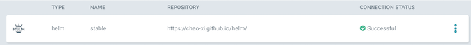

# ArgoCD with Helm Repo and Helm Package

## Reference

* [Helm Package and Helm Repo](https://github.com/Chao-Xi/helm)
* [argocd-example-apps](https://github.com/argoproj/argocd-example-apps)

### Helm Install(Optional) 

```
brew install kubernetes-helm
helm init --client-only
```

## Helm Repo and Helm Package

### Fork and Clone This Git Repo

**Click the fork button**

```
git clone https://github.com/Chao-Xi/helm.git
```

### Template Your App

```
cd my-app
helm template .
---
# Source: my-app/templates/my-app.yaml
apiVersion: v1
kind: Pod
metadata:
    name: gitops-workshop--my-app
spec:
    containers:
        - name: main
          image: alexcollinsintuit/my-app:v1
          imagePullPolicy: IfNotPresent
          env:
              - name: GREETING
                value: "Hello Helm!"
                


$ helm template . --set greeting='Hi KubeCon' 
---
# Source: my-app/templates/my-app.yaml
apiVersion: v1
kind: Pod
metadata:
    name: jxi-argocd-helm--my-app
spec:
    containers:
        - name: main
          image: alexcollinsintuit/my-app:v1
          imagePullPolicy: IfNotPresent
          env:
              - name: GREETING
                value: "Hi KubeCon"
```

### Package Your App

```
$ cd ..
$ helm package my-app --version 1.0.0
Successfully packaged chart and saved it to: /Users/i515190/Devops_sap/k8s_dev/argo/argocd/helm/my-app-1.0.0.tgz
```

* **helm repo index**:  Generate an index file given a directory containing packaged charts

```
helm repo index .            
```

**index.yaml**

```
apiVersion: v1
entries:
  my-app:
  - apiVersion: v1
    created: "2020-02-07T17:59:40.638497+08:00"
    digest: a41859b38c527895163caf8188ea8618fb3e0bd2fc1a250bef406b8eac08a62c
    icon: https://avatars2.githubusercontent.com/u/56983333?s=200&v=4
    name: my-app
    urls:
    - my-app-1.0.0.tgz
    version: 1.0.0
generated: "2020-02-07T17:59:40.637194+08:00"
```

### Publish You App

```
git add index.yaml *.tgz
git commit -m "Publish"
git push
```

### Open Github and enable website

[https://github.com/Chao-Xi/helm/settings](https://github.com/Chao-Xi/helm/settings)


Your site is published at [https://chao-xi.github.io/helm/](https://chao-xi.github.io/helm/)


### Fetch You App From The Repo

`helm repo add gitops-workshop https://${username}.github.io/helm/`

```
$  helm repo add argocd-helm https://chao-xi.github.io/helm/
"argocd-helm" has been added to your repositories

$ helm repo list
NAME            URL                                             
stable          https://kubernetes-charts.storage.googleapis.com
local           http://127.0.0.1:8879/charts                    
loki            https://grafana.github.io/loki/charts           
argocd-helm     https://chao-xi.github.io/helm/ 

$ helm fetch argocd-helm/my-app
# Which will download `my-app-1.0.0.tgz`
```

## ArgoCD with Helm

**Repositories -> Connect Repo Using HTTPs**


* Type: Helm
* NAME: Stable
* REPOSITORY: https://chao-xi.github.io/helm/




### Create App with Helm Repo

* Repo: https://chao-xi.github.io/helm/
* Chart: My-app
* Version: 1.0.0
* Clsuter: `https://kubernetes.default.svc`
* Namespace: Default

### Click "Sync" and "Synchronize"


```
$ kubectl get pods |  grep jxi-argocd-helm-my-app
jxi-argocd-helm-my-app     1/1     Running     0          44s
```

## Helm hooks with argocd

* name: **argocd-helm-hooks**
* https://github.com/argoproj/argocd-example-apps
* TARGET REVISION: HEAD
* PATH: helm-hooks
* NAMESPACE: default
* CLUSTER: in-cluster (https://kubernetes.default.svc)
* PROJECT: default

### `helm-hooks/manifests.yaml`

```
---
apiVersion: batch/v1
kind: Job
metadata:
  generateName: upgrade-sql-schema
  annotations:
    helm.sh/hook: pre-install
    helm.sh/hook-weight: "-2"
spec:
  template:
    spec:
      containers:
        - name: upgrade-sql-schema
          image: alpine:latest
          command: ["sleep", "5"]
      restartPolicy: Never
---
apiVersion: batch/v1
kind: Job
metadata:
  name: maint-page-up
  annotations:
    helm.sh/hook: pre-install
    helm.sh/hook-delete-policy: before-hook-creation
    helm.sh/hook-weight: "-1"
spec:
  template:
    spec:
      containers:
        - name: page-up
          image: alpine:latest
          command: ["sleep", "2"]
      restartPolicy: Never
  backoffLimit: 0
---
apiVersion: apps/v1
kind: ReplicaSet
metadata:
  name: frontend
spec:
  replicas: 1
  selector:
    matchLabels:
      tier: frontend
  template:
    metadata:
      labels:
        tier: frontend
    spec:
      containers:
        - name: main
          image: nginx:latest
---
apiVersion: v1
kind: Service
metadata:
  name: frontend
  annotations:
    helm.sh/hook-weight: "2"
spec:
  selector:
    tier: frontend
  ports:
    - protocol: TCP
      port: 80
      targetPort: 80
---
apiVersion: batch/v1
kind: Job
metadata:
  name: maint-page-down
  annotations:
    helm.sh/hook: post-install
    helm.sh/hook-delete-policy: before-hook-creation
spec:
  template:
    spec:
      containers:
        - name: page-down
          image: alpine:latest
          command: ["sleep", "2"]
      restartPolicy: Never
```


