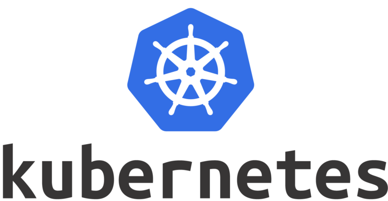
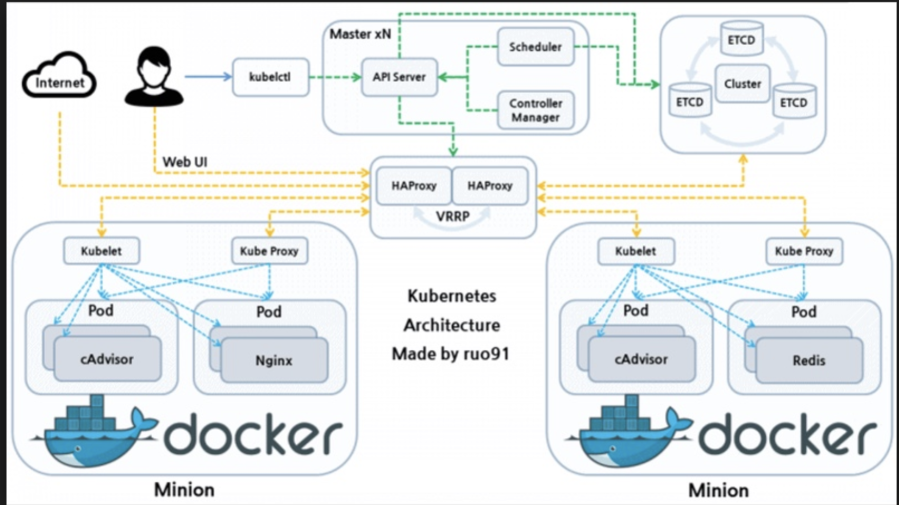

# 00.开篇介绍

## 一步一步使用二进制的方式安装了kubernetes集群

本文档的基础上重新部署了的**v1.8.2**版本，实现了`kube-apiserver`的高可用、`traefik ingress `的部署、在`kubernetes`上安装docker的私有仓库harbor、 容器化kubernetes部分组建、使用阿里云日志服务收集日志。

部署完成后，你将理解系统各组件的交互原理，进而能快速解决实际问题，所以本文档主要适合于那些有一定kubernetes基础，想通过一步步部署的方式来学习和了解系统配置、运行原理的人。

本系列系文档适用于 `CentOS 7`、`Ubuntu 16.04` 及以上版本系统，由于启用了 `TLS 双向认证`、`RBAC 授权`等严格的安全机制，建议从头开始部署，否则可能会认证、授权等失败！

