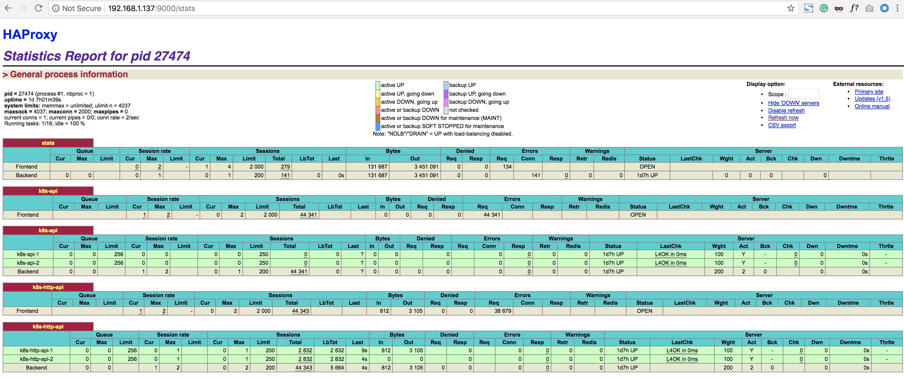
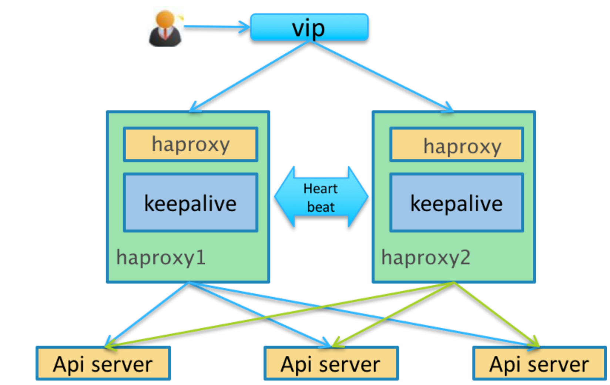
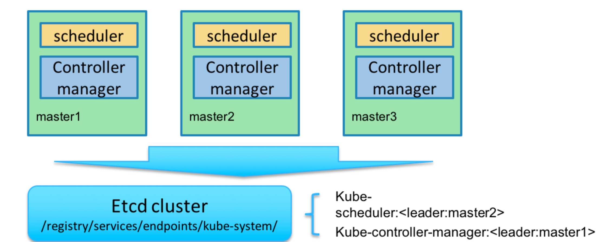

# 7.kube-apiserver 高可用

按照上面的方式在`master01`与 `master02`机器上安装`kube-apiserver`、`kube-controller-manager`、`kube-scheduler`，但是现在我们还是手动指定访问的**6443**和**8080**端口的，因为我们的域名`k8s-api.virtual.local`对应的`master01`节点直接通过`http` 和`https` 还不能访问，这里我们使用`haproxy` 来代替请求。

### 就是我们需要将http默认的80端口请求转发到apiserver的8080端口，将https默认的443端口请求转发到apiserver的6443端口，所以我们这里使用haproxy来做请求转发

## 安装haproxy  (master01 and master02)

```
sudo apt-get update
sudo apt-get upgrade
```
```
sudo apt-get -y install haproxy
```

## 配置haproxy

由于集群内部有的组建是通过非安全端口访问apiserver 的，有的是通过安全端口访问apiserver 的，所以我们要配置`http` 和`https` 两种代理方式，配置文件 `/etc/haproxy/haproxy.cfg`：

```
listen stats
  bind    *:9000
  mode    http
  stats   enable
  stats   hide-version
  stats   uri       /stats
  stats   refresh   30s
  stats   realm     Haproxy\ Statistics
  stats   auth      Admin:Password

frontend k8s-api
    bind 192.168.1.137:443
    mode tcp
    option tcplog
    tcp-request inspect-delay 5s
    tcp-request content accept if { req.ssl_hello_type 1 }
    default_backend k8s-api

backend k8s-api
    mode tcp
    option tcplog
    option tcp-check
    balance roundrobin
    default-server inter 10s downinter 5s rise 2 fall 2 slowstart 60s maxconn 250 maxqueue 256 weight 100
    server k8s-api-1 192.168.1.137:6443 check
    server k8s-api-2 192.168.1.138:6443 check

frontend k8s-http-api
    bind 192.168.1.137:80
    mode tcp
    option tcplog
    default_backend k8s-http-api

backend k8s-http-api
    mode tcp
    option tcplog
    option tcp-check
    balance roundrobin
    default-server inter 10s downinter 5s rise 2 fall 2 slowstart 60s maxconn 250 maxqueue 256 weight 100
    server k8s-http-api-1 192.168.1.137:8080 check
    server k8s-http-api-2 192.168.1.138:8080 check
```

### 通过上面的配置文件我们可以看出通过https的访问将请求转发给apiserver 的6443端口了，http的请求转发到了apiserver 的8080端口。

## 启动haproxy

```
$ sudo systemctl start haproxy
$ sudo systemctl enable haproxy
$ sudo systemctl status haproxy

● haproxy.service - HAProxy Load Balancer
   Loaded: loaded (/lib/systemd/system/haproxy.service; enabled; vendor preset: enabled)
   Active: active (running) since Fri 2018-08-24 16:02:46 UTC; 4 days ago
     Docs: man:haproxy(1)
           file:/usr/share/doc/haproxy/configuration.txt.gz
 Main PID: 27470 (haproxy-systemd)
    Tasks: 3
   Memory: 1.5M
      CPU: 17.138s
   CGroup: /system.slice/haproxy.service
           ├─27470 /usr/sbin/haproxy-systemd-wrapper -f /etc/haproxy/haproxy.cfg -p /run/haproxy.pid
           ├─27472 /usr/sbin/haproxy -f /etc/haproxy/haproxy.cfg -p /run/haproxy.pid -Ds
           └─27474 /usr/sbin/haproxy -f /etc/haproxy/haproxy.cfg -p /run/haproxy.pid -Ds

Warning: Journal has been rotated since unit was started. Log output is incomplete or unavailable.
```

然后我们可以通过上面`9000`端口监控我们的haproxy的运行状态`(192.168.1.137:9000/stats)`:




## 问题

上面我们的`haproxy`的确可以代理我们的两个master 上的apiserver 了，但是还不是高可用的，如果master01 这个节点down 掉了，那么我们haproxy 就不能正常提供服务了。这里我们可以使用两种方法来实现高可用


## 方式：使用keepalived (master01 and master02)


`KeepAlived` 是一个高可用方案，**通过 VIP（即虚拟 IP）和心跳检测来实现高可用**。其原理是存在一组（两台）服务器，分别赋予 Master、Backup 两个角色，默认情况下Master 会绑定VIP 到自己的网卡上，对外提供服务。**Master、Backup** 会在一定的时间间隔向对方发送心跳数据包来检测对方的状态，这个时间间隔一般为 2 秒钟，**如果Backup 发现Master 宕机，那么Backup 会发送ARP 包到网关，把VIP 绑定到自己的网卡，此时Backup 对外提供服务，实现自动化的故障转移，当Master 恢复的时候会重新接管服务**。非常类似于路由器中的虚拟路由器冗余协议（VRRP）

### 开启路由转发，这里我们定义虚拟IP为：192.168.1.139


```
$ sudo vi /etc/sysctl.conf
# 添加以下内容
net.ipv4.ip_forward = 1
net.ipv4.ip_nonlocal_bind = 1

# 验证并生效
$ sudo sysctl -p
net.ipv4.ip_forward = 1
net.ipv4.ip_nonlocal_bind = 1
# 验证是否生效
$ cat /proc/sys/net/ipv4/ip_forward
1
```

安装`keepalived`:

```
sudo apt install -y keepalived
```
我们这里将`master01` 设置为`Master`，`master02` 设置为`Backup`，修改配置：

### master01

```
sudo vi /etc/keepalived/keepalived.conf
! Configuration File for keepalived

global_defs {
   notification_email {
   }
   router_id kube_api
}

vrrp_script check_haproxy {
    # 自身状态检测
    script "killall -0 haproxy"
    interval 3
    weight 5
}

vrrp_instance haproxy-vip {
    # 使用单播通信，默认是组播通信
    unicast_src_ip 192.168.1.137
    unicast_peer {
        192.168.1.138
    }
    # 初始化状态
    state MASTER
    # 虚拟ip 绑定的网卡 （这里根据你自己的实际情况选择网卡）
    interface eth0
    # 此ID 要与Backup 配置一致
    virtual_router_id 51
    # 默认启动优先级，要比Backup 大点，但要控制量，保证自身状态检测生效
    priority 100
    advert_int 1
    authentication {
        auth_type PASS
        auth_pass 1111
    }
    virtual_ipaddress {
        # 虚拟ip 地址
        192.168.1.139
    }
    track_script {
        check_k8s
    }
}

virtual_server 192.168.1.139 80 {
  delay_loop 5
  lvs_sched wlc
  lvs_method NAT
  persistence_timeout 1800
  protocol TCP

  real_server 192.168.1.137 80 {
    weight 1
    TCP_CHECK {
      connect_port 80
      connect_timeout 3
    }
  }
}

virtual_server 192.168.1.139 443 {
  delay_loop 5
  lvs_sched wlc
  lvs_method NAT
  persistence_timeout 1800
  protocol TCP

  real_server 192.168.1.137 443 {
    weight 1
    TCP_CHECK {
      connect_port 443
      connect_timeout 3
    }
  }
}
```
**统一的方式在master02 节点上安装keepalived，修改配置，只需要将state 更改成BACKUP，priority更改成99，unicast_src_ip 与unicast_peer 地址修改即可。**

### master02

```
! Configuration File for keepalived

global_defs {
   notification_email {
   }
   router_id kube_api
}

vrrp_script check_haproxy {
    # 自身状态检测
    script "killall -0 haproxy"
    interval 3
    weight 5
}

vrrp_instance haproxy-vip {
    # 使用单播通信，默认是组播通信
    unicast_src_ip 192.168.1.138
    unicast_peer {
        192.168.1.137
    }
    # 初始化状态
    state BACKUP
    # 虚拟ip 绑定的网卡 （这里根据你自己的实际情况选择网卡）
    interface eth0
    # 此ID 要与Backup 配置一致
    virtual_router_id 51
    # 默认启动优先级，要比Backup 大点，但要控制量，保证自身状态检测生效
    priority 99
    advert_int 1
    authentication {
        auth_type PASS
        auth_pass 1111
    }
    virtual_ipaddress {
        # 虚拟ip 地址
        192.168.1.139
    }
    track_script {
        check_k8s
    }
}

virtual_server 192.168.1.139 80 {
  delay_loop 5
  lvs_sched wlc
  lvs_method NAT
  persistence_timeout 1800
  protocol TCP

  real_server 192.168.1.137 80 {
    weight 1
    TCP_CHECK {
      connect_port 80
      connect_timeout 3
    }
  }
}

virtual_server 192.168.1.139 443 {
  delay_loop 5
  lvs_sched wlc
  lvs_method NAT
  persistence_timeout 1800
  protocol TCP

  real_server 192.168.1.137 443 {
    weight 1
    TCP_CHECK {
      connect_port 443
      connect_timeout 3
    }
  }
}
```

启动keepalived:

```
$ sudo systemctl start keepalived
$ sudo systemctl enable keepalived
# 查看日志
$ journalctl -f -u keepalived
```

验证虚拟IP:

```
# 使用ifconfig -a 命令查看不到，要使用ip addr
$ ip addr
1: lo: <LOOPBACK,UP,LOWER_UP> mtu 65536 qdisc noqueue state UNKNOWN group default qlen 1
    link/loopback 00:00:00:00:00:00 brd 00:00:00:00:00:00
    inet 127.0.0.1/8 scope host lo
       valid_lft forever preferred_lft forever
    inet6 ::1/128 scope host
       valid_lft forever preferred_lft forever
2: eth0: <BROADCAST,MULTICAST,UP,LOWER_UP> mtu 1500 qdisc pfifo_fast state UP group default qlen 1000
    link/ether 08:00:27:ee:1d:f7 brd ff:ff:ff:ff:ff:ff
    inet 10.0.2.15/24 brd 10.0.2.255 scope global eth0
       valid_lft forever preferred_lft forever
    inet 192.168.1.139/32 scope global eth0
       valid_lft forever preferred_lft forever
    inet6 fe80::a00:27ff:feee:1df7/64 scope link
       valid_lft forever preferred_lft forever
```

### 验证apiserver：关闭master01 节点上的kube-apiserver 进程，然后查看虚拟ip是否漂移到了master02 节点

然后我们就可以将第一步在`/etc/hosts`里面设置的域名对应的IP 更改为我们的虚拟IP了

**master01 与master 02 节点都需要安装keepalived 和haproxy，实际上我们虚拟IP的自身检测应该是检测haproxy，脚本大家可以自行更改**



这样我们就实现了接入层apiserver 的高可用了，一个部分是多活的apiserver 服务，另一个部分是一主一备的haproxy 服务。

## kube-controller-manager 和kube-scheduler 的高可用


Kubernetes 的管理层服务包括`kube-scheduler`和`kube-controller-manager`。kube-scheduler和kube-controller-manager使用一主多从的高可用方案，**在同一时刻只允许一个服务处以具体的任务**。Kubernetes中实现了一套简单的选主逻辑，**依赖Etcd实现scheduler和controller-manager的选主功能。如果scheduler和controller-manager在启动的时候设置了leader-elect参数，它们在启动后会先尝试获取leader节点身份，只有在获取leader节点身份后才可以执行具体的业务逻辑**。

**它们分别会在Etcd中创建kube-scheduler和kube-controller-manager的endpoint，endpoint的信息中记录了当前的leader节点信息，以及记录的上次更新时间。**

**leader节点会定期更新endpoint的信息，维护自己的leader身份**。**每个从节点的服务都会定期检查endpoint的信息，如果endpoint的信息在时间范围内没有更新，它们会尝试更新自己为leader节点**。

**scheduler服务以及controller-manager服务之间不会进行通信，利用Etcd的强一致性，能够保证在分布式高并发情况下leader节点的全局唯一性**。整体方案如下图所示：




	

当集群中的leader节点服务异常后，其它节点的服务会尝试更新自身为leader节点，当有多个节点同时更新endpoint时，由Etcd保证只有一个服务的更新请求能够成功。通过这种机制sheduler和controller-manager可以保证在leader节点宕机后其它的节点可以顺利选主，保证服务故障后快速恢复。当集群中的网络出现故障时对服务的选主影响不是很大，因为scheduler和controller-manager是依赖Etcd进行选主的，在网络故障后，可以和Etcd通信的主机依然可以按照之前的逻辑进行选主，就算集群被切分，Etcd也可以保证同一时刻只有一个节点的服务处于leader状态。


