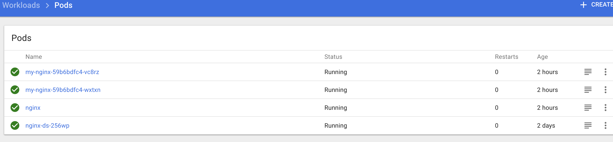

# 10.部署Dashboard 插件

官方文件目录：[kubernetes/cluster/addons/dashboard](https://github.com/kubernetes/kubernetes/tree/v1.8.2/cluster/addons/dashboard)

使用的文件如下：

```
$ mkdir dashboard && cd dashboard
```
新加了 `dashboard-rbac.yaml 文件，定义 dashboard 使用的 RoleBinding。

由于 `kube-apiserver` 启用了 `RBAC` 授权，而官方源码目录的 `dashboard-controller.yaml` 没有定义授权的 ServiceAccount，所以后续访问 `kube-apiserver` 的 API 时会被拒绝，前端界面提示：


```
$ cat > dashboard-rbac.yaml<<EOF
apiVersion: v1
kind: ServiceAccount
metadata:
  name: dashboard
  namespace: kube-system
---
kind: ClusterRoleBinding
apiVersion: rbac.authorization.k8s.io/v1alpha1
metadata:
  name: dashboard
subjects:
  - kind: ServiceAccount
    name: dashboard
    namespace: kube-system
roleRef:
  kind: ClusterRole
  name: cluster-admin
  apiGroup: rbac.authorization.k8s.io
EOF
```

## 配置dashboard-controller

```
$ vi dashboard-controller.yaml

apiVersion: extensions/v1beta1
kind: Deployment
metadata:
  name: kubernetes-dashboard
  namespace: kube-system
  labels:
    k8s-app: kubernetes-dashboard
    kubernetes.io/cluster-service: "true"
    addonmanager.kubernetes.io/mode: Reconcile
spec:
  selector:
    matchLabels:
      k8s-app: kubernetes-dashboard
  template:
    metadata:
      labels:
        k8s-app: kubernetes-dashboard
      annotations:
        scheduler.alpha.kubernetes.io/critical-pod: ''
    spec:
      serviceAccountName: dashboard
      containers:
      - name: kubernetes-dashboard
        image: gcr.io/google_containers/kubernetes-dashboard-amd64:v1.7.1
        resources:
          limits:
            cpu: 100m
            memory: 50Mi
          requests:
            cpu: 100m
            memory: 50Mi
        ports:
        - containerPort: 9090
          protocol: TCP
        livenessProbe:
          httpGet:
            path: /
            port: 9090
          initialDelaySeconds: 30
          timeoutSeconds: 30
      tolerations:
      - key: "CriticalAddonsOnly"
        operator: "Exists"
```

使用名为 `dashboard` 的自定义 `ServiceAccount`

## 配置dashboard-service

```
$ vi dashboard-service.yaml

apiVersion: v1
kind: Service
metadata:
  name: kubernetes-dashboard
  namespace: kube-system
  labels:
    k8s-app: kubernetes-dashboard
    kubernetes.io/cluster-service: "true"
    addonmanager.kubernetes.io/mode: Reconcile
spec:
  type: NodePort
  selector:
    k8s-app: kubernetes-dashboard
  ports:
  - port: 80
    targetPort: 9090
```

指定端口类型为 NodePort，这样外界可以通过地址 nodeIP:nodePort 访问 dashboard

## 执行所有定义文件

```
$ pwd
/home/vagrant/dashboard

$ ls *.yaml
dashboard-controller.yaml  dashboard-rbac.yaml  dashboard-service.yaml
$ kubectl create -f  .
```

## 检查执行结果

查看分配的 NodePort

```
$ kubectl get services kubernetes-dashboard -n kube-system

NAME                   TYPE       CLUSTER-IP       EXTERNAL-IP   PORT(S)        AGE
kubernetes-dashboard   NodePort   10.254.210.220   <none>        80:31219/TCP   1d

```

```
-n  => --namespace
```


### 检查 controller


```
$ kubectl get deployment kubernetes-dashboard  -n kube-system
NAME                   DESIRED   CURRENT   UP-TO-DATE   AVAILABLE   AGE
kubernetes-dashboard   1         1         1            1           1d

$ kubectl get pods  -n kube-system | grep dashboard
kubernetes-dashboard-679cb978d7-xrsmh         1/1       Running            0          1d
```

## 访问dashboard

1. kubernetes-dashboard 服务暴露了 NodePort，可以使用 `http://NodeIP:nodePort` 地址访问 dashboard
2. 通过 kube-apiserver 访问 dashboard
3. 通过 kubectl proxy 访问 dashboard
4. `http://192.168.1.170:31219`


### pods




由于缺少 Heapster 插件，当前 dashboard 不能展示 Pod、Nodes 的 CPU、内存等 metric 图形

如果你的后端`apiserver`是高可用的集群模式的话，那么`Dashboard`的`apiserver-host`最好手动指定，不然，当你`apiserver`某个节点挂了的时候，`Dashboard`可能不能正常访问，如下配置

```
image: gcr.io/google_containers/kubernetes-dashboard-amd64:v1.7.1
ports:
- containerPort: 9090
  protocol: TCP
args:
  - --apiserver-host=http://<api_server_ha_addr>:8080
```

## To remove dashboad pod cleanly

```
kubectl get secret,sa,role,rolebinding,services,deployments --namespace=kube-system | grep dashboard

secrets/dashboard-token-btzkx                    kubernetes.io/service-account-token   3         2d
secrets/kubernetes-dashboard-key-holder          Opaque                                2         1d
sa/dashboard                    1         2d
svc/kubernetes-dashboard      NodePort    10.254.210.220   <none>        80:31219/TCP                  1d
deploy/kubernetes-dashboard         1         1         1            1           1d

```

```
kubectl delete deployment kubernetes-dashboard --namespace=kube-system 
kubectl delete service kubernetes-dashboard  --namespace=kube-system 
kubectl delete role kubernetes-dashboard --namespace=kube-system 
kubectl delete rolebinding kubernetes-dashboard --namespace=kube-system
kubectl delete sa dashboard --namespace=kube-system 
kubectl delete secret dashboard-token-btzkx --namespace=kube-system
kubectl delete secret /kubernetes-dashboard-key-holde --namespace=kube-system
```


