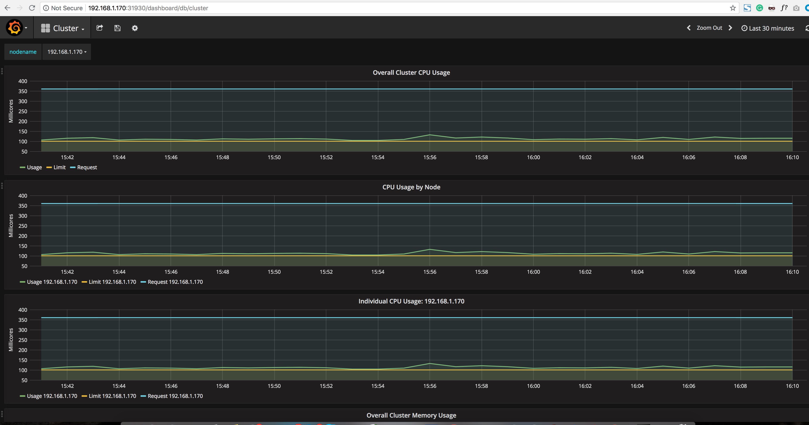
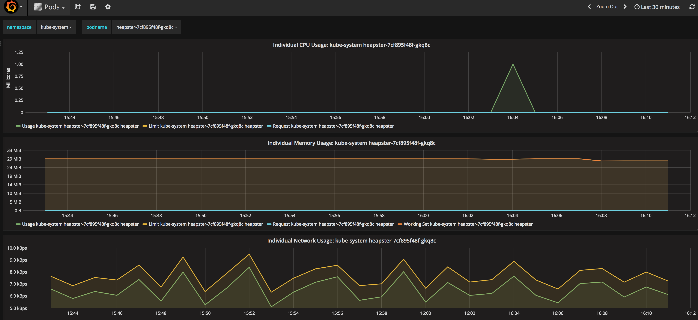
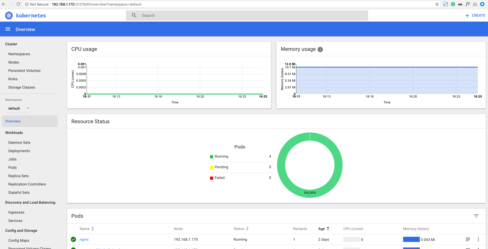
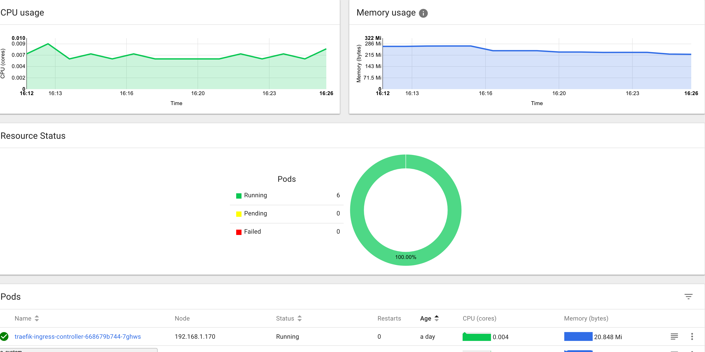
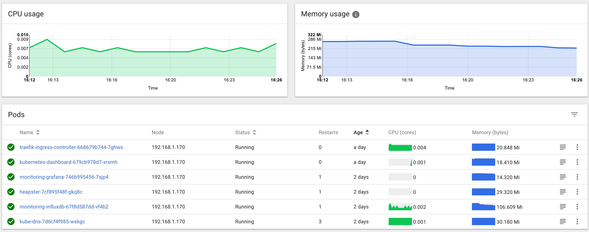

# 11. 部署Heapster插件

到[heapster release ](https://github.com/kubernetes/heapster/releases)页面下载最新版的heapster

```
$ mkdir heapster && cd heapster
$ wget https://github.com/kubernetes/heapster/archive/v1.4.3.tar.gz
$ tar -xzvf v1.4.3.tar.gz
```

部署相关文件目录：`/home/ych/k8s-repo/heapster-1.4.3/deploy/kube-config`

```
$ pwd
/home/vagrant/heapster/heapster-1.4.3/deploy/kube-config

$ ls influxdb/ && ls rbac/
grafana.yaml  heapster.yaml  influxdb.yaml
heapster-rbac.yaml
```

为方便测试访问，将`grafana.yaml`下面的服务类型设置为`type=NodePort`

## 执行所有文件

```
$ kubectl create -f rbac/heapster-rbac.yaml
clusterrolebinding "heapster" created
$ kubectl create -f influxdb
deployment "monitoring-grafana" created
service "monitoring-grafana" created
serviceaccount "heapster" created
deployment "heapster" created
service "heapster" created
deployment "monitoring-influxdb" created
service "monitoring-influxdb" created
```

## 检查执行结果

### 检查 Deployment

```
$ kubectl get deployments -n kube-system | grep -E 'heapster|monitoring'
heapster               1         1         1            1           2m
monitoring-grafana     1         1         1            0           2m
monitoring-influxdb    1         1         1            1           2m
```

### 检查 Pods

```
kubectl get pods -n kube-system | grep -E 'heapster|monitoring'
heapster-7cf895f48f-gkq8c                     1/1       Running   1          2d
monitoring-grafana-746b995456-7sjp4           0/1       Running   1          2d
monitoring-influxdb-67f8d587dd-vf4b2          1/1       Running   1          2d
```
我们可以看到`monitoring-grafana`的POD 是没有执行成功的，通过查看日志可以看到下面的错误信息：

`Failed to parse /etc/grafana/grafana.ini, open /etc/grafana/grafana.ini: no such file or
directory`

要解决这个问题([heapster issues](https://github.com/kubernetes/heapster/issues/1709))我们需要将grafana 的镜像版本更改成：`gcr.io/google_containers/heapster-grafana-amd64:v4.0.2`，然后重新执行，即可正常。

```
$ cd influxdb

$ cat grafana.yaml

---
apiVersion: extensions/v1beta1
kind: Deployment
metadata:
  name: monitoring-grafana
  namespace: kube-system
spec:
  replicas: 1
  template:
    metadata:
      labels:
        task: monitoring
        k8s-app: grafana
    spec:
      containers:
      - name: grafana
        image: gcr.io/google_containers/heapster-grafana-amd64:v4.0.2
        ports:
......        

```

### 重启monitoring-grafana pods

```
kubectl delete deployment monitoring-grafana --namespace=kube-system
kubectl create -f influxdb
```

```
$ kubectl get pods -n kube-system | grep -E 'heapster|monitoring'
heapster-7cf895f48f-gkq8c                     1/1       Running   1          2d
monitoring-grafana-746b995456-7sjp4           1/1       Running   1          2d
monitoring-influxdb-67f8d587dd-vf4b2          1/1       Running   1          2d
```

```
$ kubectl get svc -n kube-system | grep -E 'heapster|monitoring'
heapster                  ClusterIP   10.254.34.234    <none>        80/TCP                        2d
monitoring-grafana        NodePort    10.254.124.179   <none>        80:31930/TCP                  2d
monitoring-influxdb       ClusterIP   10.254.43.111    <none>        8086/TCP                      2d
```

```
$ kubectl logs -f pods/heapster-7cf895f48f-gkq8c -n kube-system

I0827 06:12:02.437063       1 heapster.go:72] /heapster --source=kubernetes:https://kubernetes.default --sink=influxdb:http://monitoring-influxdb.kube-system.svc:8086
I0827 06:12:02.437102       1 heapster.go:73] Heapster version v1.3.0
I0827 06:12:02.437268       1 configs.go:61] Using Kubernetes client with master "https://kubernetes.default" and version v1
I0827 06:12:02.437282       1 configs.go:62] Using kubelet port 10255
I0827 06:12:12.480915       1 influxdb.go:252] created influxdb sink with options: host:monitoring-influxdb.kube-system.svc:8086 user:root db:k8s
I0827 06:12:12.480972       1 heapster.go:196] Starting with InfluxDB Sink
I0827 06:12:12.480979       1 heapster.go:196] Starting with Metric Sink
I0827 06:12:12.493677       1 heapster.go:106] Starting heapster on port 8082
I0827 06:13:05.084835       1 influxdb.go:215] Created database "k8s" on influxDB server at "monitoring-influxdb.kube-system.svc:8086"
W0827 12:44:17.197834       1 heapster.go:295] No current data batch available (latest: 2018-08-27 09:58:00 +0000 UTC).
```

## 访问 grafana

上面我们修改grafana 的Service 为NodePort 类型：

```
$ kubectl get svc -n kube-system
NAME                      TYPE        CLUSTER-IP       EXTERNAL-IP   PORT(S)                       AGE
heapster                  ClusterIP   10.254.34.234    <none>        80/TCP                        2d
kube-dns                  ClusterIP   10.254.0.2       <none>        53/UDP,53/TCP                 2d
kubernetes-dashboard      NodePort    10.254.210.220   <none>        80:31219/TCP                  1d
monitoring-grafana        NodePort    10.254.124.179   <none>        80:31930/TCP                  2d
monitoring-influxdb       ClusterIP   10.254.43.111    <none>        8086/TCP                      2d
```


### 则我们就可以通过任意一个节点加上上面的31930端口就可以访问grafana了。

`http://192.168.1.170:31930/dashboard/db/cluster`



`http://192.168.1.170:31930/dashboard/db/pods`



heapster 正确安装后，我们便可以回去看我们的dashboard 是否有图表出现了：

### (我需要重新重启dashboard的pod和service)
```
kubectl delete deployment kubernetes-dashboard --namespace=kube-system 
kubectl delete service kubernetes-dashboard  --namespace=kube-system 
kubectl delete role kubernetes-dashboard --namespace=kube-system 
kubectl delete rolebinding kubernetes-dashboard --namespace=kube-system
kubectl delete sa dashboard --namespace=kube-system 
kubectl delete secret dashboard-token-btzkx --namespace=kube-system
kubectl delete secret /kubernetes-dashboard-key-holde --namespace=kube-system
```
```
$ cd dashboard/
$ kubectl create -f .
```







