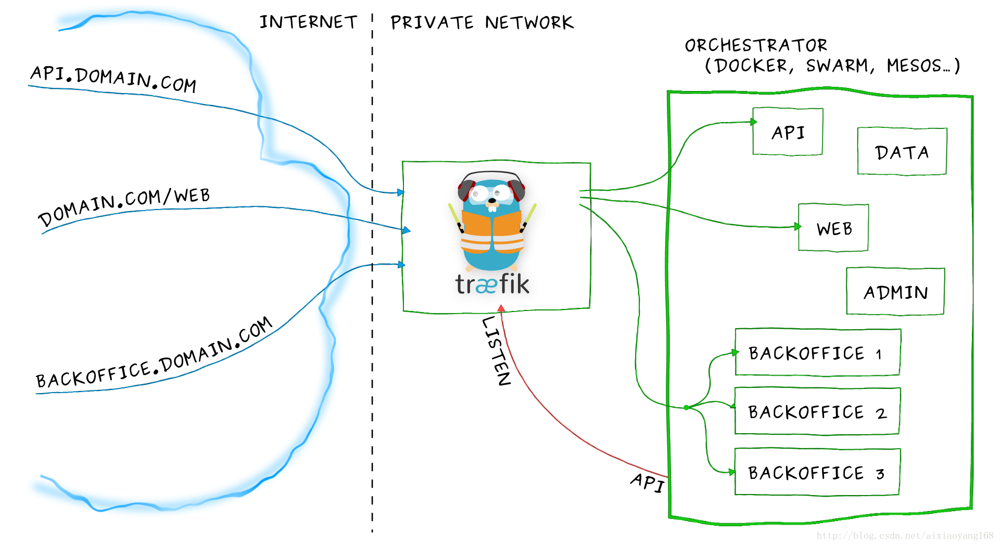
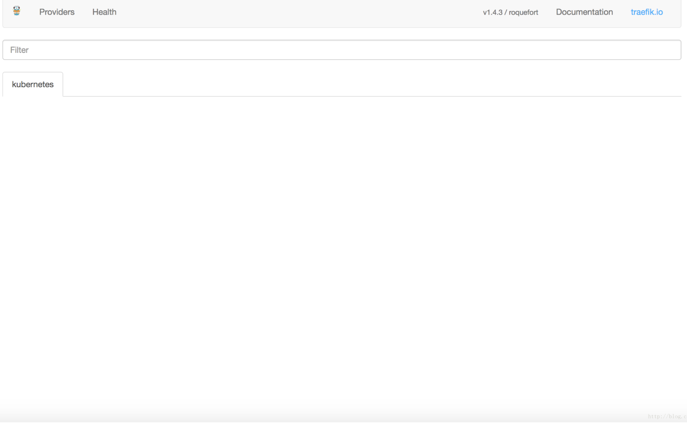
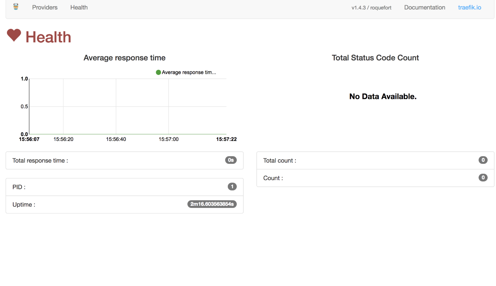
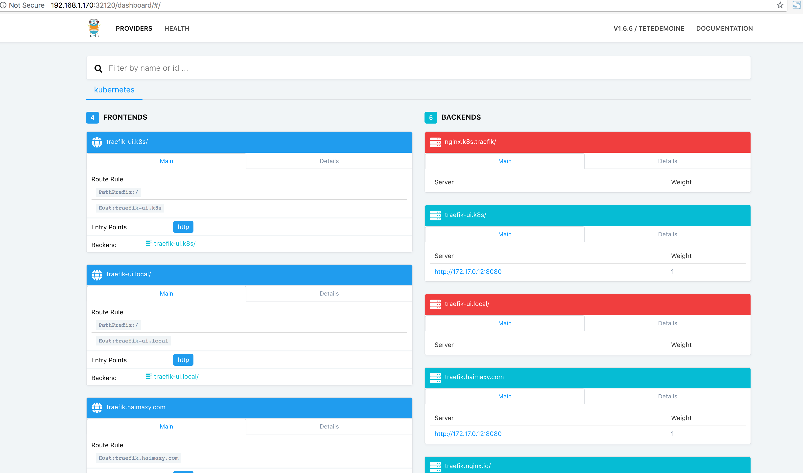
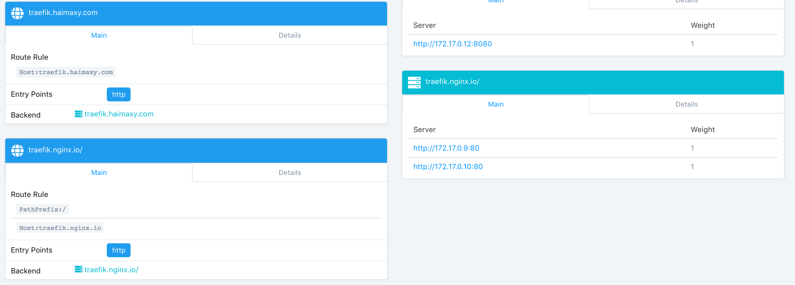

# 12.安装Ingress

[参考文档](https://blog.csdn.net/aixiaoyang168/article/details/78557739)

`Ingress`其实就是从`kuberenets`集群外部访问集群的一个入口，将外部的请求转发到集群内不同的Service 上，其实就相当于nginx、apache 等负载均衡代理服务器，再加上一个规则定义，路由信息的刷新需要靠Ingress controller来提供

`Ingress controller`可以理解为一个监听器，通过不断地与`kube-apiserver`打交道，实时的感知后端service、pod 等的变化，当得到这些变化信息后，`Ingress controller`再结合Ingress的配置，更新反向代理负载均衡器，达到服务发现的作用。其实这点和服务发现工具`consul`的`consul-template`非常类似。

## Traefik 介绍

在日常工作中，我们经常使用 Nginx、Apache 等工具作为反向代理、负载均衡，而 Træfik 是一个为了让部署微服务更加便捷而诞生的 HTTP 反向代理、负载均衡工具。**它支持多种后台 (Docker、Swarm、Kubernetes、Mesos、Consul、Etcd…) 来自动、动态的刷新配置文件，以实现快速地服务发现。** 在 Kubernetes 集群中使用，可以完全替代 ngxin + Ingress Controller，快速实现服务的暴漏。

引用 [Traefik](https://docs.traefik.io/) 官网文档 中的一张图片，可以简要说明一下什么是 Traefik。




从上图可以看出，在我们日常业务开发中，我们会部署一系列微服务，外部网络要通过 `domain`、`path`、`负载均衡等转发到后端私有网络中`，微服务之所以称为微，是因为它是动态变化的，它会经常被增加、删除、干掉或者被更新。而且传统的反向代理对服务动态变化的支持不是很方便，也就是服务变更后，我们不是很容易立马改变配置和热加载。traefik 的出现就是为了解决这个问题，它可以时刻监听服务注册或服务编排 API，随时感知后端服务变化，自动重新更改配置并热重新加载，期间服务不会暂停或停止，这对于用户来说是无感知的

## 部署 Traefik

在 Kubernetes 上部署 Traefik 很简单，只需 Yaml 创建一下即可。

```
mkdir traefik  && cd traefik
$ git clone https://github.com/containous/traefik.git

$ ll traefik/examples/k8s/
total 52
drwxrwxr-x 2 vagrant vagrant 4096 Aug 28 01:54 ./
drwxrwxr-x 7 vagrant vagrant 4096 Aug 27 09:21 ../
-rw-rw-r-- 1 vagrant vagrant  140 Aug 27 09:21 cheese-default-ingress.yaml
-rw-rw-r-- 1 vagrant vagrant 1805 Aug 27 09:21 cheese-deployments.yaml
-rw-rw-r-- 1 vagrant vagrant  519 Aug 27 09:21 cheese-ingress.yaml
-rw-rw-r-- 1 vagrant vagrant  509 Aug 27 09:21 cheese-services.yaml
-rw-rw-r-- 1 vagrant vagrant  504 Aug 27 09:21 cheeses-ingress.yaml
-rw-rw-r-- 1 vagrant vagrant  320 Aug 28 01:54 ingress.yaml
-rw-rw-r-- 1 vagrant vagrant 1120 Aug 27 09:21 traefik-deployment.yaml
-rw-rw-r-- 1 vagrant vagrant 1206 Aug 27 09:21 traefik-ds.yaml
-rw-rw-r-- 1 vagrant vagrant  694 Aug 27 09:21 traefik-rbac.yaml
-rw-rw-r-- 1 vagrant vagrant  466 Aug 27 09:30 ui.yaml
```
`traefik/examples/k8s/` 这个目录下就是示例 Traefik 启动所需要的 yaml 文件，Traefik 提供了适配各个类型服务编排的部署方式，**kubernetes 启动方式支持 Deployment 和 DaemonSet**，二选一都可以。

```
$ kubectl create -f traefik/examples/k8s/traefik-rbac.yaml
clusterrole "traefik-ingress-controller" created
clusterrolebinding "traefik-ingress-controller" created

$ kubectl create -f traefik/examples/k8s/traefik-deployment.yaml
serviceaccount "traefik-ingress-controller" created
deployment "traefik-ingress-controller" created
service "traefik-ingress-service" created

$ kubectl get pods --all-namespaces -o wide
NAMESPACE     NAME                                          READY     STATUS    RESTARTS   AGE       IP            NODE
kube-system   traefik-ingress-controller-668679b744-7ghws   1/1       Running   0          1d        172.17.0.12   192.168.1.170
...
```

好了，此时 Traefik 已经启动成功了，它同时启动了 80 和 8080 端口，80 对应的服务端口，8080 对应的 UI 端口，我们可以通过查看服务暴漏端口号浏览器访问下了提供的 UI 界面。

```
$ kubectl get service --all-namespaces

NAMESPACE     NAME                      TYPE        CLUSTER-IP       EXTERNAL-IP   PORT(S)                      AGE
kube-system   traefik                   NodePort    10.254.43.88     <none>        80:30567/TCP,443:30683/TCP    2d
kube-system   traefik-ingress-service   NodePort    10.254.140.89    <none>        80:30488/TCP,8080:32120/TCP   1d
kube-system   traefik-ui                ClusterIP   10.254.23.253    <none>        80/TCP                        2d
kube-system   traefik-web-ui            ClusterIP   10.254.226.95    <none>        80/TCP                        1d
...
```

访问 http://<node_ip>:<node_port>/dashboard/#/，这里 <node_ip> 可以为 master 或者 node 节点 IP 均可，这里我使用的是 Master IP，如：`http://192.168.1.170:32120/dashboard/#/`。






初次访问，我们发现 Providers 下 Kubernetes 什么服务都没有，Health里面也没有任何信息，这是因为我们还没有指定任何 Ingress 规则。

## 部署 Traefik UI

从上边可以看到 Traefik 提供了一套简洁的 UI 供我们使用，是由 Angular JS 编写的，它是以 Ingress 方式暴露服务的，只需要 Yaml 创建一下即可。

```
$ cd traefik/examples/k8s/
# 先修改一下 host，默认为 traefik-ui.minikube ，这里我改成 traefik-ui.k8s 更直观些。
$ vim ui.yaml

---
apiVersion: v1
kind: Service
metadata:
  name: traefik-web-ui
  namespace: kube-system
spec:
  selector:
    k8s-app: traefik-ingress-lb
  ports:
  - name: web
    port: 80
    targetPort: 8080
---
apiVersion: extensions/v1beta1
kind: Ingress
metadata:
  name: traefik-web-ui
  namespace: kube-system
spec:
  rules:
  - host: traefik-ui.k8s
    http:
      paths:
      - path: /
        backend:
          serviceName: traefik-web-ui
          servicePort: web
```         

```
$ kubectl create -f ui.yaml
service "traefik-web-ui" created
ingress "traefik-web-ui" created

$ kubectl get service --all-namespaces
kube-system   traefik                   NodePort    10.254.43.88     <none>        80:30567/TCP,443:30683/TCP    2d
kube-system   traefik-ingress-service   NodePort    10.254.140.89    <none>        80:30488/TCP,8080:32120/TCP   1d
kube-system   traefik-ui                ClusterIP   10.254.23.253    <none>        80/TCP                        2d
kube-system   traefik-web-ui            ClusterIP   10.254.226.95    <none>        80/TCP                        1d
```
此时，我们不需要刷新浏览器 UI 界面，就可以看到 `traefik-ui.k8s/` 已经显示出来了，速度很快，用户无感知。



## 部署自定义 Ingress

好了，上边我们通过部署一个 Traefik 提供的 `traefik-web-ui` 服务，初窥了一下 Traefik，现在我们自定义一个 Ingress 来实现服务暴漏。从已安装的服务列表中可以看到，我们已经安装了很多服务，这里还是选择 `kubernetes-dashboard` 和 `elasticsearch-logging` 来演示一下，基于域名访问虚拟主机的 Ingress 配置，Yaml 文件如下。

```
$ vi dashboard-k8s-traefik.yaml

apiVersion: extensions/v1beta1
kind: Ingress
metadata:
  name: dashboard-k8s-traefik
  namespace: kube-system
  annotations:
    kubernetes.io/ingress.class: traefik
spec:
  rules:
  - host: dashboard.k8s.traefik
    http:
      paths:
      - path: /
        backend:
          serviceName: kubernetes-dashboard
          servicePort: 80
spec:
  rules:
  - host: traefik.nginx.io
    http:
      paths:
      - path: /
        backend:
          serviceName: my-nginx
          servicePort: 80
```

```
kubectl create -f dashboard-k8s-traefik.yaml
```

