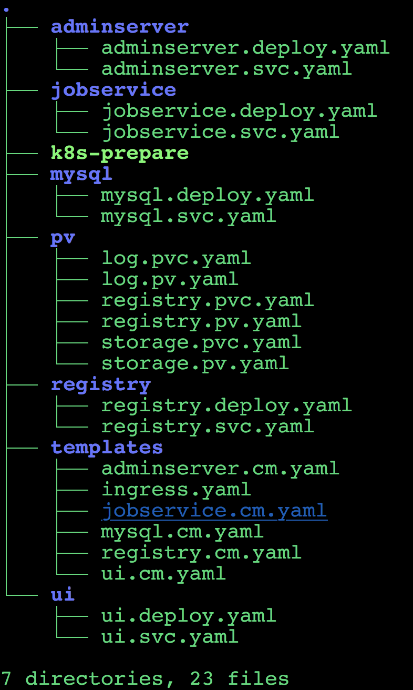
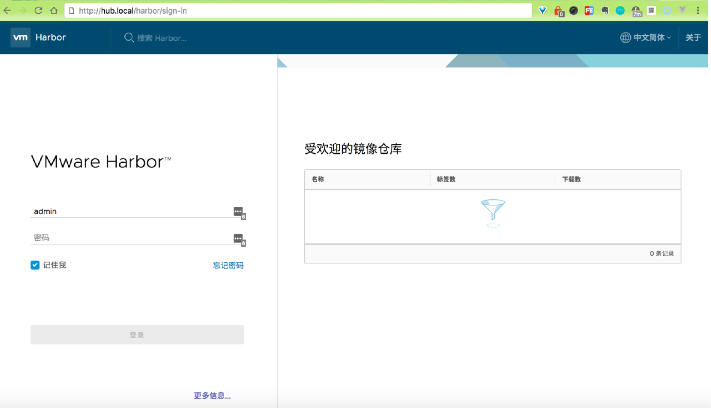

# 在kubernetes 集群上搭建docker 私有仓库Harbor

`Harbor`是一个用于**存储和分发Docker 镜像的企业级Registry 服务器**，通过添加一些企业必需的功能特性，例如安全、标识和管理等，扩展了开源`Docker Distribution`。作为一个企业级私有Registry 服务器，Harbor 提供了更好的性能和安全。提升用户使用Registry构建和运行环境传输镜像的效率。

### Harbor 支持安装在多个Registry节点的镜像资源复制，镜像全部保存在私有Registry 中， 确保数据和知识产权在公司内部网络中管控。

另外，Harbor也提供了高级的安全特性，诸如用户管理，访问控制和活动审计等。


**本文将介绍如何在kubernetes 集群上搭建一个高可用的Harbor 服务。**

* **基于角色的访问控制** - 用户与Docker镜像仓库通过“项目”进行组织管理，**一个用户可以对多个镜像仓库在同一命名空间（project）里有不同的权限。**
* **镜像复制** - **镜像可以在多个Registry实例中复制（同步）。尤其适合于负载均衡，高可用，混合云和多云的场景。**
* **图形化用户界面** - 用户可以通过浏览器来浏览，检索当前Docker镜像仓库，管理项目和命名空间。
* **AD/LDAP 支持** - **Harbor可以集成企业内部已有的AD/LDAP，用于鉴权认证管理。**
* **审计管理** - **所有针对镜像仓库的操作都可以被记录追溯，用于审计管理。**
* **国际化** - 已拥有英文、中文、德文、日文和俄文的本地化版本。更多的语言将会添加进来。
* **RESTful API** - RESTful API 提供给管理员对于Harbor更多的操控, 使得与其它管理软件集成变得更容易。
* **部署简单** - 提供在线和离线两种安装工具， 也可以安装到vSphere平台(OVA方式)虚拟设备。


## 基本步骤

先`clone harbor` 代码到本地，我们可以查看harbor 提供的`kubernetes` 部署方案文档：`kubernetes_deployment.md`。

### [Harbor](https://github.com/goharbor/harbor)
### [kubernetes_deployment.md](https://github.com/goharbor/harbor/blob/v1.2.2/docs/kubernetes_deployment.md)

`harbor` 提供了一个python 脚本(`make/kubernetes/prepare`)来生成`kubernetes` 的`ConfigMap` 文件，由于这个脚本是python 编写的，所以你需要一个能运行python 的环境，该脚本也需要使用`openssl`来生成私钥和证书，所以也要确保你的运行环境下面有可执行的`openssl`。

下面是该脚本的一些参数：

1. **-f**: 默认值是`../harbor.cfg`，当然你可以指定另外的配置文件。
2. **-k**: https 私钥路径，你可以在`harbor.cfg`文件中修改`ssl_cert_key`字段。
3. **-c**: https 证书路径，同样可以在`harbor.cfg`文件中修改`ssl_cert`字段。
4. **-s**: 密码路径，必须是16位字符串，如果没有设置，脚本将自动生成。

## 基本配置

有些基本配置必须设置，否则不能部署成功。

* `make/harbor.cfg`: Harbor 的基本配置文件。
 
* `make/kubernetes/**/*.deploy.yaml`: 一些容器的配置文件。

你需要将所有的`*.deploy.yaml`文件中的镜像替换成正确的镜像地址。例如：

```
containers:
      - name: nginx-app
        # it's very importent that you need modify the path of image.
        image: harbor/nginx
```

```
$ cd harbor/make/kubernetes
```




`make/kubernetes/pv/*.pvc.yaml`: **Persistent Volume Claim**。你可以设置存储这些文件的容量，例如：

```
  resources:
    requests:
      # you can set another value to adapt to your needs
      storage: 100Gi
```

`make/kubernetes/pv/*.pv.yaml`: **Persistent Volume**， 被绑定到上面的`*.pvc.yaml`，PV 和 PVC 是一一对应的，如果你改变了PVC 的容量，那么你也需要相应的设置PV 的容量，例如：

**exp**: `/harbor/make/kubernetes/pv/registry.pvc.yaml`

```
apiVersion: v1
kind: PersistentVolumeClaim
metadata:
  name: registry-pvc
spec:
  accessModes:
    - ReadWriteOnce
  resources:
    requests:
      storage: 1Gi
  selector:
    matchLabels:
      type: registry
```

**exp**: `/harbor/make/kubernetes/pv/registry.pv.yaml`

```
apiVersion: v1
kind: PersistentVolume
metadata:
  name: registry-pv
  labels:
    type: registry
spec:
  capacity:
    storage: 1Gi
  accessModes:
    - ReadWriteOnce
  persistentVolumeReclaimPolicy: Retain
  hostPath:
    path: /data/registry
```
将上述相关的参数修改完成后，执行下面的命令生成ConfigMap文件：

```
$ python make/kubernetes/k8s-prepare
```

```
├── adminserver
│   ├── adminserver.cm.yaml
│   ├── adminserver.deploy.yaml
│   └── adminserver.svc.yaml
├── ingress.yaml
├── jobservice
│   ├── jobservice.cm.yaml
│   ├── jobservice.deploy.yaml
│   └── jobservice.svc.yaml
├── k8s-prepare
├── mysql
│   ├── mysql.cm.yaml
│   ├── mysql.deploy.yaml
│   └── mysql.svc.yaml
├── pv
│   ├── log.pvc.yaml
│   ├── log.pv.yaml
│   ├── registry.pvc.yaml
│   ├── registry.pv.yaml
│   ├── storage.pvc.yaml
│   └── storage.pv.yaml
├── registry
│   ├── registry.cm.yaml
│   ├── registry.deploy.yaml
│   └── registry.svc.yaml
├── templates
│   ├── adminserver.cm.yaml
│   ├── ingress.yaml
│   ├── jobservice.cm.yaml
│   ├── mysql.cm.yaml
│   ├── registry.cm.yaml
│   └── ui.cm.yaml
└── ui
    ├── ui.cm.yaml
    ├── ui.deploy.yaml
    └── ui.svc.yaml

7 directories, 29 files
```

脚本执行完成后会生成下面的一些文件：

* make/kubernetes/jobservice/jobservice.cm.yaml
* make/kubernetes/mysql/mysql.cm.yaml
* make/kubernetes/nginx/nginx.cm.yaml
* make/kubernetes/registry/registry.cm.yaml
* make/kubernetes/ui/ui.cm.yaml

## 高级配置

当然了如果上面的一些基本配置不能满足你的需求，你也可以做一些更高级的配置。你可以在`make/kubernetes/templates`目录下面找到所有的Harbor的配置模板：

* `jobservice.cm.yaml`: jobservice 的环境变量和WEB 配置
* `mysql.cm.yaml`: MySQL 的Root 用户密码
* `nginx.cm.yaml`: Https 的证书和nginx 配置
* `registry.cm.yaml`: Token 服务认证和 Registry的相关配置，默认用文件系统来存储镜像数据，你能看到这样的数据： `yaml storage: filesystem: rootdirectory: /storage` 如果你想使用其他的存储后端的话，那么就需要去查看Docker 的相关文档了。
* `ui.cm.yaml`： Token 服务的私钥，UI Dashboard 的环境变量和WEB 配置

ui 和 jobservice 是用`beego`编写的，如果你对`beego`比较熟悉的话，你可以修改相关的配置。


## 自定义

* 为方便管理，这里我们在模板文件中均添加一个`namespace=kube-ops`，这样让`Harbor`都放在该namespace 下运行。
* 由于我们的系统是通过`traefik ingress`来和外部进行交流的，所以这里实际上是不需要nginx 这一层的，所以可以将下面nginx 想关的操作移除掉就行.
* 将`make/kubernetes`下面的`*.deploy.yaml`文件中的`ReplicationController`改成`Deployment`，因为`Deployment`比`ReplicationController`功能更加丰富, `apiVersion` 改成对应的`apiVersion: extensions/v1beta1`版本，将sepc 下面的selector 删除。
* 同样的在`make/kubernetes`下面的所有`*.deploy.yaml(除mysql.deploy.yaml外)`和`*.svc.yaml`文件中添加`namespace=kube-ops`的命名空间。
* 由于`mysql` 是有状态的应用，所以我们将`mysql.deploy.yaml`改成`StatefulSet`，apiVersion 需要改成对应的`apps/v1beta1`版本
* 我们这里使用共享存储`nfs`来存储我们的相关数据，所以我们将`make/kubernetes/pv`下面添加一个`ops.pv.yaml`（忽略其他的pv相关的文件）

**Exp**:  `$ vi adminserver.deploy.yaml `

```
apiVersion: extensions/v1beta1
kind: Deployment
metadata:
  name: adminserver
  namespace: kube-ops
  labels:
    name: adminserver
...
```

**Exp**:  `$ vi adminserver.svc.yaml`

```
apiVersion: v1
kind: Service
metadata:
  name: adminserver
  namespace: kube-ops
spec:
  ports:
    - port: 80
  selector:
    name: adminserver-apps
```

```
$ cd mysql
$ vi mysql.deploy.yaml
```

```
apiVersion: apps/v1beta1
kind: StatefulSet
metadata:
  name: mysql
  labels:
    name: mysql
spec:
  replicas: 1
  template:
  ...
```

```
$ vi ops.pv.yaml
```

```
apiVersion: v1
kind: PersistentVolume
metadata:
  name: opspv
  labels:
    k8s-app: opspv
spec:
  accessModes:
  - ReadWriteMany
  capacity:
    storage: 100Gi
  persistentVolumeReclaimPolicy: Retain
  nfs:
    path: /
    server: 192.168.1.139  # 替换成你自己的nfs 服务器地址

---
apiVersion: v1
kind: PersistentVolumeClaim
metadata:
  name: opspvc
  namespace: kube-ops
  labels:
    k8s-app: opspvc
spec:
  accessModes:
  - ReadWriteMany
  resources:
    requests:
      storage: 100Gi
  selector:
    matchLabels:
      k8s-app: opspv
```

上面我们新建了一个共享的`pv`和`pvc`，所以需要将`*.rc.yaml`下面所有的`claimName`的值替换成`opspvc`，另外需要在`volumeMounts`声明的地方加上`subPath`来区分存储的文件路径，如下：

**Exp:**

```
  volumeMounts:
  - name: logs
    mountPath: /var/log/jobs
    subPath: harbor/logs
volumes:
- name: logs
  persistentVolumeClaim:
    claimName: opspvc
```

```
$ vi registry.deploy.yaml

   mountPath: /storage
          subPath: harbor/registry
      volumes:
      - name: config
        configMap:
          name: harbor-registry-config
          items:
          - key: config
            path: config.yml
          - key: cert
            path: root.crt
      - name: storage
        persistentVolumeClaim:
          claimName: opspvc
```

```
$ vi mysql.deploy.yaml

volumeMounts:
        - name: mysql-storage
          mountPath: /var/lib/mysql
           subPath: harbor/mysql
      volumes:
      - name: mysql-storage
        persistentVolumeClaim:
          claimName: opspvc
```

```
$ vi jobservice.deploy.yaml

volumeMounts:
        - name: config
          mountPath: /etc/jobservice
        - name: logs
          mountPath: /var/log/jobs
          subPath: harbor/logs
      volumes:
      - name: config
        configMap:
          name: harbor-jobservice-config
          items:
          - key: config
            path: app.conf
      - name: logs
        persistentVolumeClaim:
          claimName: opspvc

```
关于镜像： 可以前往[Harbor realse](https://github.com/goharbor/harbor/releases)页面下载最新的离线包，然后解压离线安装包可以得到镜像文件`harbor.*.tgz`，然后可以利用下面的docker命令将相关的镜像加载进来： `shell $ docker load -i harbor.*.tgz`


```
$ wget https://storage.googleapis.com/harbor-releases/release-1.6.0/harbor-offline-installer-v1.6.0-rc2.tgz
$ tar -xvzf harbor-offline-installer-v1.6.0-rc2.tgz
$ cd harbor
$ sudo docker load -i harbor.v1.6.0.tar.gz

```
由于我们没有指定相关的POD 固定的运行在某个节点上，所以理论上是需要在每个节点上执行上面的步骤的，为了方便，我们这里直接将相关的镜像替换成`vmware`在docker [官方镜像仓库](https://hub.docker.com/u/vmware/)上的镜像 **`* adminserver`**: 如果你clone 代码下面`make/kubernetes/template`下面没有`adminserver.cm.yaml`文件，则可以前

我的整理[github](./kube-repo/harbor/)

## 运行

如果你完成了你的配置并且已经生成了`ConfigMap`文件，现在你可以使用下面的命令来运行`Harbor`了：

```
# create pv & pvc
$ kubectl apply -f make/kubernetes/pv/ops.pv.yaml

# create config map
$ kubectl apply -f make/kubernetes/adminserver/adminserver.cm.yaml
$ kubectl apply -f make/kubernetes/jobservice/jobservice.cm.yaml
$ kubectl apply -f make/kubernetes/mysql/mysql.cm.yaml
$ kubectl apply -f make/kubernetes/registry/registry.cm.yaml
$ kubectl apply -f make/kubernetes/ui/ui.cm.yaml

# create service
$ kubectl apply -f make/kubernetes/adminserver/adminserver.svc.yaml
$ kubectl apply -f make/kubernetes/jobservice/jobservice.svc.yaml
$ kubectl apply -f make/kubernetes/mysql/mysql.svc.yaml
$ kubectl apply -f make/kubernetes/registry/registry.svc.yaml
$ kubectl apply -f make/kubernetes/ui/ui.svc.yaml

# create k8s deployment/statefulset
$ kubectl apply -f make/kubernetes/adminserver/adminserver.deploy.yaml
$ kubectl apply -f make/kubernetes/registry/registry.deploy.yaml
$ kubectl apply -f make/kubernetes/mysql/mysql.deploy.yaml
$ kubectl apply -f make/kubernetes/jobservice/jobservice.deploy.yaml
$ kubectl apply -f make/kubernetes/ui/ui.deploy.yaml
```

**Error:**  **No namespace `kube-ops`**

### Solution:

```
$ vi namespace-kube-ops.json

{
  "kind": "Namespace",
  "apiVersion": "v1",
  "metadata": {
    "name": "kube-ops",
    "labels": {
      "name": "kube-ops"
    }
  }
}
```

```
$ kubectl create -f namespace-kube-ops.json
$ kubectl get namespaces

NAME          STATUS    AGE
default       Active    6d
kube-ops      Active    1h
kube-public   Active    6d
kube-system   Active    6d

```

上面的相关yaml 文件执行完成后，我们就可以通过`traefik ingress`给上面的`ui`绑定一个域名:

```
$ vi harbor.yaml
```

```
apiVersion: extensions/v1beta1
kind: Ingress
metadata:
  name: traefik-ops
  namespace: kube-ops
spec:
  rules:
  - host: hub.local
    http:
      paths:
      - path: /
        backend:
          serviceName: ui
          servicePort: 80
      - path: /v2/
        backend:
          serviceName: registry
          servicePort: 5000
```

```
$ kubectl create -f harbor.yaml
$ kubectl get service --all-namespaces

NAMESPACE     NAME                      TYPE        CLUSTER-IP       EXTERNAL-IP   PORT(S)                       AGE
kube-ops      adminserver               ClusterIP   10.254.226.163   <none>        80/TCP                        1h
kube-ops      jobservice                ClusterIP   10.254.176.37    <none>        80/TCP                        1h
kube-ops      mysql                     ClusterIP   10.254.145.156   <none>        3306/TCP                      1h
kube-ops      registry                  ClusterIP   10.254.234.113   <none>        5000/TCP,5001/TCP             1h
kube-ops      ui                        ClusterIP   10.254.173.92    <none>        80/TCP                        1h
```

配置完成后我们就可以在本地使用`docker`命令进行登录了：

```
sudo docker login -u admin hub.local
Password:
Login Succeeded

# admin
```




