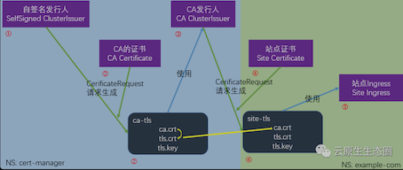
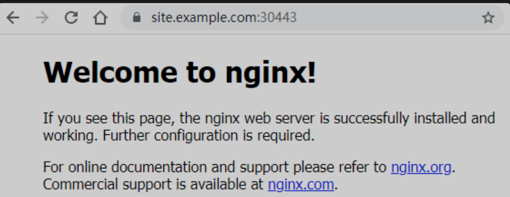
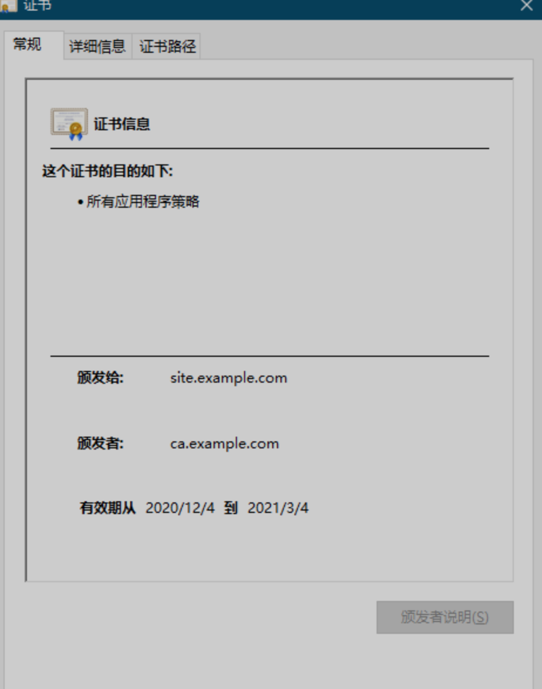
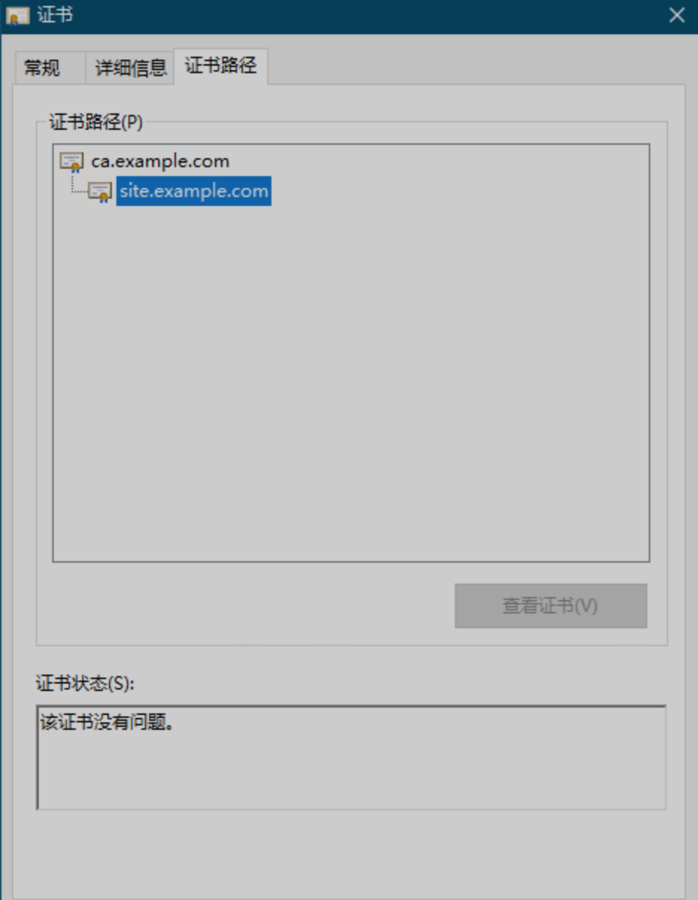

# 2 cert-manager管理内网k8s开发环境证书

## 背景

内网k8s开发环境配置HTTPS，保持与生产环境的配置的一致性，其必要性有：

* PWA开发，HTTPS是必要条件
* 网页引入HTTP资源，如果开发环境是HTTP就不会被开发和测试人员发现，造成生产环境故障
* HTTP/2，与HTTP相差太大，必须保持环境一致


### cert-manager介绍

cert-manager是Kubernetes的附加组件，用于自动管理和颁发各种发行来源的TLS证书。它将确保证书有效并定期更新，并尝试在到期前的适当时间更新证书。

**方法**

开发环境在内网，做不了域名验证，无法使用Let's Encrypt颁发和自动更新证书，**所以采用自签名CA证书+由此CA颁发证书的方式**。

* 创建自签名发行者
* 生成CA证书
* 创建CA发行者（ClusterIssuer）
* 生成网站证书
* 将网站证书配置到Ingress




## 实施


### **前提**

* Kubernetes环境
* 开发机器已配置hosts，域名site.example.com指向Ingress对外ip
* 站点已部署至k8s，Ingress开NodePort端口http30080、https30443，即现在可通过`http://site.example.com:30080`访问到nginx站点

### 1、创建自签名发行者

```
# selfsigned-issuer.issuer.yaml
# 参考：https://cert-manager.io/docs/configuration/selfsigned/
apiVersion: cert-manager.io/v1
kind: Issuer
metadata:
  name: selfsigned-issuer
  namespace: cert-manager
spec:
  selfSigned: {}
```

### **2、生成CA证书**

```
# ca-example-com.certificate.cert-manager.yaml
# 参考：https://cert-manager.io/docs/usage/certificate/
# api参考：https://cert-manager.io/docs/reference/api-docs/#cert-manager.io/v1alpha3.Certificate
apiVersion: cert-manager.io/v1
kind: Certificate
metadata:
  name: ca-example-com ###
  namespace: cert-manager ### 修改为cert-manager的namespace，以让ClusterIssuer的CA Issuer可以使用此证书
spec:
  # Secret names are always required.
  secretName: ca-example-com-tls ### Secret名字
  duration: 2160h # 90d
  renewBefore: 360h # 15d
  subject:
    organizations:
    - Example Inc. ###
  # The use of the common name field has been deprecated since 2000 and is
  # discouraged from being used.
  commonName: ca.example.com ###
  isCA: true ### 修改为true，isCA将将此证书标记为对证书签名有效。这会将cert sign自动添加到usages列表中。
  privateKey:
    algorithm: RSA
    encoding: PKCS1
    size: 2048
  #usages: ### 注释了usages，使用情况是证书要求的x509使用情况的集合。默认为digital signature，key encipherment如果未指定。
  #  - server auth
  #  - client auth
  # At least one of a DNS Name, URI, or IP address is required.
  dnsNames:
  - ca.example.com ###
  #uris: ### 注释了uris、ipAddresses
  #- spiffe://cluster.local/ns/sandbox/sa/example
  #ipAddresses:
  #- 192.168.0.5
  # Issuer references are always required.
  issuerRef:
    name: selfsigned-issuer ### 指定为自签名发行人
    # We can reference ClusterIssuers by changing the kind here.
    # The default value is Issuer (i.e. a locally namespaced Issuer)
    kind: Issuer
    # This is optional since cert-manager will default to this value however
    # if you are using an external issuer, change this to that issuer group.
    group: cert-manager.io
```

* 为相对于参考的修改项
* 我们将要把`CA Issuer`创建为ClusterIssuer，因ClusterIssuer只能访问cert-manager下的Secret，所以这个CA Certificate创建在此名字空间下，其Secret也会被创建在此名字空间下。
	* 当然也可以更改ClusterIssuer默认可访问的名字空间，参考：[https://cert-manager.io/docs/faq/cluster-resource/](https://cert-manager.io/docs/faq/cluster-resource/)


### 3、创建CA发行者（ClusterIssuer）

```
# ca-issuer.clusterissuer.yaml
# 参考：https://cert-manager.io/docs/configuration/ca/
apiVersion: cert-manager.io/v1
kind: ClusterIssuer ### ClusterIssuer
metadata:
  name: ca-issuer
  namespace: cert-manager ### ClusterIssuer下namespace无效
spec:
  ca:
    secretName: ca-example-com-tls
```

CA Issuer创建为ClusterIssuer，可为其他名字空间的Certificate发行证书

```
# site-example-com.certificate.example-com.yaml
# 参考：https://cert-manager.io/docs/usage/certificate/
# api参考：https://cert-manager.io/docs/reference/api-docs/#cert-manager.io/v1alpha3.Certificate
apiVersion: cert-manager.io/v1
kind: Certificate
metadata:
  name: site-example-com ###
  namespace: example-com ### 站点所在名字空间
spec:
  # Secret names are always required.
  secretName: site-example-com-tls ### Secret名字
  duration: 2160h # 90d
  renewBefore: 360h # 15d
  subject:
    organizations:
    - Example Inc. ###
  # The use of the common name field has been deprecated since 2000 and is
  # discouraged from being used.
  commonName: site.example.com ###
  isCA: false
  privateKey:
    algorithm: RSA
    encoding: PKCS1
    size: 2048
  #usages: ### 注释了usages，使用情况是证书要求的x509使用情况的集合。默认为digital signature，key encipherment如果未指定。
  #  - server auth
  #  - client auth
  # At least one of a DNS Name, URI, or IP address is required.
  dnsNames:
  - site.example.com ###
  #uris: ### 注释了uris、ipAddresses
  #- spiffe://cluster.local/ns/sandbox/sa/example
  #ipAddresses:
  #- 192.168.0.5
  # Issuer references are always required.
  issuerRef:
    name: ca-issuer ### 使用CA Issuer
    # We can reference ClusterIssuers by changing the kind here.
    # The default value is Issuer (i.e. a locally namespaced Issuer)
    kind: ClusterIssuer ### CA Issuer是ClusterIssuer
    # This is optional since cert-manager will default to this value however
    # if you are using an external issuer, change this to that issuer group.
    group: cert-manager.io
```

### 5、将网站证书配置到Ingress

```
# site-example-com.ingress.example-com.yaml
# 参考：https://kubernetes.io/zh/docs/concepts/services-networking/ingress/#tls
kind: Ingress
apiVersion: extensions/v1beta1
metadata:
  name: site-example-com
  namespace: example-com
  annotations:
    kubernetes.io/ingress.class: nginx
spec:
  tls:
    - hosts:
        - site.example.com
      secretName: site-example-com-tls
  rules:
    - host: site.example.com
      http:
        paths:
          - path: /
            pathType: ImplementationSpecific
            backend:
              serviceName: nginx
              servicePort: 80
```

### 6、将CA证书安装至本地

获取CA证书——ca-example-com-tls.secret.cert-manager里的tls.crt文件，拷贝至开发机器上，windows直接打开安装证书至受信任的根证书颁发机构

### 7、效果





