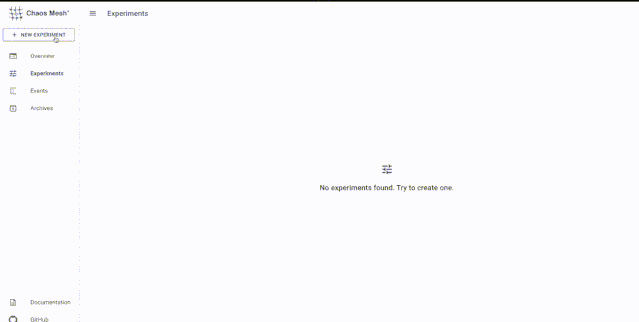
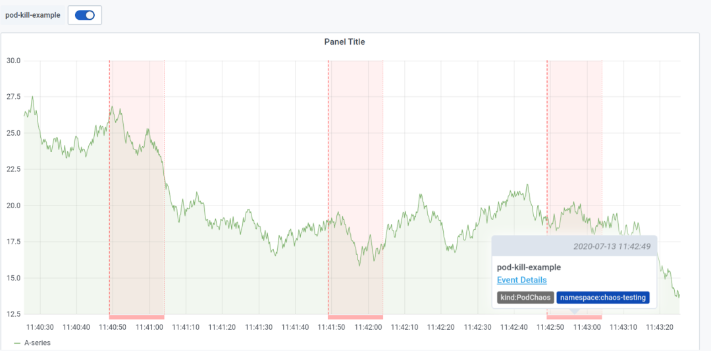

# Chaos Mesh 1.0 正式发布

继2020年7月作为沙盒项目进入 CNCF 后，[Chaos Mesh](https://chaos-mesh.org/) 1.0 于近日正式发布，Chaos Mesh 1.0 是重要里程碑，经过开源社区内10个月的努力，Chaos Mesh 在功能、可扩展性和易用性方面已经准备就绪。不仅支持更多混沌注入的类型，提高了框架组件的稳定性，并且增加了 Chaos Dashboard 组件用来改善 Chaos Mesh 的易用性。

## 1. 丰富易用的混沌实验类型

**Chaos Mesh 起源于分布式数据库 TiDB 的测试框架，所以它考虑到了分布式系统可能出现的故障**。

提供更加全面、细粒度的故障类型，能全方位的帮用户对网络、磁盘、文件系统、操作系统等进行故障注入。**同时，使用 Chaos Mesh，不需要应用做任何修改，做到真正的被测试系统无感知。Chaos Mesh 目前支持的故障注入有**：

* `pod-kill`：模拟 Kubernetes Pod 被 kill。
* `pod-failure`：模拟 Kubernetes Pod 持续不可用，可以用来模拟节点宕机不可用场景。
* `container-kill`：模拟 Container 被 kill。
* `network-latency`：模拟网络延迟。
* `network-loss`：模拟网络丢包。
* `network-duplication`：模拟网络包重复。
* `network-corrupt`：模拟网络包损坏。
* `network-partition`：模拟网络分区。
* `cpu-burn`：模拟 CPU 压力。
* `memory-bur`n：模拟 Memory 压力。
* `clock-skew`：模拟时钟偏移。
* `io-latency`：模拟文件系统 I/O 延迟。
* `io-fault`：模拟文件系统 I/O 错误。
* `io-attribution-override`：模拟文件异常。
* `kernel-injection`: 模拟内核故障

## 2. 简单易用的可视化界面

`Chaos Dashboard`组件是 `Chaos Mesh` 用户编排 `Chaos` 实验的一站式`Web` 界面。

此前，`Chaos Dashboard`仅适用于测试`TiDB`，随着 Chaos Mesh 1.0的推出，所有人都可以使用它，`Chaos Dashboard` 极大简化了混沌实验的复杂度，用户可以直接通过可视化界面来管理和监控混沌实验，**仅需鼠标点一点就能够定义混沌实验的范围、指定混沌注入类型、定义调度规则，以及在界面上获取到混沌实验的结果等**。

## 3. 增强的 Grafana 插件支持

为了进一步提高混沌实验的可观测性，Chaos Mesh 1.0 单独开发了 Grafana 插件，方便用户直接将混沌实验的运行信息展示在自己的监控面板上。

**用户在 Grafana 上安装了此插件后，可以直接在应用的监控面板上开启混沌实验信息按钮，此时混沌实验的相关信息会以 Annotations 的方式在当前的面板上展示出来，这样用户就可以在一个界面上同时观察到应用的运行情况以及当前运行的混沌实验信息。**

## 4. 安全可控的混沌实验

当在进行混沌实验的时候，我们需要严格的控制实验范围，只影响需要测试的应用程序，避免导致整体应用的雪崩。Chaos Mesh 在 1.0 版本中不仅提供了丰富的选择器来控制实验范围，**还支持设置被保护的 Namespaces 用来保护重要应用。此外，在 1.0 中 Chaos Mesh 还支持在 Namespace 权限使用，也就是说用户可以在单个 Namespace 下安装 Chaos Mesh 或者是把 Chaos Mesh 的权限范围限制在特定某个 Namespace 下，如此一来可以更大程度控制实验的“爆炸半径”，提供更加安全的混沌实验体现。**

