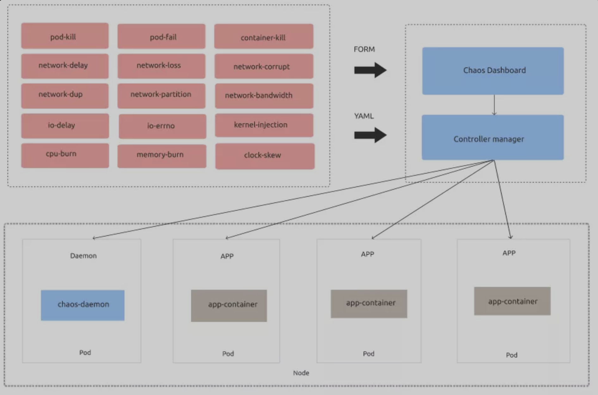
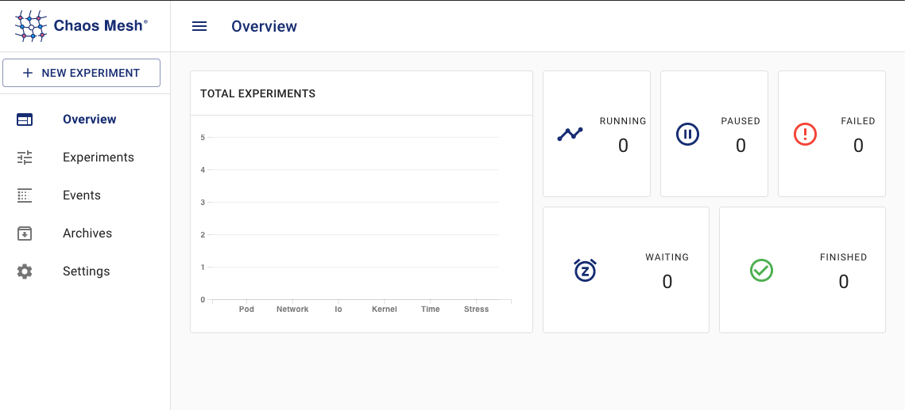
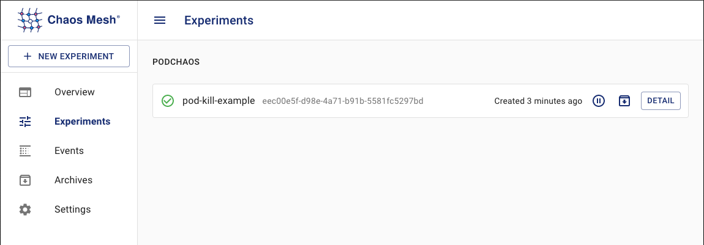
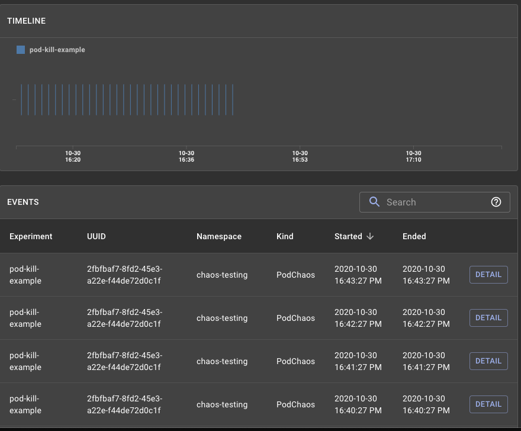

# Chaos Mesh 入门教程

**混沌工程是在分布式系统上进行实验的学科，目的是建立对系统抵御生产环境中失控条件的能力以及信心。**


即使分布式系统中的所有单个服务都正常运行, 这些服务之间的交互也会导致不可预知的结果。这些不可预知的结果, 由影响生产环境的罕见且破坏性的事件复合而成，令这些分布式系统存在内在的混沌。

我们需要在异常行为出现之前，在整个系统内找出这些弱点。这些弱点包括以下形式:


* **当服务不可用时的不正确回滚设置;**
* **不当的超时设置导致的重试风暴;**
* **由于下游依赖的流量过载导致的服务中断;**
* **单点故障时的级联失败等**。

我们采用基于经验和系统的方法解决了分布式系统在规模增长时引发的问题，并以此建立对系统抵御这些事件的能力和信心，通过在受控实验中观察分布式系统的行为来了解它的特性，**我们称之为混沌工程。**

## 什么是 Chaos Mesh?

Chaos Mesh®是云原生计算基金会（CNCF）托管的项目。

Chaos Mesh 是一个通用的混沌工程解决方案，它的特点是对Kubernetes 上的复杂系统进行全方位的**故障注入方法，涵盖了 Pod、网络、文件系统甚至内核的故障。Chaos Mesh 主要包括下面两个组件：**

* **Chaos Operator：混沌编排的核心组件。**
* **Chaos Dashboard：用于管理、设计、监控混沌实验的 Web UI。**

`Chaos Mesh` 使用 `CRD` 来定义混沌对象。

`Chaos Mesh` 的整体架构非常简单，组件部署在 Kubernetes 之上，我们可以使用 YAML 文件或者使用 `Chaos mesh Dashboard` 上的 `Form` 来指定场景。

**其中会有一个 `Chaos Daemon`，以 `Daemonset` 的形式运行，对特定节点的网络、Cgroup 等具有系统权限**。




目前实现的 CRD 对象支持6种类型的故障注入，分别是 **PodChaos、NetworkChaos、IOChaos、TimeChaos、StressChaos 和 KernelChaos**，对应的主要动作如下所示：

* `pod-kill`：模拟 Kubernetes Pod 被 kill。
* `pod-failure`：模拟 Kubernetes Pod 持续不可用，可以用来模拟节点宕机不可用场景。
* `network-delay`：模拟网络延迟。
* `network-loss`：模拟网络丢包。
* `network-duplication`: 模拟网络包重复。
* `network-corrupt`: 模拟网络包损坏。
* `network-partition`：模拟网络分区。
* `I/O delay` : 模拟文件系统 I/O 延迟。
* `I/O errno`：模拟文件系统 I/O 错误 。

### 安装

我们可以直接在 `Kubernetes` 集群上很方便地安装 `Chaos Mesh`，这里我们也可以使用轻量级的 `Kind` 搭建的 `Kubernetes` 集群。当然在部署之前，先确保 `Docker` 已在本地机器上安装并运行。

```
$ curl -sSL https://mirrors.chaos-mesh.org/v1.0.1/install.sh | bash
```

**上面的命令会安装所有的 `CRD`、`ServiceAccount` 和所有组件，如果你使用的是 `k3s `或 `k3d`，需要指定 kind 参数。**

```
$ curl -sSL https://mirrors.chaos-mesh.org/v1.0.1/install.sh | bash -s —-local kind
```

如果你已经安装了大于 0.7 版本的Kind，那么脚本将继续，否则将安装一个新的版本。脚本运行后的输出结果如下所示：

```
Install kubectl client
kubectl Version 1.18.8 has been installed
Install Kind tool
Kind Version 0.8.1 has been installed
Install local Kubernetes kind
No kind clusters found.
Clean data dir: /Users/rbanka/kind/kind/data
start to create kubernetes cluster kindCreating cluster "kind" ...
DEBUG: docker/images.go:58] Image: kindest/node:v1.17.2 present locally
 ✓ Ensuring node image (kindest/node:v1.17.2) 🖼
 ✓ Preparing nodes 📦 📦 📦 📦
 ✓ Writing configuration 📜
 ✓ Starting control-plane 🕹️
 ✓ Installing CNI 🔌
 ✓ Installing StorageClass 💾
 ✓ Joining worker nodes 🚜
Set kubectl context to "kind-kind"
You can now use your cluster with:
kubectl cluster-info --context kind-kind
Thanks for using kind! 😊
Install Chaos Mesh chaos-mesh
customresourcedefinition.apiextensions.k8s.io/iochaos.chaos-mesh.org created
customresourcedefinition.apiextensions.k8s.io/kernelchaos.chaos-mesh.org created
customresourcedefinition.apiextensions.k8s.io/networkchaos.chaos-mesh.org created
customresourcedefinition.apiextensions.k8s.io/podchaos.chaos-mesh.org created
customresourcedefinition.apiextensions.k8s.io/podiochaos.chaos-mesh.org created
customresourcedefinition.apiextensions.k8s.io/podnetworkchaos.chaos-mesh.org created
customresourcedefinition.apiextensions.k8s.io/stresschaos.chaos-mesh.org created
customresourcedefinition.apiextensions.k8s.io/timechaos.chaos-mesh.org created
namespace/chaos-testing created
serviceaccount/chaos-controller-manager created
secret/chaos-mesh-webhook-certs created
clusterrole.rbac.authorization.k8s.io/chaos-mesh:chaos-controller-manager-target-namespace created
clusterrole.rbac.authorization.k8s.io/chaos-mesh:chaos-controller-manager-cluster-level created
clusterrolebinding.rbac.authorization.k8s.io/chaos-mesh:chaos-controller-manager-cluster-level created
clusterrolebinding.rbac.authorization.k8s.io/chaos-mesh:chaos-controller-manager-target-namespace created
role.rbac.authorization.k8s.io/chaos-mesh:chaos-controller-manager-control-plane created
rolebinding.rbac.authorization.k8s.io/chaos-mesh:chaos-controller-manager-control-plane created
service/chaos-dashboard created
service/chaos-mesh-controller-manager created
daemonset.apps/chaos-daemon created
deployment.apps/chaos-dashboard created
deployment.apps/chaos-controller-manager created
mutatingwebhookconfiguration.admissionregistration.k8s.io/chaos-mesh-mutation created
validatingwebhookconfiguration.admissionregistration.k8s.io/chaos-mesh-validation created
Waiting for pod running
chaos-controller-manager-754d4f7585-h9p4c   0/1   ContainerCreating   0     10s
Waiting for pod running
chaos-controller-manager-754d4f7585-h9p4c   0/1   ContainerCreating   0     21s
Waiting for pod running
chaos-controller-manager-754d4f7585-h9p4c   0/1   ContainerCreating   0     31s
Waiting for pod running
Chaos Mesh chaos-mesh is installed successfully
```

要验证组件是否在 Kubernetes Cluster 上运行成功，可以使用以下方法检查。

```
$ kubectl get pod -n chaos-testing
NAME                                        READY   STATUS    RESTARTS   AGE
chaos-controller-manager-86c96f985f-bhtj8   1/1     Running   0          3h33m
chaos-daemon-rhv22                          1/1     Running   0          3h33m
chaos-dashboard-5d8dff7df9-6zgkc            1/1     Running   0          3h33m
```

我们可以看到有3个组件处于运行状态，controller、dashboard 以及作为 Daemonset 的运行混沌 daemon 进程。接着检查下 CRD 是否在集群上创建成功。

```
$ kubectl get crds | grep chaos
iochaos.chaos-mesh.org                  2020-10-30T02:51:54Z
kernelchaos.chaos-mesh.org              2020-10-30T02:51:54Z
networkchaos.chaos-mesh.org             2020-10-30T02:51:54Z
podchaos.chaos-mesh.org                 2020-10-30T02:51:54Z
podiochaos.chaos-mesh.org               2020-10-30T02:51:54Z
podnetworkchaos.chaos-mesh.org          2020-10-30T02:51:54Z
stresschaos.chaos-mesh.org              2020-10-30T02:51:54Z
timechaos.chaos-mesh.org                2020-10-30T02:51:54Z
```

这些 CRD 就代表了上面详细提到的各种故障注入的使用对象。

要访问 `Dashboard`，我们将使用 `kube-proxy`，或者你可以直接在`Loadbalance`r 上暴露它。显示获取 `Chaos mesh Dashbaord `上的容器端口。

```
$ kubectl get deploy chaos-dashboard -n chaos-testing -o=jsonpath="{.spec.template.spec.containers[0].ports[0].containerPort}{'\n'}"
2333
```

输出显示 Dashboard 正在监听的端口。然后紧接着我们把本地端口转发到 Pod 上的端口，我们可以从上面得到 pod 名称得到 pod 输出。

```
$ kubectl get svc -n chaos-testing
NAME                            TYPE        CLUSTER-IP       EXTERNAL-IP   PORT(S)                       AGE
chaos-dashboard                 NodePort    10.100.239.125   <none>        2333:31376/TCP                17h
chaos-mesh-controller-manager   ClusterIP   10.110.152.78    <none>        10081/TCP,10080/TCP,443/TCP   17h
```

现在我们可以通过 `http://localhost:31376` 访问 Dashboard 了。从 Dashboard 上可以看到，目前我们还没有创建任何实验。



> 创建混沌实验

这里我们定义一个测试场景，在这个场景中，我们将为一个命名空间中的 Pod 配置 Chaos，它将被安排每1分钟杀死一个 Pod。

**本例中 App 没有标签选择器，所以在多副本部署的情况下，它可以杀死任何 Pod。我们可以在配置中拥有不同的作用域。**

首先让我们克隆我们的示例仓库来获得 YAML 资源清单文件。

```
$ git clone https://github.com/ronakbanka/chaos-mesh-examples.git
cd chaos-mesh-examples/pod-chaos
```

然后使用 Kubectl 应用命名空间选择器定义的文件，这将创建3个资源对象。

```
$ kubectl apply -f pod-namespace-selector.yml
namespace/appns created
deployment.apps/nginx created
podchaos.chaos-mesh.org/pod-kill-example created
```

现在我们切换到 `Chaos Mesh Dashboard `上验证这个实验，使用上面同样的步骤进入。



我们可以看到实验已经被创建了，点击 pod-kill-example 旁边的 DETAIL 按钮可以来获取我们实验的详细信息。


详细内容基本上和我们的 YAML 文件中的 PodChaos 对象描述是一样的。

```
---
apiVersion: chaos-mesh.org/v1alpha1
kind: PodChaos
metadata:
  name: pod-kill-example
  namespace: chaos-testing
spec:
  action: pod-kill
  mode: one
  selector:
    namespaces:
      - appns
  scheduler:
    cron: "@every 1m"
```

现在，让我们在终端上使用 kubectl 来验证 pod 故障：

* 初始化状态

```
$ kubectl get pods -n appns -w
NAME                     READY   STATUS    RESTARTS   AGE
nginx-86c57db685-57l8j   1/1     Running   0          7s
nginx-86c57db685-mf2m9   1/1     Running   0          5m7s
nginx-86c57db685-szvqx   1/1     Running   0          3m7s
```

* 中间状态

```
$ kubectl get pod -n appns  -w
NAME                    READY   STATUS              RESTARTS   AGE
nginx-f89759699-6zsfj   0/1     ContainerCreating   0          2s
nginx-f89759699-7hcq4   1/1     Running             0          5m2s
nginx-f89759699-n46p4   1/1     Running             0          62s
nginx-f89759699-6zsfj   1/1     Running             0          7s
nginx-f89759699-n46p4   1/1     Terminating         0          2m
nginx-f89759699-n46p4   1/1     Terminating         0          2m
nginx-f89759699-cf7w9   0/1     Pending             0          0s
nginx-f89759699-cf7w9   0/1     Pending             0          0s
nginx-f89759699-cf7w9   0/1     ContainerCreating   0          0s
nginx-f89759699-cf7w9   1/1     Running             0          7s
```

最终状态

```
$ kubectl get pods -n appns
NAME                    READY   STATUS    RESTARTS   AGE
nginx-f89759699-l747h   1/1     Running   0          16h
nginx-f89759699-p55mh   1/1     Running   0          16h
nginx-f89759699-zxkhp   1/1     Running   0          16h
```

我们可以看到此时有2个 Pod 被重新创建，另外，我们还可以在实验详情下查看 Chaos Mesh Dashboard 上的事件。




实验完成后我们可以执行下面的步骤来清理卸载组件，也包括 kind 创建的集群。

```
$ kubectl delete ns chaos-testing
$ kind delete cluster --name=kind
```

我们还可以使用 Chaos Mesh 创建各种各样的故障场景，后面我们再分别介绍一些其他场景。

