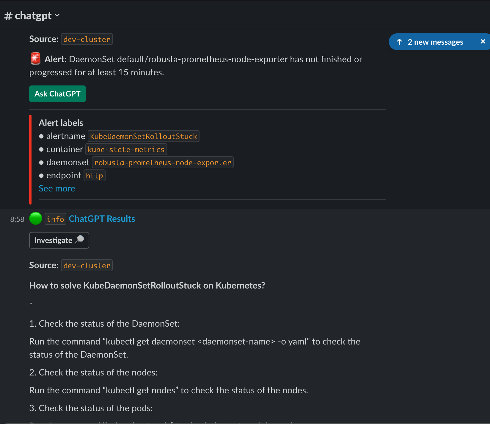
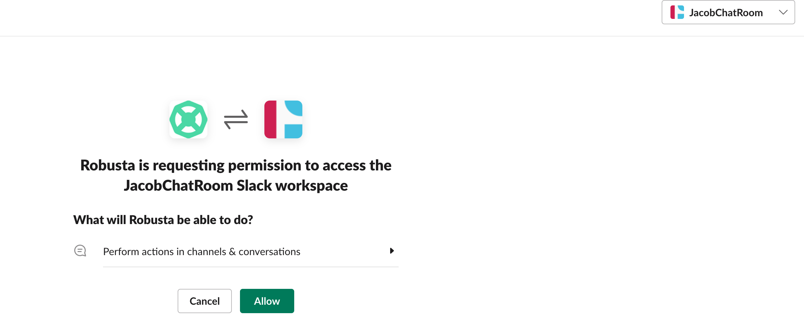
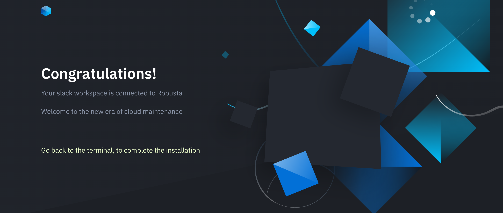
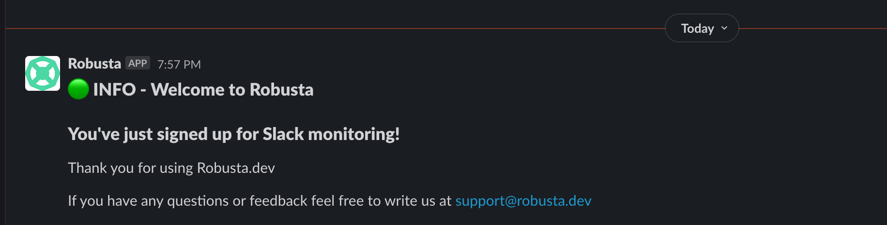
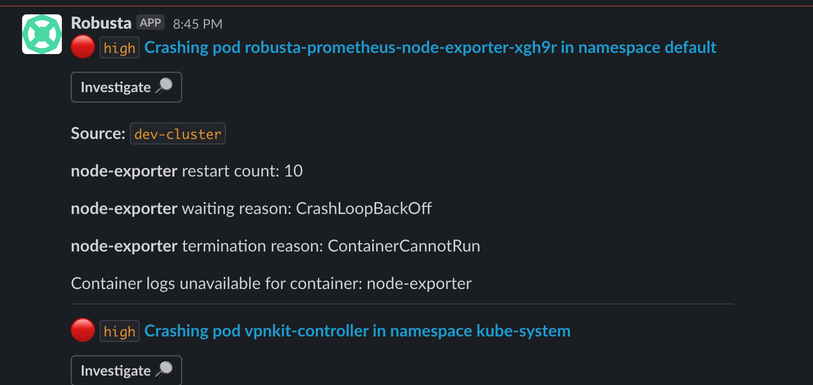
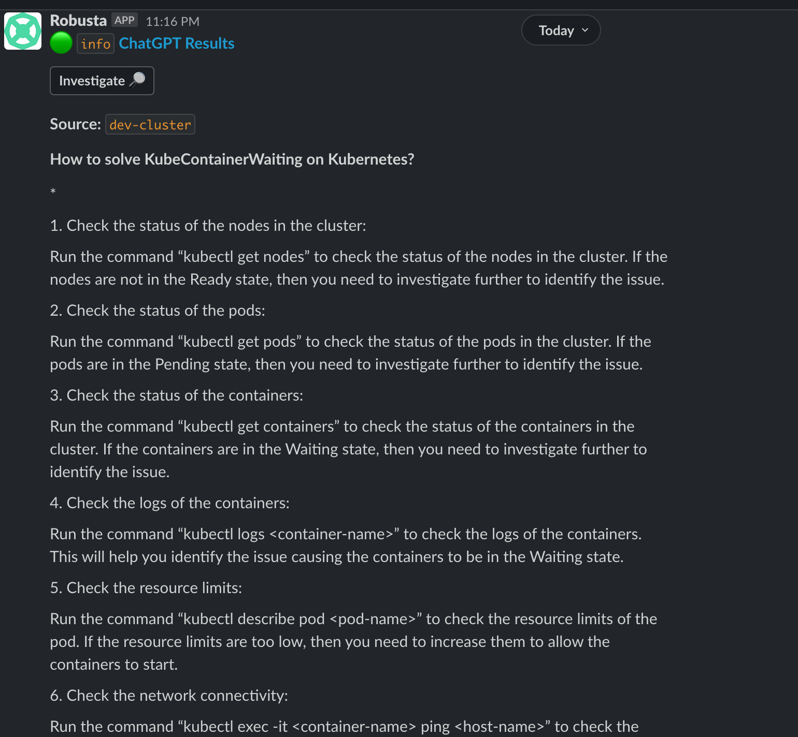
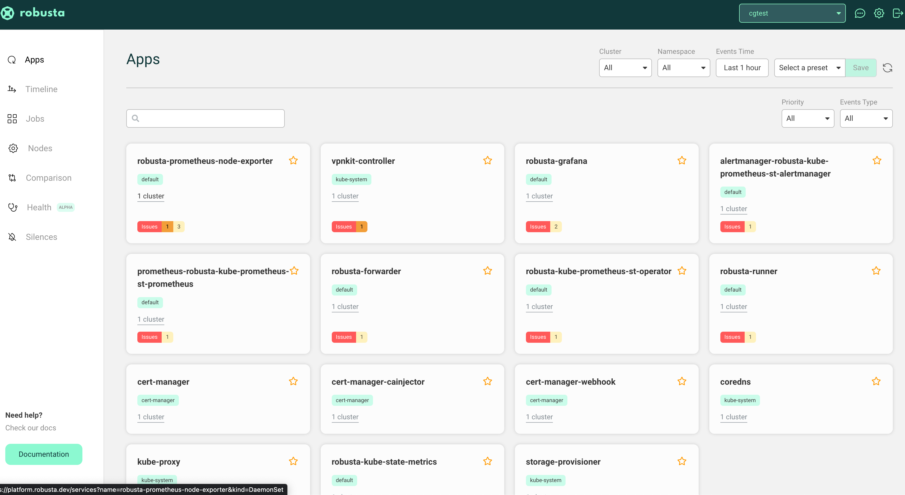

# **1 为Kubernetes集群部署一个ChatGPT机器人**

一个有趣的项目叫做 “[K8s ChatGPT Bot](https://github.com/robusta-dev/kubernetes-chatgpt-bot)”。该项目的目的是为 K8s 集群部署一个 ChatGPT 机器人。我们可以询问 ChatGPT 帮助我们解决 Prometheus 的警报，可以得到简洁的答复，不再需要一人在黑暗中独自解决警报问题！

我们需要用到 Robusta，如果你还没有 Robusta，可以参考《[K8s — Robusta, K8s Troubleshooting Platform](https://medium.com/dev-genius/k8s-robusta-k8s-troubleshooting-platform-efd389b47f24)》搭建一个 Robusta 平台。

下图是 Robusta 平台如何工作的截图：



## 1 运行 K8s ChatGPT 机器人项目

该机器人项目是基于 [Robusta.dev](https://github.com/robusta-dev/robusta) 实现的，Robusta.dev 是一个用于响应 K8s 警报的开源平台。其工作流程大致如下：

* Prometheus 使用 Webhook 接收器将警报转发给 Robusta.dev 。
* Robusta.dev 询问 ChatGPT 如何修复 Prometheus 警报。

## 2  先决条件

* Slack
* Kubernetes 集群
* Python 3.7 及以上

## 3 如何安装 Robusta

### **3-1 生成 Robusta 配置文件**

为 Robusta 准备 Python 虚拟环境。

```
$ python -m venv robusta

$ source robusta/bin/activate
(robusta) $ pip install -U robusta-cli --no-cache

Successfully installed PyJWT-2.4.0 appdirs-1.4.4 autopep8-2.0.1 black-21.5b2 cachetools-5.3.0 certifi-2022.12.7 cffi-1.15.1 charset-normalizer-3.0.1 click-8.1.3 click-spinner-0.1.10 colorlog-5.0.1 cryptography-36.0.2 docutils-0.17.1 dpath-2.1.4 future-0.18.3 google-auth-2.16.0 hikaru-0.5.1b0 idna-3.4 kubernetes-12.0.1 markdown2-2.4.7 mypy-extensions-1.0.0 oauthlib-3.2.2 opsgenie-sdk-2.1.5 pathspec-0.11.0 prometheus-client-0.12.0 pyasn1-0.4.8 pyasn1-modules-0.2.8 pycodestyle-2.10.0 pycparser-2.21 pydantic-1.10.4 pymsteams-0.1.16 python-dateutil-2.8.2 pytz-2021.3 pyyaml-6.0 regex-2022.10.31 requests-2.28.2 requests-oauthlib-1.3.1 requests-toolbelt-0.10.1 robusta-cli-0.10.11 rsa-4.9 ruamel.yaml-0.17.21 ruamel.yaml.clib-0.2.7 six-1.16.0 slack-sdk-3.19.5 tenacity-8.2.0 toml-0.10.2 tomli-2.0.1 typer-0.4.2 typing-extensions-4.4.0 urllib3-1.26.14 watchgod-0.7 webexteamssdk-1.6.1 websocket-client-1.3.3
```

使用 robusta 生成一个配置文件：

```
$ robusta gen-config
Robusta reports its findings to external destinations (we call them "sinks").
We'll define some of them now.

Configure Slack integration? This is HIGHLY recommended. [Y/n]: Y
If your browser does not automatically launch, open the below url:
https://api.robusta.dev/integrations/slack?id=xxxx-xxxxx
You've just connected Robusta to the Slack of: JacobChatRoom
Which slack channel should I send notifications to? # chatgpt
Configure MsTeams integration? [y/N]: n
Configure Robusta UI sink? This is HIGHLY recommended. [Y/n]: y
Enter your Gmail/Google address. This will be used to login: xxxx@gmail.com
Choose your account name (e.g your organization name): cgtest              
Successfully registered.

Robusta can use Prometheus as an alert source.
If you haven't installed it yet, Robusta can install a pre-configured Prometheus.
Would you like to do so? [y/N]: y
Please read and approve our End User License Agreement: https://api.robusta.dev/eula.html
Do you accept our End User License Agreement? [y/N]: y
Last question! Would you like to help us improve Robusta by sending exception reports? [y/N]: y
Saved configuration to ./generated_values.yaml - save this file for future use!
Finish installing with Helm (see the Robusta docs). Then login to Robusta UI at https://platform.robusta.dev
```

### **3-2 配置 Slack 集成**

使用浏览器打开网页：https://api.robusta.dev/integrations/slack?id=xxxx

更新权限：




恭喜你配置 Slack 集成成功。



现在回到我们的 Terminal 终端，我们可以看到以下内容，说明操作成功：

```
...
Saved configuration to ./generated_values.yaml - save this file for future use!
Finish installing with Helm (see the Robusta docs). Then login to Robusta UI at https://platform.robusta.dev
```

在 slack channel 中，我们还可以看到：



### **3-3 使用 Helm3 安装 Robusta**

安装和更新 robusta 仓库。

```
$ helm repo add robusta https://robusta-charts.storage.googleapis.com && helm repo update
"robusta" has been added to your repositories
Hang tight while we grab the latest from your chart repositories...
...Successfully got an update from the "kedacore" chart repository
...Successfully got an update from the "robusta" chart repository
...Successfully got an update from the "grafana" chart repository
...Successfully got an update from the "prometheus-community" chart repository
...Successfully got an update from the "stable" chart repository
Update Complete. ⎈Happy Helming!⎈

$ helm repo list | grep robusta
robusta         https://robusta-charts.storage.googleapis.com
```

更新 `generated_values.yaml` 文件

```
globalConfig:
  signing_key: xxxxx
  account_id: xxxx
  chat_gpt_token: sk-xxxx
sinksConfig:
- slack_sink:
....
- robusta_sink:
...

playbookRepos:
  chatgpt_robusta_actions:
    url: "https://github.com/robusta-dev/kubernetes-chatgpt-bot.git"

customPlaybooks:
# Add the 'Ask ChatGPT' button to all Prometheus alerts
- triggers:
  - on_prometheus_alert: {}
  actions:
  - chat_gpt_enricher: {}
```

将 Robusta 部署到 K8s

```
$ helm install robusta robusta/robusta -f ./generated_values.yaml --set clusterName=dev-cluster

...

As an open source project, we collect general usage statistics.
This data is extremely limited and contains only general metadata to help us understand usage patterns.
If you are willing to share additional data, please do so! It really help us improve Robusta.

You can set sendAdditionalTelemetry: true as a Helm value to send exception reports and additional data.
This is disabled by default. 

To opt-out of telemetry entirely, set a ENABLE_TELEMETRY=false environment variable on the robusta-runner deployment.


Visit the web UI at: https://platform.robusta.dev/
(robusta) 
```

```
 $ kubectl get pods -A | grep robusta
default        alertmanager-robusta-kube-prometheus-st-alertmanager-0   2/2     Running             1 (5m29s ago)   5m31s
default        prometheus-robusta-kube-prometheus-st-prometheus-0       2/2     Running             0               24m
default        robusta-forwarder-7cbf59c9db-hnx2h                       1/1     Running             0               31m
default        robusta-grafana-6fcc8676df-gc9dd                         3/3     Running             0               31m
default        robusta-kube-prometheus-st-operator-75fb45b594-fmrg2     1/1     Running             0               31m
default        robusta-kube-state-metrics-d6bb949d-pjl6t                1/1     Running             0               31m
default        robusta-prometheus-node-exporter-ll4bd                   0/1     RunContainerError   3 (3s ago)      43s
default        robusta-runner-68ff9c6c66-xbpn9                          1/1     
```
```
$ robusta logs

...
2023-03-22 12:35:00.836 INFO     Adding <class 'robusta.core.sinks.slack.slack_sink_params.SlackSinkConfigWrapper'> sink named main_slack_sink
2023-03-22 12:35:01.566 INFO     Adding <class 'robusta.core.sinks.robusta.robusta_sink_params.RobustaSinkConfigWrapper'> sink named robusta_ui_sink
2023-03-22 12:35:01.661 INFO     Supabase dal login
2023-03-22 12:35:03.087 INFO     cluster status {'account_id': 'd53afe19-a0fa-4850-ab7d-4157baf784fe', 'cluster_id': 'dev-cluster', 'version': '0.10.11', 'light_actions': 0, 'ttl_hours': 4380, 'updated_at': 'now()'}
2023-03-22 12:35:04.520 INFO     Initializing TopServiceResolver
2023-03-22 12:35:06.683 INFO     Cluster discovery initialized
2023-03-22 12:35:06.723 INFO     created jobs states configmap scheduled-jobs default
2023-03-22 12:35:06.744 INFO     Loading RSA keys from /etc/robusta/auth
2023-03-22 12:35:06.748 INFO     Loaded private key file /etc/robusta/auth/prv
2023-03-22 12:35:06.749 INFO     Loaded public key file /etc/robusta/auth/pub
2023-03-22 12:35:06.749 INFO     starting relay receiver
2023-03-22 12:35:06.750 INFO     Telemetry set to include error info, Thank you for helping us improve Robusta.
2023-03-22 12:35:06.925 INFO     Initialized task queue: 20 workers. Max size 500
2023-03-22 12:35:06.932 INFO     Initialized task queue: 20 workers. Max size 500
 * Serving Flask app 'robusta.runner.web'
 * Debug mode: off
2023-03-22 12:35:07.436 INFO     cluster status {'account_id': 'd53afe19-a0fa-4850-ab7d-4157baf784fe', 'cluster_id': 'dev-cluster', 'version': '0.10.11', 'light_actions': 29, 'ttl_hours': 4380, 'updated_at': 'now()'}
2023-03-22 12:35:07.711 INFO     connecting to server as account_id=d53afe19-a0fa-4850-ab7d-4157baf784fe; cluster_name=dev-cluster
2023-03-22 12:35:09.311 INFO     Initializing services cache
2023-03-22 12:35:11.906 INFO     Initializing nodes cache
2023-03-22 12:35:14.268 INFO     Initializing jobs cache
2023-03-22 12:35:15.260 INFO     Initializing namespaces cache
2023-03-22 12:35:16.862 INFO     Getting events history
2023-03-22 12:35:44.449 INFO     Cluster historical data sent.
```


## 4  使用 Robusta

现在，我们终于可以使用 Robusta 了！默认情况下，Robusta 在当 K8s Pod 崩溃时发送通知。

因此，让我们创建一个崩溃的 Pod：

```
$ kubectl apply -f https://gist.githubusercontent.com/robusta-lab/283609047306dc1f05cf59806ade30b6/raw
deployment.apps/crashpod created

$ kubectl get pods -A | grep crash
default       crashpod-64db77b594-cgz4s       
```



## 5 与 ChatGPT 互动

经过我们的实验，我们已经确认 Robusta 已与我们的 Slack 和 K8s 集群集成。接下来让我们与 ChatGPT 机器人进行交互！

立即触发 Prometheus 警报，跳过正常延迟：

```
$ robusta playbooks trigger prometheus_alert alert_name=KubePodCrashLooping namespace=default pod_name=example-pod

======================================================================
Triggering action...
======================================================================
running cmd: curl -X POST http://localhost:5000/api/trigger -H 'Content-Type: application/json' -d '{"action_name": "prometheus_alert", "action_params": {"alert_name": "KubePodCrashLooping", "namespace": "default", "pod_name": "example-pod"}}'
{"success":true}


======================================================================
Fetching logs...
======================================================================
2023-03-22 12:49:38.602 INFO     Error loading kubernetes pod default/example-pod. reason: Not Found status: 404
2023-03-22 12:49:38.619 INFO     Error loading kubernetes pod default/example-pod. reason: Not Found status: 404
2023-03-22 12:49:38.631 INFO     Error loading kubernetes pod default/example-pod. reason: Not Found status: 404
2023-03-22 12:49:38.634 ERROR    cannot run pod_events_enricher on alert with no pod object: PrometheusKubernetesAlert(sink_findings=defaultdict(<class 'list'>, {'main_slack_sink': [<robusta.core.reporting.base.Finding object at 0x7fbe15ab74c0>], 'robusta_ui_sink': [<robusta.core.reporting.base.Finding object at 0x7fbe15ab7370>]}), named_sinks=['main_slack_sink', 'robusta_ui_sink'], response={'success': True}, stop_processing=False, _scheduler=<robusta.integrations.scheduled.playbook_scheduler_manager_impl.PlaybooksSchedulerManagerImpl object at 0x7fbe153b9820>, _context=ExecutionContext(account_id='d53afe19-a0fa-4850-ab7d-4157baf784fe', cluster_name='dev-cluster'), obj=None, alert=PrometheusAlert(endsAt=datetime.datetime(2023, 3, 22, 12, 49, 38, 559715), generatorURL='', startsAt=datetime.datetime(2023, 3, 22, 12, 49, 38, 559719), fingerprint='', status='firing', labels={'severity': 'error', 'namespace': 'default', 'alertname': 'KubePodCrashLooping', 'pod': 'example-pod'}, annotations={}), alert_name='KubePodCrashLooping', alert_severity='error', label_namespace='default', node=None, pod=None, deployment=None, job=None, daemonset=None, statefulset=None)
2023-03-22 12:49:38.652 INFO     Error loading kubernetes pod default/example-pod. reason: Not Found status: 404
======================================================================
Done!
======================================================================
```

现在切换到 Slack，我们将看到一个新警报，并且这次带有 “Ask ChatGPT” 的按钮！




## 6 Robusta UI

Robusta 有一个用于集成的 UI，也有一个预配置的 Promethus 系统，如果你还没有自己的 K8s 集群，并且想尝试一下这个 ChatGPT 机器人，你可以使用 Robusta 现有的！

[https://platform.robusta.dev/](https://platform.robusta.dev/)


