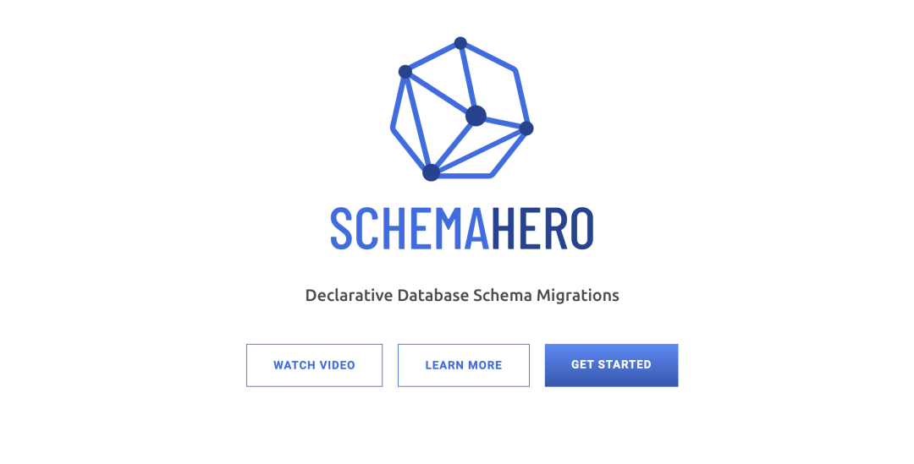
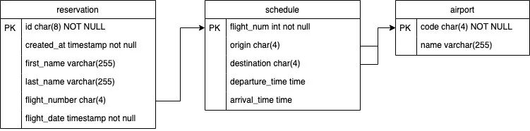
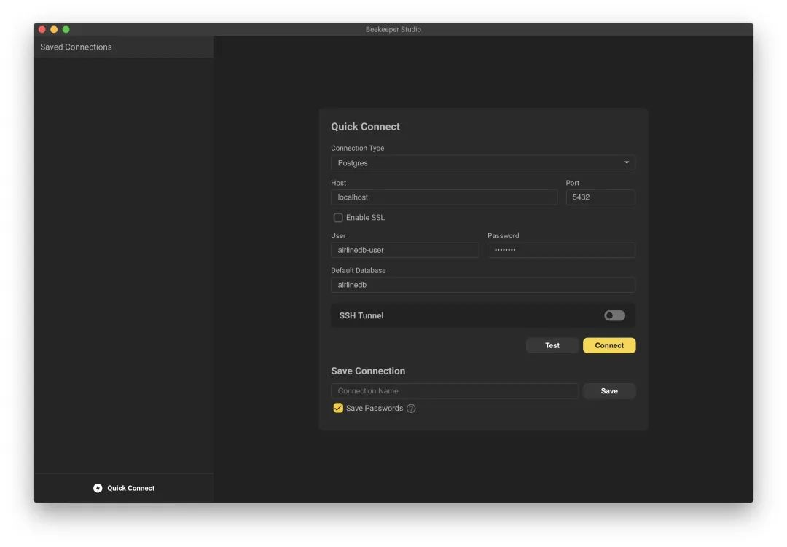
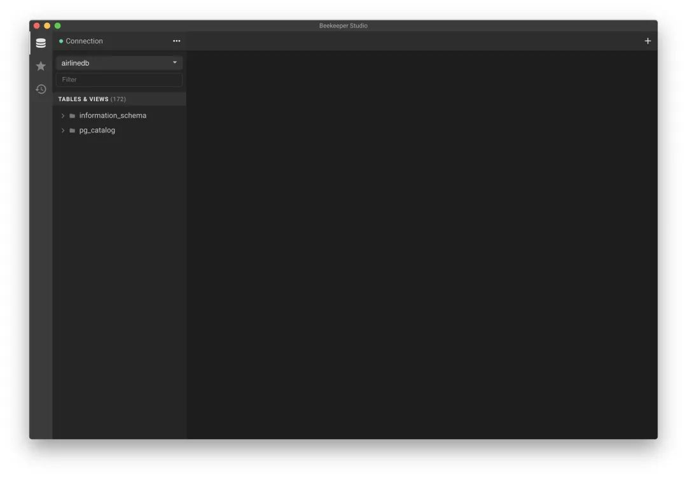
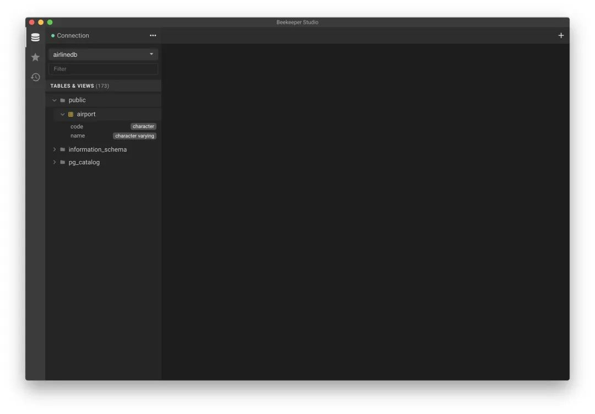
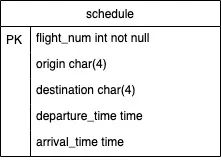
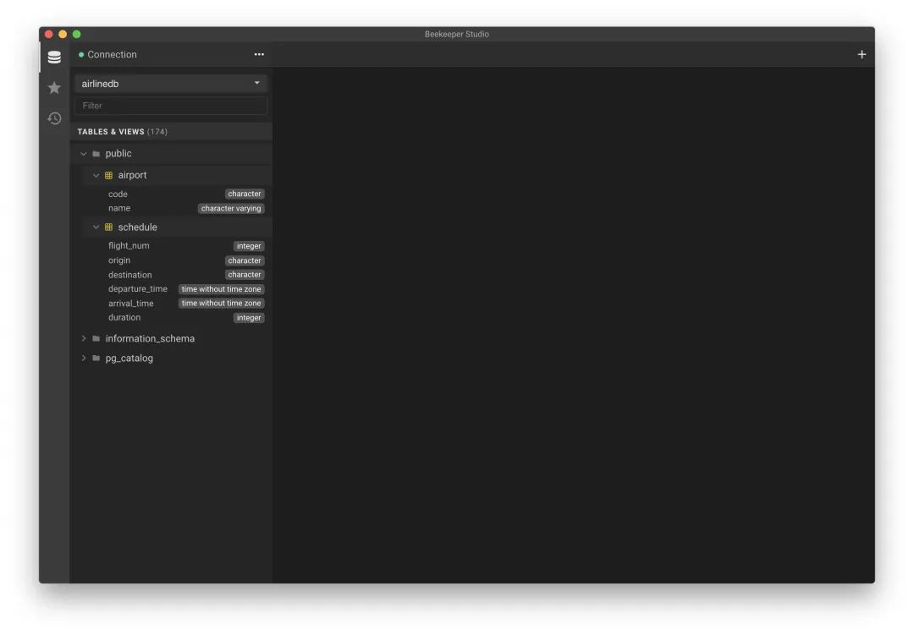

# **1 生声明式数据库结构迁移工具 - SchemaHero**



SchemaHero 是一个开源的声明式数据库 schema 迁移的云原生工具，可将 schema 定义转换为可在任何环境中应用的迁移脚本。

作为 CLI 工具和 Kubernetes Operator 编写的 SchemaHero 消除了创建和管理与运行应用程序的所有环境兼容的顺序迁移脚本的任务。

许多数据库 schema 管理工具创建了一个命令式接口，要求开发人员了解 schema 的当前状态以及将当前 schema（和相关数据）迁移到新的 schema 的相关命令，**SchemaHero 提出了一个声明式接口的方式来替换穿透的命令式接口**。

## **声明式模型**

以声明式方式管理数据库 schema 有很多好处，包括：

* 遵守变更管理流程的能力
* 可重复部署到新环境
* 兼容新运行时

在声明式模型中，仅定义 schema 的当前状态，声明式 schema 管理程序会负责将 schema 从之前的任何状态迁移到所需状态所需的命令，只存储当前状态的好处是，在创建新的环境或者实例时，将不需要以前使用的数据库扩展、表等数据。


**传统的数据库引擎通过被称为 DDL（数据定义语言）的 SQL 语句子集来接收 schema 变更**。

开发人员不需要为他们所针对的每个数据库引擎了解 DDL 之间的差别，根据数据库的能力和状态，从一个统一的声明式模型转换为适当的 DDL 命令可以通过编程方式进行处理。


当采用声明式模式来定义数据库 schema 管理时，就可以在应用之前根据一组策略来对 schema 进行验证。这对于只存储迁移脚本的命令式工具来说是不容易实现的。有了所需要的全部可用状态，就可以根据一组规则评估数据库 schema，以确保策略和最佳实践得以执行。

## **数据迁移**

有两种类型的迁移需要管理和部署。

* Schema 迁移
* 数据迁移

Schema 迁移可以使用用 SQL 语法来表示，并改变数据库的结构。这些往往是一些新的表、列变更、更改索引数据等等。这些都是常用的写法，并且总是可以用幂等的语法来表达。不同的数据库引擎对如何应用这些规则执行不同的规则。

**例如，MySQL 不允许在事务中执行 schema 迁移，而 Postgres 是可以的**。Schema 管理往往是数据库所独有的方式，而 SchemaHero 则专注于处理 schema 迁移。

> SchemaHero 目前专注于 schema  迁移，并计划在未来支持数据迁移。


## **使用**

接下来我们将来部署 SchemaHero 和一个示例数据库，将为一个虚拟的航空公司预订系统设计一个非常基本的数据库，并将其部署到 PostgreSQL 上去。

一开始我们将部署一个空数据库，创建一个初始 schema，然后修改该 schema，使其最终得到以下表结构：



## **安装 SchemaHero**

### **安装 kubectl 插件**

SchemaHero 客户端组件被打包成了一个 kubectl 插件，并通过 krew 包管理器发布，所以首先我们需要先安装 krew，安装了 krew 过后，使用下面的命令即可安装 SchemaHero 客户端。

```
$ kubectl krew install schemahero
```

安装后可以通过下面的命令来校验是否安装成功。

```
$ kubectl schemahero version
```

正常你会看到安装的 SchemaHero 版本（0.12.1 或类似版本）。


### **安装集群内组件**

一旦安装了 kubectl 插件，我们就可以安装 SchemaHero 在 Kubernetes 集群中的组件了，只需要使用下面的命令即可一键安装：

```
$ kubectl schemahero install
```

该命令将创建一个名为 `schemahero-system` 的命名空间，并部署一个 `SchemaHero operator`，可以通过执行以下命令来确认是否已经安装 SchemaHero：

```
$ kubectl get pods -n schemahero-system
```

正常情况下应该会看到 1 个 pod 正在运行，输出将类似于以下内容：

```
NAME           READY   STATUS    RESTARTS   AGE 
schemahero-0   1/1     Running   0          38s
```

客户端和集群组件都安装好过后，接下来我们可以去连接数据库。


### **连接数据库**

接下来我们需要部署一个 PostgreSQL 实例，然后配置 SchemaHero 来管理该数据库实例。

为了方便，我这里直接将 PostgreSQL 的 Helm Chart 模板渲染后的 YAML 文件添加到 SchemaHero 代码仓库中去，这里我们部署到一个名为 `schemahero-tutorial `的命名空间中去：

```
$ kubectl create ns schemahero-tutorial 
$ kubectl apply -n schemahero-tutorial -f https://raw.githubusercontent.com/schemahero/schemahero/main/examples/tutorial/postgresql/postgresql-11.8.0.yaml
```

PostgreSQL 部署完成后，我们可以使用下面的命令连接到该数据库实例：

```
$ kubectl exec -it -n schemahero-tutorial \
  postgresql-0 -- psql -U airlinedb-user -d airlinedb
```

其中 `airlinedb-user` 的密码为 password。

这里我们使用前面介绍过的 Beekeeper Studio 这个数据库管理工具来管理该数据库实例。

默认情况下上面我们部署的 PostgreSQL 实例无法在集群外访问，所以我们可以使用 kubectl 创建一个端口转发来暴露该数据库实例。

```
$ kubectl port-forward -n schemahero-tutorial svc/postgresql 5432:5432
```

然后我们就可以使用用户 airlinedb-user、数据库 airlinedb 和密码 password 连接到数据库 `127.0.0.01:5432`。



连接后可以看到现在数据库还是空的。



现在我们已经在集群中运行了 SchemaHero 和 PostgreSQL 实例，接下来我们可以向 SchemaHero 提供数据库信息，以便我们可以管理该数据库。我们可以通过使用连接信息将自定义资源部署到集群来实现。

database 对象可以允许 SchemaHero 管理数据库的 schema，database 中定义包括名称类型和连接参数。我们这里创建一个名为 airline-db.yaml 的文件，内容如下所示：

```
apiVersion: databases.schemahero.io/v1alpha4 
kind: Database 
metadata: 
  name: airlinedb 
  namespace: schemahero-tutorial 
spec: 
  connection: 
    postgres: 
      uri: 
        valueFrom: 
          secretKeyRef: 
            name: postgresql 
            key: uri
```
            
           
```
$ kubectl apply -f airline-db.yaml
$ kubectl get databases -n schemahero-tutorial 
NAME AGE 
airlinedb 47m
```          
          
现在我们就可以通过 SchemaHero 来管理我们的 PostgreSQL 实例了，接下来我们使用 SchemaHero 将一个新表部署到这个实例中。

### **新建表**
         
在这一步中，我们将把几个表部署到前面创建的 airlinesdb 数据库中去。在执行该操作时，我们将在 SchemaHero 中执行批准和拒绝工作流程，以了解如何在执行这些变更之前对其进行验证。

首先我们先定义一个简单的 airports 表，然后在我们的数据模型在定义路由时使用它。该表我们只定义了 2 列来表示机场代码和名称。

在使用 SchemaHero 之前我们可能会编写如下所示的 SQL 语句。

```
CREATE TABLE airport 
    ( code char(4) not null primary key, 
        name varchar(255) 
    )
```

而现在我们有了 SchemaHero 之后，就不需要编写 SQL 语句了，我们只需要创建为一个 SchemaHero 的 Table 自定义对象。

创建一个名为 airport-table.yaml 的资源清单文件，如下所示：

```
apiVersion: schemas.schemahero.io/v1alpha4 
kind: Table 
metadata: 
  name: airport 
  namespace: schemahero-tutorial 
spec: 
  database: airlinedb 
  name: airport 
  schema: 
    postgres: 
      primaryKey: [code] 
      columns: 
        - name: code 
          type: char(4) 
        - name: name 
          type: varchar(255) 
          constraints: 
            notNull: true
```

其中 spec.database 用来关联前面定义的 database 对象，**spec.name 是 Postgres 数据库中真实的数据表名称，然后在 spec.schema 中定义表的结构，primaryKey 可以用来指定主键，columns 定义数据表的列定义**。

同样直接应用该资源对象即可。

```
$ kubectl apply -f airport-table.yaml
```

需要注意的是尽管我们部署了 table 对象，但表结构并不会自动更改。

相反，一个新的（或编辑的）table 对象将生成一个 migration 对象，可以检查然后批准或拒绝该变更。

默认情况下，SchemaHero 需要审批流程，因为某些数据库结构迁移可能具有破坏性，可以通过向 database 对象添加属性来启用立即部署（未经批准）。

我们可以通过下面的命令查看到处于 pending 状态的迁移对象。

```
$ kubectl schemahero get migrations -n schemahero-tutorial
ID      DATABASE   TABLE     PLANNED EXECUTED APPROVED REJECTED 
eaa36ef airlinedb  airport   11s
```

如果没有找到资源，请等待几秒钟，然后重试，SchemaHero Operator 必须在 migration 可用之前完成 plan 阶段。

在批准该迁移之前，我们可以查看附加到 migration 对象上面生成的 SQL 语句。从上一个命令的输出中获取 ID，然后运行 describe migration 即可：

```
$ kubectl schemahero describe migration eaa36ef -n schemahero-tutorial

Migration Name: eaa36ef 

Generated DDL Statement (generated at 2020-06-06T10:41:04-07:00): 
  create table "airport" ("code" character (4), "name" character varying (255) not null, primary key ("code")); 

To apply this migration: 
  kubectl schemahero -n schemahero-tutorial approve migration eaa36ef 

To recalculate this migration against the current schema: 
  kubectl schemahero -n schemahero-tutorial recalculate migration eaa36ef 

To deny and cancel this migration: 
  kubectl schemahero -n schemahero-tutorial reject migration eaa36ef
```

在输出的顶部，生成的 DDL 语句是计划的迁移，这是 SchemaHero 将运行以应用此迁移的确切 SQL 语句。

在后面，SchemaHero 为后续步骤提供了 3 个命令：


* apply：运行此命令将接受 SQL 语句，SchemaHero 将对数据库执行它。
* recalculate：运行此命令将指示 SchemaHero 丢弃生成的 SQL 语句并再次生成它们。如果数据库结构已更改并且你希望 SchemaHero 重新执行计划，这将很有用。
* reject：运行此命令将拒绝迁移并且不执行它。

比如我们这里可以看到当前的迁移是安全的符合预期的，接下来我们可以批准迁移，以便让 SchemaHero 执行该计划，执行下面的命令即可：

```

$ kubectl schemahero -n schemahero-tutorial approve migration eaa36ef

Migration eaa36ef approved
```


我们可以再次运行 get migrations 来查看迁移的状态：

```
$ kubectl schemahero get migrations -n schemahero-tutorial
ID       DATABASE   TABLE    PLANNED  EXECUTED  APPROVED  REJECTED
eaa36ef  airlinedb  airport  9m38s    38s       52s
```

上面的信息表明迁移计划在 9 分 38 秒前，在 52 秒前批准，在 38 秒前执行。

现在我们在 `Beekeeper Studio `工具中单击左侧导航中 Tables & Views 标题上的刷新按钮，正常我们现在可以在 public 下看到 airport 表，点开该表，可以看到表中的列数据。




### **修改表**

接下来我们来部署一个 table 对象然后来修改表结构。

和前面一样，首先我们创建一个 schedule 表，结构如下所示：



定义一个对应的 Table 表对象，内容如下所示：

```
# schedule-table.yaml
apiVersion: schemas.schemahero.io/v1alpha4
kind: Table
metadata:
  name: schedule
  namespace: schemahero-tutorial
spec:
  database: airlinedb
  name: schedule
  schema:
    postgres:
      primaryKey: [flight_num]
      columns:
        - name: flight_num
          type: int
        - name: origin
          type: char(4)
          constraints:
            notNull: true
        - name: destination
          type: char(4)
          constraints:
            notNull: true
        - name: departure_time
          type: time
          constraints:
            notNull: true
        - name: arrival_time
          type: time
          constraints:
            notNull: true
```

直接应用上面的资源清单即可：

```
$ kubectl apply -f schedule-table.yaml -n schemahero-tutorial
$ kubectl schemahero get migrations -n schemahero-tutorial
```

当 schedule 迁移准备好时，它将显示在输出中：

```
ID      DATABASE  TABLE    PLANNED EXECUTED APPROVED REJECTED 
a9626a8 airlinedb schedule 21s 
eaa36ef airlinedb airport  4h      3h       3h
```

同样可以通过 describe 查看对应的 SQL 语句过后，如果是安全的，则可以审批该变更。

```
$ kubectl schemahero -n schemahero-tutorial approve migration a9626a8
```

批准后可以在 Beekeeper Studio 中查看是否有 schedule 表了。


现在让我们对这个表结构做一些更改：

* 使 `departure_time` 和 `arrival_time` 列可以为空
* 添加一个名为 duration 的新列

**修改上面的 `schedule-table.yaml` 文件，将 `departure_time` 和 `arrival_time` 列中的 constraints 属性移出掉，然后增加一个名为 `duration`，类型为 int 且没有 `constraint`s 属性。**

修改后的文件如下所示：

```
apiVersion: schemas.schemahero.io/v1alpha4
kind: Table
metadata:
  name: schedule
  namespace: schemahero-tutorial
spec:
  database: airlinedb
  name: schedule
  schema:
    postgres:
      primaryKey: [flight_num]
      columns:
        - name: flight_num
          type: int
        - name: origin
          type: char(4)
          constraints:
            notNull: true
        - name: destination
          type: char(4)
          constraints:
            notNull: true
        - name: departure_time
          type: time
        - name: arrival_time
          type: time
        - name: duration
          type: int
```

修改后重新应用该文件：

```
$ kubectl apply -f schedule-table.yaml
```

应用后，同样查看下该 migration 对象：

```
$ kubectl schemahero get migrations -n schemahero-tutorial
ID       DATABASE   TABLE     PLANNED  EXECUTED  APPROVED  REJECTED
a9626a8  airlinedb  schedule  9m30s    7m58s     8m0s
eaa36ef  airlinedb  airport   4h       4h        4h
fa32022  airlinedb  schedule  5s
```

**可以看到多了一个新的 `migration` 对象处于 `pending` 状态。同样使用 describe 命令查看该 migration 的详细信息**。

```
$ kubectl schemahero -n schemahero-tutorial describe migration fa32022

Migration Name: fa32022

Generated DDL Statement (generated at 2020-06-06T14:56:04-07:00):
  alter table "schedule" alter column "departure_time" type time, alter column "departure_time" drop not null;
  alter table "schedule" alter column "arrival_time" type time, alter column "arrival_time" drop not null;
  alter table "schedule" add column "duration" integer;

To apply this migration:
  kubectl schemahero -n schemahero-tutorial approve migration fa32022

To recalculate this migration against the current schema:
  kubectl schemahero -n schemahero-tutorial recalculate migration fa32022

To deny and cancel this migration:
  kubectl schemahero -n schemahero-tutorial  reject migration fa32022
```

上面的信息中可以看到该次迁移生成的 DDL 语句包括 3 个不同的语句，SchemaHero 将我们刚刚部署的 YAML 与实际的数据库结构进行了比较，并生成了上述命令。

同样校验下迁移语句没问题过后我们就可以直接批准该次迁移

```
$ kubectl schemahero -n schemahero-tutorial approve migration fa32022
Migration fa32022 approved
```

正常批准后表结构就变更成功了。



到这里我们就基本上了解了 SchemaHero 的基础知识，当然 SchemaHero 还有需要功能没有介绍，可以查看官方文档 https://schemahero.io/docs/ 了解更多相关信息。

