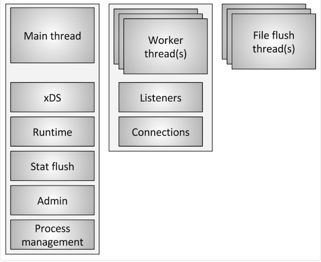

# 迁移 Nginx 到 Envoy

Reference: https://katacoda.com/envoyproxy/scenarios/migrating-from-nginx-to-envoy

大部分的应用可能还是使用的比较传统的 Nginx 来做服务代理，本文我们将介绍如何将 Nginx 的配置迁移到 Envoy 上来。我们将学到：

* 如何设置 `Envoy` 代理配置
* 配置 `Envoy` 代理转发请求到外部服务
* 配置 Envoy 代理转发请求到外部服务

最后我们还会了解到 `Envoy` 代理的核心功能，以及如何将现有的 `Nginx` 配置迁移到 `Envoy` 上来。

## 1. Nginx 示例


这里我们使用 Nginx 官方 Wiki 的示例来进行说明，完整的 `nginx.conf `配置如下所示：

```
user  www www;
pid /var/run/nginx.pid;
worker_processes  2;

events {
  worker_connections   2000;
}

http {
  gzip on;
  gzip_min_length  1100;
  gzip_buffers     4 8k;
  gzip_types       text/plain;

  log_format main      '$remote_addr - $remote_user [$time_local]  '
    '"$request" $status $bytes_sent '
    '"$http_referer" "$http_user_agent" '
    '"$gzip_ratio"';

  log_format download  '$remote_addr - $remote_user [$time_local]  '
    '"$request" $status $bytes_sent '
    '"$http_referer" "$http_user_agent" '
    '"$http_range" "$sent_http_content_range"';


  upstream targetCluster {
    172.18.0.3:80;
    172.18.0.4:80;
  }

  server {
    listen        8080;
    server_name   one.example.com  www.one.example.com;

    access_log   /var/log/nginx.access_log  main;
    error_log  /var/log/nginx.error_log  info;

    location / {
      proxy_pass         http://targetCluster/;
      proxy_redirect     off;

      proxy_set_header   Host             $host;
      proxy_set_header   X-Real-IP        $remote_addr;
    }
  }
}
```

上面的 Nginx 配置有3个核心配置：

* 配置 `Nginx` 服务、日志结构和 `Gzip` 功能
* 配置 `Nginx` 在端口 `8080` 上接受对 `one.example.com` 域名的请求
* 根据不同的路径配置将流量转发给目标服务


并不是所有的 `Nginx` 的配置都适用于 `Envoy`，有些方面的配置我们可以不用关系。`Envoy `代理主要有`4`中主要的配置类型，它们是支持 `Nginx `提供的核心基础结构的：

* `Listeners`（监听器）：他们定义 `Envoy` 代理如何接收传入的网络请求，建立连接后，它会传递到一组过滤器进行处理
* `Filters`（过滤器）：过滤器是处理传入和传出请求的管道结构的一部分，比如可以开启类似于 `Gzip` 之类的过滤器，该过滤器就会在将数据发送到客户端之前进行压缩
* `Routers`（路由器）：这些路由器负责将流量转发到定义的目的集群去
* `Clusters`（集群）：集群定义了流量的目标端点和相关配置。

我们将使用这`4`个组件来创建 `Envoy` 代理配置，去匹配 `Nginx` 中的配置。`Envoy `的重点一直是在 API 和动态配置上，但是我们这里需要使用静态配置。

## 2. Nginx 配置


现在我们来仔细看下上面的 `nginx.conf` 配置文件的内容。

### 工作连接

首先是 `Worker` 连接数配置，**主要是用于定义工作进程和连接的数量，用来配置 Nginx 扩展请求请**求：

```
worker_processes 2;

events {
	worker_connections 2000;
}
```

`Envoy` 代理用另外一种不同的方式来管理工作进程和连接。

**`Envoy` 使用单进程-多线程的架构模型**。

**一个 `master` 线程管理各种琐碎的任务，而一些 `worker` 线程则负责执行监听、过滤和转发。**

当监听器接收到一个连接请求时，该连接将其生命周期绑定到一个单独的 `worker` 线程。这使得 `Envoy `主要使用大量单线程处理工作，并且只有少量的复杂代码用于实现 `worker` 线程之间的协调工作。

通常情况下，`Envoy` 实现了`100%`的非阻塞。**对于大多数工作负载，我们建议将 `worker` 线程数配置为物理机器的线程数。**


关于 `Envoy` 线程模型的更多信息，可以查看 Envoy 官方博客介绍：Envoy threading model(https://blog.envoyproxy.io/envoy-threading-model-a8d44b922310)



### HTTP 配置

然后 `Nginx` 配置的下一个部分是定义 `HTTP` 配置，比如：

* 定义支持哪些`MIME `类型
* 默认的超时时间
* `Gzip` 配置

我们可以通过 `Envoy` 代理中的过滤器来配置这些内容。在 `HTTP` 配置部分，`Nginx` 配置指定了监听的端口 `8080`，并响应域名 `one.example.com` 和 `www.one.example.com` 的传入请求：

```
server {
		listen 8080;
		server_name one.example.com www.one.example.com;
		...
}
```

**在 `Envoy` 中，这部分就是监听器来管理的**。

开始一个 `Envoy` 代理最重要的方面就是定义监听器，我们需要创建一个配置文件来描述我们如何去运行 `Envoy` 实例。

下面的配置将创建一个新的监听器并将其绑定到 `8080` 端口上，该配置指示了 `Envoy` 代理用于接收网络请求的端口。`Envoy` 配置使用的是 `YAML` 文件，如果你对` YAML` 文件格式语法不是很熟悉的，可以点此先查看官方对应的介绍。

```
static_resources:
  listeners:
  - name: listener_0
    address:
      socket_address: { address: 0.0.0.0, port_value: 8080 }
```
**需要注意的是我们没有在监听器部分定义 `server_name`，我们会在过滤器部分进行处理。**

### Location 配置

当请求进入 `Nginx` 时， `location `部分定义了如何处理流量以及在什么地方转发流量。在下面的配置中，站点的所有传入流量都将被代理到一个名为 `targetCluster `的上游（`upstream`）集群，上游集群定义了处理请求的节点。

```
location / {
			proxy_pass 	http://targetCluster/; 
			proxy_redirect off;
			
			proxy_set_header Host $host; 
			proxy_set_header X-Real-IP $remote_addr;
		}
```


**在 `Envoy` 中，这部分将由过滤器来进行配置管理。在静态配置中，过滤器定义了如何处理传入的请求，在我们这里，将配置一个过滤器去匹配上一步中的 `server_names`，当接收到与定义的域名和路由匹配的传入请求时**，流量将转发到集群，集群和 `Nginx` 配置中的 `upstream `是一致的。

```
filter_chains:
- filters:
  - name: envoy.http_connection_manager 
    config:
      codec_type: auto 
      stat_prefix: ingress_http
      route_config:
        name: local_route
        virtual_hosts:
        - name: backend
          domains:
          - "one.example.com"
          - "www.one.example.com" 
          routes:
          - match:
              prefix: "/" 
            route:
              cluster: targetCluster 
        http_filters:
        - name: envoy.router
```

**其中 `envoy.http_connection_manager` 是 `Envoy` 内置的一个过滤器**，用于处理 `HTTP` 连接的，除此之外，还有其他的一些内置的过滤器，比如 `Redis`、`Mongo`、`TCP`。

### upstream 配置

在 `Nginx` 中，`upstream`（上游）配置定义了处理请求的目标服务器集群，在我们这里的示例中，分配了两个集群。

```
upstream targetCluster {
    172.18.0.3:80;
    172.18.0.4:80;
  }
```

在 `Envoy` 代理中，这部分是通过集群进行配置管理的。**`upstream` 等同与 `Envoy` 中的 `clusters` 定义，我们这里通过集群定义了主机被访问的方式，还可以配置超时和负载均衡等方面更精细的控制。**

```
clusters:
  - name: targetCluster
    connect_timeout: 0.25s
    type: STRICT_DNS
    dns_lookup_family: V4_ONLY
    lb_policy: ROUND_ROBIN
    hosts: [
      { socket_address: { address: 172.18.0.3, port_value: 80 }},
      { socket_address: { address: 172.18.0.4, port_value: 80 }}
    ]
```
上面我们配置了 `STRICT_DNS` 类型的服务发现，`Envoy` 会持续异步地解析指定的 `DNS` 目标。

`DNS` 解析结果返回的每个 `IP` 地址都将被视为上游集群的主机。

**所以如果产线返回两个 `IP` 地址，则 `Envoy` 将认为集群由两个主机，并且两个主机都应进行负载均衡，如果从结果中删除了一个主机，则` Envoy` 会从现有的连接池中将其剔出掉。**

### 日志配置

最后需要配置的日志部分，**`Envoy` 采用云原生的方式，将应用程序日志都输出到 `stdout` 和 `stderr`，而不是将错误日志输出到磁盘**。

当用户发起一个请求时，访问日志默认是被禁用的，我们可以手动开启。要为 `HTTP` 请求开启访问日志，**需要在 `HTTP` 连接管理器中包含一个 `access_log` 的配置**，该路径可以是设备，比如 `stdout`，也可以是磁盘上的某个文件，这依赖于我们自己的实际情况。

下面过滤器中的配置就会将所有访问日志通过管理传输到 `stdout`：

```
access_log:
- name: envoy.file_access_log
  config:
    path: "/dev/stdout"
```
```
- name: envoy.http_connection_manager
  config:
    codec_type: auto
    stat_prefix: ingress_http
    access_log:
    - name: envoy.file_access_log
      config:
        path: "/dev/stdout"
    route_config:
    .....
```

默认情况下，`Envoy` 访问日志格式包含整个 `HTTP` 请求的详细信息：

```
[%START_TIME%] "%REQ(:METHOD)% %REQ(X-ENVOY-ORIGINAL-PATH?:PATH)% %PROTOCOL%"
%RESPONSE_CODE% %RESPONSE_FLAGS% %BYTES_RECEIVED% %BYTES_SENT% %DURATION%
%RESP(X-ENVOY-UPSTREAM-SERVICE-TIME)% "%REQ(X-FORWARDED-FOR)%" "%REQ(USER-AGENT)%"
"%REQ(X-REQUEST-ID)%" "%REQ(:AUTHORITY)%" "%UPSTREAM_HOST%"\n
```

输出结果格式化后如下所示：

```
[2018-11-23T04:51:00.281Z] "GET / HTTP/1.1" 200 - 0 58 4 1 "-" "curl/7.47.0" "f21ebd42-6770-4aa5-88d4-e56118165a7d" "one.example.com" "172.18.0.4:80"
```

我们也可以通过设置 `format` 字段来自定义输出日志的格式，例如：

```
access_log:
- name: envoy.file_access_log
  config:
    path: "/dev/stdout"
    format: "[%START_TIME%] "%REQ(:METHOD)% %REQ(X-ENVOY-ORIGINAL-PATH?:PATH)% %PROTOCOL%" %RESPONSE_CODE% %RESP(X-ENVOY-UPSTREAM-SERVICE-TIME)% "%REQ(X-REQUEST-ID)%" "%REQ(:AUTHORITY)%" "%UPSTREAM_HOST%"\n"
```

此外我们也可以通过设置 `json_format` 字段来将日志作为 JSON 格式输出，例如：

```
access_log:
- name: envoy.file_access_log
  config:
    path: "/dev/stdout"
    json_format: {"protocol": "%PROTOCOL%", "duration": "%DURATION%", "request_method": "%REQ(:METHOD)%"}
```

要注意的是，访问日志会在未设置、或者空值的位置加入一个字符：`-`。

不同类型的访问日志（例如 `HTTP` 和 `TCP`）共用同样的格式字符串。

不同类型的日志中，某些字段可能会有不同的含义。有关 Envoy 日志的更多信息，可以查看官方文档对应的说明。当然日志并不是 `Envoy` 代理获得请求可见性的唯一方法，`Envoy `还内置了高级跟踪和指标功能，我们会在后续章节中慢慢接触到。


## 3. 测试

现在我们已经将 `Nginx` 配置转换为了 `Envoy` 代理，接下来我们可以来启动 `Envoy` 代理进行测试验证。

**在 Nginx 配置的顶部，有一行配置 `user www www;`，表示用非 `root` 用户来运行 `Nginx `以提高安全性。而 `Envoy` 代理采用云原生的方法来管理使用这，我们通过容器启动 `Envoy` 代理的时候，可以指定一个低特权的用户。**

下面的命令将通过 `Docker `容器来启动一个 `Envoy `实例，该命令使 `Envoy` 可以监听 `80` 端口上的流量请求，但是我们在 `Envoy` 的监听器配置中指定的是 `8080` 端口，所以我们用一个低特权用户身份来运行：

```
$ docker run --name proxy1 -p 8080:8080 --user 1000:1000 -v $(pwd)/manifests/envoy.yaml:/etc/envoy/envoy.yaml envoyproxy/envoy
```

```
$ docker run  -d --name proxy1 -p 8080:8080 --user 1000:1000 -v $(pwd)/manifests/envoy.yaml:/etc/envoy/envoy.yaml envoyproxy/envoy 
0fb93439f5e05b3bfb343a797efca239ee90163caa63a7326627e9b6e56f412f
```

启动代理后，就可以开始测试了，下面我们用 curl 命令使用代理配置的 host 头发起一个网络请求：

```
$ curl -H "Host: one.example.com" localhost:8080 -i 
HTTP/1.1 503 Service Unavailable
content-length: 91
content-type: text/plain
date: Fri, 10 Apr 2020 13:41:27 GMT
server: envoy

upstream connect error or disconnect/reset before headers. reset reason: connection failure
```

**我们可以看到会出现 `503` 错误，这是因为我们配置的上游集群主机根本就没有运行，所以` Envoy` 代理请求到不可用的主机上去了，就出现了这样的错误**。我们可以使用下面的命令启动两个 `HTTP `服务，用来表示上游主机：

```
$ docker run -d --ip 172.18.0.3 cnych/docker-http-server; docker run -d --ip 172.18.0.4 cnych/docker-http-server;

$ docker ps

CONTAINER ID        IMAGE                      COMMAND    CREATED             STATUS              PORTS                             NAMES
fd3018535a52        cnych/docker-http-server   "/app"     2 minutes ago       Up 2 minutes        80/tcp 
ace25541d654		cnych/docker-http-server   "/app"     2 minutes ago       Up 2 minutes        80/tcp 
3c83dfb9392f    envoyproxy/envoy           "/docker-entrypoint.…" 2
 minutes ago       Up 2 minutes        10000/tcp, 0.0.0.0:80->8080/tcp   proxy1
```

```
$ docker run -d --ip 172.18.0.3 cnych/docker-http-server; docker run -d --ip 172.18.0.4 cnych/docker-http-server;
a0360451f24fc4d51a38190286b56c3d127b7335d5f328e1cd65eb2d5b1b1c92
f15ec3abece875d9794c30b9596dc5cc515f0729951e5c83764ab46a6ecdfb49
```

当上面两个服务启动成功后，现在我们再通过 Envoy 去访问目标服务就正常了：

```
$ curl -H "Host: one.example.com" localhost:8080 -i 
HTTP/1.1 200 OK
date: Wed, 08 Apr 2020 04:32:01 GMT 
content-length: 58
content-type: text/html; charset=utf-8 
x-envoy-upstream-service-time: 3
	<h1>This request was processed by host: fd3018535a52</h1>

$ curl -H "Host: one.example.com" localhost -i 
HTTP/1.1 200 OK
date: Wed, 08 Apr 2020 04:32:05 GMT 
content-length: 58
14.content-type: text/html; charset=utf-8 
x-envoy-upstream-service-time: 0
server: envoy

<h1>This request was processed by host: ace25541d654</h1>
```

当访问请求的时候，我们可以看到是哪个容器处理了请求，在 Envoy 代理容器中，也可以看到请求的日志输出：

```
[2020-04-08T04:32:06.201Z] "GET / HTTP/1.1" 200 - 0 58 1 0 "-" "curl/7.54.0" "ac61099b-f100-46a9-9c08-c323c5ac2320" "one.example.com" "172.17.0.3:80"
[2020-04-08T04:32:08.168Z] "GET / HTTP/1.1" 200 - 0 58 0 0 "-" "curl/7.54.0" "15ee6ca9-b161-4630-a51c-c641d0760cd0" "one.example.com" "172.17.0.4:80"
```

最后转换过后的完整的 Envoy 配置如下(`completetd.yaml`)：

```
static_resources:
  listeners:
  - name: listener_0
    address:
      socket_address: { address: 0.0.0.0, port_value: 8080 }
    
    filter_chains:
    - filters:
      - name: envoy.http_connection_manager
        config:
          codec_type: auto
          stat_prefix: ingress_http
          access_log:
          - name: envoy.file_access_log
            config: path:"/dev/stdout"
          route_config:
            name: local_route
            virtual_hosts:
            - name: backend
              domains:
                - "one.example.com"
                - "www.one.example.com"
              routes:
              - match:
                  prefix: "/"
                route:
                  cluster: targetCluster
          http_filters:
          - name: envoy.router
  clusters:
  - name: targetCluster
    connect_timeout: 0.25s
    type: STRICT_DNS
    dns_lookup_family: V4_ONLY
    lb_policy: ROUND_ROBIN
    hosts: [
      { socket_address: { address: 172.18.0.3, port_value: 80 }},
      { socket_address: { address: 172.18.0.4, port_value: 80 }}
    ]

admin:
  access_log_path: /tmp/admin_access.log
  address:
    socket_address: { address: 0.0.0.0, port_value: 9090 }
```