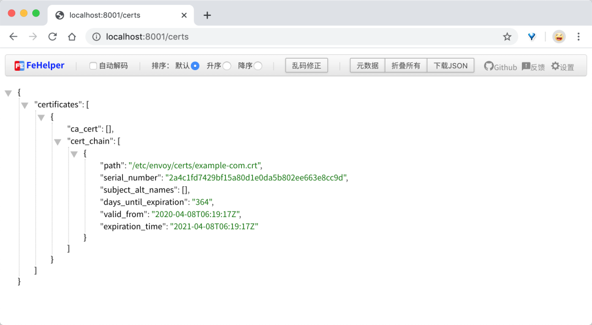

# Envoy 配置 HTTPS 证书

本节我们将演示如何使用 Envoy 保护 HTTP 网络请求。确保 HTTP 流量安全对于保护用户隐私和数据是至关重要的。下面我们来了解下如何在 Envoy 中配置 SSL 证书。


## 1. SSL 证书

这里我们将为 `example.com` 域名生成一个自签名的证书，当然如果在生产环境时候，需要使用正规 CA 机构购买的证书，或者` Let's Encrypt` 的免费证书服务。

下面的命令会在目录 `certs/` 中创建一个新的证书和密钥：

```
mkdir certs; cd certs;
openssl req -nodes -new -x509 \
  -keyout example-com.key -out example-com.crt \
  -days 365 \
  -subj '/CN=example.com/O=My Company Name LTD./C=US';

..+++++
.................................................................................................................+++++
writing new private key to 'example-com.key'
```

## 2. 流量保护

在 `Envoy` 中保护 `HTTP` 流量，**需要通过添加 `tls_context` 过滤器，`TLS` 上下文提供了为 `Envoy` 代理中配置的域名指定证书的功能，请求 `HTTPS` 请求时候，就使用匹配的证书。我们这里直接使用上一步中生成的自签名证书即可**。

我们这里的 `Envoy` 配置文件中包含了所需的 `HTTPS` 支持的配置，我们添加了两个监听器，一个监听器在 `8080` 端口上用于 `HTTP` 通信，另外一个监听器在 `8443` 端口上用于 `HTTPS` 通信。

在 `HTTPS` 监听器中定义了` HTTP `连接管理器，该代理将代理 `/service/1` 和 `/service/2 `这两个端点的传入请求，这里我们需要通过 `tls_context` 配置相关证书，如下所示：


```
tls_context:
  common_tls_context:
    tls_certificates:
    - certificate_chain:
        filename: "/etc/envoy/certs/example-com.crt"
      private_key:
        filename: "/etc/envoy/certs/example-com.key"
```

在 TLS 上下文中定义了生成的证书和密钥，如果我们有多个域名，每个域名都有自己的证书，则需要通过 `tls_certificates` 定义多个证书链。

## 3. 自动跳转


定义了 `TLS` 上下文后，该站点将能够通过 `HTTPS` 提供流量了，但是如果用户是通过` HTTP` 来访问的服务，为了确保安全，我们也可以将其重定向到 `HTTPS` 版本服务上去。

在 `HTTP` 配置中，我们将 `https_redirect:true` 的标志添加到过滤器的配置中即可实现跳转功能。

```
route_config:
  virtual_hosts:
  - name: backend
  domains:
  - "example.com"
  routes:
  - match:
      prefix: "/"
    redirect:
      path_redirect: "/"
      https_redirect: true
```

当用户访问网站的 `HTTP` 版本时，`Envoy` 代理将根据过滤器配置来匹配域名和路径，匹配到过后将请求重定向到站点的 `HTTPS` 版本去。完整的 `Envoy` 配置如下所示：

```
static_resources:
  listeners:
  - name: listener_http
    address:
      socket_address: { address: 0.0.0.0, port_value: 8080 }
    filter_chains:
    - filters:
      - name: envoy.http_connection_manager
        config:
          codec_type: auto
          stat_prefix: ingress_http
          route_config:
            virtual_hosts:
            - name: backend
              domains:
              - "example.com"
              routes:
              - match:
                  prefix: "/"
                redirect:
                  path_redirect: "/"
                  https_redirect: true
          http_filters:
          - name: envoy.router
            config: {}
  - name: listener_https
    address:
      socket_address: { address: 0.0.0.0, port_value: 8443 }
    filter_chains:
    - filters:
      - name: envoy.http_connection_manager
        config:
          codec_type: auto
          stat_prefix: ingress_http
          route_config:
            name: local_route
            virtual_hosts:
            - name: backend
              domains:
              - "example.com"
              routes:
              - match:
                  prefix: "/service/1"
                route:
                  cluster: service1
              - match:
                  prefix: "/service/2"
                route:
                  cluster: service2
          http_filters:
          - name: envoy.router
            config: {}
      tls_context:
        common_tls_context:
          tls_certificates:
            - certificate_chain:
                filename: "/etc/envoy/certs/example-com.crt"
              private_key:
                filename: "/etc/envoy/certs/example-com.key"
  clusters:
  - name: service1
    connect_timeout: 0.25s
    type: strict_dns
    lb_policy: round_robin
    hosts:
    - socket_address:
        address: 172.18.0.3
        port_value: 80
  - name: service2
    connect_timeout: 0.25s
    type: strict_dns
    lb_policy: round_robin
    hosts:
    - socket_address:
        address: 172.18.0.4
        port_value: 80

admin:
  access_log_path: /tmp/admin_access.log
  address:
    socket_address:
      address: 0.0.0.0
      port_value: 8001
```

## 4. 测试

现在配置已经完成了，我们就可以启动 `Envoy` 实例来进行测试了。在我们这个示例中，`Envoy` 暴露 `80` 端口来处理 `HTTP` 请求，暴露 `443` 端口来处理 `HTTPS` 请求，此外还在 `8001` 端口上暴露了管理页面，我们可以通过管理页面查看有关证书的信息。

使用如下命令启动 Envoy 代理：

```
docker run -it --name proxy1 -p 80:8080 -p 443:8443 -p 8001:8001 -v $(pwd):/etc/envoy/ envoyproxy/envoy
```

启动完成后所有的 HTTPS 和 TLS 校验都是通过 Envoy 来进行处理的，所以我们不需要去修改应该程序。同样我们启动两个 HTTP 服务来处理传入的请求：

```
$ docker run -d --ip 172.17.0.3 cnych/docker-http-server; docker run -d --ip 172.17.0.4 cnych/docker-http-server;
145738e12c174606f9e6e085ad2ec0ae9bf15a75d372b2bec8929e5d5df96be3
8f9a9355333d91b06a14d2bccc1a0d4a9afd20b258df561278fb94f01cdcd881
$ docker ps
CONTAINER ID        IMAGE                      COMMAND                  CREATED              STATUS              PORTS                                                                            NAMES
8f9a9355333d        cnych/docker-http-server   "/app"                   5 seconds ago        Up 4 seconds        80/tcp                                                                           eager_kapitsa
145738e12c17        cnych/docker-http-server   "/app"                   6 seconds ago        Up 5 seconds        80/tcp                                                                           beautiful_hermann
a499a8ccaedc        envoyproxy/envoy           "/docker-entrypoint.…"   About a minute ago   Up About a minute   0.0.0.0:8001->8001/tcp, 10000/tcp, 0.0.0.0:80->8080/tcp, 0.0.0.0:443->8443/tcp   proxy1
```

上面的几个容器启动完成后，就可以进行测试了，首先我们请求 HTTP 的服务，由于配置了自动跳转，所以应该会被重定向到 HTTPS 的版本上去：


```
$ curl -H "Host: example.com" http://localhost -i
HTTP/1.1 301 Moved Permanently
location: https://example.com/
date: Wed, 08 Apr 2020 06:53:51 GMT
server: envoy
content-length: 0
```

我们可以看到上面有 **`HTTP/1.1301MovedPermanently` **这样的重定向响应信息。然后我们尝试直接请求 `HTTPS` 的服务：

```
$ curl -k -H "Host: example.com" https://localhost/service/1 -i
HTTP/1.1 200 OK
date: Wed, 08 Apr 2020 06:55:27 GMT
content-length: 58
content-type: text/html; charset=utf-8
x-envoy-upstream-service-time: 0
server: envoy

<h1>This request was processed by host: 145738e12c17</h1>
$ curl -k -H "Host: example.com" https://localhost/service/2 -i
HTTP/1.1 200 OK
date: Wed, 08 Apr 2020 06:55:49 GMT
content-length: 58
content-type: text/html; charset=utf-8
x-envoy-upstream-service-time: 0
server: envoy

<h1>This request was processed by host: 8f9a9355333d</h1>
```

我们可以看到通过 HTTPS 进行访问可以正常得到对应的响应，需要注意的是由于我们这里使用的是自签名的证书，所以需要加上` -k` 参数来忽略证书校验，如果没有这个参数则在请求的时候会报错：

```

$ curl -H "Host: example.com" https://localhost/service/2 -i
curl: (60) SSL certificate problem: self signed certificate
More details here: https://curl.haxx.se/docs/sslcerts.html

curl performs SSL certificate verification by default, using a "bundle"
 of Certificate Authority (CA) public keys (CA certs). If the default
 bundle file isn't adequate, you can specify an alternate file
 using the --cacert option.
If this HTTPS server uses a certificate signed by a CA represented in
 the bundle, the certificate verification probably failed due to a
 problem with the certificate (it might be expired, or the name might
 not match the domain name in the URL).
If you'd like to turn off curl's verification of the certificate, use
 the -k (or --insecure) option.
HTTPS-proxy has similar options --proxy-cacert and --proxy-insecure.
```

我们也可以通过管理页面去查看证书相关的信息，上面我们启动容器的时候绑定了宿主机的 8001 端口，所以我们可以通过访问 `http://localhost:8001/certs` 来获取到证书相关的信息：

