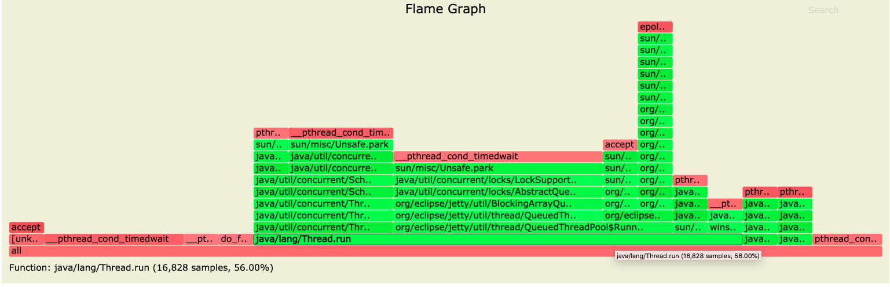
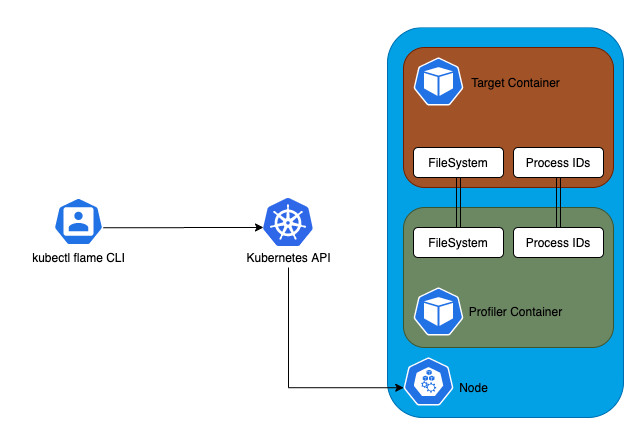

# **Kubernetes 应用性能分析工具 - Kubectl Flame**


**[kubectl-flame](https://github.com/VerizonMedia/kubectl-flame)**

**Profile 是分析应用程序性能来改进代码质量的常用方法，最流行的可视化性能分析方法是生成火焰图。**



上图中每个矩形都是一个函数，其中宽度显示它出现的频率，**从左到右的排序并不重要**。

## **1、Kubernetes 上的性能分析**

性能分析是一项较为复杂的任务，大多数探查器有两个主要问题：

* **需要修改应用程序，通常可以通过将标志添加到执行命令或将一些性能分析库导入代码中来实现。**
* 由于在分析过程中会严重影响性能，因此通常避免在生产环境中进行性能分析。

选择正确的探查器可能会解决这些问题，但是这需要仔细去进行研究，并且通常取决于编程语言和操作系统。


在 Kubernetes 集群中运行的应用程序上执行分析时，会变得更加困难。

**需要部署一个包含配置文件修改的新容器镜像，而不是当前正在运行的容器。此外，当应用程序重新启动时，某些性能问题可能会消失，这就使得调试变得困难。**


## **2、kubectl flame**

`Kubectl Flame` 是一个 kubectl 插件，可以以较低的开销生成火焰图🔥来分析应用程序性能，无需进行任何应用程序修改或停机。

### **2-1 安装 Krew**

[Installing Krew](https://krew.sigs.k8s.io/docs/user-guide/setup/install/)

**`krew.sh`**

```
(
  set -x; cd "$(mktemp -d)" &&
  OS="$(uname | tr '[:upper:]' '[:lower:]')" &&
  ARCH="$(uname -m | sed -e 's/x86_64/amd64/' -e 's/\(arm\)\(64\)\?.*/\1\2/' -e 's/aarch64$/arm64/')" &&
  curl -fsSLO "https://github.com/kubernetes-sigs/krew/releases/latest/download/krew.tar.gz" &&
  tar zxvf krew.tar.gz &&
  KREW=./krew-"${OS}_${ARCH}" &&
  "$KREW" install krew
)
```

```
sudo chmod +x krew.sh
$ ./krew.sh 
+++ mktemp -d
++ cd /var/folders/r7/nml_dsbn44gcd2jlqh7s2w940000gn/T/tmp.UqsTDMjJ
+++ uname
+++ tr '[:upper:]' '[:lower:]'
++ OS=darwin
+++ uname -m
+++ sed -e s/x86_64/amd64/ -e 's/\(arm\)\(64\)\?.*/\1\2/' -e 's/aarch64$/arm64/'
++ ARCH=amd64
++ curl -fsSLO https://github.com/kubernetes-sigs/krew/releases/latest/download/krew.tar.gz
++ tar zxvf krew.tar.gz
x ./LICENSE
x ./krew-darwin_amd64
x ./krew-darwin_arm64
x ./krew-linux_amd64
x ./krew-linux_arm
x ./krew-linux_arm64
x ./krew-windows_amd64.exe
++ KREW=./krew-darwin_amd64
++ ./krew-darwin_amd64 install krew
Adding "default" plugin index from https://github.com/kubernetes-sigs/krew-index.git.
Updated the local copy of plugin index.
Installing plugin: krew
Installed plugin: krew
\
 | Use this plugin:
 |      kubectl krew
 | Documentation:
 |      https://krew.sigs.k8s.io/
 | Caveats:
 | \
 |  | krew is now installed! To start using kubectl plugins, you need to add
 |  | krew's installation directory to your PATH:
 |  | 
 |  |   * macOS/Linux:
 |  |     - Add the following to your ~/.bashrc or ~/.zshrc:
 |  |         export PATH="${KREW_ROOT:-$HOME/.krew}/bin:$PATH"
 |  |     - Restart your shell.
 |  | 
 |  |   * Windows: Add %USERPROFILE%\.krew\bin to your PATH environment variable
 |  | 
 |  | To list krew commands and to get help, run:
 |  |   $ kubectl krew
 |  | For a full list of available plugins, run:
 |  |   $ kubectl krew search
 |  | 
 |  | You can find documentation at
 |  |   https://krew.sigs.k8s.io/docs/user-guide/quickstart/.
 | /
/
```

```
$ kubectl krew -h
krew is the kubectl plugin manager.
You can invoke krew through kubectl: "kubectl krew [command]..."

Usage:
  kubectl krew [command]

Available Commands:
  help        Help about any command
  index       Manage custom plugin indexes
  info        Show information about an available plugin
  install     Install kubectl plugins
  list        List installed kubectl plugins
  search      Discover kubectl plugins
  uninstall   Uninstall plugins
  update      Update the local copy of the plugin index
  upgrade     Upgrade installed plugins to newer versions
  version     Show krew version and diagnostics

Flags:
  -h, --help      help for krew
  -v, --v Level   number for the log level verbosity

Use "kubectl krew [command] --help" for more information about a command.
```

### **2-2 安装 flame**

可以通过 Krew 来安装`kubectl flame` 插件，一旦安装了Krew，就可以通过如下命令进行安装：

```
$ kubectl krew install flame
Updated the local copy of plugin index.
Installing plugin: flame
Installed plugin: flame
\
 | Use this plugin:
 |      kubectl flame
 | Documentation:
 |      https://github.com/VerizonMedia/kubectl-flame
 | Caveats:
 | \
 |  | Currently supported languages: Go, Java (any JVM based language) and Python
 | /
/
WARNING: You installed plugin "flame" from the krew-index plugin repository.
   These plugins are not audited for security by the Krew maintainers.
   Run them at your own risk.
```

### **2-3 运行原理**

`kubectl-flame` 通过在与目标容器相同的节点上启动一个探查器来启动性能分析，大多数探查器将与目标容器共享一些资源：

* 比如通过将 `hostPID` 设置为 `true` 来启用 `PID` 命名空间共享，通过挂载 `/var/lib/docker` 并查询 `overlayFS` 来启用文件系统共享。
* 在后台`kubectl-flame`
	* 使用 `async-profiler` 来为 `Java` 应用程序生成火焰图，通过共享`/tmp`文件夹与目标 `JVM `进行交互
	* `Golang` 则支持基于 `ebpf `分析
	* `Python` 支持基于 `py-spy `进行分析。




## **3、分析 Kubernetes Pod**

分析 Java 应用 mypod 1分钟，并在将火焰图保存到 `/Users/$USER/k8s_test/flame/tmp/flamegraph.svg`：

```
kubectl flame mypod -t 1m --lang java -f /tmp/flamegraph.svg
```

**`javademo-test.yaml`**

```
---
apiVersion: v1
kind: Namespace
metadata:
  name: demo-prod
---
apiVersion: apps/v1
kind: Deployment
metadata:
  labels:
    k8s-app: demoapp
  name: demoapp
  namespace: demo-prod
spec:
  replicas: 1
  revisionHistoryLimit: 10
  selector:
    matchLabels:
      k8s-app: demoapp
  template:
    metadata:
      labels:
        k8s-app: demoapp
      namespace: demo-prod
      name: demoapp
    spec:
      containers:
        - name: demoapp
          image: bitnami/java-example:0.0.1
          imagePullPolicy: IfNotPresent
          ports:
            - containerPort: 8080
              name: web
              protocol: TCP
      serviceAccountName: demoapp
---
apiVersion: v1
kind: ServiceAccount
metadata:
  labels:
    k8s-app: demoapp
  name: demoapp
  namespace: demo-prod
---
kind: Service
apiVersion: v1
metadata:
  labels:
    k8s-app: demoapp
  name: demoapp
  namespace: demo-prod
spec:
  type: NodePort
  ports:
    - name: web
      port: 8080
      targetPort: 8080
      nodePort: 30991
  selector:
    k8s-app: demoapp
```

```
$ kubectl get all -n demo-prod 
NAME                           READY   STATUS    RESTARTS   AGE
pod/demoapp-58fbf5746d-s8wkt   1/1     Running   0          32m

NAME              TYPE       CLUSTER-IP      EXTERNAL-IP   PORT(S)          AGE
service/demoapp   NodePort   10.106.165.20   <none>        8080:30991/TCP   32m

NAME                      READY   UP-TO-DATE   AVAILABLE   AGE
deployment.apps/demoapp   1/1     1            1           32m

NAME                                 DESIRED   CURRENT   READY   AGE
replicaset.apps/demoapp-58fbf5746d   1         1         1       32m
```

```
$ kubectl flame demoapp-58fbf5746d-s8wkt -n demo-prod -t 1m --lang java -f /Users/$USER/k8s_test/flame/tmp/flamegraph.svg
```

```
$  kubectl flame demoapp-58fbf5746d-s8wkt -n demo-prod -t 1m --lang java -f /Users/$USER/k8s_test/flam
e/tmp/flamegraph.svg
Verifying target pod ... ✔
Launching profiler ... ✔
Profiling ... ✔
FlameGraph saved to: /Users/i515190/k8s_test/flame/tmp/flamegraph.svg 🔥
```


## **4、分析基于 alpine 的容器**

在基于 alpine 的容器中分析 Java 应用程序需要使用`--alpine`标志：

```
kubectl flame mypod -t 1m -f /tmp/flamegraph.svg --lang Java --alpine
```

> 注意：仅 Java 应用程序需要此`--alpine`标志，而 Go 分析则不需要该标志。

## **5、分析 sidecar 容器**

包含多个容器的 Pod 需要将目标容器指定为参数：

```
kubectl flame mypod -t 1m --lang go -f /tmp/flamegraph.svg mycontainer
```


