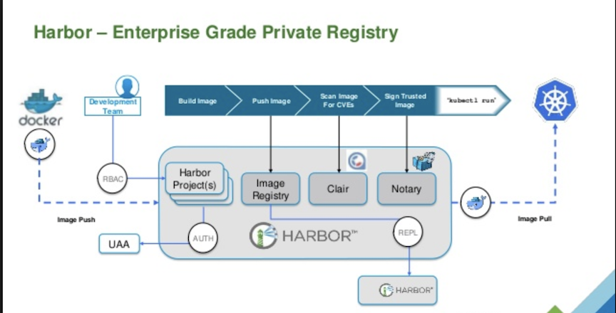

# Harbor - Manage and serve container images in a secure environment

## What is Harbor?

Harbor is an open source cloud native registry that stores, signs, and scans container images for vulnerabilities.

Harbor solves common challenges by delivering trust, compliance, performance, and interoperability. It fills a gap for organizations and applications that cannot use a public or cloud-based registry, or want a consistent experience across clouds.

1. [What is the difference between hub.docker.com and registry.docker.io?](0hub_and_registry.md)
2. [访问与搭建Docker仓库](https://github.com/Chao-Xi/JacobTechBlog/blob/master/docker/4docker_hub.md)
3. [Harbor 源码浅析](1harbor-code-analysis.md)
4. [在 Kubernetes 在快速安装 Harbor](2install_harbor_helm.md)
