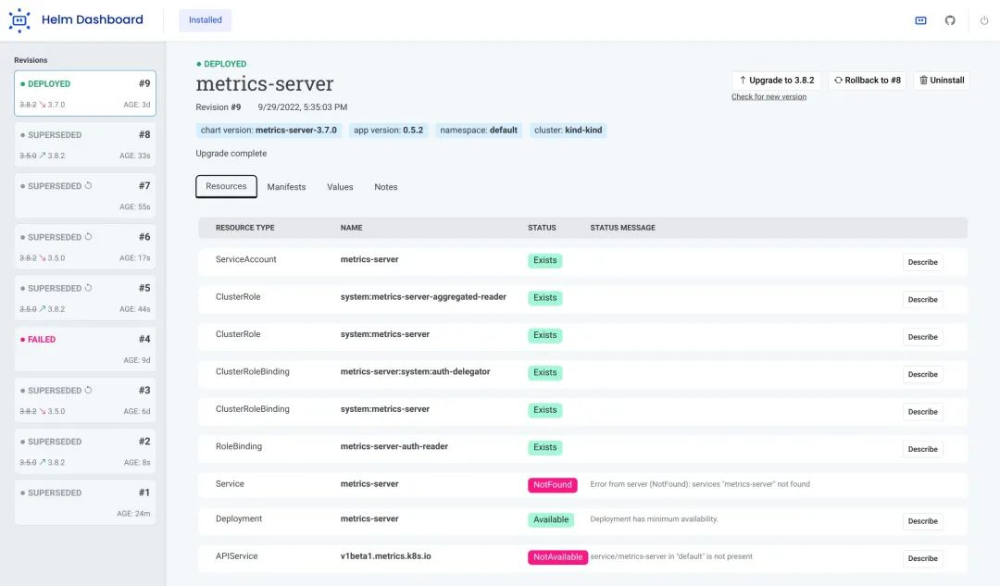
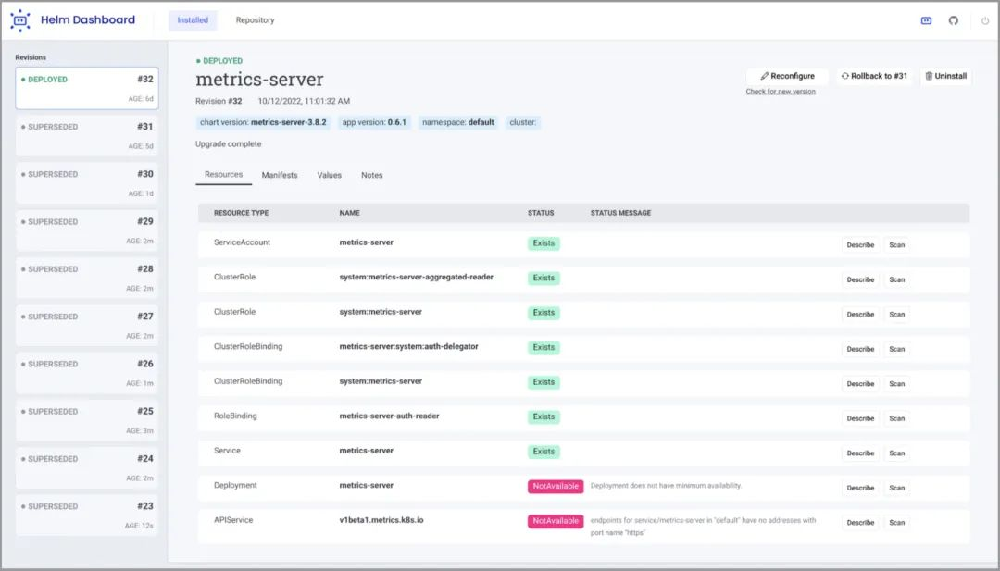
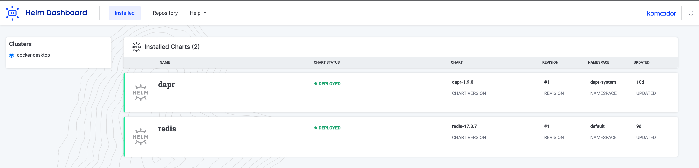
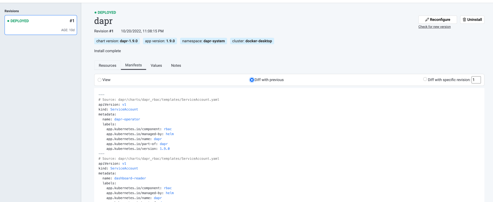
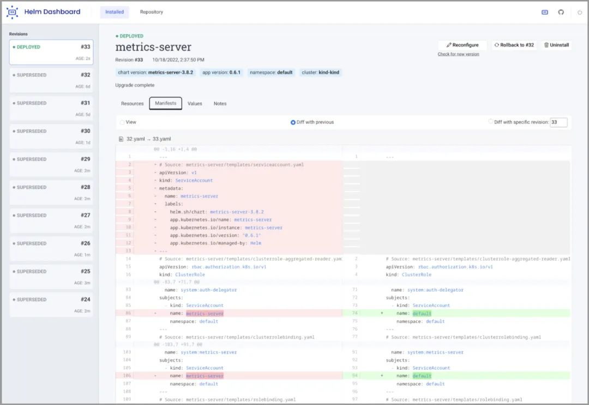
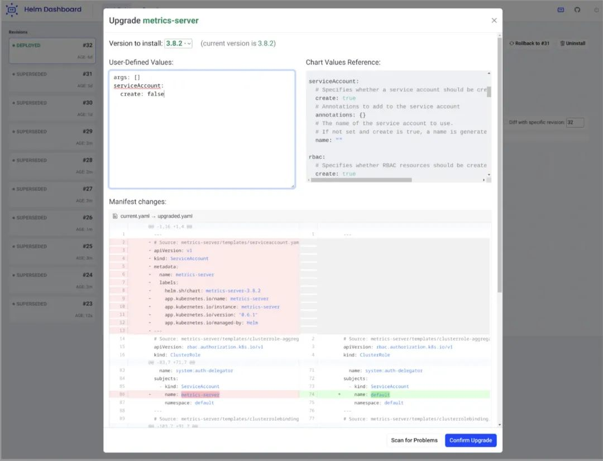

# **K8s Helm 可视化工具 - Helm Dashboard**

Helm-Dashboard 是 ValidKube 之后 Komodor 的第二个开源项目，Komodor 的愿景是通过构建有助于理解分布式云原生系统引入的复杂性的工具，使Kubernetes的操作和故障排除变得简单易行，Helm-Dashboard 就是实现该愿景的一个步骤之一。

Helm Dashboard 插件提供了一种 UI 驱动的方式来查看已安装的 Helm Chart、查看其修订历史记录和相应的 K8s 资源。此外，你还可以执行简单的操作，例如回滚到修订版或升级到新版本。

该工具的一些核心功能如下所示：


* 查看所有已安装的 Chart 及其修订历史
* 查看过去修订的清单差异
* 浏览 Chart 产生的 K8s 资源
* 易于回滚或升级版本，具有清晰和简单的清单差异
* 与流行的工具集成
* 在多个集群之间轻松切换



## **背景**

到 2020 年 4 月 Helm 成为 CNCF 毕业项目时，它已经被 70% 的 Kubernetes 用户使用了。甚至有人可能会说，是 Helm 为 Kubernetes 的全球化采用打开了大门，因为它使模板、打包和部署应用程序变得非常容易，而无需深入了解 K8s。

然而，这也为运维增加了一些『黑盒子』，在没有真正了解底层信息的情况下大规模地这样做变得极其困难。更复杂的是缺少 UI，这使得 Helm 用户必须通过 CLI 手动学习和执行许多命令。除了耗时之外，使用 CLI 还很难评估部署或回滚 Helm Chart 的影响。比较不同版本的 Helm Chart 及其对应的 K8s 资源也是一个非常低效的过程，尤其是在生产中面临故障排查问题的时候。

对可视化和简化操作的需求产生了一个广泛的"辅助"工具生态系统，Captain、Orkestra，它为一组相关的 Helm 版本及其子 Chart 添加了一个健壮的依赖关系图，**以及 Terraform Helm Provider，实现了通过 Terraform 管理 Helm Chart，ArgoCD 和 Fluxcd 等 GitOps 工具也通过 Helm Hooks 或者 Helm SDK 支持了 Helm Chart，尽管我们也非常希望这些工具，但是我们觉得这个生态系统中仍然缺少一个简单而全面的工具，专门用于简化智能变更和故障排查。**

## **Helm-Dashboard**

当我们从产品的角度来看 Helm 时，我们注意到了一个有趣的悖论：Helm 的概念非常简单，但很难在实际应用程序中浏览和操作该工具。

实际情况下，应用程序可能会不断发生故障，而业务需求和 SLA 要求开发人员随时解决问题。但是你怎么能修复你看不到的东西呢？这就好比在一个黑暗的房间里修理收音机。

我们认为拥有一个全面的 UI 界面将有助于使相同的信息更易于获取，我们的想法是将已安装的 Chart 包进行可视化，提供不依附于大型商业产品的用户界面也是一个重要的考虑因素，因为对于许多用户来说，适应市场上现有的其他 Helm 可视化软件是一个已知的障碍。

显示已安装的 Chart 列表及其状态是我们希望在该工具中加入的第一个功能。然后，我们允许检查 Chart 的历史记录，以了解它们的记录，仅此一项就可以为许多相关问题提供有价值的答案：上次升级是什么时候推出的？在升级之前存在多长时间？最近的推出有什么问题吗？



其他流行的工具，如 ArgoCD，并不保留 Helm Chart 的历史数据，所以这显然是我们需要解决的一个问题

**K8s 领域与 Helm 相关的另一部分是 Helm 在集群内创建资源的实际状态，即 Deployments、StatefulSets 等。**

K8s 本质上是无状态的，这意味着整个集群中的不同 pod 可以独立工作，同时向他们发送多个请求。当然，这样做的缺点是，它需要更多的 CLI 命令和手动调查，才能清楚地了解 Helm Chart 和 K8s 资源之间的关系和依赖。

在进行故障排除甚至只是检查你的系统时，了解更改和比较差异是关键。在没有 Dashboard 的情况下，要了解每次 Helm 修改后的 K8s 清单中的实际变化，至少需要调用5个不同的命令。我们希望通过 Helm-Dashboard 使其变得更加简单易用。





不过，查看差异只是其中的一部分。作为开发者，我们希望在发现问题后可以立即开始修复。为了实现该功能，我们需要提供轻松地回滚和升级 Chart 到任何现有版本的能力，或者只需点击一下按钮就可以完全卸载 Chart，同时比较各种 Chart 及其相应的 K8s 资源，让用户清楚地了解这些操作的结果可能是什么。



UI 提供的最重要的功能可能是在升级或重新配置 Chart 时可以预览清单变化，这样你就不必猜测 K8s 集群在即将进行的 Chart 升级后会发生什么变化。相反，你可以在按下“确认升级”按钮之前看到确切的差异。



## 使用

Helm-Dashboard 使用本地 Helm 和 Kubectl 配置运行，无需额外设置。要安装 Helm-Dashboard，只需运行以下 Helm 命令即可：

```
$ helm plugin install https://github.com/komodorio/helm-dashboard.git
Downloading and installing helm-dashboard v0.2.3 ...
https://github.com/komodorio/helm-dashboard/releases/download/v0.2.3/helm-dashboard_0.2.3_Darwin_x86_64.tar.gz

Helm Dashboard is installed, to start it, run in your terminal:
    helm dashboard

Installed plugin: dashboard
```

安装后，运行以下命令启动 UI：

```
helm dashboard
```

上面的命令将启动本地 Web 服务并在新的浏览器选项卡中打开 UI。

```
$ helm dashboard
INFO[0000] Helm Dashboard by Komodor, version 0.2.3 (549cdd9bfbdf32009f8dbbc240c59c86c2e430d7 @ 2022-10-26T14:27:14Z)
WARN[0000] Failed command: [checkov --version]
WARN[0000] Failed command: [trivy --version]
INFO[0000] Opening web UI: http://localhost:8080
```

要卸载的话也只需要执行下面的命令即可：

```
helm plugin uninstall dashboard
```

## **总结**


需要明确的是，我们仍然喜欢 Helm，并且不打算替换它，甚至不打算与 Helm CLI 的功能完全相同。我们确实想涵盖主流功能和最常见的使用场景，这样只有最特殊的情况下才会手动使用 Helm CLI，这可以留给经验更丰富的 DevOps 或 SRE 人员。

此外 Helm-Dashboard 还集成了一些额外的功能，并希望它能激发社区用户集成更多有用的工具。例如，安全和漏洞扫描也是改善 Helm 操作和整体可靠性的重要事情，因此我们集成了两个比较火热的工具：Aqua Security 的 Trivy 和 Bridgecrew 的 Checkov。