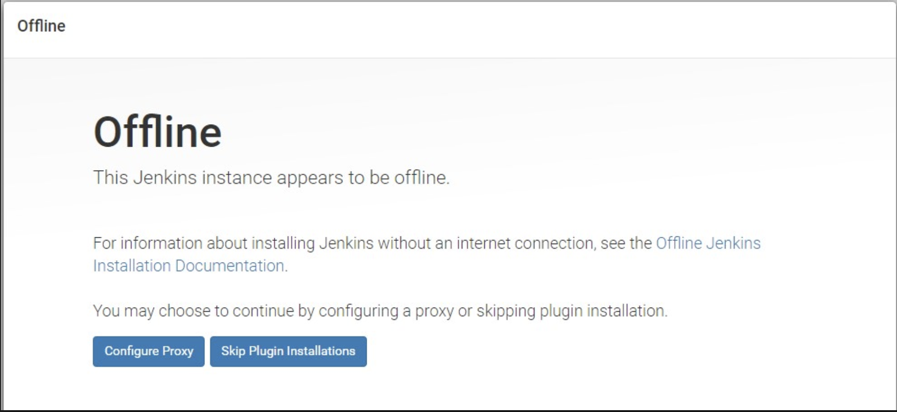
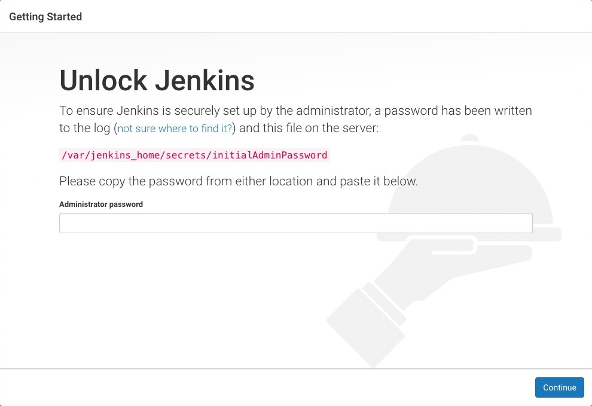
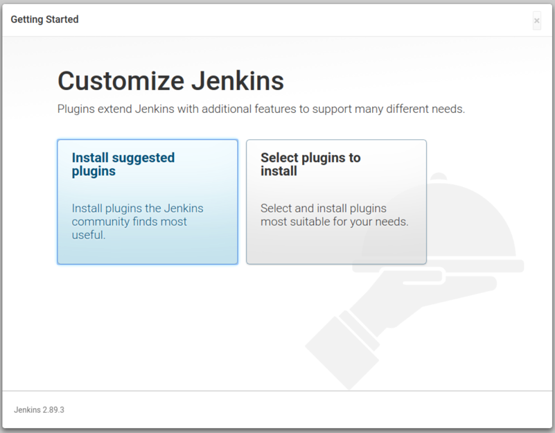
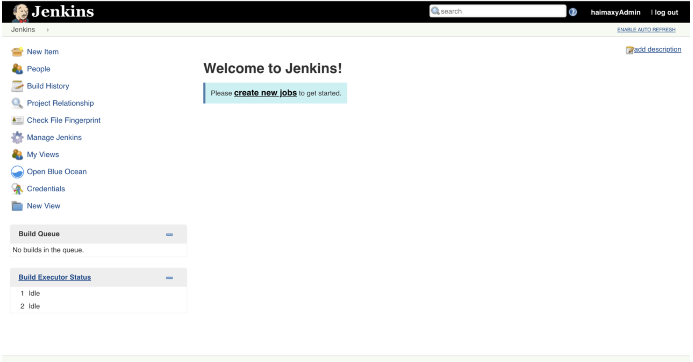
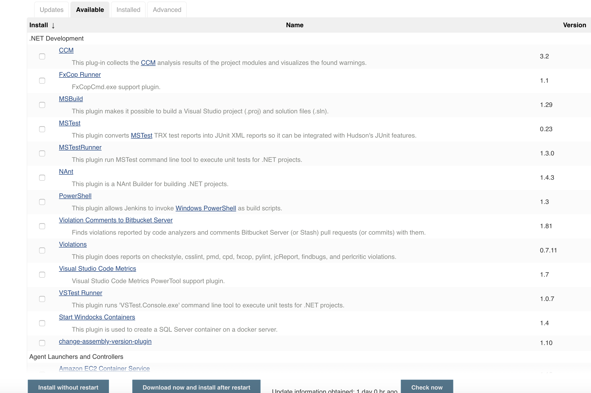

# 基于 Jenkins 的 CI/CD(一)
# 基于 kubernetes 的 jenkins Setup


提到基于`Kubernete`的`CI/CD`，可以使用的工具有很多，比如`Jenkins`、`Gitlab CI`已经新兴的`drone`之类的，我们这里会使用大家最为熟悉的`Jenins`来做`CI/CD`的工具。

## 安装

既然要基于`Kubernetes`来做`CI/CD`，当然我们这里需要将 `Jenkins` 安装到 `Kubernetes` 集群当中，新建一个 `Deployment`：(`jenkins.yaml`)

```
---
apiVersion: extensions/v1beta1
kind: Deployment
metadata:
  name: jenkins
  namespace: kube-ops
spec:
  template:
    metadata:
      labels:
        app: jenkins
    spec:
      terminationGracePeriodSeconds: 10
      serviceAccountName: jenkins
      containers:
      - name: jenkins
        image: jenkins/jenkins:lts
        imagePullPolicy: IfNotPresent
        ports:
        - containerPort: 8080
          name: web
          protocol: TCP
        - containerPort: 50000
          name: agent
          protocol: TCP
        resources:
          limits:
            cpu: 1000m
            memory: 1Gi
          requests:
            cpu: 500m
            memory: 512Mi
        livenessProbe:
          httpGet:
            path: /login
            port: 8080
          initialDelaySeconds: 60
          timeoutSeconds: 5
          failureThreshold: 12 # ~2 minutes
        readinessProbe:
          httpGet:
            path: /login
            port: 8080
          initialDelaySeconds: 60
          timeoutSeconds: 5
          failureThreshold: 12 # ~2 minutes
        volumeMounts:
        - name: jenkinshome
          subPath: jenkins
          mountPath: /var/jenkins_home
        env:
        - name: LIMITS_MEMORY
          valueFrom:
            resourceFieldRef:
              resource: limits.memory
              divisor: 1Mi
        - name: JAVA_OPTS
          value: -Xmx$(LIMITS_MEMORY)m -XshowSettings:vm -Dhudson.slaves.NodeProvisioner.initialDelay=0 -Dhudson.slaves.NodeProvisioner.MARGIN=50 -Dhudson.slaves.NodeProvisioner.MARGIN0=0.85 -Duser.timezone=Asia/Shanghai
      securityContext:
        fsGroup: 1000
      volumes:
      - name: jenkinshome
        persistentVolumeClaim:
          claimName: opspvc
```

但是全部搭建完以后，发现一个问题，启动jenkins页面，发现一个问题 `jenkins offline`, 




然后就跳过了好几个设置的的页面, 然后进入 `Manage Jenkins -> Manage Plugins -> Available `, 空的，点击`check now`, 发现出现报错 

`Oops, java.net.UnknownHostException: updates.jenkins.io`

登录到控制台，查看 `jenkins pod `的 `log`, 发现一个报错

```
WARNING: Error while serving http://192.168.1.138:30001/pluginManager/checkUpdatesServer
```

### 这可能是两个问题：

1. `Oops, java.net.UnknownHostException: updates.jenkins.io`， 这个`url`我的`jenkins` 无法访问, 在哪里修改呢？ 哈哈，两个办法，第一我们的`jenkins pod`是绑定远程的`nfs server`, 等到`server`上的`jenkins`文件夹目录，修改里面的配置。 `nfs server: 192.168.1.138`. `Location: /data/k8s/jenkins/hudson.model.UpdateCenter.xml`, 修改 `http://updates.jenkins-ci.org/update-center.json`。 第二，直接在`jenkins`页面上修改，  `Manage Jenkins -> Manage Plugins -> Advanced -> Update Site `, 修改为 `http://updates.jenkins-ci.org/update-center.json`，重新启动 `kubectl apply -f jenkins.yaml`
2. But, 问题似乎还是没有解。`Error while serving http://192.168.1.138:30001/pluginManager/checkUpdatesServer`, 因为引入`master 02`作为node当时可能会有设置问题，那我们就把`192.168.1.170`作为`jenkins node`

```
$ kubectl get nodes --show-labels
NAME            STATUS    ROLES     AGE       VERSION   LABELS
192.168.1.138   Ready     <none>    5d        v1.8.2    beta.kubernetes.io/arch=amd64,beta.kubernetes.io/os=linux,kubernetes.io/hostname=192.168.1.138
192.168.1.170   Ready     <none>    8d        v1.8.2    beta.kubernetes.io/arch=amd64,beta.kubernetes.io/os=linux,kubernetes.io/hostname=192.168.1.170,source=qikqiak
```

```
$  vi jenkins.yaml

...
spec:
      terminationGracePeriodSeconds: 10
      serviceAccountName: jenkins
      nodeSelector:
        source: qikqiak
      containers:
...
```


为了方便演示，我们把本节课所有的对象资源都放置在一个名为 kube-ops 的 namespace 下面，所以我们需要添加创建一个 namespace：(already created)

```
$ kubectl create namespace kube-ops
```

```
$ kubectl get namespace
NAME          STATUS    AGE
default       Active    8d
kube-ops      Active    7d
kube-public   Active    8d
kube-system   Active    8d
myspace       Active    5d
```

我们这里使用一个名为 `jenkins/jenkins:lts` 的镜像，这是 `jenkins` 官方的 `Docker` 镜像，然后也有一些环境变量，当然我们也可以根据自己的需求来定制一个镜像，比如我们可以将一些插件打包在自定义的镜像当中，可以参考文档：`https://github.com/jenkinsci/docker`，我们这里使用默认的官方镜像就行，另外一个还需要注意的是我们将容器的 `/var/jenkins_home` 目录挂载到了一个名为 `opspvc` 的 `PVC` 对象上面，所以我们同样还得提前创建一个对应的 `PVC` 对象，当然我们也可以使用我们前面的 `StorageClass` 对象来自动创建:(`pvc.yaml`)

```
apiVersion: v1
kind: PersistentVolume
metadata:
  name: opspv
spec:
  capacity:
    storage: 10Gi
  accessModes:
  - ReadWriteMany
  persistentVolumeReclaimPolicy: Delete
  nfs:
    server: 192.168.1.138
    path: /data/k8s

---
kind: PersistentVolumeClaim
apiVersion: v1
metadata:
  name: opspvc
  namespace: kube-ops
spec:
  accessModes:
    - ReadWriteMany
  resources:
    requests:
```

创建需要用到的 `PVC` 对象：

```
$ kubectl create -f pvc.yaml
```


另外我们这里还需要使用到一个拥有相关权限的 `serviceAccount：jenkins`，我们这里只是给 `jenkins` 赋予了一些必要的权限，当然如果你对 `serviceAccount` 的权限不是很熟悉的话，我们给这个 `sa` 绑定一个 `cluster-admin` 的集群角色权限也是可以的，当然这样具有一定的安全风险：（`rbac.yaml`）

```
apiVersion: v1
kind: ServiceAccount
metadata:
  name: jenkins
  namespace: kube-ops

---

kind: Role
apiVersion: rbac.authorization.k8s.io/v1beta1
metadata:
  name: jenkins
  namespace: kube-ops
rules:
  - apiGroups: [""]
    resources: ["pods"]
    verbs: ["create","delete","get","list","patch","update","watch"]
  - apiGroups: [""]
    resources: ["pods/exec"]
    verbs: ["create","delete","get","list","patch","update","watch"]
  - apiGroups: [""]
    resources: ["pods/log"]
    verbs: ["get","list","watch"]
  - apiGroups: [""]
    resources: ["secrets"]
    verbs: ["get"]

---
apiVersion: rbac.authorization.k8s.io/v1beta1
kind: RoleBinding
metadata:
  name: jenkins
  namespace: kube-ops
roleRef:
  apiGroup: rbac.authorization.k8s.io
  kind: Role
  name: jenkins
subjects:
  - kind: ServiceAccount
    name: jenkins
    namespace: kube-ops
```

创建 `rbac` 相关的资源对象：

```
$ kubectl create -f rbac.yaml
serviceaccount "jenkins" created
role.rbac.authorization.k8s.io "jenkins" created
rolebinding.rbac.authorization.k8s.io "jenkins" created
```

```
$ kubectl get sa -n kube-ops
NAME         SECRETS   AGE
default      1         7d
jenkins      1         1d
prometheus   1         7d
```

最后为了方便我们测试，我们这里通过 `NodePort` 的形式来暴露 `Jenkins` 的 `web` 服务，固定为`30001`端口，另外还需要暴露一个 `agent` 的端口，这个端口主要是用于 `Jenkins` 的 `master` 和 `slave` 之间通信使用的。(`svc.yaml`)

```
apiVersion: v1
kind: Service
metadata:
  name: jenkins
  namespace: kube-ops
  labels:
    app: jenkins
spec:
  selector:
    app: jenkins
  type: NodePort
  ports:
  - name: web
    port: 8080
    targetPort: web
    nodePort: 30001
  - name: agent
    port: 50000
    targetPort: agent
```

```
$ kubectl create -f jenkins.yaml
deployment "jenkins" created

$ kubectl create -f svc.yaml
service "jenkins" created
```
创建完成后，要去拉取镜像可能需要等待一会儿，然后我们查看下 `Pod `的状态：

```
$ kubectl get pods -n kube-ops
NAME                        READY     STATUS    RESTARTS   AGE
jenkins2-7f5494cd44-pqpzs   0/1       Running   0          2m
```

可以看到该 `Pod` 处于 `Running` 状态，但是 `READY` 值确为`0`，然后我们用 `describe`命 令去查看下该 `Pod` 的详细信息：

```
$ kubectl describe pod jenkins2-7f5494cd44-pqpzs -n kube-ops
...
Normal   Created                3m                kubelet, node01    Created container
  Normal   Started                3m                kubelet, node01    Started container
  Warning  Unhealthy              1m (x10 over 2m)  kubelet, node01    Liveness probe failed
  Warning  Unhealthy              1m (x10 over 2m)  kubelet, node01    Readiness probe failed:
```

可以看到上面的 `Warning` 信息，健康检查没有通过，具体原因是什么引起的呢？可以通过查看日志进一步了解：

```
$ kubectl logs -f jenkins2-7f5494cd44-pqpzs -n kube-ops
touch: cannot touch '/var/jenkins_home/copy_reference_file.log': Permission denied
Can not write to /var/jenkins_home/copy_reference_file.log. Wrong volume permissions?
```

很明显可以看到上面的错误信息，意思就是我们没有权限在 `jenkins` 的 `home` 目录下面创建文件，这是因为默认的镜像使用的是 `jenkins` 这个用户，而我们通过 `PVC` 挂载到 `nfs` 服务器的共享数据目录下面却是 `root` 用户的，所以没有权限访问该目录，要解决该问题，也很简单，我只需要在 `nfs` 共享数据目录下面把我们的目录权限重新分配下即可：

```
$ sudo chown -R 1000 /data/k8s/jenkins

```
**当然还有另外一种方法是我们自定义一个镜像，在镜像中指定使用 `root` 用户也可以**


然后我们再重新创建：

```
$ kubectl delete -f jenkins.yaml
deployment.extensions "jenkins" deleted

$ kubectl delete -f svc.yaml
service "jenkins" deleted

$ kubectl create -f jenkins.yaml
deployment.extensions "jenkins" created

$ kubectl create -f svc.yaml
service "jenkins" created
```

现在我们再去查看新生成的 `Pod` 已经没有错误信息了：

```
$ kubectl get pods -n kube-ops
NAME                          READY     STATUS    RESTARTS   AGE
jenkins-76d4565d85-6gn62      1/1       Running   0          7h
```

```
$ kubectl get svc -n kube-ops
NAME            TYPE       CLUSTER-IP       EXTERNAL-IP   PORT(S)                          AGE
jenkins         NodePort   10.254.178.111   <none>        8080:30001/TCP,50000:31908/TCP   1d
node-exporter   NodePort   10.254.125.138   <none>        9100:31672/TCP                   7d
```

等到服务启动成功后，我们就可以根据任意节点的 `IP:30001`(`192.168.1.170:30001`) 端口就可以访问 `jenkins` 服务了，可以根据提示信息进行安装配置即可：



初始化的密码我们可以在 `jenkins` 的容器的日志中进行查看，也可以直接在 `nfs` 的共享数据目录中查看：


```
cat /data/k8s/jenkins/secrets/initAdminPassword
```

然后选择安装推荐的插件即可。




安装完成后添加管理员帐号即可进入到 jenkins 主界面：




```
Manage Jenkins -> Manage Plugins -> Available
```




## 优点


`Jenkins` 安装完成了，接下来我们不用急着就去使用，我们要了解下在 `Kubernetes` 环境下面使用 `Jenkins` 有什么好处。

我们知道持续构建与发布是我们日常工作中必不可少的一个步骤，目前大多公司都采用 `Jenkins` 集群来搭建符合需求的 `CI/CD` 流程，然而传统的 `Jenkins Slave` **一主多从**方式会存在一些痛点，比如：

* 主 `Master` 发生单点故障时，整个流程都不可用了
* 每个 `Slave` 的配置环境不一样，来完成不同语言的编译打包等操作，但是这些差异化的配置导致管理起来非常不方便，维护起来也是比较费劲
* 资源分配不均衡，有的 `Slave` 要运行的 `job` 出现排队等待，而有的 `Slave` 处于空闲状态
* 资源有浪费，每台 `Slave` 可能是物理机或者虚拟机，当 `Slave` 处于空闲状态时，也不会完全释放掉资源。


正因为上面的这些种种痛点，我们渴望一种更高效更可靠的方式来完成这个 `CI/CD` 流程，而 `Docker` 虚拟化容器技术能很好的解决这个痛点，又特别是在 `Kubernetes` 集群环境下面能够更好来解决上面的问题，下图是基于 `Kubernetes` 搭建 `Jenkins` 集群的简单示意图：


从图上可以看到 `Jenkins Master` 和 `Jenkins Slave` 以 `Pod` 形式运行在 `Kubernetes` 集群的 `Node` 上，`Master` 运行在其中一个节点，并且将其配置数据存储到一个 `Volume` 上去，`Slave` 运行在各个节点上，并且它不是一直处于运行状态，它会按照需求动态的创建并自动删除。

这种方式的工作流程大致为：当 `Jenkins Master` 接受到 `Build` 请求时，会根据配置的 `Label` 动态创建一个运行在 `Pod` 中的 `Jenkins Slave` 并注册到 `Master` 上，当运行完 `Job` 后，这个 `Slave` 会被注销并且这个 `Pod` 也会自动删除，恢复到最初状态。

那么我们使用这种方式带来了哪些好处呢？


* **服务高可用**，当 `Jenkins Master` 出现故障时，`Kubernetes` 会自动创建一个新的 `Jenkins Master` 容器，并且将 `Volume` 分配给新创建的容器，保证数据不丢失，从而达到集群服务高可用。
* **动态伸缩**，合理使用资源，每次运行 `Job` 时，会自动创建一个 `Jenkins Slave`，`Job` 完成后，`Slave` 自动注销并删除容器，资源自动释放，而且 `Kubernetes` 会根据每个资源的使用情况，动态分配 `Slave` 到空闲的节点上创建，降低出现因某节点资源利用率高，还排队等待在该节点的情况。
* **扩展性好**，当 `Kubernetes` 集群的资源严重不足而导致 `Job` 排队等待时，可以很容易的添加一个 `Kubernetes Node` 到集群中，从而实现扩展。

是不是以前我们面临的种种问题在 Kubernetes 集群环境下面是不是都没有了啊？看上去非常完美。