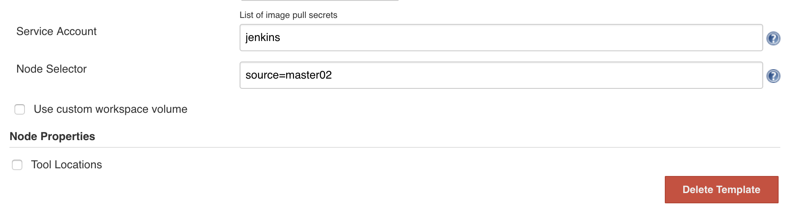

# 基于 Jenkins 的 CI/CD(一)
# 基于 kubernetes 的动态 jenkins slave

## 配置

接下来我们就需要来配置 `Jenkins`，让他能够动态的生成 `Slave` 的 `Pod`。

**第1步**. 我们需要安装`kubernetes plugin`， 点击 `Manage Jenkins -> Manage Plugins -> Available -> Kubernetes plugin` 勾选安装即可。 `kubernetes plugin`


` And My favorite plugin => Safe restart plugin `


**第2步**. 安装完毕后，点击 `Manage Jenkins —> Configure System —> (拖到最下方)Add a new cloud —> 选择 Kubernetes`，然后填写 `Kubernetes` 和 `Jenkins` 配置信息。


`kubernetes url`: `https://kubernetes.default.svc.cluster.local`

注意 `namespace`，我们这里填 `kube-ops`，然后点击`Test Connection`，如果出现 `Connection test successful` 的提示信息证明 `Jenkins` 已经可以和 `Kubernetes` 系统正常通信了，然后下方的 `Jenkins URL` 地址：`http://jenkins2.kube-ops.svc.cluster.local:8080`，这里的格式为：`服务名.namespace.svc.cluster.local:8080`，


### BugFix

Test connection may be error

1.recreate the SVC, take it a try
2.recreate the Deployment, I tried `new jenkins pod` on new node `192.168.1.138`

```
$ kubectl label nodes 192.168.1.138 source=master02

$ kubectl get nodes --show-labels
NAME            STATUS    ROLES     AGE       VERSION   LABELS
192.168.1.138   Ready     <none>    6d        v1.8.2    beta.kubernetes.io/arch=amd64,beta.kubernetes.io/os=linux,kubernetes.io/hostname=192.168.1.138,source=master02
192.168.1.170   Ready     <none>    8d        v1.8.2    beta.kubernetes.io/arch=amd64,beta.kubernetes.io/os=linux,kubernetes.io/hostname=192.168.1.170,source=qikqiak

$ vi jenkins.yaml

 terminationGracePeriodSeconds: 10
 serviceAccountName: jenkins
    nodeSelector:
      source: master02
 containers:
```


3.另外需要注意，如果这里 `Test Connection` 失败的话，很有可能是权限问题，这里就需要把我们创建的 `jenkins` 的 `serviceAccount` 对应的 `secret` 添加到这里的 `Credentials` 里面。

```
$ kubectl get secret -n=kube-ops
NAME                     TYPE                                  DATA      AGE
default-token-mjrv9      kubernetes.io/service-account-token   3         8d
jenkins-token-jwmg7      kubernetes.io/service-account-token   3         1h
prometheus-token-vrc7k   kubernetes.io/service-account-token   3         8d


$ kubectl describe secret  jenkins-token-jwmg7 -n=kube-ops
Name:         jenkins-token-jwmg7
Namespace:    kube-ops
Labels:       <none>
Annotations:  kubernetes.io/service-account.name=jenkins
              kubernetes.io/service-account.uid=4d168c85-bca0-11e8-9074-080027ee1df7

Type:  kubernetes.io/service-account-token

Data
====
ca.crt:     1359 bytes
namespace:  8 bytes
token:      eyJhbGciOiJSUzI1NiIsInR5cCI6IkpXVCJ9.eyJpc3MiOiJrdWJlcm5ldGVzL3NlcnZpY2VhY2NvdW50Iiwia3ViZXJuZXRlcy5pby9zZXJ2aWN ...
```

第3步. 配置 `Pod Template`，其实就是配置 `Jenkins Slave` 运行的 `Pod` 模板，命名空间我们同样是用 `kube-ops`，`Labels` 这里也非常重要，对于后面执行 `Job` 的时候需要用到该值。 `Labels`:`nyjxi-jnlp`

为了快速尝试动态建立一个slave，先可以尝试空的 `Container Template`，写一个简答的`jenkins freestyle job` 去测试它。

然后我们这里使用的是 `cnych/jenkins:jnlp` 这个镜像，这个镜像是在官方的 `jnlp` 镜像基础上定制的，加入了 `kubectl` 等一些实用的工具。

注意啊：要删掉 `command to run: /bin/sh -c`  和 `arguments to pass to command: cat`


另外需要注意我们这里需要在下面挂载两个主机目录，一个是 `/var/run/docker.sock`，该文件是用于 `Pod` 中的容器能够共享宿主机的 `Docker`，这就是大家说的 `docker in docker` 的方式，`Docker` 二进制文件我们已经打包到上面的镜像中了，另外一个目录下 `/root/.kube` 目录，我们将这个目录挂载到容器的 `/home/jenkins/.kube` 目录下面这是为了让我们能够在 `Pod` 的容器中能够使用 `kubectl` 工具来访问我们的 `Kubernetes` 集群，方便我们后面在 `Slave Pod` 部署 `Kubernetes` 应用。


另外还有几个参数需要注意，如下图中的`Time in minutes to retain slave when idle`，这个参数表示的意思是当处于空闲状态的时候保留 `Slave Pod` 多长时间，这个参数最好我们保存默认就行了，如果你设置过大的话，`Job` 任务执行完成后，对应的 `Slave Pod` 就不会立即被销毁删除。


另外一些同学在配置了后运行 `Slave Pod` 的时候出现了权限问题，如果出现了权限不足的问题，在 `Slave Pod` 配置的地方点击下面的高级，添加上对应的 `ServiceAccount` 即可：

例如运行简单的`jenkins job`中 `execute shell`

```
kubectl get pods
```

```
Error from server (Forbidden): pods is forbidden: User "system:serviceaccount:kube-ops:default" cannot list pods in the namespace "kube-ops"
Build step 'Execute shell' marked build as failure
```





把新的 `dynamic node`建立在特定的`machine by label`

`node selector`: `source=master02`

```
Specify which nodes the pod should operate on by providing a comma separated list of node 
labels: `label1=value1,label2=value2`.
```

到这里我们的 `Kubernetes Plugin` 插件就算配置完成了。


## 测试 1

`Kubernetes` 插件的配置工作完成了，接下来我们就来添加一个 `Job` 任务，看是否能够在 `Slave Pod` 中执行，任务执行完成后看 `Pod` 是否会被销毁。

在 `Jenkins` 首页点击`create new jobs`，创建一个测试的任务，输入任务名称，然后我们选择 `Freestyle project` 类型的任务：


注意在下面的 `Label Expression` 这里要填入`nyjxi-jnlp`，就是前面我们配置的 `Slave Pod` 中的 `Label`，这两个地方必须保持一致 `config`


然后往下拉，在 `Build` 区域选择`Execute shell`


然后输入我们测试命令

```
echo "测试 Kubernetes 动态生成 jenkins slave"
echo "==============pwd==========="
pwd

echo "=============env============="
env
```

最后点击保存


现在我们直接在页面点击做成的 `Build now` 触发构建即可，然后观察 `Kubernetes` 集群中 `Pod` 的变化

```
$ kubectl get pods -n kube-ops
NAME                       READY     STATUS              RESTARTS   AGE
jnlp-vchgt                 0/1       ContainerCreating   0          7s
```


到这里证明我们的任务已经构建完成，然后这个时候我们再去集群查看我们的 `Pod` 列表，发现 `kube-ops` 这个 `namespace `下面已经没有之前的 `Slave` 这个 `Pod` 了。

```
$ kubectl get pods -n kube-ops
NAME                          READY     STATUS    RESTARTS   AGE
jenkins-59d56bd888-qvpzk      1/1       Running   0          1h
```


## 测试 2

创建一个新的`freestyle job` : `nyjxi-jnlp-slave-demo2`

```
echo "测试 Kubernetes 动态生成 jenkins slave"
echo "==============docker in docker==========="
docker info

echo "=============kubectl============="
kubectl get pods
```

最后点击保存,并运行


### BugFix

`salve`容器启动起来了，但是与`master`的连接建立不起来，显示离线状态, 那个`jnlp`端口我也设置成`50000`了.`salve`控制台没有打印日志，但是我可以进入`salve`容器内部

此时虽然`slave`没有打印有效的信息， 我们可以在控制台进入`jenkins master`，去打印`log`信息

```
WARNING: Error in provisioning; agent=KubernetesSlave name: jnlp-sphns, 
template=PodTemplate{inheritFrom='', name='jnlp', namespace='kube-ops', idleMinutes=1, 
label='nyjxi-jnlp', serviceAccount='jenkins', nodeSelector='', nodeUsageMode=EXCLUSIVE, 
workspaceVolume=EmptyDirWorkspaceVolume [memory=false], volumes=[HostPathVolume [mountPath=/var/run/docker.sock, hostPath=/var/run/docker.sock], HostPathVolume [mountPath=/home/
jenkins/.kube, hostPath=/root/.kube]], containers=[ContainerTemplate{name='jnlp', 
image='cnych/jenkins:jnlp ', workingDir='/home/jenkins', command='', args='', ttyEnabled=true, 
resourceRequestCpu='', resourceRequestMemory='', resourceLimitCpu='', resourceLimitMemory='', 
livenessProbe=org.csanchez.jenkins.plugins.kubernetes.ContainerLivenessProbe@1bd2135c}], 
yaml=}

io.fabric8.kubernetes.client.KubernetesClientException: Failure executing: POST at: https://
kubernetes.default.svc.cluster.local/api/v1/namespaces/kube-ops/pods. Message: Pod "jnlp-
sphns" is invalid: spec.containers[0].image: Invalid value: "cnych/jenkins:jnlp ": must not 
have leading or trailing whitespace. Received status: Status(apiVersion=v1, code=422, 
details=StatusDetails(causes=[StatusCause(field=spec.containers[0].image, message=Invalid 
value: "cnych/jenkins:jnlp ": must not have leading or trailing whitespace, 
reason=FieldValueInvalid, additionalProperties={})], group=null, kind=Pod, name=jnlp-sphns, 
retryAfterSeconds=null, uid=null, additionalProperties={}), kind=Status, message=Pod "jnlp-
sphns" is invalid: spec.containers[0].image: Invalid value: "cnych/jenkins:jnlp ": must not 
have leading or trailing whitespace, metadata=ListMeta(_continue=null, resourceVersion=null, 
selfLink=null, additionalProperties={}), reason=Invalid, status=Failure, 
additionalProperties={}).
	at io.fabric8.kubernetes
```

###  Invalid value: "cnych/jenkins:jnlp ": must not have leading or trailing whitespace.

所以要重新设置一下 `Container Template`


`cnych/jenkins:jnlp` 镜像的 `dockerfile` : [jenkins-slave.Dockerfile](k8s_jenkins_code/jk2/jenkins-slave.Dockerfile)