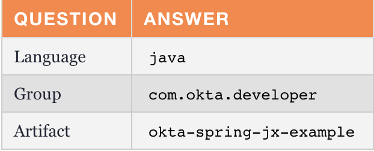
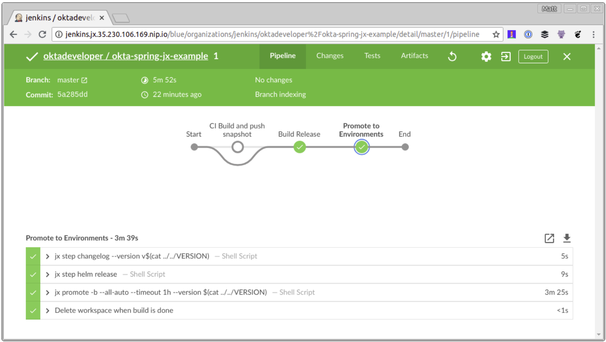

# 创建一个 `Spring Boot` 应用程序

当我第一次开始使用 `Jenkins X` 时，我尝试导入现有项目。即使我的应用程序使用了 `Spring Boot`，但是根目录中没有 `pom.xml`，所以 `Jenkins X` 认为它是一个 `Node.js` 应用程序。

出于这个原因，我建议首先创建一个空白的 `Spring Boot` 应用程序，以保证 `Jenkins X` 正确创建。

### 从 `Cloud Shell` 创建一个简单的 `Spring Boot` 应用程序：

```
jx create spring -d web -d actuator
```

此命令使用 [`Spring Initializr`](https://start.spring.io/)，因此系统会提示你进行一些选择。以下是我的选择：



提示：为你的 `artifact name` 选取一个简洁的名称将减轻你的痛苦**。`Jenkins X` 对于版本名称有`53`个字符的限制**，`oktadeveloper/okta-spring-boot-jenkinsx-example` 将会使它超过两个字符。


**为 `git` 用户名、初始化 `git` 和提交消息都选择默认值**。 如果你不想使用个人帐户，可以选择要使用的组织。运行以下命令以查看应用程序的 `CI/CD` 流水线。

```
jx get activity -f okta-spring-jx-example -w
```

运行 `jx console`，单击生成的链接，然后导航到你的项目。



此过程将执行一些任务：

* 为你的项目创建[一个版本](https://github.com/oktadeveloper/okta-spring-jx-example/releases/tag/v0.0.1)。
* 为演示环境项目创建 [pull request](https://github.com/mraible/environment-marespring-staging/pull/1)。
* 将其自动部署到演示环境，以便你可以查看它的运行情况。

```
Merge status checks all passed so the promotion worked!
Application is available at: http://okta-spring-jx-example.jx-staging.35.230.106.169.nip.io
```
注意：**由于 `Spring Boot` 默认情况下不提供欢迎页面，所以打开上面的 `URL` 时将返回`404`。**

## 使用 Jenkins X 将 Spring Boot 应用程序部署到生产环境中

默认情况下，`Jenkins X` 只会自动部署到演示环境。你可以手动[改进从演示到生产使用](https://jenkins-x.io/developing/promote/)：

```
jx promote okta-spring-jx-example --version 0.0.1 --env production
```

你可以使用 `jx edit environment` 更改生产环境，以使用自动部署。

既然你已经知道如何使用 `Jenkins X` 和一个简单的 `Spring Boot` 应用程序，让我们来看看如何通过一个更实际的示例使其工作。

## 保护你的 `Spring Boot` 应用程序并添加 `Angular PWA`

在过去的几个月里，我写了一系列有关使用 `Ionic/Angular` 和 `Spring Boot` 构建 `PWA`（progressive web app）的博文。

* [Protect Your Cryptocurrency Wealth Tracking PWA with Okta](https://developer.okta.com/blog/2018/01/18/cryptocurrency-pwa-secured-by-okta)
* [Use Okta (Instead of Local Storage) to Store Your User’s Data Securely](https://developer.okta.com/blog/2018/01/23/replace-local-storage-with-okta-profile-attributes)
* [The Hitchhiker’s Guide to Testing Spring Boot APIs and Angular Components with WireMock, Jest, Protractor, and Travis CI](https://developer.okta.com/blog/2018/05/02/testing-spring-boot-angular-componentss)
* [Deploy Your Secure Spring Boot + Angular PWA as a Single Artifact](https://developer.okta.com/blog/2018/06/18/spring-boot-angular-auth-code-flow)


这是该系列的最后一篇博客文章。我相信这是一个真实应用程序的很好的例子，因为它有许多单元和集成测试，包括与 `Protractor` 的端到端测试。让我们看看如何使用 `Jenkins X` 和 `Kubernetes` 自动化生产路径！

克隆刚刚从`GitHub`创建的`Spring Boot`项目（确保在URL中更改`{yourUsername}`）：

```
git clone https://github.com/{yourUsername}/okta-spring-jx-example.git okta-jenkinsx
```

在邻近目录中，将创建的具有 `Spring Boot + Angular` 的项目克隆为一个 `artifact`：

```
git clone https://github.com/oktadeveloper/okta-spring-boot-angular-auth-code-flow-example.git spring-boot-angular
```

在终端中，导航到 `okta-jenkinsx` 并删除不再需要的文件：

```
cd okta-jenkinsx
rm  -rf .mvn src mvnw* pom.xml
```

结果应该是包含以下文件的目录结构：

```
$ tree .
.
├── charts
│   ├── okta-spring-jx-example
│   │   ├── Chart.yaml
│   │   ├── Makefile
│   │   ├── README.md
│   │   ├── templates
│   │   │   ├── deployment.yaml
│   │   │   ├── _helpers.tpl
│   │   │   ├── NOTES.txt
│   │   │   └── service.yaml
│   │   └── values.yaml
│   └── preview
│       ├── Chart.yaml
│       ├── Makefile
│       ├── requirements.yaml
│       └── values.yaml
├── Dockerfile
├── Jenkinsfile
└── skaffold.yaml
4 directories, 15 files
```

将 `spring-boot-angular` 所有文件复制到 `okta-jenkinsx`。

```
cp  -r ../spring-boot-angular/* .
```
使用 `Travis CI `测试此应用程序时，我运行了 `npm install` 作为该过程的一部分。使用 `Jenkins X`，使用一个容器（例如 `maven` 或者 n`odejs`）保存所有内容更简单，因此在 `frontend-maven-plugin`（在 `holdings-api/pom.xml`）中添加执行以运行 `npm install `（提示：你将需要执行 `id==’npm install'` 添加到现有的pom.xml中）。

现在是 `okta-jenkinsx` 在 `IntelliJ IDEA、Eclipse、Netbeans` 或 `VS Code` 等 IDE 中作为项目打开目录的好时机！

```
<plugin>
   <groupId>com.github.eirslett</groupId>
   <artifactId>frontend-maven-plugin</artifactId>
   <version>${frontend-maven-plugin.version}</version>
   <configuration>
       <workingDirectory>../crypto-pwa</workingDirectory>
   </configuration>
   <executions>
       <execution>
           <id>install node and npm</id>
           <goals>
               <goal>install-node-and-npm</goal>
           </goals>
           <configuration>
               <nodeVersion>${node.version}</nodeVersion>
           </configuration>
       </execution>
       <execution>
           <id>npm install</id>
           <goals>
               <goal>npm</goal>
           </goals>
           <phase>generate-resources</phase>
           <configuration>
               <arguments>install --unsafe-perm</arguments>
           </configuration>
       </execution>
       ...
   </executions>
</plugin>
```

注意：`--unsafe-perm` 标志是必要的，因为 `Jenkins X` 以 `root` 用户身份运行构建。我从 `node-sass` 的故障排除说明中找到了这个解决方案。

## 增加 Actuator 并关闭 HTTPS


`Jenkins X` 依靠 `Spring Boot` 的 `Actuator `进行健康检查。这意味着如果你不将其包含在你的项目中（或有 /`actuator/health` 防护），`Jenkins X `会报告你的应用程序启动失败。

将 `Actuator starter` 作为依赖项添加到 `holdings-api/pom.xml` 中：

```
<dependency>
   <groupId>org.springframework.boot</groupId>
   <artifactId>spring-boot-starter-actuator</artifactId>
</dependency>
```

你还需要允许访问其运行健康检查。`Jenkins X` 将部署你的应用程序在一个 `NGINX` 服务器中,因此你也需要强制关闭 `HTTPS`，否则你将无法访问你的应用程序。

**修改 `holdings-api/src/main/java/.../SecurityConfiguration.java` 以允许 `holdings-api/src/main/java/.../SecurityConfiguration.java` 和删除 `requiresSecure()`。**

```
public class SecurityConfiguration extends WebSecurityConfigurerAdapter {
   @Override
   public void configure(WebSecurity web) throws Exception {
       web.ignoring().antMatchers("/**/*.{js,html,css}");
   }
   @Override
   protected void configure(HttpSecurity http) throws Exception {
       http
               .csrf().csrfTokenRepository(CookieCsrfTokenRepository.withHttpOnlyFalse())
           .and()
               .authorizeRequests()
               .antMatchers("/", "/home", "/api/user", "/actuator/health").permitAll()
               .anyRequest().authenticated();
   }
}
```

## 调整 `Dockerfile` 和 `Jenkinsfile` 中的路径

由于此项目构建在子目录而不是根目录中，因此请更新 `./Dockerfile` 以查找 `holdings-api` 文件。

```
FROM openjdk:8-jdk-slim
ENV PORT 8080
ENV CLASSPATH /opt/lib
EXPOSE 8080
# copy pom.xml and wildcards to avoid this command failing if there's no target/lib directory
COPY holdings-api/pom.xml holdings-api/target/lib* /opt/lib/
# NOTE we assume there's only 1 jar in the target dir
# but at least this means we don't have to guess the name
# we could do with a better way to know the name - or to always create an app.jar or something
COPY holdings-api/target/*.jar /opt/app.jar
WORKDIR /opt
CMD ["java", "-jar", "app.jar"]
```

你还需要更新 `Jenkinsfile`,以便它可以运行 `holdings-api` 目录中的任何 `mvn` 命令。也添加 `-Pprod `配置文件。例如：

```
// in the 'CI Build and push snapshot' stage
steps {
 container('maven') {
   dir ('./holdings-api') {
     sh "mvn versions:set -DnewVersion=$PREVIEW_VERSION"
     sh "mvn install -Pprod"
   }
 }
 ...
}
// in the 'Build Release' stage
dir ('./holdings-api') {
  sh "mvn versions:set -DnewVersion=\$(cat ../VERSION)"
}
...
dir ('./holdings-api') {
  sh "mvn clean deploy -Pprod"
}
```

这应该足以让这个应用程序与 `Jenkins X` 一起使用。但是，除非你有一个 `Okta` 帐户并相应地配置它，否则你将无法登录它。


