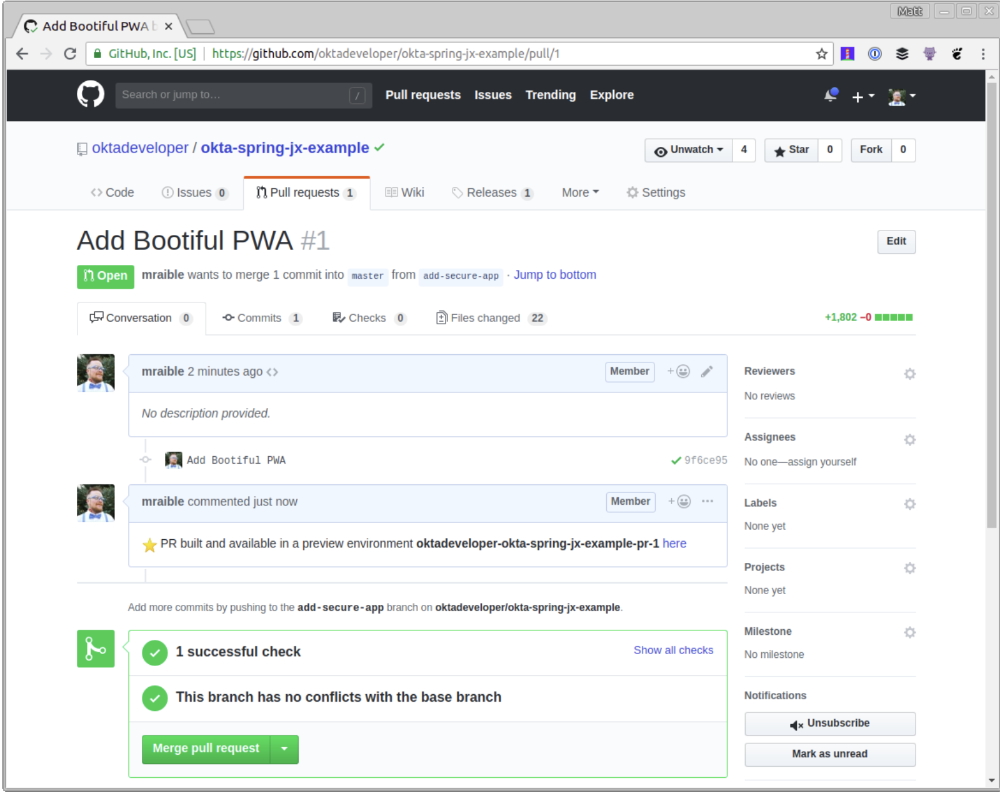

# 为什么使用Okta？

简而言之，我们使标识管理比你可能习惯的更简洁、更安全、更具可扩展性。**`Okta` 是一种云服务，允许开发人员创建、编辑和安全存储用户帐户和用户帐户数据，并将其与一个或多个应用程序相连接**。我们的 API 使你能够：

* 对用户进行身份[验证](https://developer.okta.com/product/authentication/)和[授权](https://developer.okta.com/product/authorization/)
* 存储关于用户的数据
* 执行基于密码和[社交登录](https://developer.okta.com/authentication-guide/social-login/)
* 使用[多重身份验证](https://developer.okta.com/use_cases/mfa/)保护应用程序

了解更多！查看我们的产品文档 你心动了吗？注册一个永远免费的开发者帐户，当你完成后，请返回，以便我们可以通过 Spring Boot 和 Jenkins X 了解有关 CI/CD 的更多信息！


## 在 Okta 中为 `Spring Boot` 应用程序创建一个 Web 应用程序

完成设置过程后，登录到你的帐户并导航到 `Applications > Add Application`。单击 `Web` 和 下一步。在下一页中，输入以下值并单击 `Done` (必须单击 Done，然后编辑以修改注销重定向 URI)。

* 应用名称： `Jenkins X`
* 默认 `URI： http://localhost:8080`
* 登录重定向 URI： `http://localhost:8080/login`
* 注销重定向 URI： `http://localhost:8080` 打开 `holdings-api/src/main/resources/application.yml` 并将你 `org/app` 中的值粘贴到其中。

```
okta:
 client:
   orgUrl: https://okta.okta.com
   token: XXX
security:
   oauth2:
     client:
       access-token-uri: https://okta.okta.com/oauth2/default/v1/token
       user-authorization-uri: https://okta.okta.com/oauth2/default/v1/authorize
       client-id: {clientId}
       client-secret: {clientSecret}
     resource:
       user-info-uri: https://okta.okta.com/oauth2/default/v1/userinfo
```

你将注意到 `token` 值是 `xxx`。这是因为我更喜欢从环境变量中读取它，而不是签入源代码控制。你可能也想为你的客户密钥执行此操作，但我只是为了简洁而做一个属性。要创建 `API token`：

1. 导航到 `API > Tokens` ，然后单击 `Create Token`
2. 为令牌命名（例如 “Jenkins X”），然后将其值设置为 `OKTA_CLIENT_TOKEN` 环境变量。 你需要在组织的用户配置文件中添加一个 `holding`s 属性，以便将你的加密货币存储在 `Okta` 中。导航到 `Users > Profile Editor`。点击 `Profile` 表格中的第一个配置文件。你可以通过其 `Okta` 标识来识别它。单击 `Add Attribute` 并使用以下值：
3. 显示名称： `Holdings`
4. 变量名： `holdings`
5. 描述： `Cryptocurrency Holdings` 


执行这些步骤后，你应该能够导航到 `http://localhost:8080`, 并在运行以下命令后登录：

```
cd holdings-api
./mvnw -Pprod package
java -jar target/*.jar
```

在 `Jenkins X` 中存储 `Secrets` 在本地存储环境变量非常简单。但是你如何在 Jenkins X 中做到这一点？看看它的凭证功能就知道了。下面是使用方法:


* 在 `Google Cloud Shell` 上运行 `jx console`，以获取 `Jenkins X` 网址
* 单击该链接，登录，然后单击顶部的 `Administration`
* 单击 `Credentials > (global) > Add Credentials`（在左侧）
* 从下拉列表中选择 `Secret text`，并为 `ID` 输入 `OKTA_CLIENT_TOKEN`
* 将 `Okta API token` 复制/粘贴到 `Secret` 字段中 


打开浏览器并导航到 GitHub 上的存储库并创建 pull request。创建后它应该如下所示。

当你在里面，添加 `secrets：OKTA_APP_ID`、`E2E_USERNAME` 和 `E2E_PASSWORD`。第一个是你创建的 `Jenkins X OIDC` 应用程序的 `ID`。您可以通过在 `Okta` 上导航到您的应用程序并从 `URL `复制值来获得它的值。该 `E2E-*` 密钥应该是要用来运行终端到终端`（Protractor）`测试的凭证。你可能想为此创建一个新用户。


你可以通过将这些值添加到 `environment` 顶部附近的部分来访问 `Jenkinsfile` 中的这些值 。

```
environment {
  ORG               = 'mraible'
  APP_NAME          = 'okta-spring-jx-example'
  CHARTMUSEUM_CREDS = credentials('jenkins-x-chartmuseum')
  OKTA_CLIENT_TOKEN = credentials('OKTA_CLIENT_TOKEN')
  OKTA_APP_ID       = credentials('OKTA_APP_ID')
  E2E_USERNAME      = credentials('E2E_USERNAME')
  E2E_PASSWORD      = credentials('E2E_PASSWORD')
}
```

## 将环境变量转移到 Docker 容器


要将 `OKTA_CLIENT_TOKEN` 环境变量转移到 `Docker` 容器，请查看：

```
sh "make preview"
```

并将其更改为：

```
sh "make OKTA_CLIENT_TOKEN=\$OKTA_CLIENT_TOKEN preview"
```

此时，你可以创建分支，提交更改，并验证 `Jenkins X` 中的所有内容是否正常工作。

```
cd ..
git checkout -b add-secure-app
git add .
git commit -m "Add Bootiful PWA"
git push origin add-secure-app
```


打开浏览器并导航到 GitHub 上的存储库并创建 `pull request`。创建后它应该如下所示。


如果你的 `pull request` 测试通过，你应该能看到一些绿色标记和 `Jenkins `X 的评论，说明你的应用程序在预览环境中可用。



如果你**单击此处**链接并尝试登录，则可能会从 Okta 得到一个错误，指出重定向 URI 尚未列入白名单。

## 在 Okta 中自动添加重定向 URI

当你在 Okta 中创建应用程序并在本地运行它们时，很容易知道应用程序的重定向 `URI` 将是什么。对于这个特定的应用程序，它们将 `http://localhost:8080/login` 用于登录，`http://localhost:8080` 用于注销。当您进入生产环境时，URL通常也是众所周知的。但是，使用 `Jenkins X，URL` 是动态的，并根据你的 `pull request` 编号动态创建的。

要使用 Okta 进行此操作，你可以创建一个 `Java` 类，该类与 `Okta API` 进行交互。创建 `holdings-api/src/test/java/.../cli/AppRedirectUriManager.java` 并使用以下代码完善它。

```
package com.okta.developer.cli;
import com.okta.sdk.client.Client;
import com.okta.sdk.lang.Collections;
import com.okta.sdk.resource.application.OpenIdConnectApplication;
import org.slf4j.Logger;
import org.slf4j.LoggerFactory;
import org.springframework.beans.factory.annotation.Value;
import org.springframework.boot.ApplicationArguments;
import org.springframework.boot.ApplicationRunner;
import org.springframework.boot.SpringApplication;
import org.springframework.boot.autoconfigure.SpringBootApplication;
import java.util.LinkedHashSet;
import java.util.List;
import java.util.Set;
@SpringBootApplication
public class AppRedirectUriManager implements ApplicationRunner {
   private static final Logger log = LoggerFactory.getLogger(AppRedirectUriManager.class);
   private final Client client;
   @Value("${appId}")
   private String appId;
   @Value("${redirectUri}")
   private String redirectUri;
   @Value("${operation:add}")
   private String operation;
   public AppRedirectUriManager(Client client) {
       this.client = client;
   }
   public static void main(String[] args) {
       SpringApplication.run(AppRedirectUriManager.class, args);
   }
   @Override
   public void run(ApplicationArguments args) {
       log.info("Adjusting Okta settings: {appId: {}, redirectUri: {}, operation: {}}", appId, redirectUri, operation);
       OpenIdConnectApplication app = (OpenIdConnectApplication) client.getApplication(appId);
       String loginRedirectUri = redirectUri + "/login";
       // update redirect URIs
       List<String> redirectUris = app.getSettings().getOAuthClient().getRedirectUris();
       // use a set so values are unique
       Set<String> updatedRedirectUris = new LinkedHashSet<>(redirectUris);
       if (operation.equalsIgnoreCase("add")) {
           updatedRedirectUris.add(loginRedirectUri);
       } else if (operation.equalsIgnoreCase("remove")) {
           updatedRedirectUris.remove(loginRedirectUri);
       }
       // todo: update logout redirect URIs with redirectUri (not currently available in Java SDK)
       app.getSettings().getOAuthClient().setRedirectUris(Collections.toList(updatedRedirectUris));
       app.update();
       System.exit(0);
   }
}
```
该类使用 `Spring Boot` 的 `CLI`（命令行接口）支持，这使得可以使用 `Exec Maven` 插件调用它。要添加对 `Maven` 运行它的支持，请在 `holdings-api/pom.xml` 进行以下修改 。

```
<properties>
    ...
   <exec-maven-plugin.version>1.6.0</exec-maven-plugin.version>
   <appId>default</appId>
   <redirectUri>override-me</redirectUri>
</properties>
<!-- dependencies -->
<build>
   <defaultGoal>spring-boot:run</defaultGoal>
   <finalName>holdings-app-${project.version}</finalName>
   <plugins>
       <!-- existing plugins -->
       <plugin>
           <groupId>org.codehaus.mojo</groupId>
           <artifactId>exec-maven-plugin</artifactId>
           <version>${exec-maven-plugin.version}</version>
           <executions>
               <execution>
                   <id>add-redirect</id>
                   <goals>
                       <goal>java</goal>
                   </goals>
               </execution>
           </executions>
           <configuration>
               <mainClass>com.okta.developer.cli.AppRedirectUriManager</mainClass>
               <classpathScope>test</classpathScope>
               <arguments>
                   <argument>appId ${appId} redirectUri ${redirectUri}</argument>
               </arguments>
           </configuration>
       </plugin>
   </plugins>
</build>
```

然后更新 `Jenkinsfile` 以在构建镜像之后添加一段 `mvn exec:java` 供运行。


```
dir ('./charts/preview') {
  container('maven') {
    sh "make preview"
    sh "make OKTA_CLIENT_TOKEN=\$OKTA_CLIENT_TOKEN preview"
    sh "jx preview --app $APP_NAME --dir ../.."
  }
}
// Add redirect URI in Okta
dir ('./holdings-api') {
  container('maven') {
    sh '''
      yum install -y jq
      previewURL=$(jx get preview -o json|jq  -r ".items[].spec | select (.previewGitInfo.name==\\"$CHANGE_ID\\") | .previewGitInfo.applicationURL")
      mvn exec:java@add-redirect -DappId=$OKTA_APP_ID -DredirectUri=$previewURL
    '''
  }
}
```

提交并推送你的更改，应用程序应该更新为 `http://{yourPreviewURL}/login` 的重定向 `URI`。你需要手动为 `http://{yourPreviewURL}` 添加一个注销重定向 `URI`， 因为 `Okta` 的 `Java SDK` 目前不支持此功能。


要将你的 `pull request` 上传到演示环境，请将其合并，并将主分支推送到演示环境。不幸的是，你将无法登录。这是因为没有进程使用你的 `Okt` 应用程序注册登台站点的重定向 URI。**如果手动添加 URI，一切都应该有效。**


