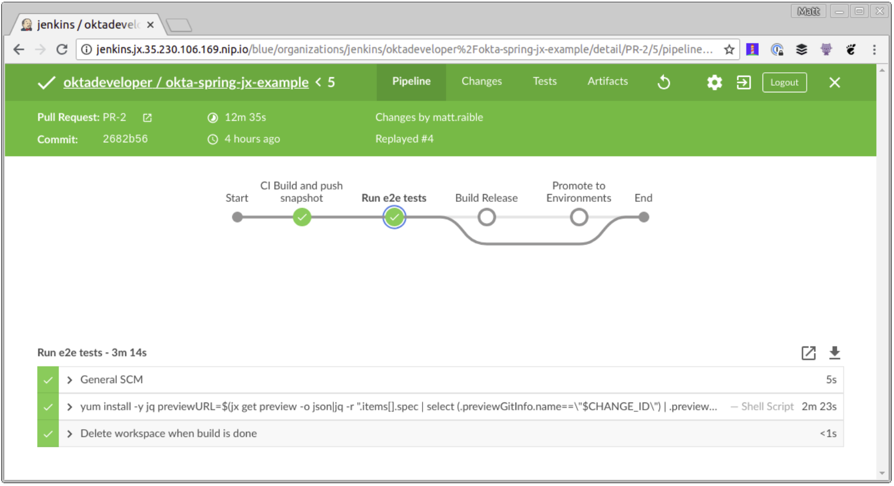

# 在 Jenkins X 中运行 Protractor 测试

对我来说，弄清楚如何在 `Jenkins X` 中运行端到端测试是最难的。我首先添加了一个新的 `Maven` 配置文件，它允许我使用 `Maven` 而不是 `npm` 运行测试。

注意：要使此配置文件起作用，你需要将 `http://localhost:8000/login` 登录重定向 URI 添加到你的应用程序，并将 `http://localhost:8000` 作为注销重定向URI。

```
<profile>
   <id>e2e</id>
   <properties>
       <!-- Hard-code port instead of using build-helper-maven-plugin. -->
       <!-- This way, you don't need to add a redirectUri to Okta app. -->
       <http.port>8000</http.port>
   </properties>
   <build>
       <plugins>
           <plugin>
               <groupId>org.springframework.boot</groupId>
               <artifactId>spring-boot-maven-plugin</artifactId>
               <executions>
                   <execution>
                       <id>pre-integration-test</id>
                       <goals>
                           <goal>start</goal>
                       </goals>
                       <configuration>
                           <arguments>
                               <argument>--server.port=${http.port}</argument>
                           </arguments>
                       </configuration>
                   </execution>
                   <execution>
                       <id>post-integration-test</id>
                       <goals>
                           <goal>stop</goal>
                       </goals>
                   </execution>
               </executions>
           </plugin>
           <plugin>
               <groupId>com.github.eirslett</groupId>
               <artifactId>frontend-maven-plugin</artifactId>
               <version>${frontend-maven-plugin.version}</version>
               <configuration>
                   <workingDirectory>../crypto-pwa</workingDirectory>
               </configuration>
               <executions>
                   <execution>
                       <id>webdriver update</id>
                       <goals>
                           <goal>npm</goal>
                       </goals>
                       <phase>pre-integration-test</phase>
                       <configuration>
                           <arguments>run e2e-update</arguments>
                       </configuration>
                   </execution>
                   <execution>
                       <id>ionic e2e</id>
                       <goals>
                           <goal>npm</goal>
                       </goals>
                       <phase>integration-test</phase>
                       <configuration>
                           <environmentVariables>
                               <PORT>${http.port}</PORT>
                               <CI>true</CI>
                           </environmentVariables>
                           <arguments>run e2e-test</arguments>
                       </configuration>
                   </execution>
               </executions>
           </plugin>
       </plugins>
   </build>
</profile>
```

提示：你可能会注意到，我必须为 `e2e-update` 和 `e2e-test` 分两次不同的执行。我发现运行 `npm e2e` 与 `frontend-maven-plugin` 不兼容，因为它只调用其他 `npm run` 命令。看来你需要在使用 `frontend-maven-plugin` 时直接调用二进制文件。

这里使用的不是 `TRAVIS` 环境变量，而是 `CI` 变量。此更改需要更新 `crypto-pwa/test/protractor.conf.js` 来匹配。

```
baseUrl: (process.env.CI) ? 'http://localhost:' + process.env.PORT : 'http://localhost:8100',
```

进行这些更改，你应该能够运行 `./mvnw verify -Pprod,e2e` 以在本地运行端到端测试。请注意，你需要将 `E2E_USERNAME` 和 `E2E_PASSWORD` 定义为环境变量。

当我第一次在 `Jenkins X` 中尝试这个功能时，我发现 `jenkins-maven` 代理没有安装 `Chrome`。我发现很难安装并发现 `jenkins-nodejs` 预安装了 `Chrome` 和 `Xvfb`。当我第一次尝试它时，我遇到以下错误：

```
[21:51:08] E/launcher - unknown error: DevToolsActivePort file doesn't exist
```

此错误是由 `Chrome on Linux `问题引起的 。我发现解决办法是在 `Protractor` 的 `chromeOptions` 中指定 -`disable-dev-shm-usage`。我还添加了一些推荐的额外标志。我特别喜欢 `--headless`，在本地运行时，因此浏览器不会弹出并妨碍我。如果我想实时看到这个过程，我可以快速删除该选项。

如果你希望在 `Jenkins X `上看到项目的 `Protractor` 测试运行，则需要修改 `crypto-pwa/test/protractor.conf.js` 以指定以下内容 `chromeOptions`：

```
capabilities: {
  'browserName': 'chrome',
  'chromeOptions': {
    'args': ['--headless', ''--disable-gpu', '--no-sandbox', '--disable-extensions', '--disable-dev-shm-usage']
  }
},
```

然后向 `Jenkinsfile` 添加一个新的 `Run e2e test`s 阶段，该阶段位于 “CI 构建”和“构建发布”阶段之间。如果有帮助，你可以看到最终的 Jenkins 文件。

```
stage('Run e2e tests') {
 agent {
   label "jenkins-nodejs"
 }
 steps {
   container('nodejs') {
     sh '''
       yum install -y jq
       previewURL=$(jx get preview -o json|jq  -r ".items[].spec | select (.previewGitInfo.name==\\"$CHANGE_ID\\") | .previewGitInfo.applicationURL")
       cd crypto-pwa && npm install --unsafe-perm && npm run e2e-update
       Xvfb :99 &
       sleep 60s
       DISPLAY=:99 npm run e2e-test -- --baseUrl=$previewURL
     '''
   }
 }
}
```

完成所有这些更改后，创建一个新分支，签入你的更改，并在 `GitHub` 上创建一个 `pull request`。

```
git checkout -b enable-e2e-tests
git add .
git commit -m "Add stage for end-to-end tests"
git push origin enable-e2e-tests
```

我确实需要做一些额外的调整才能通过所有的 Protractor 测试：

1. 在 `crypto-pwa/e2e/spec/login.e2e-spec.ts` 中，我无法通过 `should show a login button` 测试，所以我忽略了它，将 `it(…)` 改为 `xit(…)`。
2. 在同一个文件中，我将`2000 ms` 超时更改为`5000 ms`，将`5000 ms` 超时更改为`30000 ms`。
3. 在 `crypto-pwa/test/protractor.conf.js` 中，我将 `defaultTimeoutInterval` 更改为 `600000`。 第一次运行时测试可能会失败，因为未为新预览环境配置注销重定向URI。更新 Okta 应用程序的注销重定向 URI 以匹配你的 PR 的预览环境 URI，重新 `pull request` 测试，一切都应该通过！




code for the completed application in this example on [GitHub](https://github.com/oktadeveloper/okta-spring-jx-example).


