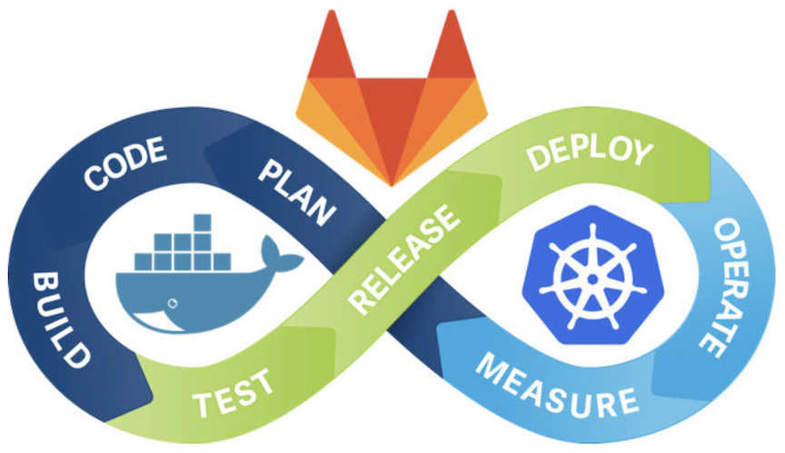

### `Gitlab` + `Gitlab CI Runner` + `Gitlab CI`

1. [在 Kubernetes 上安装 Gitlab](1k8s_gitlab.md)
2. [在 Kubernetes 上安装 Gitlab CI Runner](2Gitlab_CI.md)
3. [Gitlab CI 与 Kubernetes 的结合](3Gitlab_CI_K8S.md)
4. [在 Kubernetes 上安装 Gitlab （New)](6k8s_gitlab_install.md)

### `Jenkins` + `Gitlab` + `Harbor` + `Helm` + `Kubernetes`  => `CICD`

1. [基于 Jenkins、Gitlab、Harbor、Helm 和 Kubernetes 的 CI/CD(一)](4K8S_gitlab_cicd.md)
2. [基于 Jenkins、Gitlab、Harbor、Helm 和 Kubernetes 的 CI/CD(二, Pipeline)](5cicd_pipeline.md)