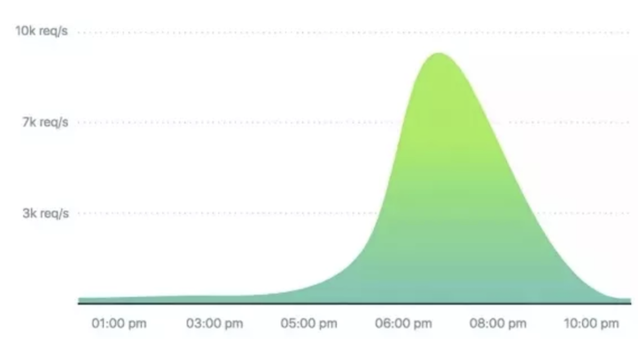
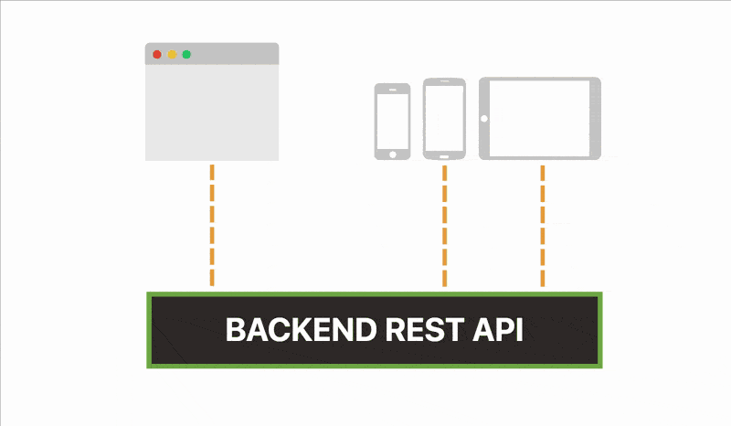
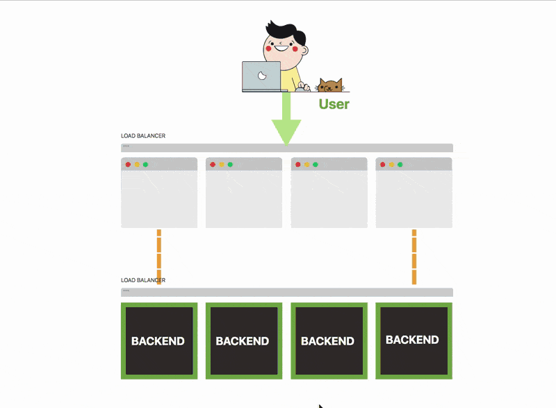
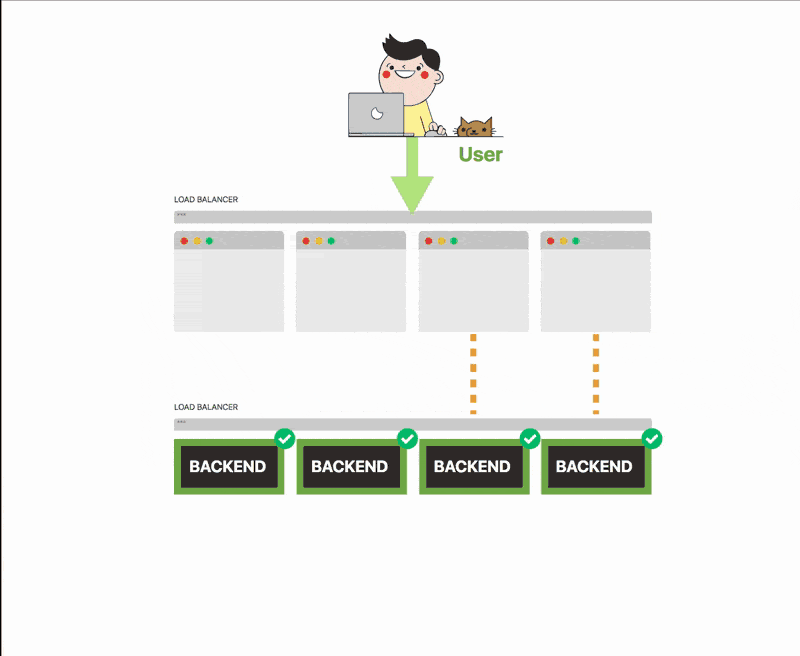
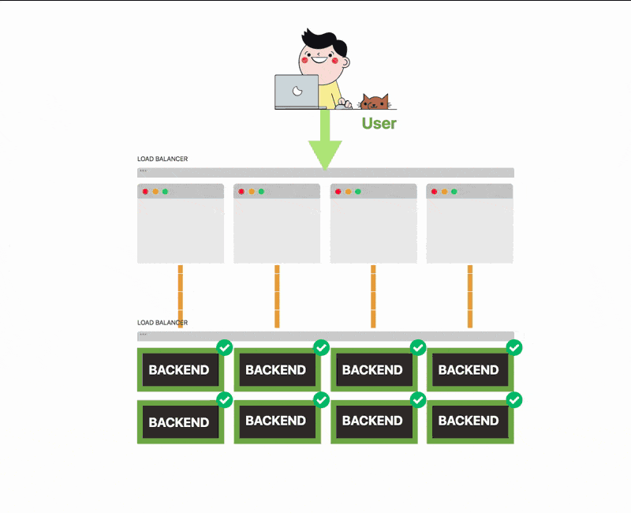
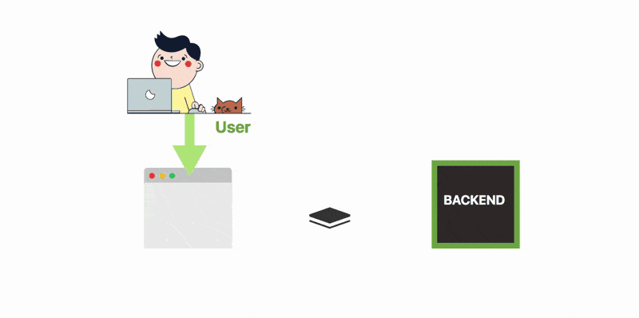

# 项目背景介绍，以及消息队列相对传统服务的优势

当你设计和构建大规模应用时，你将面临两个重大挑战：**可伸缩性和健壮性**。

你应该这样设计你的服务，即使它受到间歇性的重负载，它仍能可靠地运行。

以`Apple Store`为例，每年都有数百万的Apple客户预先注册购买新的iPhone。这是数百万人同时购买物品。

如果你要将Apple商店的流量描述为每秒的请求数量，那么它可能是下图的样子：

现在想象一下，你的任务是构建这样的应用程序。

你正在建立一个商店，用户可以在那里购买自己喜欢的商品。

**你构建一个微服务来呈现网页并提供静态资产。你还构建了一个后端`REST API`来处理传入的请求。**

你希望将两个组件分开，**因为这样可以使用相同的`REST API`，为网站和移动应用程序提供服务**。

今天是重要的一天，你的商店上线了。

你决定将应用程序扩展为**前端四个实例(instance)和后端四个实例(instance)**，因为你预测网站比平常更繁忙。

你开始接收越来越多的流量。

前端服务正在很好得处理流量。但是你注意到连接到数据库的后端正在努力跟上事务的数量。

不用担心，**你可以将后端的副本数量扩展到8**。

你收到的流量更多，后端无法应对。

一些服务开始丢弃连接。愤怒的客户与你的客服取得联系。而现在你被淹没在大量流量中。

你的后端无法应付它，它会失去很多连接。

你刚丢了一大笔钱，你的顾客也不高兴。

你的应用程序设计得并不理想，也不满足高可用，因为在你的架构中：

* **前端和后端紧密耦合**——实际上它不能在没有后端的情况下处理应用
* **前端和后端必须一致扩展**——如果没有足够的后端，你可能会淹没在流量中
* **如果后端不可用，则无法处理传入的事务。**

失去事务意味着收入损失。

### 你可以重新设计架构，以便将前端和后端用队列分离。

**前端将消息发布到队列，而后端则一次处理一个待处理消息。**

在这里我可以为大家介绍一个[AWS SQS(Amazon Simple Queue Service)](https://github.com/Chao-Xi/JacobTechBlog/blob/master/saa_test/9WebSev/1SQS.md)的消息队列服务

新架构有一些明显的好处：

* **如果后端不可用，则队列充当缓冲区**
* **如果前端产生的消息多于后端可以处理的消息，则这些消息将缓冲在队列中**
* **你可以独立于前端扩展后端**——即你可以拥有数百个前端服务和后端的单个实例

太好了，但是你如何构建这样的应用程序？

你如何设计可处理数十万个请求的服务？你如何部署动态扩展的应用程序？在深入了解部署和扩展的细节之前，让我们关注应用程序。
