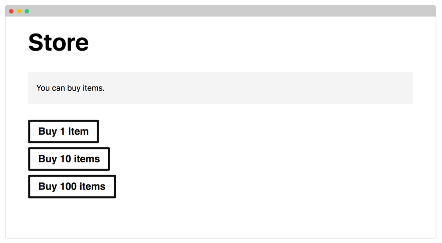
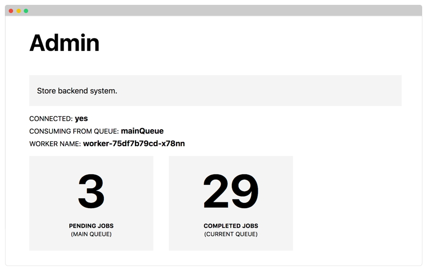
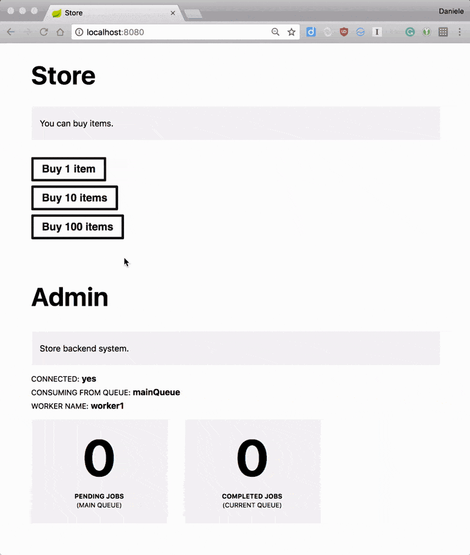

# 编写应用程序,模拟应用程序的运行以及使用JMS发送和接收消息

## 编写Spring应用程序

该服务有三个组件：**前端，后端和消息代理**。

**前端是一个简单的`Spring Boot Web`应用程序，带有`Thymeleaf`模板引擎。**

**后端是一个消耗队列消息的工作者。**

由于`Spring Boot`与`JSM`能出色得集成，因此你可以使用它来发送和接收异步消息。

你可以在[learnk8s/spring-boot-k8s-hpa](https://github.com/learnk8s/spring-boot-k8s-hpa)中找到一个连接到**JSM的前端和后端应用程序**的示例项目。

请注意，该应用程序是用Java 10编写的，[以利用改进的Docker容器集成能力](https://blog.docker.com/2018/04/improved-docker-container-integration-with-java-10/)。

只有一个代码库，你可以将项目配置为作为前端或后端运行。

你应该知道该应用程序具有：

* 一个购买物品的主页
* 管理面板，你可以在其中检查队列中的消息数
* 一个 `/health` 端点，用于在应用程序准备好接收流量时发出信号
* 一个 `/submit` 端点，从表单接收提交并在队列中创建消息
* 一个 `/metrics` 端点，用于公开队列中待处理消息的数量（稍后将详细介绍）

该应用程序可以在两种模式下运行：

**作为前端，应用程序呈现人们可以购买物品的网页。**



作为**工作者(worker)**，应用程序等待队列中的消息并处理它们。



请注意，在示例项目中，使用`Thread.sleep(5000)`等待五秒钟来模拟处理。

你可以通过更改`application.yaml`中的值来在任一模式下配置应用程序。

## 模拟应用程序的运行

默认情况下，应用程序作为前端和工作程序启动。

你可以运行该应用程序，只要你在本地运行`ActiveMQ`实例，你就应该能够购买物品并让系统处理这些物品。



如果检查日志，则应该看到工作程序处理项目。

它确实工作了！编写`Spring Boot`应用程序很容易。

一个更有趣的主题是学习如何将**`Spring Boot`连接到消息代理**。

## 使用JMS发送和接收消息

`Spring JMS`（Java消息服务）是一种使用标准协议发送和接收消息的强大机制。

如果你以前使用过`JDBC API`，那么你应该熟悉`JMS API`，因为它的工作方式很类似。

你可以按JMS方式来使用的最流行的消息代理是`ActiveMQ`——一个开源消息服务器。

使用这两个组件，你可以使用**熟悉的接口（JMS）将消息发布到[队列（ActiveMQ）](http://activemq.apache.org/)**，**并使用相同的接口来接收消息**。

更妙的是，Spring Boot与JMS的集成非常好，因此你可以立即加快速度。

实际上，以下短类封装了用于与队列交互的逻辑：

```
@Component
public class QueueService implements MessageListener {
private static final Logger LOGGER = LoggerFactory.getLogger(QueueService.class);
@Autowired
  private JmsTemplate jmsTemplate;
  public void send(String destination, String message) {
    LOGGER.info("sending message='{}' to destination='{}'", message, destination);
    jmsTemplate.convertAndSend(destination, message);
  }
@Override
  public void onMessage(Message message) {
    if (message instanceof ActiveMQTextMessage) {
      ActiveMQTextMessage textMessage = (ActiveMQTextMessage) message;
      try {
        LOGGER.info("Processing task " + textMessage.getText());
        Thread.sleep(5000);
        LOGGER.info("Completed task " + textMessage.getText());
      } catch (InterruptedException e) {
        e.printStackTrace();
      } catch (JMSException e) {
        e.printStackTrace();
      }
    } else {
      LOGGER.error("Message is not a text message " + message.toString());
    }
  }
}
```

你可以使用send方法将消息发布到命名队列。

此外，`Spring Boot`将为每个传入消息执行`onMessage`方法。

最后一个难题是指示Spring Boot使用该类。

**你可以通过在[`Spring Boot`应用程序中注册侦听器](https://docs.spring.io/spring/docs/current/spring-framework-reference/integration.html#jms-annotated-programmatic-registration)来在后台处理消息，如下所示：**


```
@SpringBootApplication
@EnableJms
public class SpringBootApplication implements JmsListenerConfigurer {
  @Autowired
  private QueueService queueService;
public static void main(String[] args) {
    SpringApplication.run(SpringBootApplication.class, args);
  }
@Override
  public void configureJmsListeners(JmsListenerEndpointRegistrar registrar) {
    SimpleJmsListenerEndpoint endpoint = new SimpleJmsListenerEndpoint();
    endpoint.setId("myId");
    endpoint.setDestination("queueName");
    endpoint.setMessageListener(queueService);
    registrar.registerEndpoint(endpoint);
  }
}
```

[其中`id`是使用者的唯一标识符，`destination`是队列的名称。]()


你可以从[`GitHub`上的项目](https://github.com/learnk8s/spring-boot-k8s-hpa/blob/master/src/main/java/com/learnk8s/app/queue/QueueService.java)中完整地读取`Spring`队列服务的源代码。


回顾一下你是如何在少于40行代码中编写可靠队列的。

